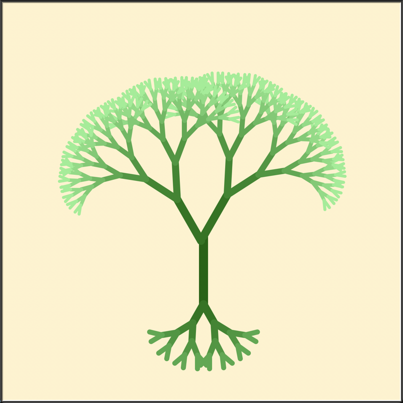

# The Litex Proof System

<small>The Litex logo is a binary tree for two symbolic reasons: 1) As as data structure, binary trees are a perfect demonstration of how abstraction is handled, and the concept abstraction plays a fundamental role in both mathematics and programming.  2) As a diagram of procedures, it evokes the sense of "something leads to another thing" in mathematical discovery and software development. </small>

## About

_That language is an instrument of human reason, and not merely a medium for the expression of thought, is a truth generally admitted.
– George Boole_

**Litex is a simple, user-friendly, universal formal language, designed to better manage the rising level of abstraction in mathematics and to bring the mathematical community into the digital age. It is daily tool to effortlessly to read, write, verify, and share mathematics.**

**Since even children can express mathematics naturally, there must exist a design for a formal language that allows anyone to quickly understand and use it. The goal of Litex is to invent such a language.** While twisted syntax and semantics of traditional formal languages often causes a significant mental drain and a huge loss of clarity of proofs, Litex adopts a minimalism approach in language design so that the complexity of writing mathematics does not exceed that of mathematical reasoning itself, allowing users to focus without being distracted by limitations imposed by formal languages.

## Design principles of Litex

_Conceptual integrity is central to product quality.
-- Fred Brooks, Turing award recipient_

Litex is the bridge between the programming world and math world. The reason Litex can achieve a uniform language with such concise syntax and semantics to express the complex world of mathematics is that it clearly recognizes both the differences and commonalities between mathematics and programming.We start by investigating **similarities and differences between math and programming**.

#### Similarities

_Mathematics... is nothing more than a game played according to certain simple rules with meaningless marks on a paper.
-- David Hilbert_

Mathematics and programming are very similar in terms of **core principles** and the **workflow practices** of practitioners.

1. **The basic elements are symbols. Symbols have properties. In most cases, properties define relationships with other symbols.**
   Note that certain operations can only be applied to elements with specific properties. For example, '/' can only be used with 'invertible symbols'.  

2. **Both math and programming follow small, universally understood rule sets. However, when symbols combine, they create new symbols and rules, leading to complexity (similarly, combining procedures creates new procedures).**
   Operator overloading is everywhere in math. For instance, '+' can mean adding numbers, combining vectors, or uniting sets. Litex embraces this flexibility, allowing operators to adapt to specific needs while maintaining clarity and intuition.  

3. **Both programming and mathematics share a deeply interconnected workflow, blending creativity, precision, and collaboration.**
    For example, programmers run code to test and debug, ensuring it works as intended. Similarly, mathematicians "compile" proofs step by step in their minds, "debugging" potential errors in their logic. With Litex, the "debugging" process here can be automated.

4. **Fundamentally, computer science is the science of abstraction, and math is abstraction itself.**
    Because the mathematical community is currently grappling with significant challenges related to abstraction, it is reasonable for it to draw insights and experiences from the programming world. Programming has developed robust frameworks and tools for managing complexity through abstraction, such as modular design, type systems, and reusable libraries. By adopting these principles, mathematics can potentially streamline its own processes, making abstract concepts more accessible and easier to work with.

#### Differences

_The computer revolution is a revolution in the way we think and in the way we express what we think. The essence of this change is the emergence of what might best be called procedural epistemology­ the study of the structure of knowledge from an imperative point of view, as opposed to the more declarative point of view taken by classical mathematical subjects. Mathematics provides a framework for dealing precisely with notions of "what is." Computation provides a framework for dealing precisely with notions of "how to."
-- Structure and Interpretation of Computer Programs_

Previous formal languages failed to recognize the subtle differences between math and programming. Key properties of math were not fully exploited to improve syntax and semantics, while the automation potential offered by programming was not fully utilized.

**Litex thrives in the sunlight of the common ground between math and programming, while also growing in the subtle gaps that highlight their differences.**

1. **Litex as a Domain-Specific Language**

Litex is designed to align closely with math. For example, every Litex expression can only return `true`, `false`, `unknown`, or `error`. This is because Litex is fundamentally a **verifier**, not a general-purpose programming language. Its primary role is to validate whether mathematical statements are correct, not to perform arbitrary computations. **This makes Litex a domain-specific language, like SQL or LaTeX, tailored for specific problems rather than a general-purpose language like C or Python.**

2. **Function as symbol combination, not an algorithm for future execution**

**Also, functions in Litex don’t "execute" in the traditional sense; instead, they serve as tools to combine predefined symbols and relationships.** After all, many mathematical expressions are written using free variables like *a* and *b*, which inherently lack fixed values. Even when using fixed variables, many integrals or expressions cannot be strictly computed to exact values. This aligns with Litex's purpose: it focuses on verifying the logical structure rather than performing computations.

3. **No control program flow**  

In math, constructs like while loops or switch statements—used to control program flow are unnecessary (Mathematical induction and similar methods can handle iterative cases without using actual iteration.). Mathematical reasoning focuses on deriving truths from existing facts, not on directing execution paths. This is why Litex avoids such features, treating them as plugins instead of core functionalities.

4. **Math as Structured String Transformation**

Math often resembles "transforming strings that match specific structures (like regular expressions)." Symbols that meet certain conditions can be combined with other qualified symbols in permitted ways. The three fundamental elements—functions, arguments, and propositions—can all be represented as symbols, enabling a unified and structured approach to mathematical reasoning.

#### Basic Syntax

_If I have seen further, it is by standing on the shoulders of giants.
-- Isaac Newton_

The design of Litex is inspired mainly by designs of existing programming languages like Python, GoLang, C, C++, Rust, JavaScript/TypeScript, Lisp, LaTeX instead of mathematical logic. Unlike other formal languages, Litex uses programming thinking to understand mathematical proofs, not the other way around.

##### Learn from other programming languages

_Beautiful is better than ugly.
Explicit is better than implicit.
Simple is better than complex.
-- The Zen of Python_

To better understand Litex, let’s first look at what Litex has borrowed from other languages.

1. Python's scoping rules and its "less typing" philosophy.  
2. Go's type syntax and "simplicity is complicated" design.
3. Concepts inspired by C++ Concepts, Python Protocols, Go Generics, and Rust Generics.  
4. TeX-like separation of logical expressions (plain text) and mathematical expressions.  
5. Everything is a symbol, and everything (variables, functions, properties) is a first-class citizen, inspired by Lisp and its descendants. Everything in lisp is nothing but symbol and list. Newcomers can learn Lisp in less than 5 minutes. Notice how the success of Lisp teaches us "Complex structure stem from well-organized simple elements."
6. Introducing OOP to math, with OOP built on interfaces rather than inheritance.  
7. A package system inspired by Go that helps programmers collaborate, maintain their proofs, and easily import others' results.

##### Corresponding between math and programming

_Science is what we understand well enough to explain to a computer. Art is everything else we do.
-- Donald Knuth_

The same idea, expressed in different ways, can feel entirely distinct. As a result, the syntax of different programming languages encourages vastly different coding styles. **Litex must strike a balance between simplicity, intuitiveness, mathematical alignment, and programming conventions.** Intuition behind this design is more like art -— difficult to explain in words, yet its impact is the most profound.

Below are the core principles of syntax design. **The specific syntax may change, but these fundamental design principles will remain unchanged.**

1. The basic elements of math -— variables, functions, and propositions —- are all represented as symbols. Main statements are limited to defining variables, functions, propositions, types, and concepts; stating facts; making claims and proofs; and accessing knowledge. Basic components of Litex are simple and easy to combine, favoring composability over monolithic design.

2. In Litex, a mathematical set is equivalent to a type. Types define members, including methods, propositions, and operator overloads, which is where object-oriented principles (OOP) are applied.  

3. A class of sets is represented as a *concept*.  

4. Facts: `forall` introduces new variables, `if` introduces conditions, and basic propositions are treated like functions that return boolean values.  

5. Every expression returns one of four values: `True`, `Unknown`, `False`, or `Error`.  

6. Symbols can be combined into new symbols using operators (functions). Functions in Litex don’t execute; they simply combine previously defined symbols.  

7. Propositions combined with other propositions create new propositions.  

8. Propositions are named *facts*, but unnamed facts also exist.  

9. `Exist` is a special proposition and should be referenced like normal propositions.  

10. When a user inputs a fact, the interpreter verifies it. If true, it’s stored for future use; otherwise, nothing happens.  

11. `Forall` facts can be "called" to verify an input fact without naming it.  

12. The `=` operation is special and can be validated in two ways: symbolically (same function and parameters) or through verification by other facts.  

13. The standard library includes packages for natural numbers and sets.  

14. Logical operators include `not`, `or`, and `and`. `Not-and` is equivalent to `or-not`, making `or` syntactic sugar. `Exist` is equivalent to `not forall`, but Litex enforces `exist` for uniformity, disallowing `not forall`.

15. A symbol may have many types, but it's its main type that tells the Litex interpreter what functions or propositions can "call" it. It works in the same way how the Macintosh works: you can open many windows at the same time, but there is only one main window that you are working on.

#### Return to common sense and simplicity

_Common sense is not so common.
--Voltaire_

A good tool encourages its user to follow good practices because clarity stems from consistency, simplicity, and intentional design. You have to be clear about what you are talking about, otherwise nobody pays attention to your work.

Traditional formal languages are useful because they emphasize the connection between programming and math. However, they are often criticized for being overwhelmingly unclear. These languages are typically designed to explain mathematical theories rather than serve as practical, everyday tools. **Previous formal languages are all too difficult to understand, and we cannot expect users to write good proofs without a clear understanding. This is why they are not widely adopted.**

**Newton didn’t need type theory to invent calculus, and children don’t need the Curry-Howard Isomorphism to write their first line of math. People naturally have an intuition for how math works. Therefore, there must be a way to design a formal language that is usable for everyone instead of just for experts. This is why Litex is built on common sense, focusing on the subtle yet often overlooked connections between math and programming.**

**The design of Litex is strictly guided by minimalism principle.** Minimalism doesn’t mean weakness; it means every keyword or syntax does one thing exceptionally well, creating a consistent coding style. Users should embrace Litex as a complete system, not a random subset. Every feature in Litex is essential, with nothing missing or redundant. The language prevents convoluted logic and vague expressions, allowing users to rely on intuition and common sense. I hope users can find pleasure in reading and writing Litex.

### Transform the way we express math

the practice
1. The beauty of programming and math both lies in its unique blend of problem solving, creativity and endless possibilities. There are plenty of programming languages that programmers enjoy, but rarely mathematicians find pleasure in using existing formal languages as everyday tools.
2. share, big math
3. CS learn from math, but math seldom take advantage of the continuously advancing information technology.

### Potentials

_The best way to predict the future is to invent it.
-- Alan Kay_

The ultimate potential of Litex is to revolutionize the math community by transitioning from traditional paper-pencil methods to computer programming. This shift eliminates paper review time, as Litex can verify the correctness of proofs. It enables global collaboration on an unprecedented scale, fostering trust among mathematicians worldwide (again, as Litex verifies the proofs). This transformation redefines the essence of math, aligning with Hilbert's view that mathematics is a game played with simple rules and meaningless marks, but now with a deeper, more accessible understanding.

**Due to the similarities between programming and mathematics, we can anticipate that the mathematical community may retrace the path that the programming world has taken from the 1950s to today, transitioning from paper-and-pencil work to automated processes with broader participation.**

Litex emphasize building simple, clear, modular and extensible code that can be read, written, shared by developers rather than its creator.

Github has already shown us the huge influence of large-scale online co-operation. 

There are many "small" facts that are natural for humans but needs extra efforts  to be implemented in advance to improve user experience. That's why the standard library(STL) is essential. If STL does not provide you with the facts you need, just use "know" keyword to "skip" this local fact for future implementation or just know it by default.

## Join the Litex Project

_Give a man a fish and you feed him for a day; teach a man to fish and you feed him for a lifetime.
-- Chinese Proverb_

The inventor of Litex, Jiachen Shen, is a hacker with a math degree. The Litex project is starred by enthusiasts from world-class institutions, including The University of Chicago, Carnegie Mellon University, Fudan University, 
Shanghai Jiao Tong University, openMMLab, deepmath.cn etc.

Since Litex is still under development, it's inevitable that today's Litex might be very different than what it is in the future. That's why Litex will never be a success without its users and contributors. Feel free to issue your suggestions and ideas to help me improve this open-source project—your feedback is invaluable.

Visit [the Litex website](www.litexlang.com) for more information. Contact me by litexlang@outlook.com, malloc_realloc_free@outlook.com.