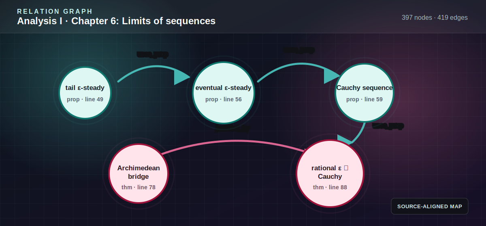

<div align="center">

</div>

<div align="center">

# Litex: The Language Where Mathematics Verifies Itself

*by Jiachen Shen and The Litex Team, version 0.9.108-beta*

[](https://litexlang.com)
[](https://githu¿b.com/litexlang/golitex)
[](https://github.com/litexlang/litexpy)
[](mailto:litexlang@outlook.com)
[](https://litex.zulipchat.com/join/c4e7foogy6paz2sghjnbujov/)
[](https://huggingface.co/litexlang)
[](https://litexlang.com/doc/Manual)

Litex is experimental research software. It is not ready for mission-critical work.

</div>

Litex is a readable, fact-oriented language for checked mathematics. Write
familiar objects, definitions, and mathematical facts; Litex checks each line
against the context that came before it and records why that line was accepted.

**Start here:** [try the Playground](https://litexlang.com), or
[install Litex locally](https://litexlang.com/doc/Setup). After installation,
this should produce a checked equality fact:

```bash
litex -e '1 + 1 = 2'
```

## Start with one checked fact

```litex
have x R = 2

x + 1 = 3
x + 1 > 2
```

This is the basic loop. `have x R = 2` introduces a real object and records
its defining fact. The next two lines are ordinary mathematical facts. Litex
checks them from the current context, arithmetic, and equality replacement;
accepted facts become available to the following lines.

The ordinary output is evidence, not just a pass/fail signal:

```text
line 1  introduced x as a real number and stored x = 2
line 3  verified x + 1 = 3
line 4  verified x + 1 > 2
```

The first useful mental model has four parts:

| Part | Role | Examples |
| --- | --- | --- |
| objects | mathematical things, not truth claims | `x + 1`, `f(x)`, `S` |
| definitions | names and meanings | `have`, `have fn`, `prop`, `struct` |
| facts | claims accepted in the current context | `x <= y`, `$P(x)`, `thm`, `claim` |
| proof processes | explicit routes for a fact that needs one | `witness`, `obtain`, `by contra`, `by cases` |

Common LaTeX-style notation, set theory, and basic logic stay close to ordinary
mathematical writing. Routine consequences can be written directly as facts;
explicit proof routes remain available when an argument needs them.

## Let facts build a checked context

Facts are not comments or hints. They are checked resources for the next
mathematical step. Here equality replacement turns `b > c` into `a > c`:

```litex
forall a, b, c R:
    a = b
    b > c
    =>:
        a > c
```

Litex matches the known comparison, replaces equal expressions, and records
that route. The author states the mathematical conclusion instead of manually
encoding the replacement mechanics.

## Open a proof process when the mathematics asks for one

Direct facts are not a promise that every proof is automatic. When the next
step has a visible proof shape, make that shape explicit. This existential
claim needs a witness and one calculation:

```litex
witness exist x R st {x^2 = 4} from 2:
    2^2 = 4
```

`obtain` uses an existing witness, `by contra` exposes a contradiction,
`by cases` splits alternatives, and `by induc` handles induction. These forms
are ways to establish a fact; they do not replace the central question of what
mathematical fact should hold next.

## Name concepts, then reuse them

The same context can hold definitions as well as facts. A named predicate and
a named function become reusable parts of a small mathematical world:

```litex
prop is_one(x R):
    x = 1

$is_one(1)

have fn f(x R) R = x^2 + 1
f(3) = 10
```

Larger developments use the same ingredients: definitions introduce vocabulary,
facts state what follows, and named theorems connect reusable pieces. Litex
textbooks can preserve the order of a lesson—define an idea, work an example,
reuse a fact, then prove the next result—instead of hiding that route behind a
different program structure.

## Keep the verification inspectable

Litex compresses the *writing* of routine mathematical reasoning; it does not
intend to make verification a black box. Each accepted statement can report:

1. what it did—introduced an object, asserted a fact, opened a local proof, or
   supplied a witness;
2. why it was accepted—a definition, previous fact, theorem, arithmetic rule,
   builtin rule, or explicit assumption; and
3. what it made available for later lines—facts, definitions, theorem names,
   and routine inferred consequences.

Use ordinary output to read a run, `-compact` for a small machine-friendly
record, and `-detail` when auditing recursive verification data and effects.
The same run can also generate a relation graph. For example, the command
below produces the data behind the Analysis I Chapter 6 graph:

```bash
litex -graph -f textbooks/Analysis/chapter06-sequential-limits.lit tmp/graphs/chapter06_graph.json
```

This repository's Analysis I material supplies a real example rather than a
toy diagram:

<p align="center">
  
</p>

The graph is one view of a checked development; source code, statement output,
and trust assumptions remain available to inspect alongside it.

### Litex to Lean compiler

The current compiler is an MVP for a limited, trust-free arithmetic subset. It
is a bridge experiment, not a claim that every Litex feature has Lean-kernel
coverage. The table shows the intended relationship between a Litex verification
trace and the Lean source it can make explicit:

| Litex evidence | Compiler treatment | Lean result |
| --- | --- | --- |
| A supported, checked fact | Emit its assumptions and conclusion as a theorem | `theorem litex_line_08 ...` |
| A later checked use that cites a matching `forall` fact | Replay the cited source theorem with its verified instantiation | `exact litex_line_08 y hy` *(design target; not yet in the MVP)* |
| Any `trust` dependency | Refuse to export it as trust-free Lean | No generated theorem |

For example, a future compiler pass can turn the following verified relation
and its trace into an ordinary Lean theorem application:

```text
# Litex evidence
# line 8: a proved, stored forall fact
forall x Z:
    $divisible_by_8(x)
    =>:
        $divisible_by_2(x)

# line 17: accepted automatically
forall y Z:
    $divisible_by_8(y)
    =>:
        $divisible_by_2(y)

detail: cite forall fact
  source: line 8
  instantiation: x ↦ y
  requirement: $divisible_by_8(y)
```

```lean
theorem litex_line_08 (x : ℤ) (hx : 8 ∣ x) :
    2 ∣ x := by
  rcases hx with ⟨d, rfl⟩
  exact ⟨4 * d, by ring⟩

theorem litex_line_17 (y : ℤ) (hy : 8 ∣ y) :
    2 ∣ y := by
  exact litex_line_08 y hy
```

The second theorem is the planned known-`forall` replay shown on the website;
the current MVP does not yet emit that form. See [Litex and Lean](https://litexlang.com/doc/Litex_and_Lean)
for the supported subset and current boundary.

Litex is not trying to replace Lean, Coq, Rocq, Isabelle, or other mature proof
assistants. It tests a different hypothesis: whether a smaller, readable,
fact-oriented interface can make some checked mathematical data cheaper to
produce, inspect, repair, and teach.

## Real mathematics is the pressure test

Litex is developed against real mathematical translation work, not only
isolated syntax examples. Textbooks and datasets are used to discover concrete
gaps in language design, the standard library, verification rules, diagnostics,
and proof organization. A failed translation is useful evidence when its first
unsupported step and any remaining assumptions are visible.

This makes four practical directions possible:

| Direction | What Litex contributes today |
| --- | --- |
| teaching | recognizable mathematics and feedback about the exact fact the current context does—or does not—justify |
| AI repair loops | machine-checkable local feedback, explicit assumptions, and a visible first unsupported step |
| scientific work | a lighter path from familiar notation to an inspectable checked artifact |
| collaboration | source-native definitions, named interfaces, explicit dependencies, and visible trust boundaries |

Visit our website for more information: [Litexlang.com](https://litexlang.com)

## What a Litex result means

A successful Litex run means that the current parser, runtime, verifier,
accepted rules, libraries, and declared context accepted that statement. It
does **not** establish that this implementation is free of bugs or that it has
the audit history of a mature proof-assistant foundation.

Read a result relative to its trusted background:

- builtin objects and builtin verification or inference rules;
- imported standard packages, configured project packages, and source-local
  cite packages;
- explicit `trust` or `axiom` assumptions; and
- the current parser, runtime, verifier, diagnostics, and test coverage.

`trust` and `axiom` are assumptions, not derived facts. Tests reduce
risk but do not remove it. The project keeps these boundaries visible so that a
reader can distinguish checked derivations from unfinished background work and
so that failures can guide the next audit or implementation step.

## Special Thanks

Litex is built by Jiachen Shen and the Litex team, with support and advice from
many friends and collaborators. Thanks especially to Wei Lin, Siqi Sun, Peng
Sun, Yi Wang, Chenxuan Huang, Yan Lu, Sheng Xu, and Zhaoxuan Hong.
