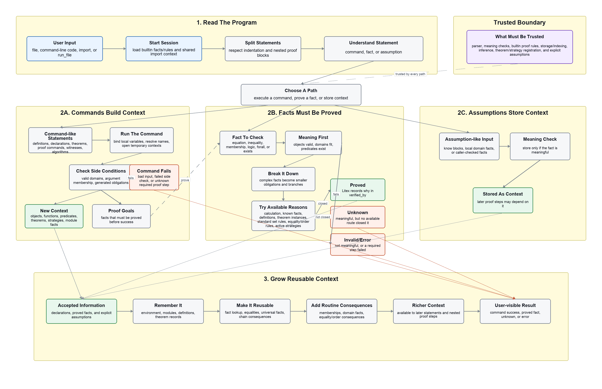

<div align="center">

</div>

<div align="center">

# Litex: The Language Where Mathematics Verifies Itself

*by Jiachen Shen and The Litex Team, version 0.9.96-beta*

[](https://litexlang.com)
[](https://github.com/litexlang/golitex)
[](https://github.com/litexlang/litexpy)
[](mailto:litexlang@outlook.com)
[](https://litex.zulipchat.com/join/c4e7foogy6paz2sghjnbujov/)
[](https://huggingface.co/litexlang)
[](https://litexlang.com/doc/Manual)

**Beta notice:** Litex is experimental and not ready for production or mission-critical proof work. **We welcome everyone to try it.**

</div>

## What is Litex?

_Truth is ever to be found in simplicity, and not in the multiplicity and confusion of things._

_– Isaac Newton_

Litex is an open-source formal mathematical language for writing checked mathematical proof code.
The basic loop is small:

1. Write the next mathematical fact.
2. Let Litex check it against the facts already in context.
3. Reuse the verified fact on later lines.

Here is a first proof:

```litex
forall x R:
    x = 2
    =>:
        x + 1 = 3
        x^2 = 4
```

Read it as ordinary mathematics: for every real number `x`, if `x = 2`, then
`x + 1 = 3` and `x^2 = 4`. Litex checks the two conclusions by using the
assumption `x = 2`, routine rewriting, and arithmetic.

This is the central idea of Litex: **users write facts; Litex grows a verified
context**. A Litex file introduces objects, states facts about them, checks
which facts follow, stores the accepted ones, and makes them available to the
lines that come after.

Litex is not intended to replace any other proof assistant. It explores a
different path in formal mathematics: whether a readable, fact-oriented
interface can make it easier for AI systems and humans to translate
natural-language problems and textbook theorems into checkable formal proof
attempts. The goal is to make ordinary mathematical reasoning precise enough
for machine feedback while preserving the structure and appearance of
mathematical reasoning itself.

## The First Mental Model

_Mathematics is a game played according to certain simple rules with meaningless marks on papers._

_– David Hilbert_

Think of a Litex file as a small mathematical world that grows one checked fact
at a time. You introduce the objects in the world, give yourself vocabulary,
prove or explicitly assume general rules, and then ask Litex whether a new fact
follows.

A classical syllogism shows the shape:

```litex
have human nonempty_set, Socrates human
abstract_prop mortal(x)

# Assumption injection: trusted input for this example, not a checked proof.
know forall x human:
    $mortal(x)

$mortal(Socrates)
```

This says: Socrates is human; every human is mortal; therefore Socrates is
mortal.

The four moves are the basic Litex loop:

1. `have human nonempty_set, Socrates human` builds a tiny world.
2. `abstract_prop mortal(x)` adds a new word that can be used in facts.
3. `know forall x human: ...` stores the general rule.
4. `$mortal(Socrates)` asks Litex to verify the particular conclusion.

The example is intentionally small, but it uses two assumption-facing tools:
`abstract_prop` declares the vocabulary word `mortal`, and `know` injects the
general rule as an explicit assumption. Litex checks that the conclusion follows
from that injected assumption and the rest of the context; it does not prove the
assumed rule from nothing.

When Litex accepts that final line, the verifier output can explain the route
it found. The exact JSON may include line numbers and more trace fields, but
the important shape is:

```text
{
  "result": "success",
  "type": "AtomicFact",
  "stmt": "$mortal(Socrates)",
  "verified_by": {
    "type": "cite forall fact",
    "cited_stmt": "forall x human: $mortal(x)"
  }
}
```

The useful part is not only that a line succeeds. The output tells you whether
the route was arithmetic, a known fact, a matching `forall`, or an inferred
consequence. That makes Litex a feedback loop: write the next fact, run the
checker, read what happened, and add the next piece of context.

When a route cites a fact that came from `know`, read the success as conditional
on that assumption. `verified_by` explains how the current line was justified
relative to the stored context; it does not mean every cited assumption was
itself proved by Litex.

The same caution applies when the runner reports `result: "success"` for a
`KnowStmt`: that success means the assumption was accepted into the context. It
does not mean Litex proved the assumption.

Every factual statement has exactly one of three outcomes: **true**,
**unknown**, or **error**. `true` means Litex found a proof path relative to the
current context, such as a builtin rule, a checked fact, or an explicitly
injected `know` assumption. `unknown` means the statement is meaningful, but
Litex did not find enough verified or assumed information to prove it. `error`
means the line cannot be checked as a valid fact, often because the syntax is
wrong or some object is not well-defined, such as an undeclared name, a function
argument outside its domain, or `1 / 0`.

## How is Litex Different

_A mathematician, like a painter or poet, is a maker of patterns. If his patterns are more permanent than theirs, it is because they are made with ideas._

_– G. H. Hardy_

Litex supports two complementary ways to verify a fact.

The explicit route is `by thm`: give a theorem a name, remember that name, and
cite it with the required arguments. This is closer to the named-theorem style
used by Lean and other formal proof systems.

```litex
have human nonempty_set, Socrates human
abstract_prop mortal(x)

thm all_humans_are_mortal:
    prove:
        forall x human:
            $mortal(x)
    know $mortal(x)

by thm all_humans_are_mortal(Socrates)
$mortal(Socrates)
```

The Lean shape is similar: keep the universal fact under a name, then apply
that name to the object you need.

```lean
variable (Human : Type)
variable (Socrates : Human)
variable (mortal : Human -> Prop)
variable (all_humans_are_mortal : forall x : Human, mortal x)

example : mortal Socrates := by
  exact all_humans_are_mortal Socrates
```

*The Litex-native route is pattern matching against the verified context.* Instead
of naming and citing the theorem, you can leave the universal fact in context
and write the conclusion directly:

```litex
have human nonempty_set, Socrates human
abstract_prop mortal(x)

know forall x human:
    $mortal(x)

$mortal(Socrates)
```

Here Litex matches `$mortal(Socrates)` against the known `forall`, checks that
`Socrates human` is already in context, substitutes `x` with `Socrates`, and
verifies the conclusion. This is the core difference in proof style: Litex can
use named theorem calls when names make the proof clearer, but it also lets
ordinary factual lines drive verification by their mathematical shape.

> This example uses two assumption-facing tools. `abstract_prop` declares an
> uninterpreted predicate name, and `know` is explicit assumption injection,
> similar in role to Lean's `by sorry`. They are useful for axioms and proof
> skeletons, but final artifacts should replace, justify, or explicitly record
> them as proof debt.

## A Quick Gallery

The examples above are deliberately tiny. The snippets below give a fast visual
sense of the larger Litex surface. They are excerpts, not full runnable files;
the linked pages contain runnable examples and fuller context.

The infinite-primes case study ends with the usual Euclid move: take a prime
divisor of `1 * 2 * ... * a + 1`, split on whether it is already below `a`,
derive the modular contradiction, and return the larger prime as a witness.

<!-- litex:skip-test -->
```litex
claim forall! a N_pos: 2 <= a => exist k N_pos st {k > a, $prime(k)}:
    2 <= a <= product(1, a, '(x N_pos) N_pos {x}) <= product(1, a, '(x N_pos) N_pos {x}) + 1
    have by exist k N_pos st {$prime(k), (product(1, a, '(x N_pos) N_pos {x}) + 1) % k = 0}: k
    by cases k > a:
        case k <= a:
            product(1, a, '(x N_pos) N_pos {x}) % k = 0
            (product(1, a, '(x N_pos) N_pos {x}) + 1) % k = (product(1, a, '(x N_pos) N_pos {x}) % k + 1 % k) % k = 1
            impossible (product(1, a, '(x N_pos) N_pos {x}) + 1) % k = 0
        case k > a:
            do_nothing
    witness exist k N_pos st {k > a, $prime(k)} from k
```

Mathematical structures can be defined directly, with operations and axioms
kept close to the ordinary textbook shape:

<!-- litex:skip-test -->
```litex
prop GroupProperty(s nonempty_set, inv fn(x s) s, op fn(x, y s) s, e s):
    forall x, y, z s:
        op(x, op(y, z)) = op(op(x, y), z)
    forall x s:
        op(e, x) = x
        op(x, e) = x
    forall x s:
        op(x, inv(x)) = e
        op(inv(x), x) = e

struct Group<s nonempty_set>:
    inv fn(x s) s
    op fn(x, y s) s
    e s
    <=>:
        $GroupProperty(s, inv, op, e)
```

Templates let users make reusable mathematical interfaces. A user can define a
three-dimensional analogue of a matrix as an indexed function space, then
instantiate it for real-valued `3 x 3 x 3` arrays:

<!-- litex:skip-test -->
```litex
template<S set, n N_pos>:
    have tensor3 set = fn(i closed_range(1, n), j closed_range(1, n), k closed_range(1, n)) S

have A \tensor3<R, 3>
A(1, 2, 3) $in R
```

`by contra`, `by cases`, `by for`, `by induc`, `by extension`, `by zorn_lemma` are builtin statements that prove by contradiction, cases, for, induction, extension and Zorn's lemma respectively. Here `by contra` proves that the square function is not surjective by finding a counterexample.

```litex
prop surjective_fn(S, T set, f fn(x S) T):
    forall y T:
        exist x S st {y = f(x)}

have fn square(x R) R = x^2
forall x R:
    square(x) = x^2

by contra not $surjective_fn(R, R, square):
    have by exist x R st {-1 = square(x)}: x
    0 <= x^2
    -1 = square(x) = x^2
    0 <= -1
    impossible 0 <= -1
```

Visit online textbook for more examples: https://litexlang.com/doc/The_Mechanics_of_Litex_Proof/Introduction .

## Goals of Litex

_We are not trying to meet some abstract production quota of definitions, theorems and proofs. The measure of success of our success is whether what we do enables people to understand and think more clearly and effectively about math._

_- William Thurston_

Litex is experimental, but it is aiming at three simple things:

1. **Human-in-the-Loop AI for Mathematical Exploration** As AI makes mathematical generation abundant, Litex helps turn fragmented reasoning into scalable, verifiable, and reusable mathematical knowledge, scale users' ability to use AI for mathematical exploration.
2. **Support scientific discovery.** Provide an accessible, scalable framework that enables both experts and non-experts to verify, refine, and reuse mathematical reasoning across science, engineering, and AI.
3. **A formal mathematical language that inspires everyone.** Formal math should
be a usable, readable medium for learning, communication, and research, close
enough to everyday math that students, mathematicians, AI agents, and curious
readers can benefit from rigor without losing sight of the ideas.

This route comes with a clear audit obligation. A Litex result should be read
relative to its trusted background: builtin rules, inference rules,
standard-library facts, and any explicit `know` assumption injections. The
project goal is not to hide that boundary; it is to make the boundary visible
while keeping the user-facing proof script close to ordinary mathematical
writing.

Here is the whole landscape of Litex kernel:

<div align="center">
  
  <p><em>Litex kernel: the core components and their relationships.</em></p>
</div>

## Starting Points

Litex keeps the public documentation small:

1. [Setup: Download Litex](https://litexlang.com/doc/Setup): install Litex,
   run files, and understand CLI output.
2. [Manual](https://litexlang.com/doc/Manual): the source of truth for syntax,
   statements, proof flow, builtin rules, and inference.
3. [FAQ](https://litexlang.com/doc/FAQ): design rationale, trust boundaries,
   comparison notes, and old overview material in condensed form.
4. [Litex vs Lean](https://litexlang.com/doc/Litex_vs_Lean): dedicated
   comparison with Lean's interface and ecosystem.
5. [Litex 中文介绍](https://litexlang.com/doc/%E4%B8%AD%E6%96%87%E7%AE%80%E8%A6%81%E4%BB%8B%E7%BB%8D): Chinese introduction and project framing.

Resources:

1. [Litex Kernel and Documents](https://github.com/litexlang/golitex)
2. [litexpy: Use Litex in Python](https://github.com/litexlang/litexpy)
3. [litex-lang on crates.io: Use Litex in Rust](https://crates.io/crates/litex-lang)
4. [Hugging Face: Litex code examples and datasets](https://huggingface.co/litexlang)

Contact us:

1. [Email](mailto:litexlang@outlook.com)
2. [Zulip community](https://litex.zulipchat.com/join/c4e7foogy6paz2sghjnbujov/)

## Special Thanks

_未来没有计划，但一定更好。_

_- 樊振东在巴黎奥运会后接受采访时说_

<div align="center">
  
  <p><em>Litex Mascot: Little Little O, a curious baby bird full of wonder</em></p>
</div>

The path of Litex is a deliberate trade-off. Litex accepts a larger trusted
implementation than small-kernel systems in order to make the proof surface
lighter. The system tries to do more routine checking in the verifier so users
can spend more of their attention on the mathematical sequence of facts. This uniqueness is the core value of Litex as a proof assistant, but it also makes contribution to Litex more difficult and demanding. We welcome young talents to try Litex and contribute to it.

Hi, I’m Jiachen Shen, creator of Litex. I am deeply grateful to Wei Lin, Siqi Sun, Peng Sun, Siqi Guo, Chenxuan Huang, Yan Lu, Sheng Xu, Zhaoxuan Hong, Xiuyuan Lu, and Yunwen Guo for their support and advice. I am sure this list will keep growing.
