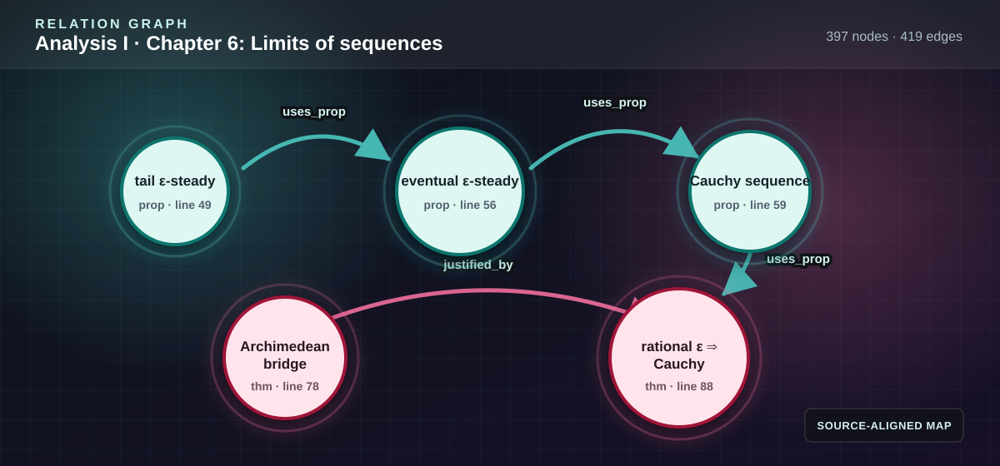

<div align="center">

</div>

<div align="center">

# Litex: The Formal Language Where Math Verifies Itself

*by Jiachen Shen and The Litex Team, version 0.9.110-beta*

[](https://litexlang.com)
[](https://github.com/litexlang/golitex)
[](mailto:litexlang@outlook.com)
[](https://litex.zulipchat.com/join/c4e7foogy6paz2sghjnbujov/)
[](https://litexlang.com/doc/Manual)

**Litex is an experimental hobby project still in beta. Expect rough edges.**

*VISIT [OUR WEBSITE](litexlang.com) FOR EXECUTABLE INTRODUCTION OF LITEX*

</div>

> **Core positioning.** Litex is a set-theory-based, fact-oriented language
> for readable checked mathematics. Users write the mathematical facts that
> form the proof spine; Litex reconstructs routine local justification through
> fact matching, equality replacement, definitions, quantified rules, and
> bounded mathematical reasoning.
>
> **核心定位。** Litex 是一门基于集合论、以事实为导向的形式化语言，用于书写可读且可机器检查的数学。
> 用户写下构成证明主干的数学事实；Litex 则通过事实匹配、等式替换、定义、量化规则与有界数学推理，
> 重建常规的局部证明依据。

## Start with one checked fact

```litex
have x R = 2

x + 1 = 3
x + 1 > 2
```

This is the basic loop. `have x R = 2` introduces a real object and records
its defining fact. The next two lines are ordinary mathematical facts. Litex
checks them from the current context, arithmetic, and equality replacement;
accepted facts become available to the following lines.

The ordinary output is evidence, not just a pass/fail signal:

```text
line 1  introduced x as a real number and stored x = 2
line 3  verified x + 1 = 3
line 4  verified x + 1 > 2
```

The first useful mental model has four parts:

| Part | Role | Examples |
| --- | --- | --- |
| objects | mathematical things, not truth claims | `x + 1`, `f(x)`, `S` |
| definitions | names and meanings | `have`, `have fn`, `prop`, `struct` |
| facts | claims accepted in the current context | `x <= y`, `$P(x)`, `thm`, `claim` |
| proof processes | explicit routes for a fact that needs one | `witness`, `obtain`, `by contra`, `by cases` |

Common LaTeX-style notation, set theory, and basic logic stay close to ordinary
mathematical writing. Routine consequences can be written directly as facts;
explicit proof routes remain available when an argument needs them.

## Let facts build a checked context

Facts are not comments or hints. They are checked resources for the next
mathematical step. Here equality replacement turns `b > c` into `a > c`:

```litex
forall a, b, c R:
    a = b
    b > c
    =>:
        a > c
```

Litex matches the known comparison, replaces equal expressions, and records
that route. The author states the mathematical conclusion instead of manually
encoding the replacement mechanics.

## Open a proof process when the mathematics asks for one

Direct facts are not a promise that every proof is automatic. When the next
step has a visible proof shape, make that shape explicit. This existential
claim needs a witness and one calculation:

```litex
witness exist x R st {x^2 = 4} from 2:
    2^2 = 4
```

A concrete proposition whose complete definition is one existential can keep
its public name while supplying the same witness:

```litex
prop has_copy(a R):
    exist x R st {x = a}

witness $has_copy(2) from 2:
    2 = 2
```

This stores `$has_copy(2)` as the proved fact. Definition inference exposes its
existential meaning afterward; the parser does not rewrite the statement. If
the sole definition clause is `exist!`, the same form additionally requires a
proof that any two values satisfying the body are equal.

`obtain` uses an existing witness, `by contra` exposes a contradiction,
`by cases` splits alternatives, and `by induc` handles induction. These forms
are ways to establish a fact; they do not replace the central question of what
mathematical fact should hold next.

When a named theorem has exactly one direct `exist` or `exist!` conclusion,
apply it and name its witnesses in one checked step:

```litex
have a Q
obtain p, q from thm rational_has_unique_reduced_fraction(a)
```

The theorem's argument and premise checks still run. Its existential stays in
a temporary scope; only the witness names, their types, body facts, and any
`exist!` uniqueness interface enter the surrounding context.

## Name concepts, then reuse them

The same context can hold definitions as well as facts. A named predicate and
a named function become reusable parts of a small mathematical world:

```litex
prop is_one(x R):
    x = 1

by def $is_one(1)

have fn f(x R) R = x^2 + 1
f(3) = 10
```

Larger developments use the same ingredients: definitions introduce vocabulary,
facts state what follows, and named theorems connect reusable pieces. Litex
textbooks can preserve the order of a lesson—define an idea, work an example,
reuse a fact, then prove the next result—instead of hiding that route behind a
different program structure.

## Keep the verification inspectable

Litex compresses the *writing* of routine mathematical reasoning; it does not
intend to make verification a black box. Each accepted statement can report:

1. what it did—introduced an object, asserted a fact, opened a local proof, or
   supplied a witness;
2. why it was accepted—a definition, previous fact, theorem, arithmetic rule,
   builtin rule, or explicit assumption; and
3. what it made available for later lines—facts, definitions, theorem names,
   and routine inferred consequences.

Use ordinary output to read successful statements, `-compact` for a small
machine-friendly success record, and `-detail` when auditing recursive
verification data and effects for the whole run. Any `RuntimeError` is rendered
with the full detailed diagnostic in all three modes, so `-compact` never hides
the available failure context.
The same run can also generate a relation graph from a repository-owned
example:

```bash
litex -graph -f examples/04_case_studies/gcd_from_finite_divisors.lit tmp/graphs/gcd_graph.json
```

The larger diagram below was generated from Analysis I Chapter 6 in its
separately owned textbook workspace:

<p align="center">
  
</p>

The graph is one view of a checked development; source code, statement output,
and trust assumptions remain available to inspect alongside it.

## A mathematical frontend for Lean

Consider a small but complete example: 1. definition of a group 2. the uniqueness of the identity in a
group. Here is a Lean formulation:

```lean
structure Group where
  Carrier : Type
  mul : Carrier → Carrier → Carrier
  one : Carrier
  inv : Carrier → Carrier
  mul_assoc : ∀ a b c : Carrier, mul (mul a b) c = mul a (mul b c)
  one_mul : ∀ a : Carrier, mul one a = a
  mul_one : ∀ a : Carrier, mul a one = a
  mul_left_inv : ∀ a : Carrier, mul (inv a) a = one

theorem one_unique
    (G : Group)
    (e : G.Carrier)
    (hleft : ∀ a : G.Carrier, G.mul e a = a)
    (hright : ∀ a : G.Carrier, G.mul a e = a) :
    e = G.one := by
  calc
    e = G.mul G.one e := (G.one_mul e).symm
    _ = G.one := hright G.one
```

Here is the corresponding Litex formulation:

```litex
struct Group<s nonempty_set>:
    mul fn(x, y s) s
    one s
    inv fn(x s) s
    <=>:
        forall x, y, z s:
            mul(mul(x, y), z) = mul(x, mul(y, z))
        forall x s:
            mul(x, one) = x
            mul(one, x) = x
            mul(inv(x), x) = one

forall s nonempty_set, G &Group<s>, identity s:
    forall a s:
        G.mul(identity, a) = a
        G.mul(a, identity) = a
    =>:
        identity = G.mul(G.one, identity) = G.one
```

This comparison motivates six questions that guide Litex:

1. **Write facts before orchestrating a proof script.** Can users state the
   mathematical facts in their natural order instead of first organizing them
   as commands that manipulate a proof state?
2. **Reuse the shape of a fact, not only its theorem name.** Can the checker
   recognize and instantiate an available fact without requiring the user to
   recall and invoke its name?
3. **Present set-theoretic objects at the surface instead of requiring users to learn type universes first.** Can carriers, elements, functions, and
   structures be presented directly through sets and membership?
4. **Make the mathematical statement, rather than functional-program structure, the subject.** Can a binary operation look like a binary
   operation, and can definitions and conclusions remain in mathematical
   order?
5. **Derive rigor from a checkable process, and retain a familiar appearance.** Can routine orchestration be omitted from the surface while
   every object, fact, instantiation, and dependency is still checked?
6. **Let relevance to a Goal be decided later.** Can a well-defined, verified
   fact enter the current context without having to advance an active Goal, so
   mathematical branches can be developed first and combined later?

Litex should not promise to “omit proof.” Its intended promise is both stricter
and more modest: let users first write the mathematical facts they actually
mean, then let the machine expose the verification, provenance, and boundaries
clearly. (Since Litex operates on a higher mathematical abstraction level, it usually runs faster than existing formal languages.)

Litex is also researching a compilation path to Lean. The current MVP assigns
stable IDs to stored facts and, only in explicit Litex-to-Lean mode, returns a
recursive IR recording which fact, forall instantiation, definition, or builtin
rule verified each step. The Lean emitter consumes that IR rather than
re-running pattern matching over source statements. Its supported surface is
still deliberately narrow; the current scoped-statement slice includes
explicit-value `have`, checked bare selection such as `have x R`, binary
`by cases`, atomic `by contra`, trust-free positive `witness exist`, and
atomic-fact witnesses for single-clause plain positive existential props, and existential
extraction through `obtain` or body-style `have x T: ...`. Bare
selection and existential extraction are compiled from their exact checked
packages with `Exists.choose`/`choose_spec`, never an invented opaque constant.
Unsupported routes fail instead of becoming `sorry` or implicit axioms. See the
[compiler README](src/compile_to_lean/README.md) for the supported subset and current
boundary.

## Real mathematics is the pressure test

Litex is developed against real mathematical translation work, not only
isolated syntax examples. Textbooks and datasets are used to discover concrete
gaps in language design, the standard library, verification rules, diagnostics,
and proof organization. A failed translation is useful evidence when its first
unsupported step and any remaining assumptions are visible.

The guide
[Write Math with Litex by AI](docs/Write_Math_With_Litex_By_AI.md)
describes the persistent-session, transactional `try:`, proof-journal, and
clean-checkpoint workflow used to turn those successes and failures into
reusable writing experience.

This makes four practical directions possible:

| Direction | What Litex contributes today |
| --- | --- |
| teaching | recognizable mathematics and feedback about the exact fact the current context does—or does not—justify |
| AI repair loops | machine-checkable local feedback, explicit assumptions, and a visible first unsupported step |
| scientific work | a lighter path from familiar notation to an inspectable checked artifact |
| collaboration | source-native definitions, named interfaces, explicit dependencies, and visible trust boundaries |

As Terence Tao noted in his public lecture, “Mathematics in the Age of AI”,
mathematical knowledge will shift from scarcity to abundance. The
research process will be unbundled into distinct stages—including
generation, verification, explanation, review, and knowledge
integration—and the division of labor between humans and AI will be reshaped accordingly. I hope Litex can be part of this revolutionary process.

Visit our website for more information: [Litexlang.com](https://litexlang.com)

## What a Litex result means

A successful Litex run means that the current parser, runtime, verifier,
accepted rules, libraries, and declared context accepted that statement. It
does **not** establish that this implementation is free of bugs or that it has
the audit history of a mature proof-assistant foundation.

Read a result relative to its trusted background:

- builtin objects and builtin verification or inference rules;
- imported standard packages, configured project packages, and source-local
  cite packages;
- explicit `trust` or `axiom` assumptions; and
- the current parser, runtime, verifier, diagnostics, and test coverage.

`trust` and `axiom` are assumptions, not derived facts. Tests reduce
risk but do not remove it. The project keeps these boundaries visible so that a
reader can distinguish checked derivations from unfinished background work and
so that failures can guide the next audit or implementation step.

## Special Thanks

Hi, I am Jiachen Shen, a math PhD student in Fudan university, who loves both math and programming. Since the day when I first notice the language, Lean 4, which connects these two worlds, I am fascinated by the finding that math can be encoded into computer programs. However, it takes huge effort to be good at Lean and the mental flow of writing Lean is very different from the flow that I am very used to when I solve math problems (The challenge has always been that with great type-system power comes great proof effort. Certainly I sometimes have to spend an entire day proving really quite simple things. ). I wonder whether there is a way code math more naturally. After all, we humans learn to reason almost instinctively from a very young age — so the underlying mechanism can't be all that complicated. If it comes naturally to a child, the core principles might be simple enough to grasp? And Litex is the result of this intellectual exploration.

Litex is built by Jiachen Shen and the Litex team, with support and advice from
many friends and collaborators. Thanks especially to Wei Lin, Siqi Sun, Peng
Sun, Yi Wang, Chenxuan Huang, Yan Lu, Sheng Xu, and Zhaoxuan Hong.
