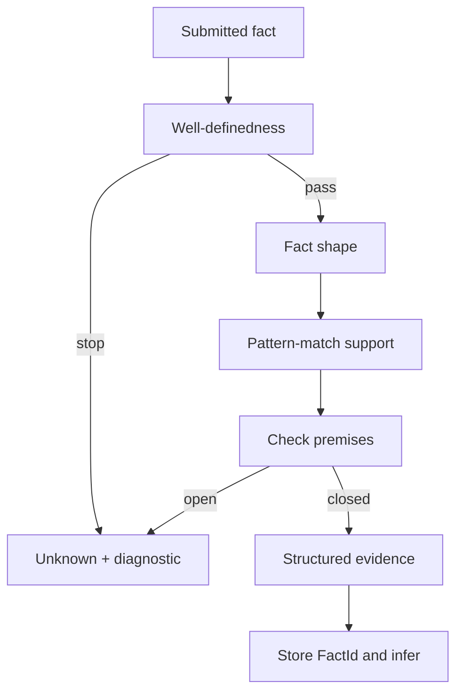
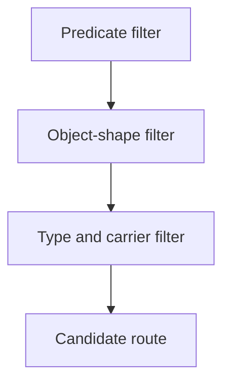

# Litex: A Formal Language Where Mathematics Verifies Itself

Created and maintained by Jiachen Shen.

Last updated: September 2, 2026.

Website: https://litexlang.com/doc/Litex_Blueprint

Chinese version: https://litexlang.com/doc/Litex中文蓝图

**Litex is a small, readable, fact-oriented formal language for turning**
**mathematical reasoning into checkable, traceable data; it also keeps the**
**runtime process readable, traceable, and repairable, so humans, AI, and Litex**
**can work in the same loop.**

It is a set-theoretic, fact-oriented formal language that builds proof flows
from the bottom up. It puts humans, AI, and the verifier in the same loop:
humans provide mathematical intent, AI proposes or repairs the next fact, and
Litex checks it and returns either its supporting evidence or the point where
verification stops. Through this cycle, checkable mathematical knowledge
accumulates. In principle, any Litex code can be compiled to Lean and connected
to the Lean/Mathlib ecosystem.

> **Litex is an experimental hobby project in beta; expect rough edges.**

<!-- Blueprint spine: reasoning abundance → scientific object → design hypothesis → measurable costs → potential capacity impact → verification and understanding bottlenecks → two participation barriers → four language choices → definition and verification → readable execution and Checkable Knowledge Records → ToLean/adapter handoff → the end-to-end human–AI–Litex knowledge-production loop → ecosystem role → success criterion -->

<!--
Litex 定位四层检查（写作时逐层核对；面向不同受众可以调整强调重点，但不能混淆层级）：
- 科学对象：可检查知识如何被表示和逐步构造。
- 科学假设：事实导向表示与事务式交互是否构成新的形式语言范式。
- 科学结果变量：这种范式怎样影响构造、理解、审核、修复和复用知识的成本。
- 社会影响：降低门槛，使验证能力跟上 AI 产生候选推理的速度。
写作边界：前三层是 Litex 的科学内核；第四层是潜在影响。不得用“从而”把未验证的科学结果写成已经实现的工具效果。
-->

## Table of Contents

- [Litex: A Formal Language Where Mathematics Verifies Itself](#litex-a-formal-language-where-mathematics-verifies-itself)
  - [Table of Contents](#table-of-contents)
  - [Litex Blueprint Overview](#litex-blueprint-overview)
    - [Two Barriers: From Understanding Mathematics to Being Able to Formalize It](#two-barriers-from-understanding-mathematics-to-being-able-to-formalize-it)
  - [1. Based on Set Theory: Keep Mathematical Objects Readable](#1-based-on-set-theory-keep-mathematical-objects-readable)
      - [Lean: A Record over `Type` and Curried Functions](#lean-a-record-over-type-and-curried-functions)
      - [Litex: Operations on a Set and Structural Facts Written Directly](#litex-operations-on-a-set-and-structural-facts-written-directly)
  - [2. Fact-Oriented: Source Preserves *What Holds*](#2-fact-oriented-source-preserves-what-holds)
    - [What Fact-Oriented Means](#what-fact-oriented-means)
    - [One Fact, Two Interfaces](#one-fact-two-interfaces)
    - [How `verify` Processes a Submitted Fact](#how-verify-processes-a-submitted-fact)
    - [Pattern-Match Search: A Semantic `Ctrl+F`](#pattern-match-search-a-semantic-ctrlf)
    - [Summary: How Fact Orientation Is Implemented](#summary-how-fact-orientation-is-implemented)
  - [3. Bottom-Up: Let Verified Facts Continue to Grow](#3-bottom-up-let-verified-facts-continue-to-grow)
  - [4. From Four Design Principles to Mathematical Practice: Definition and Verification](#mathematics-practice)
  - [5. What Each Statement Leaves Behind: Checkable Knowledge Records](#execution-model)
  - [6. Lean-Compatible: Independent Rechecking for Covered Paths](#compatibility)
    - [Summary: Bottom-Up and Top-Down Reasoning Are Complementary](#summary-bottom-up-and-top-down-reasoning-are-complementary)
  - [7. The End-to-End Human–AI–Litex Knowledge-Production Loop](#interaction-loop)
    - [Summary: Why Fact Orientation and Bottom-Up Flow Help the Loop](#summary-fact-oriented-bottom-up-loop)
  - [8. From Language to Ecosystem: The Role Litex Aims to Play](#ecosystem-role)
  - [9. Beyond the Search for One Best Language](#conclusions)
    - [Special Thanks](#special-thanks)
    - [Related Links](#related-links)

<a id="overview"></a>

## Litex Blueprint Overview

AI is moving us from an age of scarce reasoning into an age of abundant reasoning. The hard part used to be producing enough good conjectures, derivations, and solutions. Candidate reasoning can now be generated at scale, while human attention, expert review, and reliable verification cannot expand at the same rate. The bottleneck is shifting from producing an answer that looks plausible to turning many candidates into knowledge that can be checked, understood, and reused. **Reasoning overflow and verification scarcity are not a temporary imbalance; they are becoming a structural condition of knowledge production in the AI era.**

Litex is an interface experiment for this new condition: a set-theoretic, fact-oriented formal language that constructs proof flows bottom-up. It tests whether this representation and interaction paradigm can reduce the cost for humans and AI to construct, understand, audit, repair, and reuse checkable knowledge. Humans supply mathematical intent and acceptance boundaries; AI proposes or repairs the next fact; Litex checks it and returns verification grounds or a stopping point, forming a verification loop in which accepted knowledge can keep growing. Lean compatibility is also a design goal: the current compiler can transfer some supported routes to Lean/Mathlib for independent rechecking, while full coverage remains under development.

Correctness is only half of the crisis. A proof can be correct but hard to read, explain, connect, or reuse. Mathematicians and formal-language communities talk about complexity every day: long proofs, distant representations, steep tools, and hard-to-digest results. Yet they rarely ask why understanding bears this cost—or how to reduce it. This is the **complexity tax on understanding**.

Not all complexity can disappear. Some belongs to the mathematics. Some is added by representations, evidence plumbing, and interaction. With abundant AI-generated reasoning, the distinction matters twice: can the result be verified, and can humans understand, digest, and reuse it?

Terence Tao's [2026 ICM public lecture](https://teorth.github.io/tao-web/slides/age-of-ai-icm-2026.pdf) and [companion essay](https://arxiv.org/abs/2608.16753) show the same bottleneck. Generation and verification can outpace exposition, digestion, community acceptance, and canonicalization. This context motivates Litex's question but does not answer it; the representation-and-interaction hypothesis above is Litex's own.

Education, science, engineering, and AI review all need formalization. Turning AI's creativity into trustworthy knowledge requires wider participation.

> **Litex is not only a tool for formalization experts. Its goal is also to help more people become formalization experts, so that every field can incorporate the rigor of formalization.**

People who understand a domain should be able to express, check, and repair its formal reasoning—and review AI-generated work directly.

**Litex tests that path. It is a set-theoretic, fact-oriented, bottom-up formal language compatible with Lean.** Humans and AI write facts directly and see their verification grounds or stopping point. Litex lowers not rigor, but the barrier to reaching it.

### Two Barriers: From Understanding Mathematics to Being Able to Formalize It

The next two examples show two sources of the complexity tax. Both are trivial for Lean. They separate two interface barriers; they do not compare mathematical power.

1. **Entry knowledge:** users may know a fact but still need imports, proposition syntax, type annotations, and tactics.
2. **Representation distance:** even after learning the tool, users may manipulate subtypes and proof arguments instead of writing as they ordinarily reason.

These mechanisms support Lean's generality, compositionality, and ecosystem. Litex explores a different front-end contract: conditions remain explicit and strict, while the system manages more evidence and representation detail.

Start with the first barrier. Why should a user who already knows a mathematical fact need additional tool knowledge merely to place it in a formal system?

Litex:

```litex
1 + 1 = 2
```

Lean:

```lean
import Mathlib

example : (1 : ℝ) + 1 = 2 := by norm_num
```

The difficulty is not `1 + 1 = 2`. It is knowing `Mathlib`, `example`, the type annotation, and `norm_num`. These matter in complex proofs but are not part of this fact's mathematics. Must they be prerequisites when the user already understands the claim?

The second example shows representation distance. For a function on the positive reals, one common Lean encoding is:

```lean
example
    (f : {x : ℝ // x > 0} → ℝ)
    (x : ℝ) (hx : x > 0) :
    f ⟨x, hx⟩ = f ⟨x, hx⟩ := rfl
```

The corresponding Litex is:

```litex
forall f fn(t R: t > 0) R, x R:
    x > 0
    =>:
        f(x) = f(x)
```

**This only says that a function value equals itself.**

In the Lean subtype encoding, applying `f` packages `hx : x > 0` with `x` as `⟨x, hx⟩`. Litex still checks `x > 0`, but its source retains the ordinary `f(x)`.

> **Users write mathematics; the system manages verification evidence. Conditions cannot be omitted, but certificates need not be threaded by hand.**

This does not lower verification standards. It lets an abstraction layer absorb mechanical detail and lower the tool barrier.

AI also creates a subtler failure: generated Lean code passes the kernel, but its proposition may omit a condition, change a quantifier, or weaken the conclusion. The Lean kernel is not at fault; it checked the encoded proposition correctly. The mismatch is between formal specification and mathematical intent.

If a formal statement has a high reading barrier, the relevant domain expert may miss that *the proof is correct but the problem was encoded incorrectly*. Lowering that barrier therefore expands AI review capacity, not just convenience.

Litex asks whether students, domain experts, and AI can produce checked mathematics more easily without lowering verification standards.

The path for this experiment is:

1. **Set theory:** objects are organized through sets and membership, separately from facts about them. Lean's `Set α` first depends on `α : Type*`; Litex chooses a more direct set-theoretic surface.
2. **Fact-oriented:** source states *what holds*; the kernel searches rules, known facts, and equalities while checking well-definedness. Typical Lean tactics describe how to handle the current Goal.
3. **Bottom-up:** Litex lets verified facts extend the context; common Lean tactic interaction reduces the final Goal backward. Both can express the other direction.
4. **Lean-compatible:** the compiler translates covered Litex verification routes into Lean proof terms. Coverage remains partial; not every Litex source compiles today.

The two workflows can be simplified as follows:

```text
Lean: proposition → Goal → tactics and elaboration → proof term → kernel check
Litex: objects and facts → kernel checks and searches for justification → verified facts extend the context
```

Ideally, users focus on objects, conditions, facts, and conclusions while Litex acts as a copilot with fast, local, traceable feedback. *People who understand a domain but are not proof-assistant specialists can still enter formal reasoning.*

> **Lean supports other encodings and forms of automation as well. The comparison here concerns source interfaces, not whether the two languages can express the same proposition.**

> **This is a design direction, not a claim that the current language, standard library, or compiler is complete.**

<a id="set-theory"></a>

## 1. Based on Set Theory: Keep Mathematical Objects Readable

For formal semantics to be precise yet directly reviewable, the first question is which objects source presents first. Litex chooses sets, membership, and relations between sets. A set-theoretic problem can therefore state sets, subsets, and intersections without first introducing a carrier type.

The following Litex code states that intersection is monotone with respect to inclusion:

```litex
forall s, t, u set:
    s $subset t
    =>:
        intersect(s, u) $subset intersect(t, u)
```

This is a complete fact submitted to the kernel, not a proof hole. Its ordinary reading is: a member `x` of `intersect(s, u)` belongs to `s` and `u`; since `s $subset t`, it belongs to `t` and thus to `intersect(t, u)`. The user states the result, while the kernel searches through unfolding, membership transport, and reassembly.

<details>
<summary><strong>Full comparison: how Lean develops the same set-theoretic proposition</strong></summary>

Here is the version from the set-theory chapter of *Mathematics in Lean*:

```lean
import Mathlib.Data.Set.Lattice

section
variable {α : Type*}
variable (s t u : Set α)
open Set

example (h : s ⊆ t) : s ∩ u ⊆ t ∩ u := by
  rw [subset_def, inter_def, inter_def]
  rw [subset_def] at h
  simp only [mem_setOf]
  rintro x ⟨xs, xu⟩
  exact ⟨h _ xs, xu⟩
end
```

Lean first declares `α : Type*`, then `s`, `t`, and `u` as values of `Set α`. Here `Set α` is a predicate over `α`; `Type*` and its universes provide a more general type-theoretic organization that supports reuse over arbitrary carriers.

Litex chooses a different boundary: sets and membership form its surface, with specialized syntax and verification paths for membership, subsets, intersections, and unions. Here the user only declares three sets with `set` and writes the expected inclusion.

This is not a claim that shorter code is stronger: Lean can use a shorter proof or automation, while the example preserves the textbook's unfolded route. The comparison is between default interfaces. Lean gives sets a type-theoretic carrier before constructing a proof; Litex directly recognizes and checks common set-theoretic facts.

</details>

<details>
<summary><strong>Technical summary: typing judgments and membership facts</strong></summary>

Lean organizes mathematics around typed terms: after elaboration, a core expression is checked through a judgment of the form `Γ ⊢ e : T`. The colon belongs to this metalevel typing judgment; it is not an ordinary proposition inside Lean that accumulates alongside equality, order, or theorem facts. Surface overloading and coercions may elaborate similar notation into different core terms, but each resulting term is checked at a definite type.

Litex instead organizes mathematics around objects and a growing context of facts. `e $in S` is an object-language membership fact, on the same logical side of the boundary as equality, order, and other predicates. The same object may therefore be proved to belong to many unrelated or overlapping sets: membership is a relation between objects, not a unique intrinsic assignment `typeOf(e) = S`.

This does not remove static discipline or inference. Litex checks domains, return sets, structure fields, and other well-definedness obligations before accepting an expression, and dedicated rules infer membership and carrier facts throughout a proof. The distinction is that this inference extends the context with facts such as `e $in S`; it does not infer one privileged type `e : T` that determines the object's identity.

</details>

The set-theoretic surface does not remove constraints. Function domains and codomains, structure fields, and membership still undergo well-definedness checks, placed where mathematicians would naturally write them. `template` supports families indexed by carriers, parameters, or hypotheses; Litex does not claim to be a complete dependent type theory.

Nor must authors repeat well-definedness transport at every call. A checked function contract—parameter domains, return set, and call conditions—becomes reusable. The verifier checks arguments, derives return membership, and carries it through nested calls.

The obligation remains; only repeated transcription disappears. Given `f : A → B`, `g : B → C`, and `a ∈ A`, one simply writes `g(f(a))`.

<a id="group-comparison"></a>

<details>
<summary><strong>Small example: build a group and its mathematical interface from common foundations</strong></summary>

When a standard library does not yet cover a domain, can users build its theory from a small set of common concepts? Sets, functions, relations, and operations form a cross-domain language in which definitions and theorems can grow along their mathematical dependencies instead of first conforming to an external encoding. This is **bootstrapping a mathematical theory**.

Mature libraries can accelerate construction, but they should not determine the boundary of expression. The two fragments below describe the same group and identity-uniqueness result through different interfaces to carriers, operations, and laws.

#### Lean: A Record over `Type` and Curried Functions

```lean
structure Group where
  Carrier : Type
  mul : Carrier → Carrier → Carrier
  one : Carrier
  inv : Carrier → Carrier
  mul_assoc : ∀ a b c : Carrier, mul (mul a b) c = mul a (mul b c)
  one_mul : ∀ a : Carrier, mul one a = a
  mul_one : ∀ a : Carrier, mul a one = a
  mul_left_inv : ∀ a : Carrier, mul (inv a) a = one

theorem one_unique
    (G : Group)
    (e : G.Carrier)
    (hleft : ∀ a : G.Carrier, G.mul e a = a)
    (hright : ∀ a : G.Carrier, G.mul a e = a) :
    e = G.one := by
  calc
    e = G.mul G.one e := (G.one_mul e).symm
    _ = G.one := hright G.one
```

This Lean record begins with `Carrier : Type`; its elements, operations, and laws depend on that carrier. `Carrier → Carrier → Carrier` is a curried binary operation, while laws become named fields such as `mul_assoc` and `one_mul`. This supports abstraction and precise library reuse, while requiring authors to select theorem names, variants, and equality directions. The example explicitly invokes `G.one_mul`.

#### Litex: Operations on a Set and Structural Facts Written Directly

```litex
struct Group<s nonempty_set>:
    mul fn(x, y s) s
    one s
    inv fn(x s) s
    <=>:
        forall x, y, z s:
            mul(mul(x, y), z) = mul(x, mul(y, z))
        forall x s:
            mul(x, one) = x
            mul(one, x) = x
            mul(inv(x), x) = one

forall s nonempty_set, G &Group<s>, identity s:
    forall a s:
        G.mul(identity, a) = a
        G.mul(a, identity) = a
    =>:
        identity = G.mul(G.one, identity) = G.one
```

Litex binds a nonempty set `s` and models a group on it. `mul fn(x, y s) s` is a closed binary operation; laws appear as ordinary facts inside `<=>:`. Identity uniqueness is then a direct equality chain, with the kernel finding the needed laws and directions. Long-lived results may still be named `thm`; ordinary laws and local facts need not first enter a naming interface.

Structural laws are not released without bounds; Litex first checks structure membership and scope.

<details>
<summary><strong>Implementation note: the release boundary for struct facts</strong></summary>

A field path such as `G.mul` is checked against the declared struct carrier; this alone does not add group laws to context. The binder `G &Group<s>` opens exactly one layer. Function results or nested struct fields require `by struct def expression`, which verifies membership before releasing that layer. A later standalone `expression $in &Group<s>` remains opaque.

</details>

Lean can of course define a group without Mathlib's existing interface; the comparison concerns the default experience, not expressive limits. “Building from the ground up” is not dependency-free: Litex still relies on its kernel, rules, and standard library. External libraries remain important accelerators without becoming expressive boundaries.

The group is only a small demonstration. A stronger test is whether a small team can build a readable, extensible interface with explicit boundaries for an under-covered domain. Future geometry and other libraries should report dated source, verifier results, `trust` boundaries, and real reuse rather than treating that outcome as established in advance.

</details>

<details>
<summary><strong>Position in the design space: set-theoretic presentation is not unique to Litex</strong></summary>

[The Mizar Mathematical Library](https://wiki.mizar.org/library/) is based on Tarski–Grothendieck set theory;
[Lean](https://lean-lang.org/doc/reference/latest/The-Type-System/) and
[Rocq](https://rocq-prover.org/doc/V9.2.0/refman/language/core/index.html) expose dependent type-theoretic kernels to users; and
[Isabelle/HOL](https://isabelle.in.tum.de/website-Isabelle2024/dist/library/Doc/Isar_Ref/HOL_Specific.html)
uses polymorphic higher-order logic.

Litex's proposition language is broadly first-order in flavor: atomic relations and named predicates are organized by restricted classical forms and quantifiers. It favors canonical fact shapes, and propositions and proofs are not arbitrary first-class values.

This describes only the proposition interface; the verifier also checks well-definedness and searches definitions, context, and supported rules for grounds.

Against that background, Litex asks a more specific question about the user-facing object interface:
can a small, membership-centered, set-theoretic surface cover substantive mathematics without first requiring users to manage type universes?

</details>

<a id="fact-oriented"></a>

## 2. Fact-Oriented: Source Preserves *What Holds*

Fact-oriented means that the source begins with the mathematical fact itself, not with a tactic recipe. The author writes which objects, conditions, and relations should hold; Litex searches for a valid way to verify that statement in the current environment.

### What Fact-Oriented Means

A fact-oriented source keeps the proposition and its premises visible while leaving route selection to the verifier. A named theorem or definition may still be supplied when it is part of the intended interface, but an ordinary fact does not need a tactic name, rewrite direction, or search script.

### One Fact, Two Interfaces

Consider the same claim: the sum of two nonnegative real numbers is nonnegative.

**Lean writes the goal and then writes how to close it**

```lean
import Mathlib

example (x y : ℝ) (hx : x ≥ 0) (hy : y ≥ 0) : x + y ≥ 0 := by
  exact add_nonneg hx hy
```

The statement gives Lean the goal; `add_nonneg hx hy` gives the proof route. The source therefore contains both the *what* and the *how*.

**Litex: the source states what should hold**

```litex
forall x, y R:
    x >= 0
    y >= 0
    =>:
        x + y >= 0
```

Litex states the parameters, premises, and conclusion directly. It does not name `add_nonneg` or prescribe a rewrite direction; `verify` must find and check a route from the target's shape and available support.

The two interfaces divide responsibility differently:

| Interface | Source primarily writes | Route selection |
| --- | --- | --- |
| Lean tactic proof | The goal and the tactic or term that proves it | Written explicitly in the proof body |
| Litex fact-oriented proof | The objects, premises, and fact that should hold | Chosen and checked by `verify` |

For mathematically oriented readers, Litex can therefore be easier to read and accept: the source remains close to the claim, while the verification route is still recorded and checkable.

### How `verify` Processes a Submitted Fact

Once Litex has parsed a proposition into a typed fact, `verify` follows a bounded lifecycle:



Plain-text reading: **submitted fact → well-definedness → fact shape → pattern-match support → premise checks → evidence → store and infer**. A failed check stops at the relevant stage and returns a diagnostic instead of an unsupported proof.

| Stage | What happens |
| --- | --- |
| Well-definedness | Checks that objects, parameters, carriers, and operations are meaningful. |
| Fact shape | Selects the route for an equality, atomic fact, conjunction, chain, `forall`, existential, or another supported form. |
| Pattern-match support | Finds facts, definitions, theorems, or builtins whose predicate, object shape, arguments, and types fit the target. |
| Premise checks | Verifies the selected route's premises and local obligations. |
| Evidence and publication | Returns structured evidence or `Unknown`; on success, stores the fact with a `FactId` and runs applicable inference. |

### Pattern-Match Search: A Semantic `Ctrl+F`

Litex calls this process **pattern matching**. It is a particularly fancy semantic `Ctrl+F`: first use the target predicate to find relevant facts and builtin routes, then match the structure of the objects and their types. It is not a text search and not an unrestricted scan of every theorem.

For `1 + 2 > 2`, the narrowing is read as follows:



Plain-text reading: **predicate `>` → object head `+` → numeric arguments such as `2` → compatible number types and carriers → candidate route**.

The predicate narrows the candidate set; object shape, argument compatibility, and type refine it. Internal indexes may interleave these filters, but the public idea is stable: Litex searches mathematical structure, not matching text.

### What Can Supply the Matching Route?

| Support source | Matching role |
| --- | --- |
| Anonymous concrete fact | Direct predicate/object match in the active or imported environment |
| Anonymous or named `forall` fact | Match the pattern, instantiate parameters, then check premises |
| `def` | Definition expansion or reduction when the route permits it |
| Named `thm` | Selected theorem interface whose conclusion matches the target |
| Builtin rule or strategy | Registered route for a recurring predicate/object pattern |
| Equality information | Aligns object forms known to be equal |

These are shape-appropriate support routes, not interchangeable entries in one flat list. A selected route still has to discharge its own premises and well-definedness obligations. If no checked route closes the target, Litex returns a localized stopping point instead of fabricating a proof.

### Summary: How Fact Orientation Is Implemented

Litex's fact-oriented interface is a division of labor: the source states *what should hold*, and `verify` finds *how it can be verified*. The verifier performs a bounded semantic `Ctrl+F`—predicate first, then object shape, arguments, and compatible types—instantiates or expands the matching support, checks its obligations, and records the evidence. That is the mechanism behind Litex's concise source: route selection moves out of the proof text without making the result opaque or unchecked.

<a id="bottom-up"></a>

## 3. Bottom-Up: Let Verified Facts Continue to Grow

Mathematical facts are the basic units of Litex source. Each verified fact extends context for later statements, so proof flows from known conditions toward the conclusion. This is “bottom-up.”

Litex supports **declarative proof writing whose default flow is mostly forward reasoning**. Its unit is the next fact in context, not an active Goal every line must advance. A scoped, well-defined, supported statement can be accepted, stored, and used by applicable rules; branches may grow separately before converging.

Lean's typical interaction is goal-directed, backward, and top-down: the theorem fixes the Goal, then terms and tactics reduce it to simpler subgoals until Lean assembles a proof term.

Lean asks, “How can I reduce this Goal to known conditions?” Litex asks, “Given known conditions, what fact follows next?”

> Think of proof as LEGO. Lean tactics typically disassemble the desired model until its requirements match available pieces; Litex typically builds forward from those pieces until verified results converge on the model. This describes default direction only: Litex's standard is not weaker, and neither system is limited to one direction.

<a id="two-directions"></a>

<details>
<summary><strong>Small example: top-down and bottom-up forms of the same algebraic equality</strong></summary>

This example develops one equality in two directions. Lean begins from the Goal; each `rw` specifies a fact, matching direction, and replacement:

```lean
-- Using facts from the local context.
example (a b c d g f : ℝ) (h : a * b = c * d) (h' : g = f) :
    a * (b * g) = c * (d * f) := by
  rw [h']
  rw [← mul_assoc]
  rw [h]
  rw [mul_assoc]
```

Litex reverses the four rewrites into one chain, from `c * (d * f)` through intermediate results to `a * (b * g)`:

```litex
claim:
    ?forall a, b, c, d, g, f R:
        a * b = c * d
        g = f
        =>:
            a * (b * g) = c * (d * f)
    c * (d * f) = (c * d) * f = (a * b) * f = a * (b * f) = a * (b * g)
```

The four equalities correspond to `rw [mul_assoc]`, `rw [h]`, `rw [← mul_assoc]`, and `rw [h']`, in reverse order from the Lean script. Lean specifies how to rewrite the Goal; Litex states the facts that should hold along the route, and the kernel searches for support for each adjacent equality.

</details>

Bottom-up progress can accumulate: separately accepted statements remain a verified prefix, while the next `unknown` marks the repair point. Accepted parts can be reused, but a composite statement with a failed internal conclusion is not partially committed.

This convenience has a trust cost. Hundreds of builtin and infer rules move work from user scripts into a larger trusted computing base. The obligation has moved, not vanished; recorded routes must therefore be handed to Lean's smaller kernel for covered-path rechecking.

<details>
<summary><strong>Position in the design space: forward proof is not unique to Litex</strong></summary>

Mizar, Isar, ACL2, and Naproche already support forward text, theorem accumulation, or incremental checking. Litex instead tests their combination: an ordinary fact triggers local verification and extends context on success, while explicit proof structure appears only when ordinary automation is insufficient.

</details>

<a id="mathematics-practice"></a>

## 4. From Four Design Principles to Mathematical Practice: Definition and Verification

In formal practice, mathematical work repeatedly moves between two activities. **Definition** introduces objects, relations, and reusable interfaces that give a domain its language. **Verification** establishes what follows from those definitions and the available conditions. The earlier group and algebraic-equality examples were local slices; the full convergence example below puts definitions, quantifiers, witnesses, and estimates into one proof flow.

<a id="convergence-example"></a>

<details>
<summary><strong>Full example: define convergence and verify preservation under scalar multiplication</strong></summary>

Lean's default interaction begins from the final Goal. The user rewrites, decomposes, or closes it with tactics; the system constructs a proof term and submits it to the kernel.

> **Lean tactics: The theorem first presents the final Goal → the user says how it should be rewritten, decomposed, or closed → the Infoview shows which Goals remain → tactics construct a proof term → the kernel checks that term.**

The example defines sequence convergence, then proves that if `{s(n)}` converges to `a`, `{c * s(n)}` converges to `c * a`.

```lean
import Mathlib

def ConvergesTo (s : ℕ → ℝ) (a : ℝ) :=
  ∀ ε > 0, ∃ N, ∀ n ≥ N, |s n - a| < ε

theorem convergesTo_const (a : ℝ) : ConvergesTo (fun _x : ℕ ↦ a) a := by
  intro ε εpos
  use 0
  intro n nge
  rw [sub_self, abs_zero]
  apply εpos

theorem convergesTo_mul_const {s : ℕ → ℝ} {a : ℝ} (c : ℝ)
    (cs : ConvergesTo s a) :
    ConvergesTo (fun n ↦ c * s n) (c * a) := by
  by_cases h : c = 0
  · convert convergesTo_const 0
    · rw [h]
      ring
    rw [h]
    ring
  have acpos : 0 < |c| := abs_pos.mpr h
  intro ε εpos
  dsimp
  have εcpos : 0 < ε / |c| := by
    exact div_pos εpos acpos
  rcases cs (ε / |c|) εcpos with ⟨Ns, hs⟩
  use Ns
  intro n ngt
  calc
    |c * s n - c * a| = |c| * |s n - a| := by
      rw [← abs_mul, mul_sub]
    _ < |c| * (ε / |c|) :=
      mul_lt_mul_of_pos_left (hs n ngt) acpos
    _ = ε := mul_div_cancel₀ _ (ne_of_lt acpos).symm
```

This Lean proof is general, abstract, and compositional—an important source of its expressive power. Yet its default direction differs from ordinary writing, and beginners must learn many tactics. Everyday mathematics more often proceeds as follows:

1. Write down the objects, definitions, and conditions.
2. Recognize a familiar pattern.
3. Use a known fact, definition, or computation to write the next fact.
4. Let that fact become part of the context for later reasoning.

Litex makes this workflow its default execution model:

> **Litex: The user states “what should hold” → the verifier searches for proof support → an accepted fact extends the current context.**

The corresponding Litex first defines “eventually close” and “converges to,” then extracts a position from the original convergence statement and constructs a witness for the new sequence:

```litex
# 1. Use prop to define “eventually close”: forall n, n >= N0 leads through =>: to the distance bound.
prop is_eventually_close(s fn(n N) R, a R, epsilon R+, N0 N):
    forall n N:
        n >= N0
        =>:
            abs(s(n) - a) < epsilon

# 2. Convergence reads: forall positive epsilon, there exists an N0 that makes the prop hold.
prop converges_to(s fn(n N) R, a R):
    forall epsilon R+:
        exist N0 N st {$is_eventually_close(s, a, epsilon, N0)}

# 3. State “s converges =>: c * s converges” as a thm.
thm converges_to_mul_const:
    ? forall s fn(n N) R, a, c R:
        $converges_to(s, a)
        =>:
            $converges_to(fn(n N) R {c * s(n)}, c * a)
    # 4. First claim the local goal: forall epsilon, prove that an N0 exists.
    claim:
        ? forall epsilon R+:
            exist N0 N st {$is_eventually_close(fn(n N) R {c * s(n)}, c * a, epsilon, N0)}
        # 5. To supply that existence witness, choose the smaller positive error epsilon / (abs(c) + 1).
        abs(c) + 1 > 0
        epsilon / (abs(c) + 1) $in R+
        # 6. Original convergence already says such a K exists, so obtain N0 from it.
        obtain N0 from exist K N st {$is_eventually_close(s, a, epsilon / (abs(c) + 1), K)}
        # 7. To finish the new existence claim, offer that same N0 as the witness.
        witness exist K N st {$is_eventually_close(fn(n N) R {c * s(n)}, c * a, epsilon, K)} from N0:
            # 8. Enter forall n; put n >= N0 left of =>:, then prove the distance bound on the right.
            forall n N:
                n >= N0
                =>:
                    abs(s(n) - a) < epsilon / (abs(c) + 1)
                    # 9. Follow the fact chain: factor out abs(c), then use abs(c) <= abs(c) + 1 to get below epsilon.
                    abs(c * s(n) - c * a) = abs(c * (s(n) - a)) = abs(c) * abs(s(n) - a)
                    abs(c) * abs(s(n) - a) <= (abs(c) + 1) * abs(s(n) - a) < (abs(c) + 1) * (epsilon / (abs(c) + 1)) = epsilon
                    # For the new sequence written with fn, this is exactly the required fact at n.
                    abs(fn(k N) R {c * s(k)}(n) - c * a) < epsilon
            # 10. by def is_eventually_close: by definition, the forall fact above is “eventually close.”
            by def $is_eventually_close(fn(n N) R {c * s(n)}, c * a, epsilon, N0)
    # 11. by def converges_to: by definition, that forall / exist structure is convergence.
    by def $converges_to(fn(n N) R {c * s(n)}, c * a)
```

The first two `prop` declarations establish the domain language: what it means to be eventually close and to converge. Then `obtain N0` extracts a position from the original convergence statement, while `witness` supplies it for the new sequence. Choosing `epsilon / (abs(c) + 1)` avoids a separate `c = 0` case, and the inequality chain compresses the error below `epsilon`. The example combines both kinds of mathematical work: define a reusable interface, then verify a new fact through it. Fact orientation changes the interface; it does not remove the mathematics.

This example first shows the two recurring mathematical actions; the next section does not repeat the proof itself, but follows how a statement becomes a Checkable Knowledge Record and continues to affect context.

</details>

<a id="execution-model"></a>

## 5. What Each Statement Leaves Behind: Checkable Knowledge Records

When we read mathematics, no sentence stands alone. As we write a fact, we also bring to mind the definitions, premises, and earlier facts on which it depends; together they form a context that keeps growing, and later reasoning moves forward on ground already established.

Litex turns this flow—normally held only in the mind—into code, one statement at a time: source records the objects to establish and facts to verify, while defined concepts and proved facts remain in context for later statements to build on. Litex makes not only the source close to everyday mathematical writing, but the growth itself visible: it records why each statement holds, which grounds it uses, what it infers, and what actually enters the mathematical context that follows.

In other words, Litex makes both sides visible: the source reads like mathematics, and the execution lays out which definitions and facts it followed and what it leaves for the next statement.

Start with a minimal consecutive fragment:

```litex
let a = 1
a + 1 = 2
```

The first line is a definition (`define`): it introduces an object and stores the defining fact `a = 1` in context. The second is a verification (`verify`): it reads the current context, checks the well-definedness of `a + 1 = 2`, reduces transparently through `a = 1`, and then uses numeric normalization. Once accepted, the second fact enters the current context and becomes a basis for later statements.

The following expands the key records for these two lines. The field names retain their current JSON semantics; runtime node IDs and empty fields unrelated to this example are omitted for readability. The example keeps `fact_id` because it appears in the current output, but it is only an implementation field for preserving an address when compiling to Lean, not mathematical content.

<details>
<summary><strong>Expand: key JSON record for the two statements</strong></summary>

```json
{
  "kind": "run",
  "ok": true,
  "statement_results": [
    {
      "outcome": "success",
      "result": {
        "kind": "LetObjStmt",
        "statement": "let a = 1",
        "common": {
          "infers": {
            "stores": [
              {
                "fact_id": "f1",
                "statement": "a = 1",
                "reason": "object definition",
                "inferred_facts": []
              }
            ],
            "rule_applications": []
          }
        }
      }
    },
    {
      "outcome": "success",
      "result": {
        "kind": "Fact",
        "statement": "a + 1 = 2",
        "evidence": {
          "kind": "Verified",
          "well_definedness": {
            "kind": "WellDefinedFactResult",
            "fact": "a + 1 = 2",
            "proof": {
              "kind": "AtomicFact",
              "statement": "a + 1 = 2",
              "arguments": [
                {
                  "argument_index": 0,
                  "object": "a + 1",
                  "result": {
                    "value": {
                      "kind": "Direct",
                      "object": "a + 1",
                      "intrinsic_result_set": "C",
                      "target_requirements": [
                        {
                          "role": {
                            "kind": "BuiltinArgumentMembership",
                            "argument_index": 0
                          },
                          "expected_proposition": "a $in C",
                          "verification": {
                            "value": {
                              "kind": "AtomicFact",
                              "statement": "a $in C",
                              "proof": {
                                "kind": "Reuse",
                                "source": {
                                  "value": {
                                    "kind": "AtomicFact",
                                    "statement": "a $in C",
                                    "proof": {
                                      "kind": "Transform",
                                      "rule": {
                                        "kind": "TransparentDefinitionReduction",
                                        "definitions": [
                                          {
                                            "symbol": "a",
                                            "definition_object": "1",
                                            "defining_equality": "a = 1"
                                          }
                                        ]
                                      },
                                      "source": {
                                        "kind": "AtomicFact",
                                        "statement": "1 $in C",
                                        "proof": {
                                          "kind": "BuiltinRule",
                                          "diagnostic_label": "number in C",
                                          "evidence": {
                                            "kind": "Typed",
                                            "rule_id": "numeric.closed_membership",
                                            "value": {
                                              "kind": "ClosedNumericMembership",
                                              "expected_target": "1 $in C",
                                              "target_set": "C",
                                              "evaluation": {
                                                "expression": "1",
                                                "value": "1",
                                                "step": {
                                                  "kind": "Literal",
                                                  "literal": "1"
                                                }
                                              }
                                            }
                                          },
                                          "subgoals": []
                                        }
                                      }
                                    }
                                  }
                                }
                              }
                            }
                          }
                        }
                      ]
                    }
                  }
                },
                {
                  "argument_index": 1,
                  "object": "2",
                  "result": {
                    "value": {
                      "kind": "Direct",
                      "object": "2"
                    }
                  }
                }
              ],
              "predicate": {
                "kind": "SuccessVerifyAtomicPredicateWellDefinedResult",
                "name": "=",
                "expected_arity": 2,
                "domain_checks": []
              }
            }
          },
          "proof": {
            "kind": "AtomicFact",
            "statement": "a + 1 = 2",
            "proof": {
              "kind": "Reuse",
              "source": {
                "value": {
                  "kind": "AtomicFact",
                  "statement": "a + 1 = 2",
                  "proof": {
                    "kind": "Transform",
                    "rule": {
                      "kind": "TransparentDefinitionReduction",
                      "definitions": [
                        {
                          "symbol": "a",
                          "definition_object": "1",
                          "defining_equality": "a = 1"
                        }
                      ]
                    },
                    "source": {
                      "kind": "AtomicFact",
                      "statement": "1 + 1 = 2",
                      "proof": {
                        "kind": "BuiltinRule",
                        "diagnostic_label": "calculation",
                        "evidence": {
                          "kind": "Typed",
                          "rule_id": "equality.rational_normalization",
                          "value": {
                            "kind": "RationalNormalization",
                            "expected_target": "1 + 1 = 2",
                            "left_evaluation": {
                              "expression": "1 + 1",
                              "value": "2",
                              "step": {
                                "kind": "Binary",
                                "operator": "Add",
                                "left": {
                                  "expression": "1",
                                  "value": "1",
                                  "step": {
                                    "kind": "Literal",
                                    "literal": "1"
                                  }
                                },
                                "right": {
                                  "expression": "1",
                                  "value": "1",
                                  "step": {
                                    "kind": "Literal",
                                    "literal": "1"
                                  }
                                }
                              }
                            },
                            "right_evaluation": {
                              "expression": "2",
                              "value": "2",
                              "step": {
                                "kind": "Literal",
                                "literal": "2"
                              }
                            }
                          }
                        },
                        "subgoals": []
                      }
                    }
                  }
                }
              }
            }
          }
        },
        "store": {
          "fact": "a + 1 = 2",
          "fact_id": "f2",
          "infers": {
            "stores": [],
            "rule_applications": []
          }
        }
      }
    }
  ]
}
```

</details>

This record turns “why this can be written down” into traceable local steps: first confirm that `a + 1` meets the operation's domain requirement; then reduce transparently through the established definition `a = 1` to `1 + 1 = 2`; finally complete the calculation with a numeric normalization rule. For a reader, it answers at least five local questions:

| What a reader wants to know | Where to look |
| --- | --- |
| Statement and statement type | The statement and type (`statement`, `kind`): is this defining a symbol, predicate, or function, or verifying a fact? |
| Whether the statement is meaningful | The well-definedness check (`well_definedness`): are its objects and operations within their allowed domains? |
| Why it holds | The well-definedness checks, definition reduction, and rule evidence in `evidence` and `proof` |
| Whether it became a later premise | The stored result (`store`) and the accepted context |
| What was inferred while checking | The inferred results (`infers`) and their rule applications |

For example, `let a = 1` defines the symbol `a` and records `a = 1`; `a + 1 = 2` verifies a fact in the current context. Well-definedness comes first: `1 / 0 = 1 / 0` has identical expressions on both sides, but `0` is not an allowed denominator for division, so the statement does not meet the well-definedness requirement.

This minimal example produces no additional inference, so `infers` is empty; when a checking rule derives new facts or relationships, they are listed in the same place rather than hidden in terminal prose.

The context therefore grows one accepted statement at a time:

```text
Γ₀
  -- define a = 1 --> Γ₁ = Γ₀ + {a = 1}
  -- verify a + 1 = 2 --> Γ₂ = Γ₁ + {a + 1 = 2}
```

The `Γ` symbol here denotes the context of the entire proof: the concepts already defined, the facts already confirmed, and the premises available to later statements. `Γ₀` is the initial context; each accepted definition or fact adds one item to it, producing `Γ₁`, `Γ₂`, and the context used by the reasoning that follows.

A failed candidate does not fabricate a record or add an unaccepted fact to `Γ₂`; Section 7 uses the human–AI–Litex interaction to show this stopping and repair boundary. “Checkable Knowledge Record” also does not mean that every record has already been independently rechecked by Lean: temporary trust markers (`trust`), unsupported compilation routes, and expanding rules must retain their explicit boundaries.

Starting from Litex's core design—making a trustworthy, checkable knowledge record a first-class runtime product—the same record can serve four purposes:

1. **For people to read**: turn statements, grounds, and context changes into an interactive textbook, so beginners do not have to stop simply because they cannot see why a sentence holds.
2. **For AI collaboration**: return the grounds for every success, stop, and failure to the AI, so it can write Litex, correct itself from feedback, and improve step by step in a human–AI–Litex loop.
3. **For knowledge structure**: generate a dependency graph of definitions and theorems from definitions, facts, citations, and inferences, making connections among concepts visible.
4. **For Lean rechecking**: use the definitions, facts, and verification grounds in the record to design a Litex-to-Lean compiler, submit equivalent generated Lean code to Lean's kernel, and connect it to the Lean ecosystem.


### Summary: Litex's Mathematical View

Litex treats mathematical practice as a pair of recurring actions:

1. **define** establishes objects, relations, functions, and reusable interfaces—the vocabulary of a domain.
2. **verify** establishes which facts hold in the current context and preserves their grounds.
3. Every accepted statement changes the premises available to later reasoning; earlier text is a foundation, not decoration.
4. Verification preserves both why a statement holds and applicable inferences, rather than returning only a truth label.
5. Common mathematical correspondences should come from a small, composable vocabulary of objects, relations, logical structures, builtins, and library interfaces. The aim is broad set-theoretic expressiveness without adding an overlapping special interface for every formulation; current coverage is still expanding and being audited.

None of these five points is unique to Litex on its own; other languages may do one of them very well. Litex's design focus is their combination into one continuous mathematical workflow: definitions establish a vocabulary, verification confirms facts in the current context, records preserve grounds and inferences, later statements grow from what came before, and the same record serves people, AI, dependency graphs, and Lean. That combination makes formalization closer to everyday mathematical thought, more suitable for AI participation, and more aligned with an AI-era pursuit of mathematics that starts from human understanding and judgment. This is a design hypothesis Litex is testing, not an exclusivity claim about other languages.

Most importantly: Litex is a tool that genuinely helps people understand mathematics. It does not only return an answer; it lays out why the answer holds, what it depends on, and what it leaves for the statements that follow. In the age of AI, when answers can be generated in abundance, preserving this human capacity for understanding is especially precious.

<details>
<summary><strong>Implementation summary: how a record is produced</strong></summary>

The implementation can grow as rules, libraries, graphs, and Lean interfaces expand without changing the reader's core model:

```text
Litex source
  → parse typed objects and statements
  → run a definition or verification
  → check well-definedness, shape, grounds, and premises
  → build a structured execution result
  → commit the candidate or roll it back
  → extend the accepted context and run applicable inference
  → expose JSON, relation-graph, and human/AI views
  → send supported routes to the Litex-to-Lean compiler and Lean
```

JSON is the machine-readable representation of the record, not a log reconstructed from terminal prose; a relation graph is one view of record relationships; Lean is the independent rechecking endpoint for supported routes. The implementation can grow while these responsibilities remain understandable.

</details>

<a id="compatibility"></a>

## 6. Lean-Compatible: Independent Rechecking for Covered Paths

Litex is first an independently usable language with its own syntax, runtime, and kernel; without Lean it still checks well-definedness and facts and provides feedback.

Section 5 showed what Litex leaves behind as a record; this section only follows supported verification routes into Lean/Mathlib and does not repeat the mathematical source or record fields.

“A mathematical front end for Lean” means translating supported verification paths into Lean proof terms while coverage expands. *Litex can offer content and interface experience; Lean's kernel and Mathlib can strengthen Litex. The relationship is complementary, not competitive.*

Fact-first verification lets humans and AI focus on objects, conditions, facts, and conclusions with local traceable feedback. Elaboration, type classes, namespaces, and tactics are instead important sources of Lean's expressiveness and compositionality.

*The compiler also provides an independent safeguard for Litex's rigor.* Rust under `src/` alone approaches 200,000 lines and contains hundreds of growing rules, making its trusted surface harder to audit than Lean's smaller kernel. A Litex route fully compiled and accepted by Lean gains strong independent evidence and reduces sole reliance on Litex's implementation.

_Coverage remains partial. Only source routes that fully compile and pass Lean receive this safeguard._

<details>
<summary><strong>How one supported route reaches Lean/Mathlib</strong></summary>

Section 4 already showed the convergence source and its Litex verification; this section follows the same accepted record downstream without repeating the Litex proof:

`Litex source → Litex verification → ToLean compilation → Lean kernel recheck → handwritten adapter → Mathlib theorem`

ToLean uses the definitions, facts, and verification grounds in the record to generate a Lean proof object. The generated file is not handwritten:

```lean
-- LitexGenerate.lean (generated by ToLean; excerpt)
namespace __Compiler_main

def is_eventually_close (...) : Prop := ...
def converges_to (...) : Prop := ...

theorem converges_to_mul_const :
    ∀ (s : (Litex.fnSet Litex.N Litex.R).Carrier) ...,
      converges_to (...) (...) := by
  ...

end __Compiler_main
```

A handwritten adapter invokes the generated theorem and bridges its representation to Mathlib:

```lean
import LitexGenerate

-- The decisive call inside the handwritten adapter theorem (context omitted)
have generated :=
  __Compiler_main.converges_to_mul_const s sIn a aIn c cIn h
```

After the bridge, downstream code can use a native Mathlib interface:

```lean
theorem tendsto_mul_const_from_generated (...) :
    Filter.Tendsto
      (toMathlibSequence (scaleSequence c s))
      Filter.atTop
      (nhds (c * a)) := by
  have generated :=
    __Compiler_main.converges_to_mul_const s sIn a aIn c cIn h
  exact tendsto_of_generated_convergesTo _ _ generated
```

This establishes one currently covered route, not universal compiler coverage; other source routes must retain their explicit boundaries.

</details>

<details>
<summary><strong>How the Litex-to-Lean Compiler Works</strong></summary>

Ecosystem reuse and independent rechecking share one route: Litex records verification paths, maps each supported step to a Lean theorem or proof construction, and assembles a proof term. Mathlib's set-theoretic support makes this a natural architecture.

Implementation requires two mappings: supported paths to Lean proof constructions, and Litex objects through designed wrappers to Lean representations rather than mechanical translation. This takes continued development and verification; intermediary code lives at https://github.com/litexlang/golitex/blob/main/lean/Litex/Core.lean.

The compiler has two underlying problems. First, how should Lean/Mathlib represent Litex mathematics? Equivalent formulations have long-term consequences for Mathlib reuse, Litex extension, and ecosystem cooperation. Functions, sets, membership, and well-definedness need a consistent, sustainable representation.

Second, how should successful execution become a Lean proof? A search branch must return structured rules, facts, objects, subproofs, and well-definedness results, while preserving declarations and scope changes. The compiler can then replay Litex's route deterministically instead of rebuilding from display text or asking Lean to search again.

</details>

Litex therefore supplies a mathematics-facing interface while Lean supplies small-kernel rechecking and ecosystem reuse. Covered paths can combine both into a verifiable, reviewable, reusable workflow.

### Summary: Bottom-Up and Top-Down Reasoning Are Complementary

In mathematical practice, bottom-up accumulation of facts and top-down decomposition of a goal are not alternatives. They coexist and check one another. Litex and Lean are therefore complementary: Litex lets an author start from objects, conditions, and verified facts and grow a readable proof flow; Lean starts from an explicit goal, decomposes it, constructs a proof term, and submits the result to a small kernel for independent checking. They can divide the work in one workflow without making either direction the only correct one.

From the author's observation, AI often handles *fact-oriented* expression and local bottom-up continuation naturally. One possible explanation is its training material: much knowledge on the internet is organized as facts, conclusions, and local derivations, so models learn patterns that resemble this direction. This is a working hypothesis about data distribution and model behavior, not a universal conclusion about every model or task.

AI training also optimizes objectives and, in some stages, preference or reward signals. “Reward” should not be identified with the Transformer architecture itself: a Transformer provides the representation and generation architecture, while losses and sometimes preference/reward optimization shape behavior during training. This gives no basis for claiming that AI has a stable first-principles, bottom-up reasoning ability; in many tasks it may more readily organize a plausible path backward from a desired result or evaluation signal. That is a tendency to test, not an immutable limitation.

Both modes of thought are valuable. Bottom-up reasoning accumulates reusable local facts and exposes their intermediate support; top-down reasoning clarifies the target, chooses a direction, and narrows the search space. The Litex–Lean connection can place both directions in one checkable evidence chain, allowing humans and AI to collaborate from the direction each handles best.

<a id="interaction-loop"></a>

## 7. The End-to-End Human–AI–Litex Knowledge-Production Loop

The point of the loop is not merely to let AI generate code. Verification results determine what the AI may do next. The human supplies the mathematical intent, constraints, and acceptance boundary; the AI proposes the next Litex fact; Litex checks whether it is well-defined and adequately justified, then returns a machine-readable result.

`mathematical intent → AI candidate → Litex check → Committed / RolledBack → continue / repair`

A `Committed` candidate enters accepted context, allowing the AI to propose the next fact. A `RolledBack` candidate leaves the context unchanged, so the AI repairs the current candidate using the failed phase, failed goal, and verifier evidence. JSON can preserve these attempts and decisions, but the JSON record is not itself a proof.

<details>
<summary><strong>Example: how Litex guides the AI in repairing subgroup multiplication</strong></summary>

**Human | Supplies the mathematical goal**

> Given a subgroup `H` of a group `G`, define multiplication on `H` so that `group.mul(x, y)` is still treated as an element of `H` whenever `x, y ∈ H`.

**AI | Submits the first interface candidate**

The AI initially declared the return carrier through the previously defined `subgroup_carrier` alias. The existing proof journal does not preserve the complete candidate source, so it is not reconstructed here as a verbatim record. The journal does preserve the decisive verification result:

> **Output boundary:** The JSON below is a readable field-level excerpt retained by the existing proof journal from the Litex output at the time; it is not a stable output API. As Litex evolves, field names, nesting, and message text may change. The loop depends on the underlying meanings—whether the transaction committed, the earliest failure location, and the verifier evidence—not on this exact JSON shape.

```json
{
  "attempt_id": "SS003A1",
  "result": "rejected_rolled_back",
  "failed_phase": "verify_well_definedness",
  "verifier_evidence": "Return value group.mul(x,y) was not inferred to belong to the cross-file subgroup_carrier."
}
```

The accepted context remains unchanged. From the stopping point, the AI concludes that the mathematical definition need not change; only the expression of the return carrier needs repair.

**AI | Repairs only the localized interface problem**

The fourth candidate keeps the same function value and exposes `H`, which is definitionally equal to `subgroup_carrier`, as the direct return carrier:

<!-- litex:skip-test -->
```litex
template<G nonempty_set, group &group::Group<G>, H power_set(G):
    $subgroup::is_subgroup(G, group, H)>:
    have fn subgroup_mul(
        x, y \subgroup_carrier<G, group, H>
    ) H = group.mul(x, y)
```

**Litex | Accepts the repair**

```json
{
  "attempt_id": "SS003A4",
  "result": "accepted",
  "verifier_evidence": "Outer try committed after declaring the return carrier as the definitionally equal H."
}
```

The fact then enters accepted context, and the AI can continue with the subgroup identity and inverse. This is one observed interaction; it does not imply that every failure can be repaired automatically by AI.

</details>

The same loop can scale from one fact to a theorem, a reusable interface, a textbook chapter, or a multi-file theory. Contiguous committed blocks can be materialized as `.lit` source containing only accepted mathematics. When explicitly in scope and supported, the route may continue to a proof artifact checked by Lean's kernel.

<a id="summary-fact-oriented-bottom-up-loop"></a>

### Summary: Why Fact Orientation and Bottom-Up Flow Help the Loop

| Design benefit | Mechanism in the human–AI–Litex loop | Meaning | Boundary |
| --- | --- | --- | --- |
| Intermediate facts are reusable | Verified facts enter context as material for later proofs | Even if the final target fails, accepted intermediate steps may serve other proofs, definitions, or interfaces | Reuse depends on the fact's scope, formulation, and later need |
| Each trial costs less | A failed candidate rolls back transactionally, so only the current candidate needs repair | AI need not rewrite the entire proof from scratch and can continue from the previous state | This is a design advantage that lowers per-round repair cost, not a claim that AI is more efficient on every task |
| Errors do not pollute context | A `RolledBack` candidate does not enter the accepted fact set | A failed attempt cannot become a false premise for later proofs | The proposition itself still needs review against mathematical intent |
| Success and failure are explainable | Failure returns the phase, goal, and evidence; success preserves the accepted path | A human can tell the AI exactly where it went wrong and why a step is correct | Field names and messages may evolve; these underlying meanings are the stable part |
| Mathematical intent is easier to align | Humans provide the goal, conditions, and acceptance boundary; AI proposes local facts | Humans review not only whether a proof passes, but whether the problem was expressed correctly | Litex cannot replace human judgment about mathematical intent |
| Human attention is reallocated | Humans own intent and boundaries, AI explores candidates, and Litex performs local checks | Humans need not guide every syntactic and search detail line by line | Key definitions, conditions, and final judgments still require human participation |
| Failures can improve the system | Failures are localized as expression, rule, standard-library, kernel, or diagnostic problems | A failed proof can become a language or tooling improvement signal | Classification and verification are still required; not every failure is a kernel defect |
| The reasoning trajectory can be saved and resumed | Commits, rollback points, and verification evidence form a continuous trajectory | Work can resume from an accepted prefix, and the trajectory can support review, evaluation, or future AI training | “Useful for AI training” is data potential, not a demonstrated performance gain |
| Important paths can be independently rechecked | Covered paths continue to Lean/Mathlib for independent checking | Litex provides an easy-to-write, easy-to-repair front end while Lean adds kernel assurance | Only currently covered paths that compile successfully receive this extra check |

Therefore, the human–AI–Litex loop produces more than a final proof: it produces a reasoning trajectory with proposition boundaries, commit states, failure locations, verification evidence, and reusable intermediate facts. The `verify` pipeline above makes each candidate's next repair actionable by locating the missing well-definedness condition, fact match, definition or theorem route, universal instantiation, or later subgoal. Litex's fact-oriented, bottom-up design makes that trajectory available for continued use, targeted repair, review, and improvement.

<a id="ecosystem-role"></a>

## 8. From Language to Ecosystem: The Role Litex Aims to Play

**Litex serves humans and AI as both a readable-reasoning front end and a production layer for trustworthy reasoning data, connected to existing ecosystems through Lean and Mathlib. It aims to serve AI, engineers, and other domain practitioners as well as formal-methods experts.**

These three roles correspond to the following concrete outputs:

| Ecosystem role | Outputs Litex aims to produce |
| --- | --- |
| Front end for readable reasoning | Mathematical objects, conditions, intermediate facts, and conclusions that people can inspect directly |
| Production layer for trustworthy reasoning data | Machine-checked facts and verification sources, explicit stopping boundaries, and explicitly marked uses of `trust` and other trust boundaries |
| Connection to the existing ecosystem | Lean proof terms for currently supported source routes, plus explicitly separate AI- or human-authored adapters for additional Lean/Mathlib interfaces |

“Trustworthy reasoning data” does not give every output mature-proof-assistant guarantees. It means the data carries checking results, sources, and boundaries. Builtin and infer rules, `trust`, and implementation still require audit; only a route fully compiled and accepted by Lean gains the smaller kernel's additional check. Coverage and adapters are still expanding.

Code and dataset volume are intermediate measures. What matters is whether people understand the artifacts, machines check them, later reasoning reuses them, and supported paths enter existing toolchains. Only those outcomes can turn a language experiment into shared reasoning infrastructure.

<a id="conclusions"></a>

## 9. Beyond the Search for One Best Language

The question is not only which formal language is the most powerful, mature, or
widely adopted. We should also ask what other forms of mathematical thought
could become possible if the interface were different.

Litex begins from this possibility. It treats formalization as a way of
shaping mathematical attention, not only as a way of satisfying a kernel. Its
fact-oriented and bottom-up design is an invitation to explore another relation
between human intuition, machine verification, and mathematical knowledge.

Section 5 makes this longer-term vision concrete: the implementation may grow
large while readers can still trace the definitions, premises, and facts behind
each statement through Checkable Knowledge Records.

Litex may not become the only path, and it does not need to. Its contribution
may be to show that formal mathematics has more than one possible future.

<a id="special-thanks"></a>

### Special Thanks

Litex is created and maintained by Jiachen Shen and the Litex Team. Special
thanks to Wei Lin, Siqi Sun, Peng Sun, Yi Wang, Chenxuan Huang, Yan Lu, Sheng
Xu, Keyao Zhu, Xingjian Ma, and Zhaoxuan Hong for their support and advice.

### Related Links

1. To try examples directly and inspect Litex's output and knowledge graphs, visit [litexlang.com](https://litexlang.com).

2. For the kernel implementation, see the [golitex repository](https://github.com/litexlang/golitex).

Note: the repository contains checked results, experiments, and unfinished work side by side. *Publicly visible does not mean claimed complete.* Judge capabilities by current tests, dated status, trusted boundaries, and known limitations.
