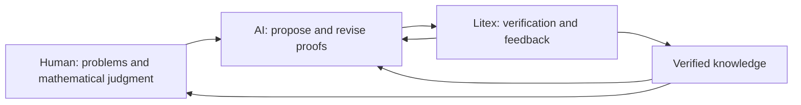

# Litex: A Formal Language Where Mathematics Verifies Itself

Created and maintained by Jiachen Shen.

Last updated: October 8, 2026.

Website: https://litexlang.com/doc/Litex_Blueprint

Chinese version: https://litexlang.com/doc/Litex中文蓝图

## Table of Contents

- [0. Litex Blueprint Overview](#overview)
  - [0.1 Five Main Threads: How Litex Works](#overview-spine)
- [1. Write Facts and See Why They Hold](#fact-oriented)
  - [1.1 Fact-Oriented: Writing “What Holds” into the Source](#fact-oriented-interface)
  - [1.2 What Each Statement Leaves Behind: Checkable Knowledge Records](#execution-model)
- [2. Start from Familiar Mathematics: Litex’s Set-Theoretic Foundation](#set-theory)
  - [2.1 The Design Difficulty: Making Concrete Mathematics a Working Language](#design-difficulty)
- [3. Let Established Knowledge Grow: Bottom-Up Proofs](#bottom-up)
- [4. Humans, AI, and Litex Advance Proofs Together](#interaction-loop)
- [5. Connect to Lean for Independent Rechecking and Mathlib Interoperability (Experimental)](#compatibility)
- [6. From Language to Ecosystem: The Role Litex Aims to Play](#ecosystem-role)
  - [6.1 Compiling Proofs to Executable Code (Python / C) (Experimental)](#executable-code)
- [7. The Art of Seeking What Is Different](#conclusions)
  - [Special Thanks](#special-thanks)
- [Appendix: Programming, Mathematics, and Formalization with Litex](#overview-readers)
  - [Personal Reflection: Does Litex Fill a Paradigm Gap in AI Reasoning?](#summary-bottom-up-and-top-down)
- [Appendix: Source Gallery](#overview-gallery)

<a id="overview"></a>

## 0. Litex Blueprint Overview

_“Language is an instrument of human reason, and not merely a medium for the expression of thought.”_

_— George Boole, The Laws of Thought (1854), Chapter II (excerpt)_

*Begun in 2024, Litex asks whether a formal language can become an everyday mathematical language for anyone willing to learn it: close to familiar mathematical expression, yet rigorously checked. It hopes to become a Python for formal languages, helping more people gradually become formalization experts.*

**Fostering understanding is at the heart of Litex.** Mathematics helps us understand the world; mathematical understanding itself deserves particular care in the AI era. This aim has two connected aspects.

**First, retain familiar mathematical concepts and ways of writing.** Litex seeks to preserve the objects and habits of everyday mathematical writing: sets, elements, functions, relations, and direct statements of conditions, facts, and conclusions. The aim is to let readers draw on their existing mathematical intuition and lower the barriers and costs of learning and understanding formal expression.

**Second, make the structure of mathematics easier to see.** By comparing source and verification records, readers can ask how definitions, conditions, and conclusions depend on each other, how a piece of knowledge is established, and how it supports further reasoning. Litex hopes this will help people [deepen their understanding](https://terrytao.wordpress.com/2026/09/11/a-severe-misalignment-of-ai-in-mathematics/), discover connections, and find inspiration through formalization.

Writing a checkable proof often requires both understanding the mathematics and knowing which theorem to cite or which proof tool to use. Litex makes the selection and combination of many routine verification methods part of the language: authors write definitions, constructions, and intermediate conclusions, while the language finds local grounds in current knowledge, builtin rules, and definitions, and checks their conditions.

Authors can state the fact that should hold next, then inspect the grounds the language found or the point where checking stopped. Verified facts remain available to later reasoning. Litex organizes this work around sets, elements, functions, and relations, with clear feedback that people and AI can use together. Authors choose the mathematical route; within its supported scope, the language selects methods, checks premises, and combines verification steps. [Section 1.1](#fact-oriented-interface) illustrates this division of work and the implementation it requires.

The next step on this path is Lean. The Litex-to-Lean compiler is not yet integrated into the current build and is expected to be completed by the end of 2026. Its goal is to let Lean independently recheck supported Litex proofs, connecting familiar mathematical expression to the existing formalization ecosystem.

<a id="overview-spine"></a>

### 0.1 Five Main Threads: How Litex Works

**These five threads show how Litex can build checkable mathematical knowledge step by step and put it to work for Math for AI.**

**1. I write what I want to prove, and the language explains why it holds.**

I still need to think through the proof and choose constructions and intermediate results. For local steps whose grounds can be found in the current knowledge, I want the language to carry out the checks and explain what it found.

For example, I can state an arithmetic fact directly:

```litex
1 + 1 = 2
```

The following statement records show the current CLI output in English and Chinese side by side; Litex currently supports 10 output languages. `proof_method` (`证明方法` in Chinese) explains the grounds, while `stores` (`存储` in Chinese) records facts that can be used later:

<table>
<thead>
<tr><th>English (<code>-lang en</code>)</th><th>Chinese (<code>-lang zh</code>)</th></tr>
</thead>
<tbody>
<tr>
<td><pre><code class="language-json">{
  "success": true,
  "statement": "1 + 1 = 2",
  "proof_method": {
    "type": "by_closed_calculation",
    "rule_name": "Closed calculation",
    "message": "Exact evaluation of closed expressions without proof search"
  },
  "stores": ["1 + 1 = 2"],
  "infers": []
}</code></pre></td>
<td><pre><code class="language-json">{
  "成功": true,
  "语句": "1 + 1 = 2",
  "证明方法": {
    "类型": "封闭计算",
    "规则名": "封闭计算",
    "说明": "精确计算封闭表达式，不递归搜索证明"
  },
  "存储": ["1 + 1 = 2"],
  "推断": []
}</code></pre></td>
</tr>
</tbody>
</table>

I can also define oddness and then state a concrete judgment:

```litex
prop is_odd(x Z):
    x % 2 = 1

$is_odd(3)
```

The JSON record for `$is_odd(3)` shows that the language checks the fact by unfolding the definition and retains the resulting concrete facts:

```json
{
  "success": true,
  "statement": "$is_odd(3)",
  "proof_method": {
    "type": "by_definition",
    "rule_name": "By definition",
    "message": "Verified by unfolding a definition"
  },
  "stores": ["$is_odd(3)"],
  "infers": ["3 $in Z", "3 % 2 = 1"]
}
```

These records let both people and AI see whether a statement passed, what kind of grounds the language found, and what the step left behind.

**Multilingual feedback.** The CLI can present this JSON feedback in multiple languages. The same source can be checked with `litex -lang zh -e '1 + 1 = 2'` for Chinese field names and explanations, or with `-lang fr` for French. Thanks in part to AI-assisted translation, this multilingual explanatory copy became feasible; choosing an output language does not change the Litex source or its verification. The current output locales are `en`, `zh`, `zh-hant`, `fr`, `ru`, `es`, `ar`, `ja`, `ko`, and `vi`.

**2. I can start from a mathematical world I already know.**

Litex is based on ZFC and organizes mathematics through sets, elements, functions, and relations. I want readers learning formalization to keep using their mathematical intuition and familiar ways of expressing ideas as far as possible.

For example, real numbers, sets, functions, and relations can appear together in one small example:

```litex
have a R = 2

have S set = {x R: x > 0}

have fn f(x R) R = x^2

prop is_less(x, y R):
    x < y

$is_less(2, 4)
```

`have a R = 2` introduces both `a $in R` and `a = 2`. `S` is the set of positive real numbers, `f` is the square function on the reals, and `is_less` expresses strict inequality between two reals. The final statement verifies the concrete relation `2 < 4`. These objects follow the organization of everyday mathematics.

**3. The language can retain the knowledge we have established and use it again.**

Every step forward in a proof should leave something that later steps can depend on. Objects, definitions, and verified facts together form the current mathematical context, on which new reasoning can continue to grow.

For example, we can prove Cantor's theorem ourselves: every function \(f:X\to\mathcal P(X)\) misses some subset and therefore cannot be surjective. The code below first defines what it means for a subset to have no preimage, proves the general result using a diagonal set, and then applies it to a concrete function. The whole example uses no `trust`:

```litex
prop has_no_preimage(X set, f fn(x X) power_set(X), D power_set(X)):
    forall a X:
        D != f(a)

thm cantor:
    ? forall X set, f fn(x X) power_set(X):
        exist D power_set(X) st {$has_no_preimage(X, f, D)}

    have D power_set(X) = {x X: not x $in f(x)}

    thm diagonal_nonmembership:
        ? forall a X:
            D = f(a)
            =>:
                not a $in f(a)
        by contra:
            ? not a $in f(a)
            a $in D
            impossible a $in f(a)

    claim:
        ? forall a X:
            D != f(a)
        by contra:
            ? D != f(a)
            not a $in f(a)
            a $in D
            a $in f(a)
            impossible a $in f(a)

    by def $has_no_preimage(X, f, D)
    witness exist E power_set(X) st {$has_no_preimage(X, f, E)} from D

have fn singleton(n N) power_set(N) = {n}
release thm cantor(N, singleton)
obtain missing from exist S power_set(N) st {$has_no_preimage(N, singleton, S)}
missing != singleton(0)
```

This example shows how knowledge accumulates during a proof and remains available for further use. Once we have defined the concept and proved Cantor's theorem, those results become part of the current mathematical context. When we introduce the concrete function `singleton`, Litex can use the general conclusion already proved to obtain new objects and facts for subsequent reasoning.

**4. AI can work with people to advance proofs through explicit feedback.**

AI can help try different approaches, fill in steps, and correct errors. People focus on the problem and its mathematical meaning; Litex provides verification feedback. Their shared work should accumulate checkable results.



**5. A written proof should ultimately be checked again by Lean.**

I want expressions closer to everyday mathematics to compile into Lean proof objects, receive an independent check, and connect to the existing ecosystem. The current build has not yet integrated this compiler entrypoint; it remains a goal for Litex to implement.

For example, consider a Litex arithmetic fact:

```litex
1 + 1 = 2
```

Using the representation from the repository's earlier compilation experiment, the corresponding Lean proof can be written as:

```lean
import Litex

theorem one_add_one : Litex.Same ((1 : ℂ) + (1 : ℂ)) (2 : ℂ) := by
  exact Litex.Same.ofEq (by norm_num)
```

`Litex.Same` is the equality relation in that compilation layer. The minimal Lean fragment above has been checked by Lean. It illustrates the target proof form; the current Litex build still has no compiler entrypoint that generates it.

Whether you are a mathematician, a programmer, or a Lean user, Litex can offer new knowledge and perspectives; if you are interested, continue with [Programming, Mathematics, and Formalization with Litex](#overview-readers) at the end of this document.

The following chapters develop these five threads in order, then discuss the language ecosystem; reader comparisons and further source examples appear in the appendices.

<a id="fact-oriented"></a>

## 1. Write Facts and See Why They Hold

_“Readability counts.”_

_— Tim Peters, The Zen of Python (PEP 20)_

<a id="fact-oriented-interface"></a>

### 1.1 Fact-Oriented: Writing “What Holds” into the Source

When an author writes the fact that should hold next, Litex starts checking: it first checks well-definedness, then searches builtin rules and strategies, known facts, universal facts, and definitions for local grounds. The language selects and combines verification methods for many routine steps; authors still supply key constructions, witnesses, and estimates.

#### How Litex Helps Users Search Verification Routes by Fact Shape

An atomic goal has a recognizable relation or predicate shape, such as `>=`, `$is_positive`, or `$in`. The verifier uses it to retrieve candidates, instantiate arguments or align expressions through known equalities, and check premises. If no supported path applies, it stops at the goal. This bounded local lookup is not unrestricted proof search. Shape indexing helps control the candidate set; speed and memory effects still need measurement on comparable tasks.

Common matching targets fall into four kinds:

| What is matched | What the kernel does | Minimal example |
| --- | --- | --- |
| **Builtin rules and strategies** | Filter paths by predicate/argument shape and combine premise checks within their permissions | Given `x >= 0`, `y >= 0`, match “sum of nonnegatives is nonnegative,” get `x + y >= 0` |
| **Known concrete facts** | Find a same-shaped fact in context; align spelling by equality if needed | Given `$is_positive(a)` and `a = b`, match and rewrite to `$is_positive(b)` |
| **Known `forall`** | Match the goal shape to a universal fact, instantiate, check premises | Given `forall x R: x > 1 => $is_positive(x)` and `b > 1`, get `$is_positive(b)` |
| **Definitions** (`def` / `prop`) | Match a named predicate with its definition body by shape | Given `a > 0`, match `prop is_positive`, get `$is_positive(a)` |

```litex
prop is_positive(a R):
    a > 0

# 1) Match a builtin rule
forall x, y R:
    0 <= x
    0 <= y
    =>:
        0 <= x + y

# 2) Match a known fact, then rewrite by equality
forall a, b R:
    $is_positive(a)
    a = b
    =>:
        $is_positive(b)

# 3) Match a known forall (store the universal; then from b > 1 get $is_positive(b))
forall x R:
    x > 1
    =>:
        x > 0
        $is_positive(x)

have b R:
    b > 1

$is_positive(b)

# 4) Match the definition of prop is_positive
have a R:
    a > 0

$is_positive(a)
```

The first part's `0 <= x + y` does not name a verification tool. Litex selects a candidate path from the addition and order shapes, then checks premises such as `0 <= x` and `0 <= y` in the current context. Shape matching finds a candidate; the required premises must also check before the conclusion can be accepted. The other three parts show the same default workflow reusing known facts, instantiating universal facts, and using definitions.

| The author's mathematical work | Litex's routine verification work |
| --- | --- |
| Choose definitions, construct objects, and state conditions | Check objects, parameter domains, and well-definedness conditions |
| State the fact to establish at this step | Retrieve known grounds, rules, and builtin strategies by fact shape |
| Supply intermediate equalities, witnesses, or local derivations | Check each step's premises, record results, and reuse verified facts |
| Choose the mathematical route of the proof | Control the permissions and rewrite scope of default search |

Litex's design characteristic is to organize these capabilities into one everyday workflow: classify mathematical objects and facts, let ordinary facts trigger local verification, and extend available knowledge when they pass. Within the supported scope, authors can write mathematical steps directly while the language implementation handles many of their mechanical verification operations.

The current implementation grades lookup paths through `VerifyState`: direct evidence, known object properties, builtin rules, strategies, definitions, and universal facts have different permissions. When checking a rule's premises, the verifier passes down only lower lookup permissions; rewrites through definitions or universal facts also have explicit boundaries within a branch. Adding a rule thus requires specifying what it may use as premises and how to prevent it from calling itself repeatedly. The author still writes only the fact to establish at this step.

<details>
<summary><strong>Which steps does Litex check automatically, and which should the author write?</strong></summary>

Authors choose definitions, constructions and key intermediate results; Litex checks supported local steps against current knowledge. The boundary depends on the work a step requires: following a fixed structure to check available grounds, or choosing a proof route that has not yet been supplied. It cannot be drawn simply by counting automatic steps.

**Check types through a uniform structure.** This expression contains several layers of addition, but the author need not supply a separate type fact for each layer:

```litex
have n N
((n+1)+1)+1 $in N
```

Litex follows the supported addition structure using closure of the natural numbers. This does not mean that every operation preserves the natural-number carrier; domains and operation conditions still have to hold.

**Supply an intermediate equality, then reuse the result.** The author can expose the route from a definition to a value:

```litex
have x R = 2
have y R = x + 1
y = x + 1 = 3
y^2 = 9
```

The third line specifies unfolding `y` and then calculating `x+1`. Once the chain checks, its endpoint equality `y=3` is available to later steps; the fourth line need not repeat that derivation.

**Supply a recursive unfolding.** For a function they define, authors can specify the recursive equation and the established value to substitute:

```litex
have fn f(n N) N by induc n from 0:
    case n = 0: 0
    case n >= 1: f(n - 1) + 1
f(0) = 0
f(1 - 1) = f(0) = 0
f(1) = f(1 - 1) + 1 = 0 + 1 = 1
```

Here the value of `f` comes from the author's definition. The final chain uses the recursive equation, the initial value and arithmetic in order. With the same definition and `f(0)=0`, the bare assertion `f(1)=1` did not close automatically in the current acceptance run. A checkable explicit route does not require default search to discover every combination of recursive unfoldings.

Search can be made stronger, but more search branches also add runtime and maintenance costs. Litex aims to automate mechanical reasoning with clear structural, evidence and cost boundaries, while authors write meaningful mathematical steps. Repeated mechanical typing or repeated use of existing evidence should prompt an audit for missing shared support; every failure should not be assigned to the author. The effects of this tradeoff still need measurement on real tasks.

</details>

<a id="automation-implementation"></a>

<details>
<summary><strong>Why does Litex's verification kernel need so much implementation?</strong></summary>

The operations authors omit still have to be performed. To check `0 <= x + y` directly, the system must recognize the goal's shape, select a candidate path, check the objects and both nonnegative premises, record the grounds, and make the conclusion reusable. These responsibilities move into the language implementation.

**Classification and combination.** Litex implements many common mathematical rules and bounded proof strategies that combine supported checks. Different objects, operations, and relations have different conditions. Classifying paths by mathematical category helps narrow candidates and gives each combination explicit premises and calling boundaries. This document calls them rules and proof strategies; they need not correspond to tactics with the same names in other proof assistants.

**Premises and evidence.** Alongside matching a goal, the system must check the sets its arguments belong to, function-call conditions, and required facts, then preserve the result and give feedback. These checks let authors omit routine operations, while requiring implementation for each verification path. The typing, equality-chain, and recursive examples above illustrate the division of work for different paths.

**Search and maintenance costs.** Searching for further intermediate conclusions, rewrites, or recursive unfoldings adds branches and combinations to handle. The default workflow therefore has explicit permissions: it seeks grounds for a supplied local step, with authors supplying mathematical routes at the supported boundary. Repeated mechanical bridges should still prompt an audit for missing shared support. Every additional path needs review of its mathematical conditions, evidence, and cost; code size cannot substitute for that review.

Here, “verification kernel” means the project's verification and execution implementation, including grounds search, builtin mathematical rules, well-definedness checks, fact storage, and feedback. The [Lean Language Reference](https://lean-lang.org/doc/reference/latest/Elaboration-and-Compilation/) separates elaboration and tactic execution from the trusted kernel that checks core proof terms; code-size comparisons need to distinguish these responsibilities. Current verification relies on the correctness of Litex's verifier and its builtin and inference rules. [Section 5](#compatibility) explains the goal and current status of independent Lean rechecking.

</details>

<details>
<summary><strong>How many objects, statements, and builtin verification paths exist today? (2026-10-04 snapshot)</strong></summary>

This inventory counts Rust enum variants at source commit `2ecde77d0`. The rows use different units and cannot be added into one “total number of builtin theorems.”

| Implementation layer | Count | Unit counted |
| --- | ---: | --- |
| `Obj` | 17 top-level families; 91 expanded forms | AST categories for objects and expressions |
| `Stmt` | 9 top-level families; 50 expanded forms | AST categories for facts, definitions, proof commands, and other statements; `ByStmt` has 10 forms and `ReleaseAndExpandStmt` has 7 |
| `Fact` / `AtomicFact` | 10 / 46 | Fact forms / atomic-relation forms |
| Builtin rules | **551** | Nonempty terminal proof-result branches: 267 for equality, 259 for other atomic facts, 16 for disjunctions, and 9 for existentials |
| Builtin strategies | **128** | Strategy-result branches: 8 for equality and 120 for other atomic facts |
| Builtin rewrites / builtin predicate-definition paths | 5 / 11 | Separately counted result branches, excluded from the rule count above |
| Reserved named builtin theorems | 29 | Distinct names callable through the general `release thm` interface and related entrypoints |

“Expanded” has a fixed boundary: for `Obj`, it opens the immediate mathematical-expression families while keeping names, function applications, and template instances as three generic forms; for `Stmt`, it opens the first-level statement families and `DefineObjStmt`, but does not expand the contained `Fact`. Thus 91 and 50 are AST-form counts, not 91 builtin mathematical objects or 50 theorems.

These rule branches are organized around concrete mathematical interfaces, rather than an arbitrary collection of proof tricks. Each counted branch has a named proof-result shape aimed at an object operation, the logical structure of a fact or statement, or a familiar mathematical property; it need not directly unfold a source definition. In the `0 <= x + y` example above, addition is an object operation and `<=` is an atomic fact; the `SumOfNonnegatives` result records separate evidence for the two nonnegative premises. `UnionCommutative` represents a familiar property of set union, while `EqualityWitnessFromMembership` uses a known membership fact to supply a witness for an existential statement. Each kind of path has a goal shape and applicability conditions, and strategies combine checks within specified permissions. This is implementation work behind the short source the author writes. The numbers describe the structural scale of these interfaces and evidence branches; they do not establish that every branch is reachable in the current build, correct, or independently rechecked by Lean. Those questions require path-by-path review.

</details>

<details>
<summary><strong>Why can Litex maintain a fact table? Could Lean be extended to do the same?</strong></summary>

Lean can extend automation; `simp` and `grind` already use known facts. Litex makes a more specific choice: bounded local checking by fact shape is the default behavior of ordinary statements, and its proposition interface stays within a range that is easier to index. For example, it does not support `forall p prop`, which quantifies over arbitrary propositions; its usual goals have named predicates or atomic relations such as membership, equality, and order.

That restriction lets Litex's current fact and rule tables narrow candidates by relation or predicate head before checking arguments and premises. Stored forall equality conclusions also use nested constructor patterns, function positions and parameter holes on both endpoints. Fixed argument subterms can use existing Direct equality before constructor descent; instantiation carriers and premises still require checked evidence. It does not prove that Lean cannot offer a similar experience, or that higher-order propositions make every goal unindexable. It identifies the expressive boundary chosen for Litex's default checking path. The usability it gains and forms of expression it forgoes need testing in real formalization tasks.

</details>

The following three Lean–Litex comparisons show several of these kinds of matching through complete interface examples. Lean source of course also contains a theorem statement that states the goal, and Litex also allows explicit theorems and proof structure; the difference is the default center of attention:

| Typical interface | What the source mainly presents | What interactive output mainly presents |
| --- | --- | --- |
| Lean tactic proof | The theorem statement gives the goal; the tactic proof body mainly writes **how**: how to rewrite, apply a theorem, or close the goal | Infoview shows **what**: what still needs to be proved |
| Litex fact-oriented proof | The source mainly writes **what**: which objects, conditions, and facts should hold | Verification output explains **how**: why a fact was accepted, or where verification stopped |

This table compares typical workflows, not every way either language can be written. The next three examples show different sources of grounds. The everyday Normal JSON summarizes the top-level method; more detailed premise checks remain in typed verification results.

<details>
<summary><strong>Example 1: how Lean and Litex verify “the sum of two nonnegative reals is still nonnegative”</strong></summary>

**Builtin rules and strategies.** Litex splits the goal into a predicate and an argument shape, filters candidate paths accordingly, then checks that types, premises, and conditions all hold.

The mathematical fact to prove is: the sum of two nonnegative reals is still nonnegative.

**Lean source｜proof body writes how**

```lean
import Mathlib

example (x y : ℝ) (hx : x ≥ 0) (hy : y ≥ 0) : x + y ≥ 0 := by
  exact add_nonneg hx hy
```

Before that last line runs, Infoview shows the unfinished **what**:

**Lean Infoview｜shows what**

```text
x y : ℝ
hx : x ≥ 0
hy : y ≥ 0
⊢ x + y ≥ 0
```

**Litex source｜writes what directly**

```litex
forall x, y R:
    0 <= x
    0 <= y
    =>:
        0 <= x + y
```

This source does not name a rule. The goal `0 <= x + y` can be expressed as the predicate `>=` and the arguments `x + y`, `0`; the kernel filters candidates accordingly, matches the two nonnegative premises, and continues to check types and conditions.

The current CLI Normal output labels the whole `forall` statement `compound_fact` and stores that universal fact. This top-level summary does not expand each internal rule check.

For the fixed identity `tan(x)*cot(x)=1`, equality WD first checks real `x`
and the actual `sin(x)!=0` and `cos(x)!=0` evidence. The identity leaf then
matches the same angle without another premise search. Detailed output keeps
both the `TanCotProduct` leaf and the enclosing WD citations. The analogous
`TanSquareReciprocalCosine` leaf needs `cos(x)!=0`. These are bounded fixed
laws; they do not restore a general trigonometric normalizer. The
[product tracer](../examples/proof_nodes/equal/by_builtin_rule/tan_cot_product.lit)
records the before/after behavior.

Negative/nonpositive common-factor rules are fixed order leaves with two
mandatory stages: checked sign, then checked reversed argument comparison.
Sixteen dedicated payloads cover four comparison targets and four product
placements. Fixed converse/stronger-premise alternatives retain the inherited
ceiling and chosen proof; no global normalization or search stage is added.
Positive/nonnegative routes keep precedence. The [weak-order tracer](../examples/proof_nodes/atomic/by_builtin_rule/nonpositive_common_factor_weak_order.lit)
also preserves the strict-versus-zero boundary.

First-quadrant leaves read the actual strict bounds `0<x<pi/2`, retaining
both source citations. Two nonzero leaves supply the existing sine/cosine
requirements during tangent/cotangent WD; four separate Less/Greater leaves
certify positivity after WD. No new search stage or persistent state is
introduced. The [quadrant tracer](../examples/proof_nodes/atomic/by_builtin_rule/trig_first_quadrant.lit)
checks these producer and consumer paths.

The fixed interval checker accepts four literal forms of the negative half-pi
endpoint and both comparison directions, keeping the actually checked source
fact. Closed numeric equality substitution uses a single scalar-tree pass:
whole known values win before children, and a rebuilt parent may use its
known value. It cites the chosen equalities and keeps the residual verifier's
permissions; table iteration order does not choose which original subterms
remain visible. The [numeric tracer](../examples/proof_nodes/atomic/by_builtin_rewrite/closed_numeric_subterm_priority.lit)
checks this behavior without changing search stages or persistent state.

</details>

<details>
<summary><strong>Example 2: how Lean and Litex reuse a universal fact</strong></summary>

**User-supplied universal facts.** A proved `forall` fact enters the context; when a same-shaped goal appears, Litex matches parameters and checks the instantiated premises. Whole-source replay also renames bound variables inside nested `forall` premises and `exist!` witness carriers. It preserves complete carriers, conditions and free owners, then checks WD under the caller's existing permissions. This is a structural comparison, without opening another search route. The [nested-source tracer](../examples/proof_nodes/forall/known_source_nested_unique.lit) records the actual stored-fact citation.

The second mathematical fact is: if a real `a > 10`, then there exists a positive real strictly less than `a`. The earlier universal fact can then be used directly for a concrete `a`.

**Lean source｜proof body writes how**

```lean
import Mathlib

def HasPositiveWitness (n : ℝ) : Prop :=
  ∃ a : ℝ, 0 < a ∧ n > a

theorem hasPositiveWitness_of_gt_ten (x : ℝ) (hx : x > 10) :
    HasPositiveWitness x := by
  refine ⟨10, by norm_num, ?_⟩
  exact hx

example (a : ℝ) (ha : a > 10) : HasPositiveWitness a := by
  exact hasPositiveWitness_of_gt_ten a ha
```

Before the last line runs, Infoview gives the current **what**; the `exact` in the source specifies the **how** that completes it:

**Lean Infoview｜shows what**

```text
a : ℝ
ha : a > 10
⊢ HasPositiveWitness a
```

**Litex source｜writes what directly**

```litex
prop is_positive(n R):
    exist a R+ st {n > a}

claim:
    ? forall x R:
        x > 10
        =>:
            $is_positive(x)
    witness exist a R+ st {x > a} from 10

have a R:
    a > 10

$is_positive(a)
```

Here `prop` gives a reusable interface; `claim` establishes an instantiable universal fact. The later `have` supplies a concrete premise, and the final source writes only `$is_positive(a)`, without again writing how to call the universal fact.

This source passes in the current CLI. The final statement's Normal output records `proof_method.type = cite_forall` and adds `$is_positive(a)` to `stores`, showing that the step used a known universal fact.

</details>

<details>
<summary><strong>Example 3: how Lean and Litex transport a concrete fact along an equality</strong></summary>

**Concrete facts and known equalities.** Litex can also start from a concrete fact in the context and use a known equality to align arguments that are written differently but equal.

The third mathematical fact is: given that `a` is positive and `a = b`, conclude that `b` is positive. Here one needs equality to transport a concrete fact to another writing.

**Lean source｜proof body writes how**

```lean
import Mathlib

def IsPositive (x : ℝ) : Prop :=
  x > 0

example (a b : ℝ) (ha : IsPositive a) (hab : a = b) : IsPositive b := by
  simpa [hab] using ha
```

Before `simpa [hab] using ha` runs, Infoview only presents the current **what**:

**Lean Infoview｜shows what**

```text
a b : ℝ
ha : IsPositive a
hab : a = b
⊢ IsPositive b
```

**Litex source｜writes what directly**

```litex
prop is_positive(x R):
    x > 0

forall a, b R:
    $is_positive(a)
    a = b
    =>:
        $is_positive(b)
```

The Litex source preserves premises and conclusion; it does not write `simpa` or specify a rewrite direction. The verifier finds `$is_positive(a)` from the context and then uses `a = b` to align arguments.

The current CLI accepts and stores this universal fact. Normal output summarizes the top-level method as `compound_fact`; the equality substitutions require inspection of the internal verification result.

</details>

<details>
<summary><strong>Personal observation: an analogy with imperative and declarative programming</strong></summary>

The analogy between Lean tactic proofs and Litex fact-oriented source is developed in [“For programmers”](#reader-programmers) at the end of the document.

</details>

<details>
<summary><strong>Place in the design space: searching for local proof grounds is not unique to Litex</strong></summary>

[Lean `grind`](https://lean-lang.org/doc/reference/latest/The--grind--tactic/),
[Rocq `auto`](https://rocq-prover.org/doc/master/refman/proofs/automatic-tactics/auto.html),
and [Isabelle/Isar](https://isabelle.in.tum.de/doc/isar-ref.pdf) provide local automation through explicit proof tactics or
proof methods; [Mizar](https://mizar.uwb.edu.pl/project/mizman.pdf)
has empty justification;
[ACL2](https://acl2.org/doc/index-seo.php?xkey=ACL2____DEFTHM) can attempt to prove a theorem event without hints;
[Naproche](https://naproche.github.io/) uses automated theorem provers
to check steps in controlled natural language. Litex more specifically tests whether ordinary mathematical statements can trigger local verification limited by the current context and rules, then write back to the context when they succeed and display verification sources.

Local automation can sit on different logical foundations. Litex asks whether ordinary statements can trigger explainable local checks by default within a restricted proposition interface, set-theoretic objects, and a context that grows statement by statement. Any cost comparison with other systems needs concrete tasks.

</details>

<a id="execution-model"></a>

### 1.2 What Each Statement Leaves Behind: Checkable Knowledge Records

Each accepted statement adds knowledge that later proof steps can use. Its execution result records the top-level grounds, stored facts, and inferences within their scope; a failure identifies where checking stopped. Reading source and result together shows why the step holds and what it leaves behind. More complete verification evidence remains in the internal result tree for detailed tools and future Lean rechecking.

First consider a minimal contiguous fragment:

```litex
let a = 1
a + 1 = 2
```

The first sentence is a definition (`define`): it introduces an object and stores the defining fact `a = 1` in the context. The second sentence is verification (`verify`): it reads the current context, checks well-definedness of `a + 1 = 2`, performs transparent definition reduction along `a = 1`, then uses a numerical normalization rule. After it succeeds, the second fact enters the current context and becomes a basis later statements can continue to use.

Below is the execution result of this fragment.

<details>
<summary><strong>Expand: Litex execution result</strong></summary>

```json
{
  "kind": "run",
  "success": true,
  "target": "eval",
  "path": null,
  "detail": "normal",
  "session_error": null,
  "statement_results": [
    {
      "success": true,
      "statement": "let a = 1",
      "proof_method": { "type": "define_obj" },
      "stores": ["a = 1"],
      "infers": []
    },
    {
      "success": true,
      "statement": "a + 1 = 2",
      "proof_method": {
        "type": "builtin_rule",
        "rule_name": "Calculation",
        "message": "Both sides evaluate to the same number"
      },
      "stores": ["a + 1 = 2"],
      "infers": []
    }
  ]
}
```

</details>

The second statement passes well-definedness, definition reduction, and numerical checking. The Normal JSON above displays only the top-level `Calculation`; it does not expand every internal substep. Readers can answer several immediate questions from this everyday record:

| What the reader wants to know | What to look at in the record |
| --- | --- |
| Which statement ran | `statement` |
| Whether it succeeded | statement `success`, and run `success` / `session_error` |
| Why it holds | `proof_method` (rule name, cite, definition route, …) |
| Why it stopped | `why_failed.phase` and `why_failed.goal` |
| What entered the later context | `stores` and `infers` |

Normal JSON is a summary for people and tools. The full verify/exec evidence tree is not printed by ordinary `-e` / `-f` / `-r` output. Future Lean rechecking would require translating supported verification paths into Lean evidence without proof holes.

Well-definedness comes before acceptance: even though `1 / 0 = 1 / 0` has identical sides, division by zero prevents it from becoming an accepted equality.

<details>
<summary><strong>Expand: Litex execution result</strong></summary>

When we enter `1 = 0`, Litex's Normal JSON output is

```json
{
  "kind": "run",
  "success": false,
  "target": "eval",
  "path": null,
  "detail": "normal",
  "session_error": null,
  "statement_results": [
    {
      "success": false,
      "statement": "1 = 0",
      "why_failed": {
        "phase": "search_proof",
        "goal": "1 = 0"
      },
      "stores": [],
      "infers": []
    }
  ]
}
```

A failed statement adds neither `stores` nor `infers` to the accepted context. An external writing tool can save the attempt and its feedback for a human or AI to repair. Litex returns a diagnosis; it does not automatically maintain a complete archive of attempts.

</details>

The record lets people inspect local grounds, gives AI feedback for revision, and can supply material for a dependency graph of definitions and facts. By comparing source, established definitions and facts, and the verification method for the step, readers can ask why it holds and how the reasoning connects from one step to the next. Section 4 discusses collaboration; Section 5 discusses the goal of handing supported internal evidence to Lean for independent rechecking. Both depend on clear boundaries between accepted statements and stopped attempts.


I believe the functions of this output stream go beyond those listed above. We hope more scenarios will be discovered in the future AI era.

<details>
<summary><strong>Summary: which mathematical views Litex's design embodies</strong></summary>

Definitions establish objects and vocabulary; verification confirms facts; accepted statements extend the background available later. Litex aims to cover common mathematics through a small number of composable objects, relations, logical forms, rules, and library interfaces, rather than an isolated interface for every phrasing. Coverage is still being expanded and audited.

Whether this combination reduces the cost for people and AI to construct, understand, and repair checkable knowledge is a design hypothesis to test on real tasks. Exposing grounds lets readers ask for the mathematical reason behind each source statement.

</details>

<details>
<summary><strong>Implementation summary: how the record is generated</strong></summary>

The current implementation connects statement execution with result records; the Lean path remains a goal:

```text
Litex source
  → parse into typed objects and statements
  → execute definition or verification
  → check well-definedness, shape, grounds, and premises
  → produce a structured execution result
  → commit the candidate or roll it back
  → update the accepted context, and run inference when applicable
  → let humans and AI see accepted paths, context changes, and repair boundaries
  → retain a checkable knowledge record for tools and interactive views
  → provide machine-readable or structured views such as JSON and relation graphs when needed
  → future integration: hand supported evidence to a Lean compiler and kernel
```

JSON is generated directly from internal execution results and summarizes the check. Relation graphs offer another way to view those results; independent Lean rechecking remains a goal to be integrated.

</details>

<a id="set-theory"></a>

## 2. Start from Familiar Mathematics: Litex’s Set-Theoretic Foundation

_“Language design is a curious mixture of grand ideas and fiddly details.”_

_— Bjarne Stroustrup_

Litex takes set theory as its mathematical foundation and organizes mathematics through sets, elements, functions, and relations. Authors can write membership, subset relations, function applications, and equalities directly, without first unfolding the concrete set-theoretic construction of common objects. The aim is to let readers work with familiar mathematical concepts and reduce the extra effort of understanding formal representations. How builtin rules and number-system interfaces correspond to foundational theory still needs to be documented and audited.

For example, if `s` is contained in `t`, then after intersecting each with the same set `u`, the former is still contained in the latter:

```litex
forall s, t, u set:
    s $subset t
    =>:
        intersect(s, u) $subset intersect(t, u)
```

**Symbolic input.** The same conclusion can also be typed as `s ∩ u ⊆ t ∩ u`. Litex accepts `∩` and `⊆` as input and normalizes them to `intersect` and `$subset`. Most examples here use the letter-based spelling because it is easier to type on an ordinary keyboard.

As one can see, this writing is very close to the set-theoretic statements we meet in everyday mathematics.

Below is the Lean version of the same mathematical statement from the set-theory chapter of *Mathematics in Lean*:

```lean
import Mathlib.Data.Set.Lattice

section
variable {α : Type*}
variable (s t u : Set α)
open Set

example (h : s ⊆ t) : s ∩ u ⊆ t ∩ u := by
  rw [subset_def, inter_def, inter_def]
  rw [subset_def] at h
  simp only [mem_setOf]
  rintro x ⟨xs, xu⟩
  exact ⟨h _ xs, xu⟩
end
```

Lean first declares a common element type `α : Type*`, then declares `s`, `t`, `u : Set α`. This makes the theorem reusable over any element type; `Type*` also involves the universe hierarchy of types.

This comparison shows how the two languages introduce sets and develop a proof: Lean first declares the element type, while Litex directly states and checks facts about the sets. Lean can also prove the result with a short proof or automation; the textbook's expanded steps are retained here to make the comparison easier to follow.

> **Set theory provides the foundation; everyday writing can start from familiar concepts.**

Two common questions arise: must users first become fluent in set theory, and must they construct every object from the ZFC axioms?

<details>
<summary><strong>Two misreadings: neither “learn set-theoretic encoding first” nor “rebuild everything from ZFC”</strong></summary>

**Misreading 1: If I am not fluent in set theory, I cannot express ordinary notions such as groups, topological spaces, or open sets with ∈ and ∪.**  
Familiar mathematical concepts need readable forms in the language. Groups, topological spaces, and their families of open sets can be defined through their mathematical properties:

```litex
# Group: carrier set, operation, identity, inverse, and the usual laws
struct Group<s nonempty_set>:
    mul fn(x, y s) s
    one s
    inv fn(x s) s
    <=>:
        forall x, y, z s:
            mul(mul(x, y), z) = mul(x, mul(y, z))
        forall x s:
            mul(x, one) = x
            mul(one, x) = x
            mul(inv(x), x) = one

# Topology: a space is its carrier together with a family of open sets
prop is_topological_space(X set, open_sets power_set(power_set(X))):
    {} $in open_sets
    X $in open_sets
    forall U, V open_sets:
        intersect(U, V) $in open_sets
    forall family power_set(power_set(X)):
        family $subset open_sets
        =>:
            family_union(family) $in open_sets
```

An open set is simply a member of that family: under the explicit assumption `$is_topological_space(X, open_sets)`, writing `U open_sets` means that `U` is open. The group–Lean comparison below is a fuller interface contrast; here the point is only what the “dictionary” looks like. Coverage is still expanding; this is not a claim that every common notion is already catalogued.

**Misreading 2: If the foundation is set theory, must every development rebuild analysis, algebra, and topology from the ZFC axioms—and would that not be too hard?**  
Everyday work can start from existing objects and structures and use their properties in further proofs, without unfolding their concrete set-theoretic constructions each time. Litex also provides set-theoretic / ZFC-side axiom and constructor interfaces for foundational work or a particular construction. Authors can choose how much of that foundation the problem requires them to unfold.

More precisely: Litex's builtin layer cares about **checkable relationships** among objects, statements, and facts—not about picking one “true” concrete construction as the definition. Rational numbers `Q` and real numbers `R` admit many set-theoretic constructions; a function may be modeled by different graph encodings. The builtin interface does not make any one of these the unique definition; it exposes usable relations such as membership, inclusion, and the domain–codomain behavior of function application. When a particular construction matters, a development may write it explicitly, or mark an assumed compatibility result with `trust`.

Readers can therefore start from familiar concepts such as groups or topological spaces, or use foundational axiom interfaces when needed. The fragments above and the group comparison below show the former approach; they do not require readers to first complete a construction beginning with the empty-set axiom.

</details>

<details>
<summary><strong>Technical summary: typing judgments and membership facts</strong></summary>

Lean organizes mathematics as typed terms: after elaboration, core expressions are checked by judgments of the form `Γ ⊢ e : T`. The colon belongs to a meta-level typing judgment; it is not an ordinary proposition in Lean's object language that can be accumulated alongside equality, order, or theorem facts. Surface overloading and coercions can elaborate similar writing into different core terms, but each resulting term is checked under a definite type.

Litex organizes mathematics as objects and a gradually growing fact context. `e $in S` is a membership fact in the object language, at the same logical layer as equality, order, and other predicates. Therefore the same object can be proved to belong to several unrelated or overlapping sets: membership is a relation among objects, not a unique intrinsic assignment `typeOf(e) = S`.

Object capability lookup uses the facts stored for the object's canonical
identity. The execution environment's `special_properties` index retains actual
membership and equality facts, including facts learned after a name's
introduction. Function-call checking reads signatures from these facts;
function-body unfolding follows and cites stored equalities. For example,
`have fn f(x R) R = x + 1` followed by `let g = f` supports `g(4) = 5` directly.
Membership `g $in fn(x R) R` alone supplies callability without a concrete value.
Definition-selected default struct field views remain a distinct annotation.

This does not cancel static constraints or inference. Before accepting an expression, Litex still checks domains, return sets, structure fields, and other well-definedness obligations, and derives membership and carrier facts in proofs through dedicated rules. The difference is that such inference adds facts such as `e $in S` to the context, rather than inferring a privileged type `e : T` that decides the object's identity.

Lean's core is based on dependent type theory; Litex chooses to organize user-facing mathematics through sets and membership facts. Lean's `Set α` can also express set-theoretic mathematics, and Mathlib offers rich mathematical interfaces. The difference is in how each language asks authors to introduce objects, state facts, and supply verification grounds by default. Litex's current coverage is still expanding; a shared mathematical goal does not mean the two systems already have identical scope. Litex's verifier and builtin rules form their own trusted implementation surface, which makes independent Lean rechecking an important goal. The earlier compiler experiment is not wired into the current build.

</details>

<a id="design-difficulty"></a>

### 2.1 The Design Difficulty: Making Concrete Mathematics a Working Language

“More concrete” refers to the mathematical vocabulary authors ordinarily work with. The [Lean Language Reference](https://lean-lang.org/doc/reference/latest/Elaboration-and-Compilation/) explains that Lean elaborates surface syntax into core type-theoretic expressions whose proof terms the kernel checks; compiler IR for executable programs belongs to another path. Lean also has rich notation and automation. Litex chooses sets, membership facts, and named functions to organize everyday writing.

For example, `have a R = 2` looks like one sentence, yet the current CLI records both `a $in R` and `a = 2` for later well-definedness checks, calculation, and equality alignment. One object may have several membership facts, and aliases affect function-signature lookup. When authors omit an operational step, the language must maintain these cross-statement relationships and check that they support the next statement before accepting it.

The design challenge is making arithmetic, set construction, functions, relations, quantifiers, witnesses, contradiction, and induction work together. In the Cantor proof, `{x X: not x $in f(x)}` combines bounded set construction, function application, negation, and membership. Each combination raises questions: when is it well-defined, which premises may be cited, how is repeated search controlled, what facts and grounds are stored on success, and where should failure stop? The current verifier reduces lookup permissions when checking rule premises; statement execution checks in a temporary environment before committing accepted facts. These mechanisms support the concise writing.

Litex still leaves key constructions, intermediate conclusions, and witnesses to authors, with explicit structures such as `claim`, `witness`, `by contra`, and induction. It aims to make rigorous checking, useful coverage of interacting mathematical features, and ease of use work together. A single example or list of symbols cannot establish that arbitrary proofs are supported. Coverage and future independent Lean rechecking require separate verification and compilation evidence.

<a id="group-comparison"></a>

<details>
<summary><strong>Small example: defining the same mathematical object under different axiomatic systems</strong></summary>

When the standard library does not cover a domain, can users build a theory from a small set of shared concepts? Sets, functions, relations, and operations are a shared language across domains, letting definitions and theorems grow along their own mathematical dependencies rather than first obeying an external library's encoding. This is **bootstrapping a mathematical theory**.

Mature libraries certainly speed construction, but they should not be a precondition for expressing a new domain. The two group fragments below express the same structure and uniqueness of the identity, yet present different interfaces for carriers, operations, and laws.

A group consists of elements, a binary operation, an identity, and inverses, satisfying associativity, identity laws, and inverse laws. If another element also behaves as an identity for every element, it must coincide with the original identity.

#### Lean: a record type over `Type` and curried functions

```lean
structure Group where
  Carrier : Type
  mul : Carrier → Carrier → Carrier
  one : Carrier
  inv : Carrier → Carrier
  mul_assoc : ∀ a b c : Carrier, mul (mul a b) c = mul a (mul b c)
  one_mul : ∀ a : Carrier, mul one a = a
  mul_one : ∀ a : Carrier, mul a one = a
  mul_left_inv : ∀ a : Carrier, mul (inv a) a = one

theorem one_unique
    (G : Group)
    (e : G.Carrier)
    (hleft : ∀ a : G.Carrier, G.mul e a = a)
    (hright : ∀ a : G.Carrier, G.mul a e = a) :
    e = G.one := by
  calc
    e = G.mul G.one e := (G.one_mul e).symm
    _ = G.one := hright G.one
```

Lean specifies the element type with `Carrier : Type`, and later operations and laws depend on it. `Carrier → Carrier → Carrier` is a curried binary function that takes two elements in turn; associativity and identity laws become named fields such as `mul_assoc` and `one_mul`. This helps abstraction and large-library reuse; authors must also know which field to call in a proof and in which direction an equality is used. The example above explicitly calls `G.one_mul`.

#### Litex: operations on a set and structural facts written directly

```litex
struct Group<s nonempty_set>:
    mul fn(x, y s) s
    one s
    inv fn(x s) s
    <=>:
        forall x, y, z s:
            mul(mul(x, y), z) = mul(x, mul(y, z))
        forall x s:
            mul(x, one) = x
            mul(one, x) = x
            mul(inv(x), x) = one

forall s nonempty_set, G &Group<s>, identity s:
    forall a s:
        G.mul(identity, a) = a
        G.mul(a, identity) = a
    =>:
        identity = G.mul(G.one, identity) = G.one
```

Litex first binds a nonempty set `s`, then writes the group as a structure on it. `mul fn(x, y s) s` means the operation takes two elements of `s` and returns a result still in `s`; the group laws are written as ordinary facts under `<=>:`. Uniqueness of the identity is then written directly as an equality chain, and the kernel searches for identity-law grounds. Long-lived results can still be named as a `thm`, but local facts need not all become interfaces that must be memorized first.

Field paths such as `G.mul` are checked against the declared structure carrier; the path itself does not add the group axioms to the context. Directly binding `G &Group<s>` opens one layer automatically. A struct definition also publishes universal laws over its parameters and instance; inner consequent universals are flattened without changing premises or existential dependencies. Ordinary known-forall matching can use those laws when the exact carrier and conditions verify. `release struct def expression` still verifies membership before materializing one layer of representation and property facts; a later membership fact alone does not eagerly unpack the value.

Lean can also define a group without Mathlib. These examples compare everyday writing; Litex still depends on its verifier, rules, and standard library, and external libraries can help authors build theories faster. The earlier distinction between the set-theoretic foundation and everyday writing also applies to this group example.

The group is only a small demonstration. A stronger test is whether a small team can build readable, extensible interfaces with clear boundaries for domains that existing libraries cover poorly. Future libraries in geometry and other areas should show progress through dated source, verification results, `trust` boundaries, and real reuse notes, rather than claiming success in advance.

</details>

<details>
<summary><strong>Place in the design space: set-theoretic presentation is not Litex's invention</strong></summary>

[Mizar's mathematical library](https://wiki.mizar.org/library/) is based on Tarski–Grothendieck set theory;
[Lean](https://lean-lang.org/doc/reference/latest/The-Type-System/) and
[Rocq](https://rocq-prover.org/doc/V9.2.0/refman/language/core/index.html) present dependent type theory kernels to users;
[Isabelle/HOL](https://isabelle.in.tum.de/website-Isabelle2024/dist/library/Doc/Isar_Ref/HOL_Specific.html)
uses polymorphic higher-order logic.

Litex's user-facing propositional language is broadly first-order in style: atomic relations or named predicates are organized through restricted classical logical forms and quantifiers. It prefers canonical fact shapes; propositions and proofs cannot be arbitrarily combined as ordinary first-class values—so forms such as `forall p prop` are disallowed; Section 1 explains how that keeps the fact table indexable by predicate name. This describes only the propositional interface; the verifier also checks well-definedness and searches for grounds from definitions, context, and supported rules.

In this background, Litex's question falls more specifically on the user-facing object interface:
can a small, membership-centered set-theoretic surface cover substantial mathematics without requiring users to manage type
universes first?

</details>

<a id="bottom-up"></a>

## 3. Let Established Knowledge Grow: Bottom-Up Proofs

_“If I have seen further it is by standing on the shoulders of Giants.”_

_— Isaac Newton, letter to Robert Hooke (1676)_

In Litex, a proof usually moves forward from known conditions and facts. Each accepted step leaves knowledge that later steps can use. Established intermediate conclusions remain available even when the final goal has not yet been proved.

Typical Lean tactic interaction starts with a goal and reduces it to subgoals. This compares default writing and interaction directions: Litex often asks “what else do the known facts support?” while Lean tactics often ask “what does the current goal still need?” Both must check their conclusions rigorously.

<a id="two-directions"></a>

<details>
<summary><strong>Small example: top-down and bottom-up writings of the same algebraic equality</strong></summary>

This example shows two directions of progress for the same equality. Lean starts from the goal; each `rw` specifies a fact, a matching direction, and a replacement:

```lean
-- Using facts from the local context.
example (a b c d g f : ℝ) (h : a * b = c * d) (h' : g = f) :
    a * (b * g) = c * (d * f) := by
  rw [h']
  rw [← mul_assoc]
  rw [h]
  rw [mul_assoc]
```

Litex writes an equality chain from `a * (b * g)` to `c * (d * f)`. This left-to-right orientation verifies in the current kernel:

```litex
claim:
    ?forall a, b, c, d, g, f R:
        a * b = c * d
        g = f
        =>:
            a * (b * g) = c * (d * f)
    a * (b * g) = (a * b) * g = (c * d) * g = (c * d) * f = c * (d * f)
```

The chain reassociates the product, substitutes `a * b = c * d`, substitutes `g = f`, and reassociates again. Lean specifies how to rewrite the goal next; Litex writes the facts that should hold along the way, and the kernel searches for grounds of adjacent equalities.

</details>

<details>
<summary><strong>Place in the design space: forward proof is not Litex's invention</strong></summary>

Mizar, Isar, ACL2, and Naproche already support forward text, theorem accumulation, or stepwise checking, so “bottom-up” is not unique to Litex. Litex tests a combination: ordinary facts automatically trigger local verification, extend the context when they succeed, and keep accepted or stopped paths visible for humans or AI to inspect and repair; explicit proof structure is written only when ordinary verification is insufficient. A fuller comparison appears in Section 1's summary “Litex and Naproche—Similar Goals, Different Core Interfaces.”

</details>

<a id="interaction-loop"></a>

## 4. Humans, AI, and Litex Advance Proofs Together

_“By ‘augmenting human intellect’ we mean increasing the capability of a man to approach a complex problem situation…”_

_— Douglas Engelbart, Augmenting Human Intellect: A Conceptual Framework (1962), Introduction (excerpt)_

Humans own the mathematical problem, key constructions, and final judgment. AI proposes or revises the next source fragment; Litex checks it and returns grounds or a stopping point. Accepted statements become the background for the next fragment; people or external tools can record and repair failed attempts. This is how statement-level verification can enter a collaborative workflow:

```text
Human proposes a mathematical problem and an intended solution
                         ↓
AI splits the problem and solution into ordered fragments
                         ↓
              ┌──── fragment formalization loop ────┐
              │                                     │
              ▼                                     │
AI writes the current fragment as Litex code        │
                         ↓                          │
Litex structured verification result                │
   ├─ success                                       │
   │     → record this code                         │
   │     → record how Litex ran it                  │
   │     → go to the next fragment ─────────────────┘
   └─ RolledBack
         → evidence-based diagnosis
         → repair the same fragment and try again
                         ↓
All successful fragments are joined in order → the problem is solved and formalized
                         ↓
Human experts perform a basic check
                         ↓
These Litex programs become building blocks for later problems
```

Each round handles a definition, theorem, or small proof fragment. Accepted fragments become grounds for later proofs; failed attempts do not change the existing mathematical context. If collaboration tools save candidate source and output, people and AI can revisit the repair process; those tools maintain the full attempt record. Once all fragments pass, humans still need to check whether the formal statement is faithful to the original problem and mathematical intent.

<details>
<summary><strong>Example: walking one fragment formalization loop by the flowchart</strong></summary>

The following convergence example shows the intended fragment order. The two definitions have passed checking; the theorem proof remains a migration example that the current build has not verified, so this collaboration process is not yet complete.

<a id="convergence-example"></a>

**1. Human proposes a mathematical problem and an intended solution**

> First define sequence convergence: for every positive error `ε`, there exists a position `N` after which every term is close enough to the limit. Then prove: if `{s(n)}` converges to `a`, then `{c * s(n)}` converges to `c * a`.

**2. AI splits the problem and solution into ordered fragments**

For this problem, AI might first split it into, for example:

1. Define “eventually close enough,” a predicate defined with `prop`
2. Define “convergence,” a predicate defined with `prop`
3. Write and prove a `thm`: scalar multiplication preserves convergence

**3. Fragment formalization loop: the first two fragments succeed—definitions enter the context**

AI first submits two definitions; Litex returns success. That leaves this source, together with a record of how Litex ran it. The accepted context grows, and later theorem fragments can unfold by definition.

```litex
# "Eventually close enough": from N0 onward, every term lies within error epsilon.
prop is_eventually_close(s fn(n N) R, a R, epsilon R+, N0 N):
    forall n N:
        n >= N0
        =>:
            abs(s(n) - a) < epsilon

# "Converges to a": for every positive error there exists such an N0.
prop converges_to(s fn(n N) R, a R):
    forall epsilon R+:
        exist N0 N st {$is_eventually_close(s, a, epsilon, N0)}
```

**4. Failure and repair in the same loop: proving that scalar multiplication preserves convergence**

If AI asks `by def` to establish convergence without first constructing the `forall / exist` evidence, local checking would stop. The following JSON illustrates the shape of failure feedback; it is not a verbatim result from running this theorem in the current build:

```json
{
  "kind": "run",
  "success": false,
  "detail": "normal",
  "session_error": null,
  "statement_results": [
    {
      "success": false,
      "statement": "...",
      "why_failed": {
        "phase": "search_proof",
        "goal": "$converges_to(fn(n N) R {c * s(n)}, c * a)"
      },
      "stores": [],
      "infers": []
    }
  ]
}
```

A failed fragment does not enter the accepted context. The definition gives the shape of the goal; a proof must still construct an appropriate `N0` for each `epsilon`. The next complete fragment constructs a bound for every positive epsilon and specifies the scaled sequence pointwise:

```litex
prop is_eventually_close(s fn(n N) R, a R, epsilon R+, N0 N):
    forall n N:
        n >= N0
        =>:
            abs(s(n) - a) < epsilon

prop converges_to(s fn(n N) R, a R):
    forall epsilon R+:
        exist N0 N st {$is_eventually_close(s, a, epsilon, N0)}

thm converges_to_mul_const:
    ? forall s, scaled fn(n N) R, a, c R:
        $converges_to(s, a)
        forall n N:
            scaled(n) = c * s(n)
        =>:
            $converges_to(scaled, c * a)
    claim:
        ? forall epsilon R+:
            exist N0 N st {$is_eventually_close(scaled, c * a, epsilon, N0)}
        abs(c) >= 0
        abs(c) + 1 > 0
        have scale R+ = abs(c) + 1
        epsilon / scale > 0
        epsilon / scale $in R+
        abs(c) <= scale
        obtain N0 from exist K N st {$is_eventually_close(s, a, epsilon / scale, K)}
        witness exist K N st {$is_eventually_close(scaled, c * a, epsilon, K)} from N0:
            claim:
                ? forall n N:
                    n >= N0
                    =>:
                        abs(scaled(n) - c * a) < epsilon
                scaled(n) = c * s(n)
                abs(s(n) - a) < epsilon / scale
                abs(s(n) - a) >= 0
                scaled(n) - c * a = c * s(n) - c * a = c * (s(n) - a)
                abs(scaled(n) - c * a) = abs(c * (s(n) - a)) = abs(c) * abs(s(n) - a)
                abs(c) * abs(s(n) - a) <= scale * abs(s(n) - a)
                scale * abs(s(n) - a) < scale * (epsilon / scale) = epsilon
                abs(scaled(n) - c * a) = abs(c) * abs(s(n) - a) <= scale * abs(s(n) - a) < epsilon
            by def $is_eventually_close(scaled, c * a, epsilon, N0)
    by def $converges_to(scaled, c * a)
```

The current build stops at `def_thm` for this `thm`, so neither it nor the scalar-multiplication conclusion can enter the accepted prefix.

**5. Target workflow: join fragments only after they pass**

Only after the theorem fragment actually passes verification can definitions and theorem form a continuous Litex development. An external collaboration tool can save failed attempts to explain repairs; mathematical premises still come only from accepted source.

**6. Human experts perform a basic check**

Experts check whether the intent is still “define convergence and prove that scalar multiplication preserves it,” whether the `prop`s are faithful to the analysis definitions, and whether the estimates are credible. Machine success does not waive review.

**7. These Litex programs become building blocks for later problems**

If the theorem eventually passes verification and human review, the convergence interface and scalar-multiplication result can become reusable premises for later problems in limits or continuity. For now, this example shows that route and its unfinished boundary.

</details>

<a id="compatibility"></a>

## 5. Connect to Lean for Independent Rechecking and Mathlib Interoperability (Experimental)

_“A formal proof is a proof in which every logical inference has been checked all the way back to the fundamental axioms of mathematics.”_

_— Thomas Hales, “Formal Proof” (2008)_

Litex currently checks source with its own verifier and provides feedback; handing proofs to Lean for independent rechecking is a next-stage goal. This requires three conditions: translation preserves the original proposition, generated proofs contain no holes, and Lean's kernel actually accepts them. Meeting these conditions would reduce reliance on Litex's own verifier and allow further connections to Mathlib. Earlier compiler artifacts remain available, but the current build has no compiler integration.

> **Current build:** The `litex` binary has no integrated compiler command. A wrapper retained from the earlier experiment targets a binary absent from this build. The example below records that experiment; it has not been regenerated by the current build or rechecked with the current Lean toolchain.

<details>
<summary><strong>Example: how Litex code compiles to Lean</strong></summary>

The intended Litex–Lean–Mathlib path is:

`Litex source → Litex verification → ToLean compilation → Lean kernel recheck → handwritten adapter → Mathlib theorem`

> Current verification results retain the sources of facts and rules. A future compiler must turn each **supported** acceptance path into evidence Lean can check, and reject paths it does not yet cover. A rule count alone cannot replace this semantic work on each path.

Example: we want to prove that the sum of the first `n` positive odd numbers is `n^2`. We first write Litex source:

```litex
have fn kth_odd(k Z) Z = 2 * k - 1

forall n Z:
    n >= 1
    =>:
        sum(1, n, kth_odd) $in Z

forall n Z:
    n^2 $in Z

thm sum_first_odds:
    ? forall n Z:
        n >= 1
        =>:
            sum(1, n, kth_odd) = n^2
    by induc n from 1:
        ? sum(1, n, kth_odd) = n^2

        ? from n = 1:
            kth_odd(1) = 2 * 1 - 1 = 1
            sum(1, 1, kth_odd) = kth_odd(1) = 2 * 1 - 1 = 1 = 1^2

        ? induc:
            kth_odd(n + 1) = 2 * (n + 1) - 1
            sum(1, n + 1, kth_odd) = sum(1, n, kth_odd) + kth_odd(n + 1) = n^2 + kth_odd(n + 1) = n^2 + (2 * (n + 1) - 1) = (n + 1)^2
```

Compiled to Lean (different Litex versions may generate different output)

```lean
-- Generated by StmtResultToLeanCompiler from main.lit. DO NOT EDIT.
import Litex

set_option linter.style.nameCheck false

namespace __Compiler_main

noncomputable def kth_odd : Litex.Fn Litex.Z Litex.Z :=
  { call := fun {__alpha} (__arg : __alpha) __arg_in => (((2 : ℤ) * Litex.In.rep __arg __arg_in) - (1 : ℤ)), callOwn := fun (__arg : ℤ) => (((2 : ℤ) * __arg) - (1 : ℤ)) }

theorem __fact0 : Litex.In kth_odd (Litex.fnSet Litex.Z Litex.Z) := by
  exact Litex.In.own (Litex.fnSet Litex.Z Litex.Z) kth_odd

theorem __fact1 : Litex.Same kth_odd ({ call := fun {__alpha} (__arg : __alpha) __arg_in => (((2 : ℤ) * Litex.In.rep __arg __arg_in) - (1 : ℤ)), callOwn := fun (__arg : ℤ) => (((2 : ℤ) * __arg) - (1 : ℤ)) } : Litex.Fn Litex.Z Litex.Z) := by
  unfold kth_odd
  exact Litex.Same.refl ({ call := fun {__alpha} (__arg : __alpha) __arg_in => (((2 : ℤ) * Litex.In.rep __arg __arg_in) - (1 : ℤ)), callOwn := fun (__arg : ℤ) => (((2 : ℤ) * __arg) - (1 : ℤ)) } : Litex.Fn Litex.Z Litex.Z)

theorem __fact2 :
    ∀ (__p1 : ℤ) (__domain1 : Litex.Le (1 : ℂ) (((__p1) : ℂ))), Litex.In (Litex.sum (1 : ℤ) __p1 kth_odd) Litex.Z := by
  intro n __domain_f17
  have __infer2_0 : Litex.Lt (0 : ℂ) (((n) : ℂ)) := Litex.Lt.transLe (Litex.OrderBridge.ltOfComplexReals (show (0 : ℝ) < (1 : ℝ) by norm_num)) (__domain_f17)
  have __prior2_0 : Litex.In (Litex.sum (1 : ℤ) n kth_odd) Litex.Z := Litex.In.own Litex.Z ((Litex.sum (1 : ℤ) n kth_odd))
  exact __prior2_0

theorem __fact3 :
    ∀ (__p1 : ℤ), Litex.In (((((__p1) : ℚ)) ^ (2 : ℤ) : ℚ) : ℂ) Litex.Z := by
  intro n
  have __prior3_0 : Litex.In (((((n) : ℚ)) ^ (2 : ℤ) : ℚ) : ℂ) Litex.Z := Litex.Rules.complexIntPowNatInZ (n) (2 : ℕ)
  exact __prior3_0

theorem sum_first_odds :
    ∀ (n : ℤ) (__domain_f48 : Litex.Le (1 : ℂ) (((n) : ℂ))),
      Litex.Same (Litex.sum (1 : ℤ) n kth_odd) (((((n) : ℚ)) ^ (2 : ℤ) : ℚ) : ℂ) := by
  intro n __domain_f48
  have __step4_29 : ∀ (__p1 : ℤ) (__domain1 : Litex.Le (1 : ℂ) (((__p1) : ℂ))), Litex.Same (Litex.sum (1 : ℤ) __p1 kth_odd) (((((__p1) : ℚ)) ^ (2 : ℤ) : ℚ) : ℂ) := by
    intro __target_value __domain1
    have __target_ge_start_real : (((1 : ℤ)) : ℝ) ≤ (__target_value : ℝ) := by
      simpa [Litex.Le, Litex.OrderValue] using __domain1
    have __target_ge_start : (1 : ℤ) ≤ __target_value := by
      exact_mod_cast __target_ge_start_real
    exact Litex.Rules.integerInductionFrom (motive := fun __induction_value : ℤ => Litex.Same (Litex.sum (1 : ℤ) __induction_value kth_odd) (((((__induction_value) : ℚ)) ^ (2 : ℤ) : ℚ) : ℂ)) (by
    have __step4_2 : (Litex.Same (Litex.fnApplyCarrier (domain := Litex.Z) (codomain := Litex.Z) kth_odd ((Litex.In.own (Litex.fnSet Litex.Z Litex.Z) kth_odd)) (1 : ℤ)) (((2 : ℂ) * (1 : ℂ)) - (1 : ℂ))) ∧ (Litex.Same (((2 : ℂ) * (1 : ℂ)) - (1 : ℂ)) (1 : ℂ)) := by
      exact ⟨Litex.Same.trans ((by
      unfold Litex.fnApplyCarrier kth_odd
      exact Litex.Same.intSubComplex (Litex.Same.intMulComplex (Litex.Same.intComplexOfEq (z := (2 : ℤ)) (by norm_num)) (Litex.Same.intComplexOfEq (z := ((1 : ℤ))) (by norm_cast))) (Litex.Same.intComplexOfEq (z := (1 : ℤ)) (by norm_num)))) (Litex.Same.refl (((2 : ℂ) * (1 : ℂ)) - (1 : ℂ))), Litex.Same.ofEq (by norm_num [Litex.abs, Litex.min, Litex.max, Litex.tupleDim, Litex.TupleShape.dimension])⟩
    have __infer4_3 : Litex.Same (Litex.fnApplyCarrier (domain := Litex.Z) (codomain := Litex.Z) kth_odd ((Litex.In.own (Litex.fnSet Litex.Z Litex.Z) kth_odd)) (1 : ℤ)) (1 : ℂ) := Litex.Same.trans ((__step4_2).1) ((__step4_2).2)
    have __step4_4 : (Litex.Same (Litex.sum (1 : ℤ) (1 : ℤ) kth_odd) (Litex.fnApplyCarrier (domain := Litex.Z) (codomain := Litex.Z) kth_odd ((Litex.In.own (Litex.fnSet Litex.Z Litex.Z) kth_odd)) (1 : ℤ))) ∧ (Litex.Same (Litex.fnApplyCarrier (domain := Litex.Z) (codomain := Litex.Z) kth_odd ((Litex.In.own (Litex.fnSet Litex.Z Litex.Z) kth_odd)) (1 : ℤ)) (((2 : ℂ) * (1 : ℂ)) - (1 : ℂ))) ∧ (Litex.Same (((2 : ℂ) * (1 : ℂ)) - (1 : ℂ)) (1 : ℂ)) ∧ (Litex.Same (1 : ℂ) (((1 : ℚ) ^ (2 : ℤ) : ℚ) : ℂ)) := by
      exact ⟨Litex.Same.trans (Litex.Same.symm (Litex.Same.symm (Litex.Same.trans (Litex.Rules.integerRangeSumSingleOwn (1 : ℤ) kth_odd) ((__step4_2).1)))) (Litex.Same.symm ((by
      unfold Litex.fnApplyCarrier kth_odd
      exact Litex.Same.intSubComplex (Litex.Same.intMulComplex (Litex.Same.intComplexOfEq (z := (2 : ℤ)) (by norm_num)) (Litex.Same.intComplexOfEq (z := ((1 : ℤ))) (by norm_cast))) (Litex.Same.intComplexOfEq (z := (1 : ℤ)) (by norm_num))))), ⟨(__step4_2).1, ⟨(__step4_2).2, Litex.Same.ofEq (by norm_num [Litex.abs, Litex.min, Litex.max, Litex.tupleDim, Litex.TupleShape.dimension])⟩⟩⟩
    have __infer4_5 : Litex.Same (Litex.sum (1 : ℤ) (1 : ℤ) kth_odd) (((2 : ℂ) * (1 : ℂ)) - (1 : ℂ)) := Litex.Same.trans ((__step4_4).1) ((__step4_4).2.1)
    have __infer4_6 : Litex.Same (Litex.sum (1 : ℤ) (1 : ℤ) kth_odd) (1 : ℂ) := Litex.Same.trans (Litex.Same.trans ((__step4_4).1) ((__step4_4).2.1)) ((__step4_4).2.2.1)
    have __infer4_7 : Litex.Same (Litex.sum (1 : ℤ) (1 : ℤ) kth_odd) (((1 : ℚ) ^ (2 : ℤ) : ℚ) : ℂ) := Litex.Same.trans (Litex.Same.trans (Litex.Same.trans ((__step4_4).1) ((__step4_4).2.1)) ((__step4_4).2.2.1)) ((__step4_4).2.2.2)
    have __infer4_8 : Litex.Same (Litex.fnApplyCarrier (domain := Litex.Z) (codomain := Litex.Z) kth_odd ((Litex.In.own (Litex.fnSet Litex.Z Litex.Z) kth_odd)) (1 : ℤ)) (((1 : ℚ) ^ (2 : ℤ) : ℚ) : ℂ) := Litex.Same.trans (Litex.Same.trans ((__step4_4).2.1) ((__step4_4).2.2.1)) ((__step4_4).2.2.2)
    have __infer4_9 : Litex.Same (((2 : ℂ) * (1 : ℂ)) - (1 : ℂ)) (((1 : ℚ) ^ (2 : ℤ) : ℚ) : ℂ) := Litex.Same.trans ((__step4_4).2.2.1) ((__step4_4).2.2.2)
    have __infer4_10 : Litex.In (1 : ℂ) Litex.RPos := (Litex.In.congr ((__step4_4).2.2.2) Litex.RPos).mpr (Litex.Rules.complexEqRealInRPos (((1 : ℚ) ^ (2 : ℤ) : ℚ) : ℂ) (1 : ℝ) (by norm_num) (by norm_num))
    have __infer4_11 : Litex.Positive (1 : ℂ) := (by simpa [Litex.In.rep] using (Litex.Rules.positiveOfInRPos (__infer4_10)))
    have __infer4_12 : Litex.In (Litex.sum (1 : ℤ) (1 : ℤ) kth_odd) Litex.RPos := (Litex.In.congr (__infer4_7) Litex.RPos).mpr (Litex.Rules.complexEqRealInRPos (((1 : ℚ) ^ (2 : ℤ) : ℚ) : ℂ) (1 : ℝ) (by norm_num) (by norm_num))
    have __infer4_13 : Litex.Positive (Litex.sum (1 : ℤ) (1 : ℤ) kth_odd) := (by simpa [Litex.In.rep] using (Litex.Rules.positiveOfInRPos (__infer4_12)))
    have __infer4_14 : Litex.In (Litex.fnApplyCarrier (domain := Litex.Z) (codomain := Litex.Z) kth_odd ((Litex.In.own (Litex.fnSet Litex.Z Litex.Z) kth_odd)) (1 : ℤ)) Litex.RPos := (Litex.In.congr (__infer4_8) Litex.RPos).mpr (Litex.Rules.complexEqRealInRPos (((1 : ℚ) ^ (2 : ℤ) : ℚ) : ℂ) (1 : ℝ) (by norm_num) (by norm_num))
    have __infer4_15 : Litex.Positive (Litex.fnApplyCarrier (domain := Litex.Z) (codomain := Litex.Z) kth_odd ((Litex.In.own (Litex.fnSet Litex.Z Litex.Z) kth_odd)) (1 : ℤ)) := (by simpa [Litex.In.rep] using (Litex.Rules.positiveOfInRPos (__infer4_14)))
    have __infer4_16 : Litex.In (((2 : ℂ) * (1 : ℂ)) - (1 : ℂ)) Litex.RPos := (Litex.In.congr (__infer4_9) Litex.RPos).mpr (Litex.Rules.complexEqRealInRPos (((1 : ℚ) ^ (2 : ℤ) : ℚ) : ℂ) (1 : ℝ) (by norm_num) (by norm_num))
    have __infer4_17 : Litex.Positive (((2 : ℂ) * (1 : ℂ)) - (1 : ℂ)) := (by simpa [Litex.In.rep] using (Litex.Rules.positiveOfInRPos (__infer4_16)))
    exact (by simpa using (__infer4_7))) (fun (__induction_value : ℤ) (__induction_ge_start : (1 : ℤ) ≤ __induction_value) (__induction_hypotheses : Litex.Same (Litex.sum (1 : ℤ) __induction_value kth_odd) (((((__induction_value) : ℚ)) ^ (2 : ℤ) : ℚ) : ℂ)) => by
    have __infer4_18 : Litex.Lt (0 : ℂ) (((__induction_value) : ℂ)) := Litex.Lt.transLe (Litex.OrderBridge.ltOfComplexReals (show (0 : ℝ) < (1 : ℝ) by norm_num)) ((by
      have __induction_ge_start_real : (((1 : ℤ)) : ℝ) ≤ (__induction_value : ℝ) := by
        exact_mod_cast __induction_ge_start
      simpa [Litex.Le, Litex.OrderValue] using __induction_ge_start_real))
    have __infer4_19 : Litex.In (Litex.sum (1 : ℤ) __induction_value kth_odd) Litex.RPos := (Litex.In.congr (__induction_hypotheses) Litex.RPos).mpr (Litex.Rules.positiveIntegerRationalPowInRPos (__induction_value) (2 : ℤ) (__infer4_18) (by norm_num))
    have __infer4_20 : Litex.Positive (Litex.sum (1 : ℤ) __induction_value kth_odd) := (by simpa [Litex.In.rep] using (Litex.Rules.positiveOfInRPos (__infer4_19)))
    have __step4_21 : Litex.Same (Litex.fnApplyCarrier (domain := Litex.Z) (codomain := Litex.Z) kth_odd ((Litex.In.own (Litex.fnSet Litex.Z Litex.Z) kth_odd)) (__induction_value + (1 : ℤ))) (((2 : ℂ) * ((((__induction_value) : ℂ)) + (1 : ℂ))) - (1 : ℂ)) := by
      exact Litex.Same.trans ((by
      unfold Litex.fnApplyCarrier kth_odd
      exact Litex.Same.intSubComplex (Litex.Same.intMulComplex (Litex.Same.intComplexOfEq (z := (2 : ℤ)) (by norm_num)) (Litex.Same.intComplexOfEq (z := ((__induction_value + (1 : ℤ)))) (by norm_cast))) (Litex.Same.intComplexOfEq (z := (1 : ℤ)) (by norm_num)))) (Litex.Same.refl (((2 : ℂ) * ((((__induction_value) : ℂ)) + (1 : ℂ))) - (1 : ℂ)))
    have __step4_22 : (Litex.Same (Litex.sum (1 : ℤ) (__induction_value + (1 : ℤ)) kth_odd) ((((Litex.sum (1 : ℤ) __induction_value kth_odd) : ℤ) : ℂ) + (Litex.fnApplyCarrier (domain := Litex.Z) (codomain := Litex.Z) kth_odd ((Litex.In.own (Litex.fnSet Litex.Z Litex.Z) kth_odd)) (__induction_value + (1 : ℤ))))) ∧ (Litex.Same ((((Litex.sum (1 : ℤ) __induction_value kth_odd) : ℤ) : ℂ) + (Litex.fnApplyCarrier (domain := Litex.Z) (codomain := Litex.Z) kth_odd ((Litex.In.own (Litex.fnSet Litex.Z Litex.Z) kth_odd)) (__induction_value + (1 : ℤ)))) ((((((__induction_value) : ℚ)) ^ (2 : ℤ) : ℚ) : ℂ) + (Litex.fnApplyCarrier (domain := Litex.Z) (codomain := Litex.Z) kth_odd ((Litex.In.own (Litex.fnSet Litex.Z Litex.Z) kth_odd)) (__induction_value + (1 : ℤ))))) ∧ (Litex.Same ((((((__induction_value) : ℚ)) ^ (2 : ℤ) : ℚ) : ℂ) + (Litex.fnApplyCarrier (domain := Litex.Z) (codomain := Litex.Z) kth_odd ((Litex.In.own (Litex.fnSet Litex.Z Litex.Z) kth_odd)) (__induction_value + (1 : ℤ)))) ((((((__induction_value) : ℚ)) ^ (2 : ℤ) : ℚ) : ℂ) + (((2 : ℂ) * ((((__induction_value) : ℂ)) + (1 : ℂ))) - (1 : ℂ)))) ∧ (Litex.Same ((((((__induction_value) : ℚ)) ^ (2 : ℤ) : ℚ) : ℂ) + (((2 : ℂ) * ((((__induction_value) : ℂ)) + (1 : ℂ))) - (1 : ℂ))) ((((((__induction_value) : ℚ)) + (1 : ℚ)) ^ (2 : ℤ) : ℚ) : ℂ)) := by
      exact ⟨Litex.Rules.integerRangeSumSplitLastOwn (1 : ℤ) __induction_value kth_odd ((by simpa [Litex.Le, Litex.OrderValue] using ((by
      have __induction_ge_start_real : (((1 : ℤ)) : ℝ) ≤ (__induction_value : ℝ) := by
        exact_mod_cast __induction_ge_start
      simpa [Litex.Le, Litex.OrderValue] using __induction_ge_start_real)))), ⟨Litex.Same.intCastAddComplex (__induction_hypotheses) (Litex.Same.intComplex ((Litex.fnApplyCarrier (domain := Litex.Z) (codomain := Litex.Z) kth_odd ((Litex.In.own (Litex.fnSet Litex.Z Litex.Z) kth_odd)) (__induction_value + (1 : ℤ))))), ⟨Litex.Same.addCongrRightInt (Litex.Same.refl ((((((__induction_value) : ℚ)) ^ (2 : ℤ) : ℚ) : ℂ))) (__step4_21), Litex.Same.trans (Litex.Same.refl (((((((__induction_value) : ℚ)) ^ (2 : ℤ) : ℚ) : ℂ) + (((2 : ℂ) * ((((__induction_value) : ℂ)) + (1 : ℂ))) - (1 : ℂ))))) (Litex.Same.trans (Litex.Same.ofEq ((show ((((((__induction_value) : ℚ)) ^ (2 : ℤ) : ℚ) : ℂ) + (((2 : ℂ) * ((((__induction_value) : ℂ)) + (1 : ℂ))) - (1 : ℂ))) = ((((((__induction_value) : ℚ)) + (1 : ℚ)) ^ (2 : ℤ) : ℚ) : ℂ) from (by norm_cast <;> ring_nf)))) (Litex.Same.symm (Litex.Same.refl (((((((__induction_value) : ℚ)) + (1 : ℚ)) ^ (2 : ℤ) : ℚ) : ℂ)))))⟩⟩⟩
    have __infer4_23 : Litex.Same (Litex.sum (1 : ℤ) (__induction_value + (1 : ℤ)) kth_odd) ((((((__induction_value) : ℚ)) ^ (2 : ℤ) : ℚ) : ℂ) + (Litex.fnApplyCarrier (domain := Litex.Z) (codomain := Litex.Z) kth_odd ((Litex.In.own (Litex.fnSet Litex.Z Litex.Z) kth_odd)) (__induction_value + (1 : ℤ)))) := Litex.Same.trans ((__step4_22).1) ((__step4_22).2.1)
    have __infer4_24 : Litex.Same (Litex.sum (1 : ℤ) (__induction_value + (1 : ℤ)) kth_odd) ((((((__induction_value) : ℚ)) ^ (2 : ℤ) : ℚ) : ℂ) + (((2 : ℂ) * ((((__induction_value) : ℂ)) + (1 : ℂ))) - (1 : ℂ))) := Litex.Same.trans (Litex.Same.trans ((__step4_22).1) ((__step4_22).2.1)) ((__step4_22).2.2.1)
    have __infer4_25 : Litex.Same (Litex.sum (1 : ℤ) (__induction_value + (1 : ℤ)) kth_odd) ((((((__induction_value) : ℚ)) + (1 : ℚ)) ^ (2 : ℤ) : ℚ) : ℂ) := Litex.Same.trans (Litex.Same.trans (Litex.Same.trans ((__step4_22).1) ((__step4_22).2.1)) ((__step4_22).2.2.1)) ((__step4_22).2.2.2)
    have __infer4_26 : Litex.Same ((((Litex.sum (1 : ℤ) __induction_value kth_odd) : ℤ) : ℂ) + (Litex.fnApplyCarrier (domain := Litex.Z) (codomain := Litex.Z) kth_odd ((Litex.In.own (Litex.fnSet Litex.Z Litex.Z) kth_odd)) (__induction_value + (1 : ℤ)))) ((((((__induction_value) : ℚ)) ^ (2 : ℤ) : ℚ) : ℂ) + (((2 : ℂ) * ((((__induction_value) : ℂ)) + (1 : ℂ))) - (1 : ℂ))) := Litex.Same.trans ((__step4_22).2.1) ((__step4_22).2.2.1)
    have __infer4_27 : Litex.Same ((((Litex.sum (1 : ℤ) __induction_value kth_odd) : ℤ) : ℂ) + (Litex.fnApplyCarrier (domain := Litex.Z) (codomain := Litex.Z) kth_odd ((Litex.In.own (Litex.fnSet Litex.Z Litex.Z) kth_odd)) (__induction_value + (1 : ℤ)))) ((((((__induction_value) : ℚ)) + (1 : ℚ)) ^ (2 : ℤ) : ℚ) : ℂ) := Litex.Same.trans (Litex.Same.trans ((__step4_22).2.1) ((__step4_22).2.2.1)) ((__step4_22).2.2.2)
    have __infer4_28 : Litex.Same ((((((__induction_value) : ℚ)) ^ (2 : ℤ) : ℚ) : ℂ) + (Litex.fnApplyCarrier (domain := Litex.Z) (codomain := Litex.Z) kth_odd ((Litex.In.own (Litex.fnSet Litex.Z Litex.Z) kth_odd)) (__induction_value + (1 : ℤ)))) ((((((__induction_value) : ℚ)) + (1 : ℚ)) ^ (2 : ℤ) : ℚ) : ℂ) := Litex.Same.trans ((__step4_22).2.2.1) ((__step4_22).2.2.2)
    exact (by simpa using (__infer4_25))) __target_value __target_ge_start
  have __c4_0 : Litex.Same (Litex.sum (1 : ℤ) n kth_odd) (((((n) : ℚ)) ^ (2 : ℤ) : ℚ) : ℂ) := (by
    simpa [Litex.In.rep, Litex.fnApply, Litex.fnApplyOwn, Litex.abs, Complex.ext_iff, Real.norm_eq_abs] using (__step4_29 n (by
    simpa [Litex.In.rep, Litex.fnApply, Litex.fnApplyOwn, Litex.abs, Complex.ext_iff, Real.norm_eq_abs] using (__domain_f48))))
  exact __c4_0

end __Compiler_main

```

The generated code is Lean code, but under Litex's semantics. We add a small adapter that bridges Litex's representation to Mathlib:

```lean
import Generated

/-! The handwritten interface from generated Litex evidence to native Mathlib. -/

namespace Adapter

/-- Export the generated theorem as ordinary Mathlib equality. -/
theorem sumFirstOddsNative
    (n : ℤ)
    (oneLeN : (1 : ℤ) ≤ n) :
    ∑ k ∈ Finset.Icc (1 : ℤ) n, (2 * k - 1) = n ^ 2 := by
  have generated :=
    __Compiler_main.sum_first_odds n
      (Litex.OrderBridge.leOfComplexReals (by exact_mod_cast oneLeN))
  have exactComplexEq :
      ((Litex.sum (1 : ℤ) n __Compiler_main.kth_odd : ℤ) : ℂ) =
        ((n ^ 2 : ℤ) : ℂ) := by
    calc
      ((Litex.sum (1 : ℤ) n __Compiler_main.kth_odd : ℤ) : ℂ) =
          ((((n : ℚ) ^ (2 : ℤ) : ℚ) : ℂ)) :=
        Litex.Same.intComplexEq generated
      _ = ((n ^ 2 : ℤ) : ℂ) := by norm_cast
  exact_mod_cast exactComplexEq

end Adapter

```

After bridging, the conclusion can use Mathlib's native interface:

```lean
import Adapter

/-- A native theorem whose statement is entirely independent of Litex. -/
theorem firstHundredPositiveOddIntegersSum :
    ∑ k ∈ Finset.Icc (1 : ℤ) 100, (2 * k - 1) = 10000 := by
  exact Adapter.sumFirstOddsNative 100 (by norm_num)

```

This early artifact illustrates the representations and adapter that a handoff would require; it does not show that the current `src/` can generate the same proof. A production path must separately check statement preservation, rule coverage, and Lean kernel acceptance.

</details>

<a id="ecosystem-role"></a>

## 6. From Language to Ecosystem: The Role Litex Aims to Play

_“The best way to predict the future is to invent it.”_

_— Alan Kay, “The Early History of Smalltalk” (1993)_

Litex hopes to use the same verified source and results for human reading, AI-assisted repair, knowledge organization, and future Lean rechecking. The following table outlines these goals for the ecosystem:

| Ecosystem role | Intended result |
| --- | --- |
| Readable reasoning front end | Mathematical objects, conditions, intermediate facts, and conclusions that people can inspect directly |
| Checkable reasoning data layer | Machine-checked facts and verification grounds, clear stopping points, and explicitly marked trust boundaries |
| Connection to existing ecosystems | Designed toward Lean compilation and rechecking (Section 5, experimental); early Lean artifacts document only experimental coverage, and the current `src/` has no compiler; new Lean/Mathlib adapters remain separate, handwritten work |
| Proof to executable code (experimental) | Convert checked computational fragments into runnable Python or C (Section 6.1) |

The current verifier and tools are substantial, but usability, domain coverage, and adoption still require dated examples and real use results. For discussion, contact litexlang@outlook.com.

<details>
<summary><strong>Litex's ecological niche</strong></summary>

This route has a scale tension. A few designers need to coordinate objects, facts, proofs, and trust boundaries to keep the semantics coherent, while implementation spans many rules, well-definedness paths, evidence results, failure diagnostics, examples, and tests. As of October 4, 2026, tracked `src/` contains 631 Rust files and roughly 137,000 physical lines. The repository has about 419,000 physical Rust lines in all, including historical and experimental implementations under `scripts/`; that total is not the size of the current verifier. These counts show engineering scale, not mathematical coverage or correctness.

AI tools can change the cost for a small team to write, inspect, and iterate on that implementation. They do not decide mathematical semantics, trust boundaries, or acceptance standards for people. Set-theoretic presentation, readable proof text, and local automation each have precedents. Litex tests whether combining them in one default interface can yield a readable, checkable, and sustainably extensible mathematical workflow under these engineering conditions.

</details>

<a id="executable-code"></a>

### 6.1 Compiling Proofs to Executable Code (Python / C) (Experimental)

Litex is also experimenting with translating checked computational fragments into runnable Python or C. This currently focuses on supported numeric definitions and `algo` fragments, so the same checked description of a computation can also be used for execution.

This route is deliberately narrow and experimental. It is not a whole-Litex-to-Python/C compiler; coverage is limited to extractable definitions. For the CLI surface, see `-extractpython` / `-extractc` in the CLI docs.

<details>
<summary><strong>Sketch: Newton step for √2 → Python / C</strong></summary>

The same Litex proof used for scientific computing can become executable code. For example, one Newton step toward √2:

```litex
claim:
    ? forall x R+:
        (x + 2 / x) / 2 $in R+
    2 / x > 0
    x + 2 / x > 0
    (x + 2 / x) / 2 > 0

have fn newton_sqrt_two(x R+) R+ = (x + 2 / x) / 2
algo newton_sqrt_two_step(x R) R by cases:
    case x = 0: 1
    case x != 0: (x + 2 / x) / 2
claim:
    ? forall x R+:
        newton_sqrt_two_step(x) = newton_sqrt_two(x)
    newton_sqrt_two_step(x) = (x + 2 / x) / 2 = newton_sqrt_two(x)
```

To Python:

```python
def newton_sqrt_two_step(x):
    if x == 0.0:
        return 1.0
    elif x != 0.0:
        return ((x + (2.0 / x)) / 2.0)
    raise AssertionError("unreachable verified Litex cases")
```

To C:

```c
#include <stdlib.h>

double newton_sqrt_two_step(double x) {
    if (x == 0.0) {
        return 1.0;
    }
    else if (x != 0.0) {
        return ((x + (2.0 / x)) / 2.0);
    }
    abort();
}
```

</details>

<a id="reasoning-direction"></a>

<a id="conclusions"></a>

## 7. The Art of Seeking What Is Different

_“A mathematician, like a painter or a poet, is a maker of patterns.”_

_— G. H. Hardy, A Mathematician’s Apology (1940)_

<!-- This passage is a bit more idealistic. In the AI era, everyone focuses too much on pragmatism and easily overlooks the long-term influence of a native, innovative, distinctive new solution. Whether in mathematics or in any science, people encourage different angles and different solutions to the same problem. Such different viewpoints are often the true sources of breakthroughs in the history of science, and may ultimately bring greater gains in effectiveness. -->

Mathematics needs trustworthy conclusions and a language in which people can understand how those conclusions were established. Litex therefore poses a testable question: can organizing source around sets and facts, automatically checking supported local steps, and recording each step's grounds lower the cost for people and AI to construct, review, and repair checkable mathematics? This route deserves exploration alongside existing approaches such as Lean, Mizar, and Naproche, with real mathematical tasks to test its effects.

I hope Litex helps more people continue to understand and create mathematics while taking part in rigorous verification. The current code, examples, and boundaries are a starting point. Broader domain coverage, independent Lean rechecking, and a real reduction in human effort still need to be demonstrated separately.

<details>
<summary><strong>A note from the author</strong></summary>

I am Jiachen Shen (沈嘉辰), a mathematics PhD student at Fudan University. Lean showed me that mathematics and programming can meet in a real language. Litex explores whether formal source can follow more closely the mental flow of solving mathematical problems.

Today's Litex has been shaped through repeated experiments, refactoring, and sometimes rebuilding from scratch. These processes have often been long and painful, but they have gradually helped me see which forms of writing fit mathematical thinking, which implementations can support them over time, and how to keep the language consistent as a whole.

Given my personal time and resources, I could not have brought this language design to its current scale of code, documentation, and examples without AI assistance. AI gives one person a chance to keep guiding the language design while taking on implementation and maintenance work that would otherwise be difficult to manage alone. This is also why Litex's development is closely tied to this era.

Litex began with sustained personal work and now also benefits from others' support. Through the open-source [golitex](https://github.com/litexlang/golitex) project, I hope to meet people interested in discussing language design, mathematical formalization, and Math for AI. Criticism and alternative approaches deserve serious consideration.

</details>

<a id="special-thanks"></a>

### Special Thanks

Litex is created and maintained by Jiachen Shen and the Litex team. Special thanks to Wei Lin, Siqi Sun,
Peng Sun, Chenxuan Huang, Yan Lu, Sheng Xu, Keyao Zhu and Zhaoxuan Hong for their support and advice on the project.

### Related Links

1. To try examples directly and view Litex-generated output and knowledge graphs, visit [litexlang.com](https://litexlang.com).

2. For kernel implementation, see the [golitex repository](https://github.com/litexlang/golitex).

Note: the current repository retains checked results, experiments, and unfinished work at once. *Public visibility is not a claim of completion*; capabilities should be judged by tests, dated status, trust boundaries, and known limitations.

### Native theorem interfaces and diagnostics (2026-10-02)

The 25 reserved legacy theorem names now have native contracts in the current
verifier. The theorem-release path checks
requirements and conclusion well-definedness before committing conclusions to
the surrounding context, and reports the actual
failed stage and premise. Complex arithmetic containing `i` is handled by
calculation. Indexed constructions require a nonempty index set. These changes
preserve the AST and Runtime/ExecEnv contracts; explicit equality chains remain
the authoring route for definition endpoints. Argument shapes are theorem-specific;
choice-backed product nonemptiness identifies its axiom-of-choice provenance.

<a id="overview-readers"></a>

## Appendix: Programming, Mathematics, and Formalization with Litex

This section draws on the experience of Lean users, mathematicians, programmers, and readers in other knowledge domains to discuss the knowledge and perspectives Litex may offer. You can choose the parts that interest you, or return to the [five main threads](#overview-spine) to continue exploring the language design.

### For Lean users

Why another formal language?

When I first encountered Lean, I was astonished: mathematics could be written as code, and proofs could be checked by a machine! The very idea of turning mathematics into code was exciting, and it led me to think about how I would want to use a formal language.

As I learned, a few questions took shape. What if I could simply write `1 + 1 = 2`, without first writing `example` and then `by ...`? What if, after defining oddness, I could write `$odd(13)` and let the language check it against the definition? What if, already knowing that all humans are mortal and that Socrates is human, I could write that Socrates is mortal without explicitly citing the universal premise again?

These questions led to a concrete interface choice: authors decide the next mathematical step; the language searches for supported local grounds and explains what the step leaves in context. The cost is that the verifier must handle well-definedness, premise matching, result records, and failure locations. Section 2.1 develops that design responsibility. Lean users can judge this as a different default workflow, rather than only shorter notation.

```text
Lean:  proposition → proof goal → tactic refinement → proof term → kernel check
Litex: objects and facts → kernel checks and searches for grounds → verified facts extend the context
```

Lean places objects, propositions, and proofs within a dependent term/type system; Litex distinguishes mathematical objects, facts, and definition and proof steps in its source. The subtype comparison below shows how each language writes a function call when its condition is already known. The comparison concerns expression and reading cost.

Lean remains an important reference point and a future rechecking target. Lean proofs elaborate into proof terms checked by its kernel; compiler IR for executable programs is a separate path. Litex retained Lean artifacts from an earlier compilation experiment, but the current `src/` has no compiler integration. Performance and learning-cost advantages also need measurement on comparable tasks, not inference from interface alone.

<details>
<summary><strong>Lean–Litex comparison examples</strong></summary>

Below are three representative Lean–Litex side-by-side examples. For table compactness, Lean examples omit `import` lines. They compare default interfaces, not proof length, and do not claim that the two languages have identical capability boundaries:

<table>
<thead>
<tr><th>Litex example</th><th>Lean example</th></tr>
</thead>
<tbody>
<tr>
<td><strong>Direct fact: given x = 2</strong><pre><code>forall x R:
    x = 2
    =&gt;:
        x + 1 = 3
        x^2 = 4</code></pre></td>
<td><strong>The same fact</strong><pre><code>example (x : ℝ) (h : x = 2) :
    x + 1 = 3 ∧ x ^ 2 = 4 := by
  have h_add : x + 1 = 3 := by
    rw [h]
    norm_num
  have h_square : x ^ 2 = 4 := by
    rw [h]
    norm_num
  exact ⟨h_add, h_square⟩</code></pre></td>
</tr>
<tr>
<td><strong>Conditional function domain</strong><pre><code>forall x {y R: y &gt; 0}:
    x &gt; 0

have fn positive_successor(x R: x &gt; 0) R = x + 1

positive_successor(1) = 2</code></pre></td>
<td><strong>Carry the condition with a subtype</strong><pre><code>def positiveSuccessor
    (x : {y : ℝ // y &gt; 0}) : ℝ := x.val + 1

example : positiveSuccessor ⟨1, by norm_num⟩ = 2 := by
  norm_num [positiveSuccessor]</code></pre></td>
</tr>
<tr>
<td><strong>Intersection preserves subset</strong><pre><code>forall s, t, u set:
    s $subset t
    =&gt;:
        intersect(s, u) $subset intersect(t, u)</code></pre></td>
<td><strong>Unfold set definitions and prove pointwise</strong><pre><code>example {alpha : Type*} (s t u : Set alpha) (h : s ⊆ t) :
    s ∩ u ⊆ t ∩ u := by
  rw [subset_def, inter_def, inter_def]
  rw [subset_def] at h
  simp only [mem_setOf]
  rintro x ⟨xs, xu⟩
  exact ⟨h _ xs, xu⟩</code></pre></td>
</tr>
</tbody>
</table>

</details>

<details>
<summary><strong>Two barrier examples unfolded</strong></summary>

The next two examples examine the barriers between “I understand” and “I can formalize”:

1. **Tool-use barrier**: a user already understands a mathematical fact, yet may not know how to write it into a formal system.
2. **Expression barrier**: the way mathematics is written in a formal system may differ from everyday mathematical expression we are used to.

Start with the tool barrier. Often the mathematics itself is already simple—for example `1 + 2 = 3`, which a child can write, or a polynomial identity. What stalls inside the formal system is often not “do I understand the mathematics,” but whether one remembers which tactic or lemma to call.

Litex:

```litex
1 + 2 = 3

forall a, b R:
    (a + b)^2 = a^2 + 2 * a * b + b^2
```

Lean:

```lean
import Mathlib

example : (1 : ℝ) + 2 = 3 := by norm_num

example (a b : ℝ) : (a + b) ^ 2 = a ^ 2 + 2 * a * b + b ^ 2 := by ring
```

The Lean versions are useful, yet they require the user to know first: numerical equalities use `norm_num`, polynomials use `ring`; more complex cases still require remembering fact names in the library and citing them explicitly in source. Those names and call steps are not the mathematical facts themselves, yet they often consume large amounts of time and attention. Litex asks: once a user understands a fact, can they write it down directly and let the system do the tool work needed for checking—without first learning to memorize, search for, and name those grounds?

Next, the expression barrier. Our mathematical problem is that a function `f` accepts only positive reals, and we already know `x > 0`; we want to say that `f(x)` equals itself. A common Lean encoding is:

```lean
example
    (f : {x : ℝ // x > 0} → ℝ)
    (x : ℝ) (hx : x > 0) :
    f ⟨x, hx⟩ = f ⟨x, hx⟩ := rfl
```

The corresponding Litex is:

```litex
forall f fn(t R: t > 0) R, x R:
    x > 0
    =>:
        f(x) = f(x)
```

Lean uses a subtype to bind a value to a proof that it is positive, so a call must combine `x` and `hx` into `⟨x, hx⟩`. The design is precise and general, but the reader must cross that representation layer before seeing `f(x)`.

Litex still checks `x > 0`, but leaves it as an ordinary fact in the context, while the source still writes `f(x)`. What is omitted is hand-passing of evidence; the well-definedness checks for `f(x)` are done by the verifier for you.

> **Users state facts; the system checks available grounds.** For supported steps, `1 + 2 = 3` needs no handwritten `by norm_num`; when conditions are known, a function call need not repeatedly pass a proof in source. This can remove some operations, while the overall learning cost still needs testing with real users.

A problem facing AI for Math today is that AI may generate code that passes the Lean kernel while the actual proposition drops a hypothesis, changes a quantifier, or weakens a conclusion. The Lean kernel did not err; it correctly checked the proposition in the code. The error is that the formal statement did not align with the mathematical intent.

Ideally, Litex users attend to objects, conditions, facts, and conclusions, while Litex provides locally traceable feedback. *People who understand a domain but are not proof-assistant experts can still take part in formalization and know how far the system has checked.*

> **This is a design direction, not a claim that the current language, standard library, or compiler is already complete.**

</details>

<a id="summary-bottom-up-and-top-down"></a>

<details>
<summary><strong>Personal reflection: does Litex fill a paradigm gap in AI reasoning?</strong></summary>

Accumulating intermediate facts from premises and decomposing proof obligations from a goal are both useful directions in mathematical work. Litex source defaults toward the former; common Lean tactic interaction defaults toward the latter. Which representation makes it easier for AI to propose correct steps, use failure feedback, and reuse intermediate conclusions is a comparative research question, not something to infer from training methods alone.

An ideal workflow could use goals to choose a worthwhile route, then accumulate checkable facts statement by statement. If Litex and Lean can achieve a trustworthy handoff, they may connect these two ways of working; the compiler entrypoint still needs to be implemented.

</details>

### For mathematicians

If you work in mathematics, what you may care about first is not yet another tool, but how mathematical understanding—and the traditional values mathematics represents—can be preserved in the AI era.

AI is bringing *reasoning abundance*: answers and proofs can be generated at scale, yet they are not automatically trustworthy or explainable, nor do they necessarily deepen understanding. As [Terence Tao said in his 2026 ICM public lecture](https://www.youtube.com/watch?v=M0--ZH1lOzg), the future of mathematics needs to shift toward verification, exposition, and digestion of proofs. More generally: how can AI-generated reasoning become shared knowledge that is checkable, understandable, and reusable—not only in mathematics, but across knowledge work?

Today’s mathematical world is not calm: hot topics rotate quickly, and AI sometimes makes mathematical problems chaseable like “mining.” In September 2026, Terence Tao and 25 Fields medalists warned that AI companies treating “fast problem-solving” as a measure of mathematical progress may sacrifice genuine understanding, originality, scholarly transmission, and norms of attribution, severely misaligning AI development goals with the mathematical community. [Original post](https://terrytao.wordpress.com/2026/09/11/a-severe-misalignment-of-ai-in-mathematics/)

Litex aims to build a readable working interface between everyday mathematical expression and formal verification. Domain knowledge can be written as objects, conditions, and facts, checked by machine, and then revisited through the grounds used at each step. The value of mathematics lies not only in conclusions, but in understanding how they hold.

Litex distinguishes mathematical objects, facts about them, and definition and proof steps in its source, helping readers follow a familiar mathematical line of thought. This separation serves expression and understanding; how easily a proof can be completed still depends on the problem and the system's support.

Mathematicians are well placed to judge whether a new form of writing is faithful to mathematical intent. Litex invites scrutiny of whether its source, verification grounds, and reusable interfaces aid understanding, as well as whether a particular proof passes. The author hopes this language experiment offers Math for AI another perspective and welcomes tests using real mathematics.

<a id="reader-programmers"></a>

### For programmers

Programmers can view Litex as a language that distinguishes mathematical objects, facts, and proof steps. Lean tactic proofs often use commands to change goal state; everyday Litex source states facts directly, while the verifier checks well-definedness and searches for local grounds.

The Python analogy concerns the language handling many everyday operations so authors can focus on the mathematics they want to express. In Litex, this includes selecting local verification methods for ordinary facts, checking premises, and reusing results. The same object can be proved to belong to multiple sets, with the verifier checking the membership and condition facts needed for function calls. The analogy concerns the experience of using the language; Litex's membership facts and well-definedness checks retain their own mathematical meaning.

```text
Lean surface:  terms / types   (objects, propositions, and proofs use terms and types)
Litex surface: objects · facts · statements

Lean (as a language): functional / declarative
Lean tactic proofs:   often read as imperative how
Litex source:         declarative what; verifier finds how

Lean (writing math):  strict typing feel  ≈ static
Litex:                many-set membership ≈ dynamic (Python-like)
```

Fact and rule tables transfer some grounds retrieval from the author to the language. [Section 1](#fact-oriented) explains the boundaries of that default search path, and the [division of verification responsibilities](#automation-implementation) explains the engineering cost. Authors can omit many operations because each supported path handles premises, results, and failure feedback in the implementation.

There is a second experimental compilation route that programmers often care about: once a computational fragment is checked in Litex, Litex can try to emit runnable Python or C from it (Section 6.1)—again experimental, and narrow, not a full language backend.

### For readers in other knowledge domains

Beyond mathematics, Litex hopes to use simple syntax for objects, relations, conditions, and rules, together with clear verification feedback, to invite exploration of another way of expressing the relationship among human intuition, machine verification, and mathematical knowledge. Litex also hopes to explore entry points for formal languages in real knowledge work—from AI safety, explainability of AI outputs, financial risk control, and high-assurance software engineering to physics, chemistry, medicine, law, and engineering.

These are currently directions of exploration, not claims of existing support for those industries. Practitioners without a mathematical background are welcome to take part: use formal tools in their own fields to understand grounds, discover conflicts, and prevent errors.

<a id="overview-gallery"></a>

## Appendix: Source Gallery

These snippets are not a tutorial—only a look at what “write what you want to prove” looks like in Litex. The preceding chapters develop the design and its boundaries.

The simplest equality:

```litex
1 + 1 = 2
```

A polynomial identity:

```litex
forall a, b R:
    (a + b)^2 = a^2 + 2 * a * b + b^2
```

A set fact:

```litex
forall s, t, u set:
    s $subset t
    =>:
        intersect(s, u) $subset intersect(t, u)
```

Nonnegative numbers stay nonnegative under addition:

```litex
forall x, y R:
    0 <= x
    0 <= y
    =>:
        0 <= x + y
```

A well-defined call when the domain condition is already known:

```litex
forall f fn(t R: t > 0) R, x R:
    x > 0
    =>:
        f(x) = f(x)
```

A proposition—define once, then use as an atomic fact:

```litex
prop is_positive(x R):
    x > 0

forall a, b R:
    $is_positive(a)
    a = b
    =>:
        $is_positive(b)
```

A known `forall` fact used to prove a concrete atomic fact:

```litex
prop is_positive(n R):
    exist a R+ st {n > a}

claim:
    ? forall x R:
        x > 10
        =>:
            $is_positive(x)
    witness exist a R+ st {x > a} from 10

have a R:
    a > 10

$is_positive(a)
```

Existential quantifiers—witness first, then obtain from the `exist` fact:

```litex
witness exist x R st {x = 0} from 0

obtain zero from exist x R st {x = 0}
zero = 0
```

A theorem—name a reusable conclusion, then cite it (transitivity of divisibility):

```litex
prop divides_by(d, n Z):
    exist k Z st {n = d * k}

thm divides_transitive:
    ? forall a, b, c Z:
        $divides_by(a, b)
        $divides_by(b, c)
        =>:
            $divides_by(a, c)
    obtain k from $divides_by(a, b)
    obtain m from $divides_by(b, c)
    c = b * m = (a * k) * m = a * (k * m)
    witness $divides_by(a, c) from k * m:
        c = a * (k * m)

witness $divides_by(2, 6) from 3
witness $divides_by(6, 30) from 5

by thm divides_transitive(2, 6, 30) => $divides_by(2, 30)
```

A named function:

```litex
have fn reciprocal(x R: x != 0) R = 1 / x
reciprocal(2) = 1 / 2
```

A local `claim`—write the equalities that should hold along the way, without naming rewrite directions:

```litex
claim:
    ? forall a, b, c, d, g, f R:
        a * b = c * d
        g = f
        =>:
            a * (b * g) = c * (d * f)
    a * (b * g) = (a * b) * g = (c * d) * g = (c * d) * f = c * (d * f)
```

Proof by contradiction—show that “every real satisfies `x^2 >= x`” fails:

```litex
by contra:
    ? not forall x R:
        x^2 >= x
    impossible 0.5^2 >= 0.5
```

Proof by cases—exhaust the split, then close the goal in each branch:

```litex
have fn k(x R) R by cases:
    case x = 2: 3
    case x != 2: 4

have x R

by cases:
    ? k(x) > 2
    case x = 2:
        k(x) = 3 > 2
    case x != 2:
        k(x) = 4 > 2
```

Proof by induction—the sum of the first `n` odd positives is `n^2`:

```litex
have fn kth_odd(k Z) Z = 2 * k - 1

thm sum_first_odds:
    ? forall n Z:
        n >= 1
        =>:
            sum(1, n, kth_odd) = n^2
    by induc n from 1:
        ? sum(1, n, kth_odd) = n^2

        ? from n = 1:
            kth_odd(1) = 2 * 1 - 1 = 1
            sum(1, 1, kth_odd) = kth_odd(1) = 1 = 1^2

        ? induc:
            kth_odd(n + 1) = 2 * (n + 1) - 1
            sum(1, n + 1, kth_odd) = sum(1, n, kth_odd) + kth_odd(n + 1) = n^2 + (2 * (n + 1) - 1) = (n + 1)^2
```

A `struct`—a group: operation, identity, inverse on a carrier, and uniqueness of the identity:

```litex
struct Group<s nonempty_set>:
    mul fn(x, y s) s
    one s
    inv fn(x s) s
    <=>:
        forall x, y, z s:
            mul(mul(x, y), z) = mul(x, mul(y, z))
        forall x s:
            mul(x, one) = x
            mul(one, x) = x
            mul(inv(x), x) = one

forall s nonempty_set, G &Group<s>, identity s:
    forall a s:
        G.mul(identity, a) = a
        G.mul(a, identity) = a
    =>:
        identity = G.mul(G.one, identity) = G.one
```

A `template`—a parameterized definition family, then `\name<args>` to materialize:

```litex
struct Triple<X set>:
    first X
    second X
    third X

template<X set>:
    have fn triple(a, b, c X) &Triple<X> = (a, b, c)

\triple<R>(1, 2, 3) = (1, 2, 3)

have p &Triple<R> = \triple<R>(1, 2, 3)
p.first = 1
```

A simple word problem—use ASCII identifiers in the current parser; comments may be written in Chinese:

```litex
# Mom's age is 3 times Xiao Ming's age plus 4; Xiao Ming is 15. How old is Mom?
have xiaoming_age R = 15
let mom_age = 3 * xiaoming_age + 4
mom_age = 3 * 15 + 4 = 49
```

You supply the mathematical move; Litex checks each connection and keeps what passed.

Exact decimal construction normalizes aliases such as `2.400` and `2.4` before
comparison and persistence. The imaginary unit has a dedicated nonzero builtin,
and complex division retains denominator evidence. Finite sums and products
share an evaluator with the equality verifier: checked function application,
binding-aware substitution, recursive exact evaluation, then accumulation.
Each evaluation shares a 1024-term allowance across nested aggregates and
checks integer endpoint overflow. Separate symbolic rules retain their domain,
pointwise or partition premises. Detailed results expose the term calculations;
`eval` displays the exact value and publishes the checked source-to-result
equality; algorithm trace steps cite their defining equations. These verifier
paths do not establish Lean export support.
