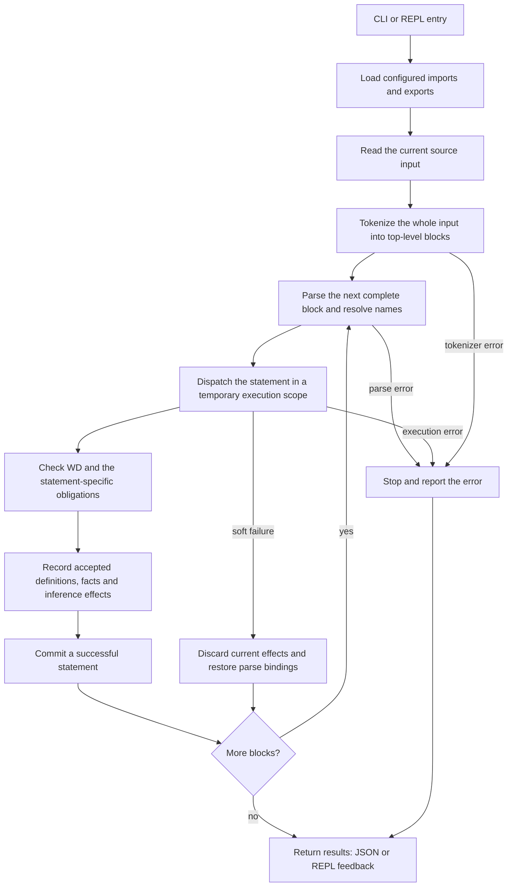

# Litex Manual

<a id="manual"></a>

Created and maintained by Jiachen Shen.

Read and run examples in the [online Manual](https://litexlang.com/doc/Manual).
The maintained [Markdown source](https://github.com/litexlang/golitex/blob/main/docs/Manual.md)
is the single home for the language guide and detailed reference.

> **Litex is an experimental hobby project still in beta. Expect rough edges.**

<a id="manual-introduction"></a>

## How to use this manual

Read the opening guide to understand what a statement makes available. Use the
dictionaries when choosing a mathematical operation, checking its domain, or
finding the next explicit proof step. Each entry connects meaning, conditions,
execution or verification, reusable facts, examples, and its nearest boundary.
The reciprocal thread shows why those pieces belong together: `1 / x` needs
nonzeroness, its callable definition records that domain, and a later product
identity may need the defining equation as an explicit bridge.

| Part | Read it to | Start here |
|---|---|---|
| Design principles | Understand the mathematical object model and checking contracts | [Principles](#design-principles), [core model](#the-core-reading-model) |
| System pipeline | Follow source input through the complete system and identify each owner's job | [Pipeline and component map](#system-pipeline) |
| Project organization | Select dependencies/exports and understand names and load order | [Projects](#project-organization) |
| Syntax and proof/output | Write facts, check WD and read verification results | [Syntax](#syntax-reference), [facts](#factual-statements), [WD](#well-defined-objects), [proof/output](#proof-process) |
| Basic proof writing | Turn a mathematical sentence into the right declaration, goal, proof block and witness | [Basic decisions](#basic-decisions-before-writing-a-proof) |
| Dictionaries and practice | Look up native contracts and choose a mathematical proof formulation | [S](#statement-dictionary), [O](#object-dictionary), [F/C](#builtin-atomic-fact-dictionary-and-relationships), [pitfalls](#pitfalls-and-missing-proof-steps), [recipes](#recommended-mathematical-formulations) |
| Advanced interfaces | Read deeper function, struct and template contracts | [Interface details](#advanced-interface-details) |
| Native rules and inference | Find extra guarded laws, calculation limits and inference triggers | [Verification rules](#builtin-verification-rules), [inference](#builtin-inference) |
| Execution and extraction | Run algorithms/eval and inspect Python/C extraction boundaries | [Executable path](#execution-and-extraction) |
| Compatibility and evidence | Interpret removed forms, assumptions and verification records | [Compatibility](#removed-and-renamed-public-forms), [coverage](#verification-and-coverage), [appendix](#appendix) |

The native inventory has **51 public statement forms, 93 active object leaves,
20 builtin atomic families with their negative forms, and two native certificate
predicates**, plus the 29 reserved native theorem interfaces. Stable S/O/F/C
identifiers survive the merge. This inventories the public native language,
not every imported theorem or every individual kernel rewrite.

The detailed Reference entries now live here. Their original
[inventory evidence](audits/reference-inventory-2026-10-06.json) remains a
historical source-owned record; the [merge audit](audits/manual-merge-2026-10-06.json)
records the consolidation. The [pipeline and ordering audit](audits/manual-pipeline-2026-10-06.json)
records the current whole-system chapter and reading order.
The [equality/order recipe audit](audits/manual-order-recipes-2026-10-06.json)
records the checked algebra, translation, sign and sum-of-squares routes.
The [square/product audit](audits/manual-square-product-2026-10-06.json)
extends those routes with cancellation, square/absolute-value conversion,
equality cases, weighted estimates and quadratic certificates.
The [power catalog audit](audits/manual-power-catalog-2026-10-06.json)
records the parity, integer-exponent order and common-estimate lookup extension.
The [proof-basics audit](audits/manual-proof-basics-2026-10-06.json)
records the introductory writing decisions and their paired scope/logic controls.
Expected rejections and retained migration examples are labelled and excluded
from the positive fence collector. An assumed example is not a strict proof.
The S19, S23 and S24 trust/axiom entries intentionally demonstrate ordinary-mode
assumptions and have separate strict rejection controls. Other assumed examples
are labelled where they occur. Every positive fence runs in isolation.

### The core reading model

A Litex file is read from top to bottom. A successful statement may introduce
a name, define vocabulary, verify a fact, or add information that later
statements can reuse.

```litex
have x R = 2

x + 1 = 3
x^2 = 4
```

The first line introduces a real object `x` and records `x = 2`. The next two
lines state facts. Litex checks them from the current context and stores the
accepted facts for later use.

Keep three language categories separate:

| Category | Meaning | Examples |
|---|---|---|
| **Object** | A mathematical value or expression | `x`, `R`, `C`, `i`, `{1, 2}`, `x + 1`, `fn(t R) R` |
| **Fact** | A proposition about objects | `x = 2`, `x $in R`, `$prime(n)` |
| **Statement** | An action that checks or changes the context | `have`, a bare fact, `prop`, `claim`, `thm` |

For a factual statement, the user-facing outcomes are:

| Result | Meaning | Next action |
|---|---|---|
| Success | Litex found a verification route and merged the statement. | Inspect `proof_method` when provenance matters. |
| Failed (soft miss) | The statement did not succeed (search miss, well-definedness, …); the temporary env is discarded. | Add a smaller equality, membership, domain fact, or lemma; or fix the WD obligation. |
| SessionError | Hard failure; the session must stop. | Fix the invariant / bug / unrecoverable condition before continuing. |

Batch JSON presents Success as `"success": true`, Failed as `"success": false`
inside `statement_results` (not a lifted top-level `verify_error`), and
SessionError as top-level `"session_error"`. See [cli.md](cli.md).
AI-generated explanations and Litex drafts are untrusted until the displayed
formal code has been checked.

A common mistake is to read a soft miss as false:

```text
have x R
x = 0
```

The second line normally fails search (`why_failed.phase: search_proof`). That
is not a proof that `x != 0`. The context only says that `x` is real.

### Reading path

Read [design principles](#design-principles), the [system pipeline](#system-pipeline),
and [project organization](#project-organization) for the system-level picture.
Then use [syntax](#syntax-reference), [fact grammar](#factual-statements),
[WD](#well-defined-objects) and [proof/output](#proof-process) for authoring.
The S/O/F/C dictionaries and P/R entries provide the detailed lookup route.

The final technical chapters continue with [advanced interfaces](#advanced-interface-details),
[native rules](#builtin-verification-rules) and [inference](#builtin-inference),
then [execution/extraction](#execution-and-extraction). Each deep note links
back to its dictionary entry; domains, facts and scope have the same meaning
in both views.

The [Learner Cheatsheet](Litex_Learner_Cheatsheet.md) supplies compact learning
developments; [examples](../examples/README.md) supply longer runnable files.
The [FAQ](FAQ.md), [Blueprint](Litex_Blueprint.md), and
[Lean–Litex comparisons](Representative_Lean_Litex_Example_Comparisons.md)
cover rationale and comparisons. Installation and command flags belong in
the [CLI reference](cli.md).

### Supported syntax and recommended source style

This manual describes what Litex accepts. For new proofs and ordinary teaching
examples, prefer `release thm name(args)` for calls without selection,
multiline `forall`, and English/ASCII keywords and operators. Bare `by thm`,
inline universals, and the documented Unicode aliases remain supported.
Keep `by thm name(args) => fact` when selecting an atomic consequence; its
context effect differs from an all-conclusions release. See the
[learner recommendation table](Litex_Learner_Cheatsheet.md#supported-syntax-and-recommended-writing)
for examples and reasons. These source-style preferences do not impose parser
restrictions.

<a id="language-foundations"></a>

## Design principles

### Pure-set object model

Litex uses one universe of mathematical objects and chooses a pure-set
foundation: every well-defined Litex object satisfies `$is_set`. Thus a
numeral, a function value, a user-defined set, a function space, and each of
`N`, `Z`, `Q`, `R`, and `C` are all objects. They keep different mathematical
interfaces, but they are not different runtime carrier types.

Membership is a fact between two objects. For example, `1`, `N`, and `R` are
objects; `1 $in N` and `1 $in R` are separate facts about the same `1`.
Likewise, `forall x R` introduces an object `x` together with the fact
`x $in R`; it does not retype `x` as a host-language real number. A function
space `fn(x R) R` and a function belonging to it are also objects, while the
function-space membership records the callable contract.

This is Litex's explicit choice within the pure/impure distinction described
in Tao's *Analysis I*: the book remains agnostic about whether primitive
objects are themselves sets, while Litex adopts the pure interpretation. The
choice is foundational rather than notational. Surface concepts still retain
their ordinary roles: a number is used arithmetically, a function is applied,
and a set is inspected through membership. Set equality is extensional:
`by extension` proves equality from the two membership directions. In the pure
model this is the common object equality principle, not a separate equality
for a host-language `Set` type.

The object universe is not an internal universal set. `Object` is the
meta-level carrier used to implement the language, not an object that can be
written on either side of `$in`. Litex also does not provide unrestricted
comprehension. A set builder has the bounded form `{x S: facts}` over an
already available `S`; replacement and other partial constructors have their
own well-definedness obligations. These restrictions are what separate
"every object is set-coded" from the inconsistent claim that every predicate
defines a set of all objects.


### Meaning, evidence and context

Objects, facts and statements have the roles shown in the
[core reading model](#the-core-reading-model). Before truth verification,
well-definedness checks that the objects and predicate applications are
meaningful under their domains. A successful statement can then make facts
available in its scope; later statements consume those facts through checked
routes. [Inference](#builtin-inference) accounts for the routine consequences
published after acceptance.

These are mathematical and checking contracts. Naming, operator precedence,
delimiters and Unicode spellings are [syntax rules](#syntax-reference).
The [trust boundary](#trust-boundary) states what a successful check assumes.

## System pipeline

This chapter follows one current source input from launch to visible results.
Project mounting supplies its definitions and names; the source runner handles
tokenization and statement order; each statement handler checks its own
mathematical obligations and commits accepted information. The [proof
process](#proof-process) zooms into verification inside this larger flow.

### From input to results



The tokenize step runs over the complete current input before any of its
statements execute. After that, parsing and execution alternate **one complete
top-level block at a time**. A theorem, claim or sketch includes its entire
nested proof in that block; parsing does not execute an unfinished proof.
Successful earlier blocks remain available when a later block soft-fails.

WD and truth verification are distinct obligations. A fact assertion verifies
its fact before storing it. A definition checks its construction contract;
a proof directive runs its scoped proof route; `eval` checks its computation
and result equality. Ordinary-mode `trust` checks WD while explicitly assuming
truth, and strict mode rejects the user-assumption forms. The diagram groups
these handler-specific checks without claiming they all use one verifier.

**Source:** [source runner](../src/run/run_litex_code.rs),
[statement transaction and dispatch](../src/execute/exec_stmt.rs),
[fact verify → store/infer](../src/execute/execute_fact_stmt/exec_fact_stmt.rs).

### What each part owns

| Part | Responsibility | Input → result | Implementation |
|---|---|---|---|
| Launch and run | Select file/project/source/REPL, strict policy and output language; route to the appropriate runner | Command arguments → selected run | [launch](../src/launch_command.rs), [run](../src/run/README.md) |
| Project loading | Read `litex.config`, run imports and selected exports in order, and record completed file environments | Manifest and files → mounted project context | [run_module](../src/run_module/README.md) |
| Module and name management | Track module/file owners and resolve qualified names against loaded exports | Alias/export/name → its owner-qualified identity | [module_manager](../src/module_manager/README.md) |
| Tokenization | Recognize tokens, comments, aliases, indentation and complete source blocks | Source text → token blocks or tokenizer error | [tokenize](../src/tokenize/mod.rs) |
| Parsing and AST | Build the Stmt/Obj/Fact shapes, attach binder identities and resolve source names | One complete block → structured statement or parse error | [parser entry](../src/parse/parse.rs), [AST](../src/ast/mod.rs) |
| Runtime and execution environments | Own active context, name visibility and scoped statement execution; commit successful effects | Existing context + statement → success, soft failure or hard error | [Runtime](../src/runtime/mod.rs), [ExecEnv](../src/exec_env/mod.rs), [exec_stmt](../src/execute/exec_stmt.rs) |
| Well-definedness | Check child objects, declaration/signature visibility, carriers and partial-operation guards | Object/fact + context → domain evidence or WD failure | [object WD](../src/execute/execute_fact_stmt/well_defined_results/verify_obj/mod.rs), [atomic WD](../src/execute/execute_fact_stmt/verify_atomic_fact/verify_well_defined.rs) |
| Fact verification and proof handlers | Reuse known facts and permitted calculation/rules/definitions/universals; check explicit proof routes | Goal + available evidence → typed verification result | [fact checking](../src/execute/execute_fact_stmt/README.md), [proof statements](../src/execute/execute_by_stmt/mod.rs) |
| Instantiation | Substitute actual arguments into domains, bodies and facts while retaining binding identity and checking the caller's obligations | Parameterized interface + arguments → instantiated interface | [instantiate](../src/instantiate/mod.rs) |
| Exact mathematical calculation | Provide bounded exact numeric/algebraic calculation to the checking and evaluation paths | Supported expressions → exact values/normal forms or a declined calculation | [rational_expression](../src/rational_expression/mod.rs) |
| Storage and inference | Index accepted seeds, assign/cite facts and publish supported routine consequences in the current scope | Accepted fact → stored fact and inference effects | [store_fact_and_infer](../src/store_fact_and_infer/README.md) |
| Display and result projection | Render statements and project existing result/evidence trees into localized output; projection adds no proof | Structured statement/result → readable representation and JSON | [display_and_ir](../src/display_and_ir/README.md), [json_output](../src/json_output/README.md) |
| Import knowledge-base cache | Reuse a completed dependency's saved knowledge where policy permits; strict imports replay source | Dependency record → cached context or cold execution | [knowledge_base](../src/knowledge_base/README.md), [strict cache policy](../src/run_module/import_kb.rs) |
| Optional executable extraction | Select marked source, verify that virtual program, then lower the supported executable subset to Python or C | Selected checked program → executable-code artifact | [extract_executable_code](../src/extract_executable_code/README.md) |

Instantiation, exact calculation, storage and name resolution are shared
services used at the appropriate points, rather than unconditional extra
passes over every statement. A cold project import re-enters the same source and
statement checking path for the dependency's files. An eligible cache hit
restores completed dependency knowledge; strict imports take the source path. Imported file environments
keep their owners; they are not flattened into one ambient fact collection.
The current active Rust modules are listed in [src/lib.rs](../src/lib.rs).

### One statement leaves evidence for the next

```litex
have n N
0 <= n
n + 0 = n
```

The parser introduces the name for the declaration. Execution checks that
`N` is a usable nonempty carrier, stores `n $in N`, and inference publishes
the nonnegative bound. The second line reads that known consequence. The third
line checks the addition's object domains and proves the equality through the
ordinary equality route. Each successful statement commits before the next
block is parsed. [F01](#f01-membership-and-nonmembership) owns the membership
contract and [S04](#s04-arbitrary-members) owns arbitrary-member introduction.

**Expected soft failure — the third statement misses `search_proof`; the
fourth still succeeds:**

<!-- litex:skip-test -->
```litex
have n N
0 <= n
n = 0
n + 0 = n
```

The aggregate run reports failure because one statement failed; there is no
session error, and the successful statements remain recorded. The failed
equality is not a proof of `n != 0`. A failed declaration likewise restores
its speculative parse bindings, so it cannot occupy a name for the next
block. Global identifier counters are not rolled back or reused.

### Project loading, proof checking and executable output

Read [project organization](#project-organization) next for which sources are
selected and how their names are made available. Read [proof process](#proof-process)
for which evidence can justify a goal. Finally, [execution and extraction](#execution-and-extraction)
explains how checked algorithms become computations or target programs.
Those chapters describe connected parts of this pipeline, with separate
responsibilities and checked boundaries.

<a id="project-workflows"></a>

## Project organization

### Modules and manifests (preview)

> **Project modules:** there is no `submodule` and no `[hierarchy]`.
> A maintained package is a single module. `[export]` lists only `.lit` files;
> `[import]` and `[import std]` share one alias namespace within each manifest.
>
> - Tables / parse / `::` elaborate:
>   [`src/module_manager/README.md`](../src/module_manager/README.md)
> - How `-r` / `-f` / `-e` / REPL mount and run:
>   [`src/run/README.md`](../src/run/README.md)
> - Fixtures:
>   [`examples/module_manager/`](../examples/module_manager/)

A maintained project directory has one `litex.config`.

```ini
[import]
Algebra = "../Algebra"

[import std]
basics # Alternatively: basics = basics (choose one spelling, not both)

[export]
chap1 = "./chapter01.lit"
chap2 = "./chapter02.lit"
chap3 = "./chapter03.lit"
```

Under the Litex CLI:

| Command | Config | Behavior |
|---------|--------|----------|
| `-r <dir>` | required at `<dir>` | all imports, then all exports |
| `-f <file>` | optional at `parent(file)` | listed → prefix through file; unlisted → full mount then file; missing → isolated |
| `-e` / bare REPL | optional at cwd | full mount (or empty), then eval / REPL |

Mount soft Failed becomes session `FailToImport`. Soft Failed on a `-f`
**target** itself stays a normal file failure.

Important rules:

1. `[export]` is ordered and each entry names one `.lit` file. Exporting a
   child directory or nested config node is not allowed.
2. `[export]` is an explicit selection list, not a complete directory
   inventory. Unlisted files and folders are sidecars: discovery does not
   parse, execute, or expose them in the module namespace. Every declared
   export path must exist and point to a `.lit` file.
3. `[import] Alias = path` mounts another module directory.
   `[import std]` accepts either a bare name `N` (meaning `N = N`) or
   `Alias = StdName`; both mount `<std_root>/<StdName>` under `Alias`.
   After resolution `[import]` and `[import std]` are the same kind of
   import. Import aliases from both sections must be unique within that
   `litex.config`; separate packages may reuse an alias for their own paths.
   An export name may reuse an import spelling: `a::b` is always a
   current export, `a::b::c` is an import path, and `a:::b` is explicit
   single-export sugar for `a::<sole_export>::b`.
4. Canonical names follow the mount alias and export name, for example
   `Algebra::chap1::name` or `basics:::name` when `basics` has one export.

Struct carriers accept these same paths: `&local::Pair`,
`&Lib::facts::Tagged<R>` and, for an import with exactly one export,
`&Lib:::Tagged<R>`. The full definition owner is retained for field types,
function returns and nested struct fields. Missing paths, wrong arguments
and tuples outside the chosen carrier are rejected. See the runnable
[qualified struct fixture](../examples/module_manager/qualified_struct_views/README.md).

Cross-module references always use canonical qualified names. Module aliases
and symbols are separate, so a local symbol may also be named `A`; field
selection such as `obj.b` remains in the field namespace. An export is
unavailable while it is still loading, so an earlier file cannot cite a later
export.

An import alias is resolved using the importing package's manifest, then the
normalized directory path selects the global module ID. For example, two
packages may each declare `Common = "./dep"` and refer to different dependency
directories. Same-path imports under different aliases share one module.
The loader assigns distinct global display labels when local aliases repeat;
these labels do not change source name resolution. See the runnable
[cross-file identity fixture](../examples/module_manager/cross_file_identity/README.md).

Project dependencies come from `litex.config` (`[import]` / `[import std]`),
not from source-level `import` statements. Every `.lit` file rejects `import`;
reproducible dependencies belong in the manifest. The interactive REPL runs
Litex source blocks only; it does not add a separate terminal `import`
command surface.

```ini
[hierarchy]
module
```

```ini
[hierarchy]
submodule
```

```ini
[export]
Part2 = "./Part2"
```

```ini
[import]
basics = "../OtherBasics"

[import std]
basics = basics
```

These manifests are invalid under the current module design: `[hierarchy]` and
`submodule` are removed, `[export]` cannot name a folder, and import aliases
must be unique across `[import]` and `[import std]`.

Project execution, persistent sessions and output are
CLI contracts rather than language syntax. See the [CLI reference](cli.md) for
installation, project-running examples, and the current command set.

## Syntax Reference

### Binder syntax

| Meaning | Form | Canonical section |
|---|---|---|
| Object in a set | `x S` | [Bare facts and `have`](#bare-facts-and-have) |
| Set parameter | `S set` | [Bare facts and `have`](#bare-facts-and-have) |
| Nonempty set parameter | `S nonempty_set` | [Bare facts and `have`](#bare-facts-and-have) |
| Finite set parameter | `S finite_set` | [Bare facts and `have`](#bare-facts-and-have) |
| Multiple names in one domain | `x, y R` | [Universal facts](#universal-facts) |
| Domain condition | `x R: x != 0` | [Domain obligations](#domain-obligations) |
| Parameterized definition | `template<S set, x S>:` | [Templates](#templates) |
| Shared universal assumptions | Explicit typed parameters and an indented premise block; `setting` is unsupported | [Shared assumptions](#shared-assumptions-and-inline-universals) |
| Struct parameter | `struct Group<S nonempty_set>:` | [Struct objects](#struct-objects-and-definition-owned-field-access) |

### Syntax lookup

| What is being written | Canonical index |
|---|---|
| Object/expression | [Complete O index](#object-dictionary) |
| Atomic relation or predicate | [Complete F index](#builtin-atomic-fact-dictionary-and-relationships) |
| Compound or quantified fact | [Fact-shape summary](#fact-shape-summary) |
| Definition or proof action | [Complete S index](#statement-dictionary) |
| Reserved builtin theorem | [Native theorem index](#reserved-builtin-theorem-interfaces) |
| Removed legacy spelling | [Compatibility table](#removed-and-renamed-public-forms) |


### Names, numbers, and arithmetic

Names refer to builtin objects, earlier definitions, local binders, or
module-qualified definitions. Arithmetic uses ordinary precedence:
parentheses, calls, and indexing bind tightly, then powers, prefix `-`,
multiplication and division, then addition and subtraction. Powers associate
to the right.

The parser therefore reads `-t^2` as `-(t^2)`, not `(-t)^2`. That compatibility
rule does not make the bare spelling canonical authoring: it still leaves a
reader to recall the precedence choice. Write `-(t^2)` (equivalently
`-1 * (t^2)`) for the opposite of a square, and write `(-t)^2` for the square
of the negative value. Parenthesize a negative exponent too: `t^(-1)`, not
`t^-1`. This explicit-parentheses rule applies to generated and agent-authored
Litex as well as handwritten source.

prefix `-a` is the unary arithmetic operator `neg(a)` (AST
`Neg`), not the same tree as the binary difference `0 - a`. Closed numeric
evaluation treats both. Do not rely on `-a` and `0 - a` being identical AST.

User-defined names may begin with a letter or one underscore and may then use
letters, numbers, and underscores. The prefix `__` (two underscores) is
reserved for generated symbols, including names in Lean output, and is rejected
during tokenization. Names beginning with one underscore remain ordinary user
space, as do prefixes such as `h_` and `fn_`. Comments and quoted strings are
not symbol tokens and may contain the reserved spelling.

Builtin object spellings are also reserved at declaration sites: literals
`i`, `e`, `pi`, standard sets such as `N`, `R`, `C`, and object constructor/function
names such as `sin`, `sqrt`, `fn`, `sum` and `cart` cannot be user definitions,
parameters, fields, indices or witnesses. Their uses are parsed as builtins
before identifier lookup. Use a fresh name such as `t`, `epsilon` or `pi_value`;
a rejected declaration does not leave its attempted names bound.

### Compact numeric-set suffixes

The suffix must be adjacent to its base. These compact forms are canonical;
the verifier prints the same spelling.

The signs are strict: `+` means greater than zero, `-` means less than zero,
and `*` means nonzero. `N*` is not a standard spelling; use `N+` for nonzero
naturals.

### Operator and delimiter notes

- Arithmetic binding from tighter to looser is: calls/indexing, right-associative
  `^`, prefix `-`, multiplicative operators, then binary `+` and `-`. Thus the
  parser reads `-t^2` as `-(t^2)`, while `-t * u` groups as `(-t) * u`.
- At the prefix-`-`/power boundary, always state the intended tree explicitly:
  `-(t^2)` or `-1 * (t^2)` negates the power, `(-t)^2` powers the negative
  base, and `t^(-1)` uses a negative exponent. Do not author `-t^2` or `t^-1`.
- Function and coordinate application use `()`. Bracket indexing is removed; see [compatibility](#removed-and-renamed-public-forms).
- `{a, b}` is a displayed set; `{x S: facts}` is a set comprehension.
- `st { ... }` delimits an existential body. Its entries are atomic facts or
  their supported boolean combinations (`and` / chain / `or`); name a quantified
  condition with `prop` before using it there. Restricting the body this way
  keeps exist index keys easy to design for known-fact search. The same
  restriction applies to set builders.
- `#` outside an inline aside starts a line comment. Quotes in that comment
  need not be balanced. A trailing comment preserves a block header's colon.
  Indentation defines block structure.
- Inline aside `"..."` (ASCII quotes, single line) is stripped at tokenize time
  and is not part of the AST. Unclosed `"..."` is a parse error.
- Block comment: a line that is exactly `"""` after trim opens or closes a
  multi-line comment. Only ASCII `"""` counts; `"`, `""`, or `""""` alone do
  not. Unclosed `"""..."""` is a parse error. Distinct from `#` and from
  inline `"..."`.
- Line continuation (preview): a line whose code region ends
  with `\\` joins the next physical line into the same logical line. Optional
  trailing whitespace and a following `# ...` comment after `\\` are allowed
  and dropped with the marker (so the continued line is not commented out).
  Leading spaces on the continued line are ordinary whitespace. Mid-line `\\`
  is not continuation and is unrelated to the template prefix `\`. A trailing
  `\\` with no following line is a parse error.
- Bracket sequence literals, the matrix carrier, and apostrophe matrix operators are removed; use functions with explicit index sets.

### Unicode mathematical input aliases (preview)

Litex accepts the following Unicode mathematical input. Simple aliases are
canonicalized during tokenization; infix set forms are lowered by the parser to
the existing set-object and fact nodes. Stored facts, diagnostics, and verifier
semantics continue to use canonical ASCII Litex syntax.

For new proofs and ordinary documentation examples, prefer the English/ASCII
column below. Unicode remains supported input; use it deliberately when the
example teaches notation aliases or the author requests that style.

| Unicode input | Canonical Litex syntax |
|---|---|
| `∀`, `∃`, `∃!` | `forall`, `exist`, `exist!` |
| `≤`, `≥`, `≠` | `<=`, `>=`, `!=` |
| `→`, `↔` | `=>`, `<=>` |
| `∧`, `∨`, `¬` | `and`, `or`, `not` |
| `∈` | `$in` |
| `∉` | `not ... $in ...` |
| `⊆`, `⊇` | `$subset`, `$superset` |
| `⊂`, `⊊`, `⊋` | `$proper_subset`, `$proper_subset`, `$proper_superset` |
| `A ∪ B`, `A ∩ B` | `union(A, B)`, `intersect(A, B)` |
| `A × B` | `cart(A, B)` |
| `ℕ`, `ℤ`, `ℚ`, `ℝ`, `ℂ` | `N`, `Z`, `Q`, `R`, `C` |
| `ℕ+`, `ℤ+`, `ℚ+`, `ℝ+` | `N+`, `Z+`, `Q+`, `R+` |
| `ℤ-`, `ℚ-`, `ℝ-` | `Z-`, `Q-`, `R-` |
| `ℤ*`, `ℚ*`, `ℝ*`, `ℂ*` | `Z*`, `Q*`, `R*`, `C*` |
| `π`, `∅` | `pi`, `{}` |

For example, this is the same universal fact as its ASCII spelling:

```litex
∀ x ℝ:
    x ≠ 0
    →:
        x ∈ ℂ
        x ≤ x ∧ x ≥ x
```

Aliases are recognized only as complete tokens and are not rewritten inside
quoted module paths. `⊂` deliberately means strict/proper subset, the same as
`⊊`; non-strict subset remains `⊆`. Unicode compact numeric sets mirror the
existing ASCII keyword family exactly, so `ℕ*` remains unsupported just as
`N*` is unsupported.

`∃!` has exactly the existing unique-existence semantics of `exist!`. In
particular, `witness ∃! ...` must prove both that the supplied witness satisfies
the body and that any two witnesses satisfying the body are equal.

The infix precedence from lower to higher is `∪`, `∩`, `×`, then the existing
arithmetic object operators. Union and intersection associate to the left. A
direct product chain is flattened, so `A × B × C` becomes `cart(A, B, C)`;
parentheses can request nesting. `×` never means numeric multiplication:
`2 × 3` is parsed as `cart(2, 3)` and is rejected because the factors are not
sets. Write `2 * 3` for arithmetic multiplication. The word forms remain
constructor calls such as `union(A, B)`; this preview does not add `A union B`.

---

## Factual Statements

A **fact** is a proposition Litex can try to verify. A top-level accepted fact
is stored in the current context; a fact nested inside a quantifier or proof
block follows that form's scope.

### Atomic facts

An atomic fact applies a builtin relation or a declared predicate to objects.
The [F dictionary](#builtin-atomic-fact-dictionary-and-relationships) owns their meanings, domains,
negative forms and relationships. An expression alone, such as `2 + 3`, is not
a fact; write `2 + 3 = 5` or use [eval](#s51-exact-evaluation).


### Conjunctions, chains, and disjunctions

Use `and` for a conjunction on one line, adjacent binary relations for a
chain, and `or` for alternatives.

```litex
1 < 2 and 2 < 3
1 <= 2 = 2 < 3
1 < 2 or 1 >= 2
```

For an equality chain, Litex checks each adjacent equality and then stores
the non-adjacent equalities by transitivity. For example, this chain stores
`y = 3`, which the next statement can use:

```litex
have x R = 2
have y R = x + 1
y = x + 1 = 3
y^2 = 9
```

The definition step and calculation step are explicit. Automatic definition
expansion does not enable rewrite in its residual goal. A failed chain does
not commit its endpoint equality.

The fact grammar has a deliberate canonical hierarchy rather than arbitrary
recursive nesting. A conjunction is a flat list of atomic facts. A disjunction
is the outer layer, and each of its branches is one atomic fact, one relation
chain, or one flat conjunction. In ordinary operator terms, `and` binds more
tightly than `or`. That parser precedence is also why the verifier can treat
`or` branches as a small fixed set of shapes when matching known and goal
disjunctions.

For example:

```text
$p(a) and $q(a) or $t(a)
```

has two `or` branches: `($p(a) and $q(a))` and `$t(a)`. It is not read as
`$p(a) and ($q(a) or $t(a))`. Allowing an `or` branch to be a completed
conjunction preserves this fixed hierarchy; it does not make `and` or `or`
arbitrarily nestable.

Verification of an `or` proves that at least one branch holds; it does not add
an arbitrary branch as a known fact.

A verified conjunction or relation chain can introduce a disjunction even
when its other branches are compound. Litex checks the selected branch and
retains that proof; it does not assume that the compound branch is true.

```text
have x R
x = 0 or x != 0
x = 0
```

The disjunction is true, but the last line still soft-fails.

### Existential facts

`exist` states existence, `exist!` states unique existence, and `not exist`
states non-existence. Witness variables are local to the fact.

An existential used as a complete fact must consume its whole line, including
inside `forall` conclusions and `prop` definitions. A suffix such as
`exist y R st {y = x} and 0 = 1` is a parse error; it is never discarded.
Put additional conditions inside `st { ... }`, or write a separate fact on
the next line. The enclosing `witness exist ... from ...` form still consumes
its own `from` clause after the existential.

```litex
witness exist x R st {x^2 = 4} from 2:
    2^2 = 4

witness exist! x R st {x = 0} from 0

by contra:
    ? not exist x R st {x != x}
    obtain x from exist x R st {x != x}
    impossible x != x
```

Knowing an existential does not put its bound name in the outer context:

```text
exist x R st {x = 1}
x = 1
```

The second line is an `error` because the existential `x` is out of scope. Use
`obtain` to introduce a fresh witness name.

Existential bodies may contain atomic facts, conjunctions, chains, and
disjunctions. They do not contain anonymous `forall` facts. Put the quantified
condition in a named `prop` and reference it atomically. Braces delimit the
body:

```litex
prop universally_self_equal(x R):
    forall y R:
        x = x

forall:
    exist x R st {$universally_self_equal(x)}
    =>:
        exist x R st {$universally_self_equal(x)}
```

### Universal facts

`forall` introduces arbitrary parameters, optional assumptions, and
conclusions. With no assumptions, write conclusions directly rather than an
empty `=>:` block. A parameterless `forall:` is allowed: it binds no names and
just packages the body facts (useful as a bare `? forall:` theorem goal).

```litex
forall x R:
    0 <= x^2

forall x R:
    x = 2
    =>:
        x + 1 = 3

forall:
    1 + 1 = 2
```

A universal over the literal empty display can be checked by finite enumeration:

```litex
by enumerate finite_set:
    ? forall x {}:
        x != x
```

This enumeration uses the literal `{}`. It does not discharge
the corresponding goal over `range(3, 3)`, even after proving that range equal
to `{}`. The following is a known soft failure:

```text
forall index range(3, 3):
    index != index
```

The conclusion of a `forall` cannot itself be another `forall`. Put every
quantified parameter in the same header. The nested spelling below is a parse
`error`:

```text
forall x R:
    x > 0
    =>:
        forall y R:
            y > 0
            =>:
                x + y > 0
```

Write the flat fact instead:

```litex
forall x, y R:
    x > 0
    y > 0
    =>:
        x + y > 0
```

A universal fact may still be an explicit premise before `=>:`. That premise
is an assumed fact in the outer scope, not a universal conclusion. A
`not forall` fact is likewise not allowed as a direct universal conclusion;
name that quantified proposition before using it there.

An assumption is local; it does not become a global fact:

```text
forall x R:
    x = 2
    =>:
        x + 1 = 3

x = 2
```

The last line is an `error` because the bound `x` no longer exists.

#### Shared assumptions and inline universals

The current parser rejects `setting` and does not expand `forall [Name]`
bundles. Write the parameters and assumptions directly in each universal:

```litex
forall X nonempty_set, x, y X, z X:
    x = y
    =>:
        z = z
```

A premise-free universal may use `forall x R => x = x`. The current parser
also supports a one-line premise and conclusion separated by the outer arrow:

```litex
forall x R: x > 0 => x != 0
```

Prefer an indented block in newly authored proofs, so the premises and
conclusions are easy to inspect and extend:

```litex
forall x R:
    x > 0
    =>:
        x != 0
```

Existential and set-builder property bodies do not admit a nested `forall`;
name the quantified condition with `prop` and use its atomic `$P(...)` fact.

### Universal equivalence and negated universals

`forall ... <=>:` stores both directions of an equivalence. The left side is
introduced after `=>:` even when it has no shared assumptions.

Well-definedness is checked separately for the two generated universal
directions. Each check receives the shared assumptions and its own antecedent,
but it cannot borrow a side condition from the opposite side. Put any side
condition needed to make both directions meaningful before `=>:` as a shared
assumption.

```litex
forall x, y R:
    =>:
        x = y
    <=>:
        y = x
```

`not forall` negates a universal claim. its domain and
conclusions are restricted to quantifier-free shapes (atomic / `and` / chain /
`or`) — the same shapes allowed inside an `exist … st {…}` body. Prove and store
both reduce to the De Morgan counterexample exist
`exist binders st { dom…, not(then)… }` (the `not forall` fact itself is still
recorded in `facts_by_id`; search reuses `known_exist`). Nested `exist` or
`forall` inside `not forall` is a parse error; name such content as a `prop`
instead.

**Checked example.**

```litex
by contra:
    ? not forall x R:
        x > 0
    impossible 0 > 0
```

Do not replace `not forall` with an unsupported prefix on a block:

```text
not:
    forall x R:
        x > 0
```

This is a parse `error`; write `not forall ...` on one header.

<a id="fact-syntax-index"></a>

### Fact-shape summary

| Shape | Syntax |
|---|---|
| Atomic | `a = b`, `a $in A`, `$P(a)` |
| Flat conjunction | `atomic and atomic` |
| Chain | `a <= b = c < d` |
| Outer disjunction | `(atomic, chain, or flat-conjunction branch) or branch` |
| Existence | `exist params st {facts}` |
| Unique existence | `exist! params st {facts}` |
| Non-existence | `not exist params st {facts}` |
| Universal implication | `forall params: assumptions =>: conclusions` |
| Universal equivalence | `forall params: =>: left <=>: right` |
| Inline universal | `forall params: assumption => conclusion` |
| Negated universal | `not forall params: facts` |
| Inline negated universal | `not forall params: assumption => conclusion` |

---

## Well-Defined Objects

Before Litex tries to prove a fact, it checks that every object in that fact is
meaningful in the current context. A well-definedness failure is an `error`,
not a soft-miss theorem label.

### Domain obligations

Ordinary `prop` and `abstract_prop` facts must refer to a declaration visible
at the point where their well-definedness is checked, with exactly the declared
number of arguments. Qualified predicate names use the declaration in that
module and file. A declaration later in a claim's proof body cannot make an
earlier undefined goal well-defined. This also applies to negated predicate
facts and to facts used as quantified assumptions.

Function definitions are checked under the parameter types and domain facts
written in their signature.

```litex
have fn reciprocal(x R: x != 0) R = 1 / x
have fn root(x R: 0 <= x) R = sqrt(x)

reciprocal(2) = 1 / 2
sqrt(4) = 2
root(4) = 2
```

The same expressions fail when their obligations are absent:

```text
have x R
1 / x = 1
sqrt(x) = 0
```

Both factual lines produce `error`: the first lacks `x != 0`; the second lacks
`0 <= x`.

### Ordered assumptions during well-definedness

The premises of a `forall` and the facts in an `exist` body are checked
from left to right in their temporary binder scope. After one fact is known to
be well-defined, Litex records it there as an assumption and runs its sound
inference. A positive concrete predicate may therefore expose its definition,
including a universal clause needed by a later object obligation.

The same ordering applies to the domains of `not forall` and
`forall … <=>:` during their independent WD checks, including definition
bodies and claim goals. A checked domain such as `y != 0` can guard a later
`1 / y`. For an iff, only the common domain guards both branches; a condition
on one branch does not justify objects on the other branch. These local
assumptions do not prove the quantified fact or escape its binder scope.
See [the executable guarded-quantifier example](../examples/wd/fact/guarded_quantifier_domains.lit).

**Checked example.**

```litex
prop nonzero_on(E power_set(R), g fn(x E) R):
    forall x E:
        g(x) != 0

forall E power_set(R), f, g fn(x E) R:
    $nonzero_on(E, g)
    =>:
        fn(x E) R {f(x) / g(x)} $in fn(x E) R
```

Here the checked predicate premise exposes `forall x E: g(x) != 0`, so the
anonymous function body is meaningful throughout `E`. This is scoped
definition use, not unrestricted proof search: recursion guards still apply,
an `abstract_prop` has no body to expose, and omitting the predicate premise
still leaves the division ill-defined. The temporary assumptions and inferred
facts do not escape the quantified or existential check.

The equivalent facts in a `struct` `<=>:` block are also checked from left to
right in a temporary field scope. Each successful fact is staged without
definition inference before the next fact is checked. This lets a filter guard
justify a later partial expression, both when the struct is defined and when
an instantiated struct carrier is checked:

**Checked example.**

```litex
struct NonzeroPair:
    value R
    tag N
    <=>:
        value != 0
        1 / value = 1 / value
```

Source order is significant: omitting `value != 0`, or placing it after the
reciprocal, leaves the reciprocal ill-defined. These temporary filter facts do
not escape the struct check and are not proved merely by appearing in the
definition.

<a id="main-object-criteria"></a>

### Where to find object obligations

Each [O entry](#object-dictionary) owns its precise domain and common native
properties. For example, [O01](#o01-division) checks the denominator guard;
[O79](#o79-function-spaces) checks the complete fixed signature;
[O92](#o92-definition-owned-field-access) distinguishes field WD from releasing
struct properties. [S04](#s04-arbitrary-members) and
[P06](#p06-arbitrary-have-needs-nonemptiness) explain why introducing an arbitrary
member requires nonemptiness. These conditions are checked before truth search.

## Proof Process

The proof process answers one question: why may the current statement be added
to the verified context? The checker follows a small set of routes and reports
the route that succeeded or the point that failed.

For a proof route written as `by ...:` followed by one or more `?` goals, the
ordinary proof-statement list may be empty. In that case Litex installs the
route's generated assumptions, runs zero user proof statements, and immediately
performs the same final goal checks. This is not an admission: an unclosed goal
still fails. Structural definitions remain required where the method needs
them, such as `case` arms and the base/step headers of finite-set induction.
`by contra` is the sole exception to the empty-tail rule: its last statement
must always be an explicit `impossible fact`.

### Basic decisions before writing a proof

This is the writing entry for a reader or AI that knows the intended
mathematics but has not yet chosen its Litex form. The dictionaries own
the exact contracts; the decisions below connect them into a small proof.
Keep the mathematical domain, quantifier order and conclusion fixed while
choosing syntax or repairing a verification miss.

| Decision | Basic distinction | Contract to consult |
|---|---|---|
| Introduce or name a value | `have x R` introduces an arbitrary real; `have x R = 2` specifies its value; `let` names an expression | [S04](#s04-arbitrary-members), [S05](#s05-typed-values-given-by-equality), [S03](#s03-equality-aliases) |
| Define a condition or a function | `prop` names a proposition; `$P(a)` asserts an instance; `have fn` defines a callable value | [R02](#r02-choose-the-language-form-by-mathematical-role), [R04](#r04-a-relation-and-its-selected-value-have-different-roles) |
| State a conditional result | Put hypotheses before `=>:` and conclusions after it; without the arrow the listed facts are conclusions | [Universal facts](#universal-facts) |
| Execute proof actions | A bare `forall` contains facts; commands such as `by def`, `witness`, `obtain` and local declarations need a statement/proof surface | [S33](#s33-local-claims) |
| Use a goal parameter | A claim activates its goal's binders and premises; use those names directly | [S33](#s33-local-claims), [scope](#scope-and-failure) |
| Prove or consume existence | Supply a value with `witness`; extract a value with `obtain` from an existence fact that verifies | [S35](#s35-existential-witnesses), [S07](#s07-extract-existential-witnesses) |
| Claim uniqueness | `exist!` requires uniqueness as well as a satisfying witness | [S36](#s36-unique-existential-witnesses) |
| Use a logical fact | An implication needs its premise; a disjunction does not select a branch | [Compound facts](#conjunctions-chains-and-disjunctions), [S39](#s39-proof-by-exhaustive-cases) |
| Make an expression meaningful | Put its actual domain/guard in the interface before using it; `N` subtraction and division are not total closure rules | [WD](#well-defined-objects), [P01–P03](#p01-reflexivity-does-not-bypass-well-definedness) |
| Connect equal expressions | Expose the changed value or defining equation before a larger calculation when needed | [P04](#p04-connect-division-and-multiplication-explicitly), [P05](#p05-a-function-equation-may-need-to-be-exposed-before-substitution), [P07](#p07-name-the-value-equality-before-arithmetic) |
| Prove equality of structured values | Element membership, set inclusion, set equality and function equality have different obligations | [F01](#f01-membership-and-nonmembership), [S45](#s45-set-extensionality), [S46](#s46-function-extensionality) |
| Read a failed check | Distinguish parse, WD and proof-search failures; an unknown fact does not prove its negation | [Output](#reading-verifier-output), [P12](#p12-a-search-miss-does-not-disprove-an-inequality) |

#### Separate values, definitions and facts

An arbitrary member is not a chosen numerical value. Naming a mathematical
expression also does not perform mutable assignment. The calculation below
keeps the named expression and its intermediate value visible:

```litex
have arbitrary R
have chosen R = 2
let twice = 2*chosen
twice = 2*chosen = 2*2 = 4
```

`arbitrary=0` is not justified by its declaration. A second `let` with the
same active name is a rebinding error, not an update to a variable. Likewise,
declaring `prop is_above_two(t R): t>2` defines the condition; it does not
establish that an arbitrary real satisfies it. Establish the instance:

```litex
prop is_above_two(t R):
    t > 2
have a R = 3
by def $is_above_two(a)
```

The defining function equation and a declared output carrier have separate
roles too. A return carrier makes a value usable at that type; it does not
give every equation one might want about the value. See the
[function-law example](#prove-a-law-of-the-function).

#### Make the goal, hypotheses and block role explicit

**Checked goal/proof form:** the `? forall` header introduces `x` and its
local hypothesis. The body uses that same `x` and executes the proof action.
After success the universal result is available at a concrete argument.

```litex
prop is_positive(t R):
    t > 0
claim:
    ? forall x R:
        x > 0
        =>:
            $is_positive(x)
    by def $is_positive(x)
have a R = 3
$is_positive(a)
```

The explicit `by def` command belongs in the proof body. Moving it into
the conclusions of a bare `forall` is a parse error:

<!-- litex:skip-test -->
```litex
prop is_positive(t R):
    t > 0
forall x R:
    x > 0
    =>:
        by def $is_positive(x)
```

A bare universal may state the factual conclusion `$is_positive(x)` directly
when its verification route already works; `claim` is the surface for the
explicit command, not a mandatory wrapper for every true universal.

Without `=>:`, `forall x R: x>0; x!=0` claims both conclusions for every
real and is false. With the arrow, the first is a hypothesis for the second:

```litex
forall x R:
    x > 0
    =>:
        x != 0
```

Claim parameters and local hypotheses do not become global names or facts.
Do not reintroduce an already active `x` with another `forall x`, or use it
after the claim. A statement such as `(1/2)*2=1` proves one numerical instance;
it does not prove `forall x R: (1/2)*x=1`. For a universal proof, work with
the active arbitrary parameter and the exact stated hypotheses.

#### Preserve witness dependencies and distinguish existence from uniqueness

**Checked dependent witness:** in “for every `x`, there is a `y`”, the
witness may depend on the active `x`. Choose it inside that scope.

```litex
claim:
    ? forall x R:
        exist y R st {y = x+1}
    witness exist y R st {y = x+1} from x+1
```

A single `have y R = 1` outside the universal is a fixed value and cannot
stand for this varying witness. Keep quantifier order and dependencies intact.

**Checked introduction and elimination:** first supply a satisfying value,
then extract a named value from the verified existence fact.

```litex
witness exist w R st {w^2 = 4} from 2
obtain root from exist w R st {w^2 = 4}
root^2 = 4
```

`obtain` checks its source itself. A separate identical `exist` line before
it is unnecessary when that check already succeeds. It cannot manufacture
an unproved existence fact, such as a real root with `w^2=-1`.
A witness proves the substituted body; it need not repeat that same body in
an indented proof unless an actual intermediate step is needed.

Uniqueness is an additional mathematical obligation. Supplying `2` proves
`exist w R st {w^2=4}` but not `exist!`: `-2` is another solution. The linear
specification has a unique witness:

```litex
witness exist! w R st {w = 2} from 2
```

Finally, `forall x S` does not assert that `S` is nonempty. An empty-domain
universal can be true vacuously, while `have x S` needs nonemptiness. See
[P06](#p06-arbitrary-have-needs-nonemptiness) and the
[empty-domain discussion](#universal-facts).

#### Keep logical directions and branches separate

If `P(x)=>Q(x)` is available, first establish `P(x)` before using its
conclusion. `Q(x)` alone does not give the converse. The following strict
example uses abstract predicate signatures and local mathematical hypotheses;
no instances of either predicate are assumed globally:

```litex
abstract_prop is_first(x)
abstract_prop is_second(x)
forall x R:
    $is_first(x)
    forall t R:
        $is_first(t)
        =>:
            $is_second(t)
    =>:
        $is_second(x)
```

Similarly, `P(x) or Q(x)` gives neither selected branch. To prove one common
conclusion, establish it in both cases. Empty branch bodies are sufficient
here because each case plus its supplied implication already closes the goal:

```litex
abstract_prop is_first(x)
abstract_prop is_second(x)
abstract_prop is_result(x)
claim:
    ? forall x R:
        $is_first(x) or $is_second(x)
        forall t R:
            $is_first(t)
            =>:
                $is_result(t)
        forall t R:
            $is_second(t)
            =>:
                $is_result(t)
        =>:
            $is_result(x)
    by cases:
        ? $is_result(x)
        case $is_first(x)
        case $is_second(x)
```

Use the [fact-shape grammar](#binder-and-fact-shape-guide) when combining
quantifiers and logical operators. Mathematical equivalence does not imply
that arbitrary nested logical source forms are valid grammar.

#### Check the exact object, domain and mathematical claim

The following facts have related meanings but distinct argument roles:

```litex
have A set = {1,2}
1 $in A
{1} $subset A
{1} $in power_set(A)
```

The first membership concerns a number, the inclusion concerns a set, and
the last membership concerns a subset as a member of a power set. Set
equality requires both inclusion directions. Function equality requires
the complete domain and agreement there; `f(0)=g(0)` supplies only one
application equality. For example, `f(t)=t` and `g(t)=t^2` agree at `0` but
differ at `2`. Use [extensionality](#s46-function-extensionality) when that
is the mathematical goal.

Keep carrier and arithmetic conditions attached to operations. For natural
`n`, `n-1` need not be natural because `n` may be zero. The guarded version is:

```litex
forall n N+:
    n-1 $in N
```

Closed rational arithmetic is exact, not a floating-point tolerance check:

```litex
1/3 != 0.333333
1/3 + 1/6 = 1/2
```

`eval` computes on its supported executable surface; it is not a replacement
for the symbolic universal statement one intended to prove. Likewise, a few
numerical examples do not replace a universal proof.

#### A short write-check-edit loop

1. Write the exact goal, carrier, hypotheses and witness dependencies.
2. Choose the mathematical action and its S/O/F entry; use an existing native
   or library interface before recreating its definition locally.
3. Make the target and declared interface WD before their proof bodies.
   A later proof-body fact cannot repair a rejected goal header.
4. Check the first failing stage. Fix syntax, a justified domain obligation,
   or the smallest missing mathematical bridge at that point. Preserve the
   theorem's meaning; do not add an unproved premise or `trust` to force success.
5. After a proof works, try the shorter route and remove redundant echoes;
   retain the mathematical spine and demonstrated bridges. Replay the complete
   snippet in a clean strict context and inspect its run/statement results.

An entry saying that a bridge was needed in an audited build is dated evidence,
not a permanent requirement to repeat it in every later version. The same
principle applies to a recorded direct-search miss. Use the current checker
and keep version-specific observations distinct from the mathematical contract.

The [proof-basics audit](audits/manual-proof-basics-2026-10-06.json) records
the checked snippets and controls for definition/truth, scope, quantifier
dependency, implication direction, disjunction selection and uniqueness.

### The core loop

For an ordinary atomic fact, Litex follows this public progression:

1. Parse the statement and check that every object is well-defined.
2. Reuse an already known fact, including transport through known equalities,
   or evaluate a closed expression directly.
3. Read indexed special properties and try finite constructor matching.
4. Try a bounded builtin mathematical rule, then builtin/user strategies.
5. Try a concrete definition or known `forall`, followed by permitted rewrite.
6. On success, store the fact and run builtin inference on the new information.

Atomic truth search uses one shared permission ceiling. Level 0 (`Direct`)
first reads stored facts/identity/alpha paths, then tries closed exact calculation
and deterministic structural membership.
Special properties (level 1) may use level-0 premises; builtin rules (level 2)
may use level 1; strategies (level 3) and definition/forall (level 4) may use
level 2. Rewrite is available at level 4 once per branch and keeps level 4
with rewriting disabled. WD checks inherit the current ceiling.

Closed calculation has no access to the environment or recursive proof search.
It covers closed numeric equality, real comparisons and standard-set membership
with exact decimal, rational or complex evidence. It does not substitute known
values for symbols or unfold user functions. For example, `1/3 < 1/2` can close
a level-0 premise; `1/0 = 1/0` still fails WD. Detailed JSON identifies this
route as `by_closed_calculation` and retains normalized values. Unsupported or
overflowing calculations return a search miss, never an assumed proof.

Structural membership checks numeric carriers along strictly smaller expression
subtrees. For example, nested natural addition and a squared real difference
need no intermediate type assertions:

```litex
have n N
((n+1)+1)+1 $in N
have a,b cart(R,R)
0 <= (b(1)-a(1))^2
```

Its leaves cite stored memberships, calculate closed values, or read the fixed
codomain of a builtin whose object WD has already succeeded. Standard-set
inclusion uses a finite table. It does not call SP, ordinary proof search,
definition unfolding, or rewrite. User-function and tuple-projection types
remain SP capabilities unless their memberships are already stored. Division,
negative powers, finite cardinalities and projections retain all WD conditions;
`m-n` is not automatically natural, nor is integer division automatically integer.
Detailed output retains the constructor tree under `by_structural_membership`.
This is type propagation; symbolic equalities and order proofs keep their own rules.

This is goal-directed verification, not unrestricted theorem search. A builtin
rule may ask for its documented premises, but it does not silently build an
arbitrary chain of other builtin rules. When a mathematically valid jump is
a soft miss, expose one or two intermediate facts in the source; those facts make
the intended route readable to both the checker and the reader.

```litex
abstract_prop P(x)

forall x, y R:
    $P(x)
    x = y
    =>:
        $P(y)
```

Here the conclusion matches the known local fact `$P(x)` after equality
matching. No theorem name is required.

Matching is not arbitrary search:

```text
abstract_prop P(x, y)
trust $P(1, 1)
$P(1, 2)
```

The last fact soft-fails; no known equality makes the second arguments match.

### Goal-shape routing

Use the [Learner Cheatsheet's proof-action table](Litex_Learner_Cheatsheet.md#6-small-proofs-write-the-route-only-when-needed)
before expanding a proof manually. It owns the compact goal-to-action index;
this Manual owns the exact syntax, generated obligations, directional
boundaries, and executable examples for each proof surface.

### Known facts, universal facts, and theorem calls

An accepted fact becomes available to later statements. A `forall` fact can be
instantiated when its parameter domains and assumptions hold. A `thm` adds the
same universal interface and also permits explicit citation.

```litex
forall x R:
    x > 0
    =>:
        x != 0

have a R = 2
a > 0
a != 0
```

Litex can also package an instantiated implication into its classical
disjunction. If `P(t) => Q(t)` is available, then
`not P(t) or Q(t)` verifies by checking `Q(t)` in the temporary `P(t)` case.
This rule does not reverse the implication.

Do not add a theorem call merely to repeat the same fact after it has already
matched:

```text
release thm positive_is_nonzero(a)
a != 0
```

The second line is usually redundant if `release thm` already stored its
conclusions. Keep an explicit restatement only when a verifier run shows that a
bridge fact is needed.

### Indexed facts and equality lookup

Before builtin or strategy search, non-equality atomic goals use the shared
`by_known` entry: first read stored atomic facts using identity or stored
equality paths only; on a miss, try parameter transformations and then
`known_special_property`. A direct stored hit does not launch argument proof search.
For a well-defined function application, an exact-object definition-time
signature can establish membership in its substituted return set or in
`fn_range(f)`, without proving a new premise, entering a builtin rule or a strategy.
Normal output identifies this route as `known_special_property`; Detailed
output carries the definition citation and stored equality matches. Fixed
builtin premises can retain the same evidence as nested proofs.

Equality first checks IR/alpha identity and already stored equality paths,
then its separate `ByKnownSpecialProperty` step, then builtin rules. This
order also applies inside strategy search. Re-reading a released equality
cites its existing path before attempting rules with new premises; it still
requires WD. See the [release-and-read tracer](../examples/proof_nodes/equal/by_equivalence_class/stored_equality_before_builtin.lit).
The later equality-class stage also reuses one stored equality when both
endpoints differ only by structurally alpha-equivalent bound names, including
anonymous functions inside sums. It cites the original equality plus both
endpoint identities; free functions, bodies, carriers and bounds must still
match. This is stored-fact reuse, with no new mathematical premise or graph
mutation. See the [aggregate replay tracer](../examples/proof_nodes/equal/by_equivalence_class/stored_aggregate_alpha.lit).

Known Cartesian membership supplies the complete finite domain and ordered
coordinate carriers; a stored tuple equality supplies coordinate beta evidence.
For example, `have p cart(R,R) = (a,b)` permits `p(1) = a` after application WD.
Function-valued coordinates retain their own checked domains and guards on
later calls. Stored equalities and selected definitions retain their source
FactIds; a common return upper bound alone does not establish callability.
Coordinate bounds remain mandatory. See the
[coordinate tracer](../examples/infer/atomic/cart_exact_function_coordinates.lit)
and [nested-call tracer](../examples/proof_nodes/equal/by_object_definition/by_fn_application/finite_function_coordinate_call.lit).

Stored `forall` equality conclusions use a nested constructor index for both
endpoints, with parameter holes, function positions and separate application
groups. Fixed objects retain their actual identities and may match through
existing equality paths. Binder objects use conservative index branches and
still require the full alpha/capture checks. An index hit only selects a
candidate: instantiated parameter carriers and domain facts remain mandatory.

During argument matching, a subtree containing none of the selected forall's
parameters first checks equality of the complete value at Direct permission.
On a miss, supported matching constructors descend to Direct-only leaves;
this does not restart forall, definition or rewrite search. A function
parameter can bind a curried function-valued prefix. For example:

```litex
forall f, g fn(x R) R, a R:
    f(0) = g(0)
    forall y R:
        y + f(0) = y
    =>:
        a + g(0) = a
```

Here `f(0)` is fixed relative to the inner parameter `y`; its existing
equality with `g(0)` supplies the argument transport. This does not assert
that the functions `f` and `g` are equal. The
[rigid-application tracer](../examples/proof_nodes/equal/by_known_forall/rigid_application_alias.lit)
has executable missing-equality and wrong-carrier controls in its focused tests.

### Reading verifier output

Default Normal JSON identifies each statement, its success or failure,
`proof_method`, `stores`, and `infers`. Builtin explanations use `rule_name`
and `message`. Compound proofs can have summary explanations; Normal omits
well-definedness subtrees and does not expose the full recursive result IR.
Chinese output localizes both field names and explanations. The Rust JSON API
also has Compact and Detailed projections, but the CLI currently exposes only
Normal. See the [output contract](cli.md#json-output-contract).

When a statement soft-fails, read the failed node rather than adding broad
automation immediately:

| Unknown shape | Useful next question |
|---|---|
| Atomic | Is an equality, membership, sign, domain condition, or matching lemma missing? For a nested function application, `detail` may name the unmatched application, the nearest known prefix equality, and the remaining unapplied argument count. |
| Conjunction | Which component failed? |
| Chain | Which adjacent step failed? |
| Universal | Which local conclusion failed under the displayed assumptions? |
| Universal equivalence | Which direction and clause failed? |

Do not infer trust from a natural-looking success message. Inspect citations,
trusted imports, `trust` summaries, and the builtin or inference rule involved.

---

## Entry contract and coverage framework

| Entry type | What the reader can find in one place |
|---|---|
| Statement | Mathematical action; prerequisites; actual execution; stored/exported results; scope/boundary; checked example; source; related entries |
| Object | Meaning and spelling; exact WD/domain; common native properties; how to establish/use them; boundary; multiple uses; source; related entries |
| Atomic fact | Meaning and argument orientation; positive/negative domains; definitions and relationships; verification versus inference; examples and boundaries |

The S, O and F numbers are stable lookup identifiers. Related public spellings
share an entry when their mathematical contract is identical. Semantically
different modes have separate entries: arbitrary `have`, value `have`, and
specification `have` are not one undifferentiated command. Unique witnesses
have a separate statement entry even though they share an AST family.

### Classification map

| Dictionary | Groups to browse |
|---|---|
| Statements | Fact checking; object introduction; function construction; vocabulary and struct/template definitions; named results and strategies; assumptions; releases; local proofs; witnesses; proof methods; registrations; evaluation |
| Objects | Names and calls; constants; standard number sets; scalar/integer/trigonometric/logarithmic/complex operations; set operations and formers; products and sequences; function spaces/images; iteration; finite statistics; struct fields; template instances |
| Atomic facts | Equality; real order; sethood/nonemptiness/finiteness; membership; inclusion; arithmetic predicates; mapping properties; choice specifications |
| Mathematical routes | Select a value or witness; define a callable object; assert a relation; instantiate a declaration family; prove equality or a local law |

Package manifests and CLI execution are described in [cli.md](cli.md).
Imported standard-library interfaces extend this native inventory; they do
not become native objects or builtin predicates merely because an example
imports them. A source-defined `$P(...)` belongs to the concrete/abstract
predicate entries, rather than the builtin-family count.

The [machine inventory](audits/reference-inventory-2026-10-06.json) reconciles
all active AST leaves with parser support. Removed forms have a separate
compatibility section. Certificate predicates use C identifiers because their
truth is produced/consumed by native theorem interfaces rather than ordinary
user predicate definitions. Reserved theorem calls have a separate index.

Property lists are source-backed native families with their actual guards;
the checked examples show concrete supported uses. They do not promise that
every mathematically equivalent spelling or larger combination is discovered
automatically. Prefer the listed explicit interface when it carries quantified
or compound requirements.

### Binder and fact-shape guide

| Form | Meaning and important boundary | Primary route |
|---|---|---|
| `forall x S: ...` | A proposition for every member; its binder stays local and no nonemptiness assertion is implied | Bare fact, claim or theorem |
| `forall A set: ...` | A meta-level set parameter, not membership in a writable universal set | Typed binder |
| `finite_set` / `nonempty_set` binder category | Supplies the named predicate obligations, rather than a host carrier object | Typed binder |
| Premises followed by `=>:` | Local mathematical hypotheses used for the conclusions | Guarded universal/claim |
| `exist ... st {facts}` | At least one complete witness tuple | Witness; obtain for elimination |
| `exist! ... st {facts}` | Existence plus componentwise uniqueness of complete candidates | Unique witness and specification function |
| Flat `and` | All supported atomic components | Check/store components |
| `or` | At least one supported branch; neither branch is chosen merely by storing it | Prove a branch or use exhaustive cases |
| Equality/order chain | The adjacent steps and their supported transitive consequences | Explicit intermediate expressions |
| `forall ... <=>:` | Both directions under the common domain; a guard on one side does not guard the other | Two directional obligations |
| `not exist` / `not forall` | Quantified negation with the supported De Morgan/counterexample shape | Explicit contradiction/witness routes |

Fact nesting is bounded: existential and builder bodies are quantifier-free;
a direct quantified condition can be named by a real concrete `prop`.
Universal conclusions cannot contain an extra nested universal; use a single
compatible parameter header when that preserves the mathematical dependency.
Universal hypotheses, as in the Zorn interface, have their supported scoped
role. A bare universal body contains facts; proof commands belong in a proof
statement's body. The examples in the dictionaries show the active-binder form.

## Two lookup indexes

### I know the syntax

| Public form | Mathematical use | Entry |
|---|---|---|
| `have fn f(...) T = body` | Define a callable value by an expression | [S01](#s01-expression-defined-functions) |
| `a / b` | Divide scalars by a nonzero scalar | [O01](#o01-division) |
| `x $in S`, `not x $in S` | Assert membership or nonmembership | [F01](#f01-membership-and-nonmembership) |
| `claim` with an equality chain | Prove a goal through explicit algebraic steps | [P04](#p04-connect-division-and-multiplication-explicitly) |
| `witness $is_nonempty_set(S) from value` | Certify a set contains a concrete object | [P06](#p06-arbitrary-have-needs-nonemptiness) |

### I know the mathematics

| Mathematical intention | Route through the dictionary |
|---|---|
| Choose basic declaration, proof and scope actions for a mathematical sentence | [Basic writing decisions](#basic-decisions-before-writing-a-proof) |
| Construct a witness that depends on a universally quantified input | [Witness dependencies](#preserve-witness-dependencies-and-distinguish-existence-from-uniqueness) → [S35](#s35-existential-witnesses) |
| Use an implication or a disjunction without reversing or selecting it | [Logical directions](#keep-logical-directions-and-branches-separate) → [S39](#s39-proof-by-exhaustive-cases) |
| Define the reciprocal on nonzero reals | [R01](#r01-define-and-use-a-reciprocal-function) → [S01](#s01-expression-defined-functions) → [O01](#o01-division) |
| Make `1 / x` meaningful | [O01 domain](#domain-and-well-definedness) → [P01](#p01-reflexivity-does-not-bypass-well-definedness) |
| Learn what follows from a carrier declaration | [F01 relationships](#relationships-with-other-facts) |
| Turn `a / b = c` into `a = c * b` | [P04](#p04-connect-division-and-multiplication-explicitly) |
| Use a function equation inside a product | [R01 proof](#prove-a-law-of-the-function) → [P05](#p05-a-function-equation-may-need-to-be-exposed-before-substitution) |
| Select an arbitrary member of a defined set | [P06](#p06-arbitrary-have-needs-nonemptiness) |
| Choose between naming a value and asserting a property | [R02](#r02-choose-the-language-form-by-mathematical-role), [R04](#r04-a-relation-and-its-selected-value-have-different-roles) |
| Build a function over each carrier set | [R03](#r03-a-declaration-family-over-an-arbitrary-carrier) |
| Define a piecewise function and prove a law | [R05](#r05-a-piecewise-definition-and-a-universal-law) |
| Prove `a^2+b^2 >= 2*a*b` by completing a square | [R06](#r06-complete-a-square-and-translate-the-bound) → [P12](#p12-a-search-miss-does-not-disprove-an-inequality) |
| Move a term across an inequality or compose bounds | [R07](#r07-translate-add-subtract-and-compose-bounds) → [F05](#f05-weak-less-than) |
| Multiply or divide an inequality | [R08](#r08-scale-an-inequality-with-the-correct-sign) → [P13](#p13-preserve-sign-strictness-and-expression-shape) |
| Prove a polynomial bound using sums of squares | [R09](#r09-build-a-sum-of-squares-proof) |
| Use an absolute-value or triangle bound | [R10](#r10-expose-absolute-value-bounds) → [P13](#p13-preserve-sign-strictness-and-expression-shape) |
| Determine a product's sign, detect zero factors, or cancel a factor | [R11](#r11-product-signs-zero-factors-and-cancellation) |
| Multiply bounds for two varying nonnegative factors | [R11 product bounds](#bound-a-product-with-two-varying-factors) |
| Compare squares, recover absolute values, or take square roots | [R12](#r12-squares-absolute-values-and-equality-cases) |
| Bound a squared sum, use a weighted estimate or two-dimensional Cauchy–Schwarz | [R13](#r13-reusable-quadratic-certificates) |
| Find when a square-based bound is an equality | [R12 zero cases](#zero-and-strictly-positive-square-sums), [R13 equality cases](#recover-the-equality-case) |
| Clear positive denominators or bound a general positive quadratic | [R14](#r14-clear-denominators-and-bound-a-positive-quadratic) |
| Use even powers, odd-power signs, or power zero cases | [R15 parity](#power-signs-parity-and-zero-cases) → [O27](#o27-powers) |
| Decide which direction a power inequality takes | [R15](#r15-power-signs-and-two-kinds-of-monotonicity) |
| Compare powers with different integer exponents | [R15 exponent order](#order-arbitrary-integer-exponents) |
| Find a familiar scalar inequality and its checked proof | [R16](#r16-common-real-inequalities-at-a-glance) |
| Construct a uniquely specified callable value | [S13](#s13-functions-from-unique-existence), [S36](#s36-unique-existential-witnesses) |
| Prove an image value has a source | [S09](#s09-extract-function-preimages), [O81](#o81-function-images) |
| Prove a set or function equality | [S45](#s45-set-extensionality), [S46](#s46-function-extensionality) |
| Supply pointwise facts to a native constructor interface | [Reserved interfaces](#reserved-builtin-theorem-interfaces) |
| Read a nested struct law | [S27](#s27-open-one-struct-definition-layer), [O92](#o92-definition-owned-field-access) |
| Establish primality by its explicit definition | [P09](#p09-an-explicit-definition-proof-has-its-own-obligations) |
| Interpret a retired source spelling | [Compatibility](#removed-and-renamed-public-forms) |

<a id="statements"></a>

<a id="statement-index"></a>

<a id="statement-syntax-index"></a>

## Statement dictionary

| ID | Public form | Mathematical role | Example status |
|---|---|---|---|
| [S01](#s01-expression-defined-functions) | `have fn ... = body` | Expression-defined functions | checked |
| [S02](#s02-bare-factual-statements) | `fact` | Bare factual statements | checked |
| [S03](#s03-equality-aliases) | `let name = expression` | Equality aliases | checked |
| [S04](#s04-arbitrary-members) | `have x S` | Arbitrary members | checked |
| [S05](#s05-typed-values-given-by-equality) | `have x S = value` | Typed values given by equality | checked |
| [S06](#s06-members-satisfying-a-proved-specification) | `have x S: facts` | Members satisfying a proved specification | checked |
| [S07](#s07-extract-existential-witnesses) | `obtain names from exist ...` | Extract existential witnesses | checked |
| [S08](#s08-extract-witnesses-through-a-predicate) | `obtain names from $P(args)` | Extract witnesses through a predicate | checked |
| [S09](#s09-extract-function-preimages) | `have by fn_preimage: names from value $in fn_range(f)` | Extract function preimages | checked |
| [S10](#s10-replacement-images) | `have by replacement_axiom: Img from prop P, set A` | Replacement images | checked |
| [S11](#s11-piecewise-functions) | `have fn ... by cases:` | Piecewise functions | checked |
| [S12](#s12-functions-by-decreasing-integer-measure) | `have fn ... by induc n from lower:` | Functions by decreasing integer measure | checked |
| [S13](#s13-functions-from-unique-existence) | `have fn f by exist!:` | Functions from unique existence | checked |
| [S14](#s14-concrete-predicates) | `prop P(parameters): facts` | Concrete predicates | checked |
| [S15](#s15-abstract-predicate-signatures) | `abstract_prop P(parameters)` | Abstract predicate signatures | checked |
| [S16](#s16-structured-carriers) | `struct Name<optional parameters>:` | Structured carriers | checked |
| [S17](#s17-parameterized-declaration-families) | `template<parameters>:` | Parameterized declaration families | checked |
| [S18](#s18-named-theorems) | `thm name: ? goal` | Named theorems | checked |
| [S19](#s19-named-axioms) | `axiom name: ? goal` | Named axioms | assumption demonstration |
| [S20](#s20-reusable-proof-strategies) | `strategy name: ? forall ...` | Reusable proof strategies | checked |
| [S21](#s21-executable-functions-by-cases) | `algo ... by cases:` | Executable functions by cases | checked |
| [S22](#s22-executable-functions-by-induction) | `algo ... by induc measure from lower:` | Executable functions by induction | checked |
| [S23](#s23-explicitly-trusted-facts) | `trust: facts` | Explicitly trusted facts | assumption demonstration |
| [S24](#s24-trusted-witness-introduction) | `trust have names carriers: facts` | Trusted witness introduction | assumption demonstration |
| [S25](#s25-publish-theorem-conclusions) | `release thm name(arguments)` | Publish theorem conclusions | checked |
| [S26](#s26-select-one-theorem-consequence) | `by thm name(arguments) => atomic_fact` | Select one theorem consequence | checked |
| [S27](#s27-open-one-struct-definition-layer) | `release struct def expression` | Open one struct definition layer | checked |
| [S28](#s28-replay-an-object-definition) | `release obj def identifier` | Replay an object definition | checked |
| [S29](#s29-expand-finite-integer-membership) | `expand: value $in range(...)` | Expand finite integer membership | checked |
| [S30](#s30-regularity-release) | `release regularity_axiom(S)` | Regularity release | checked |
| [S31](#s31-choice-release) | `release axiom_of_choice: set F:` | Choice release | checked |
| [S32](#s32-zorn-release) | `release zorn_lemma: set S, prop P, prop U, prop M:` | Zorn release | checked |
| [S33](#s33-local-claims) | `claim: ? goal` | Local claims | checked |
| [S34](#s34-local-sketches) | `sketch: statements` | Local sketches | checked |
| [S35](#s35-existential-witnesses) | `witness exist ... from values` | Existential witnesses | checked |
| [S36](#s36-unique-existential-witnesses) | `witness exist! ... from values` | Unique existential witnesses | checked |
| [S37](#s37-witnesses-for-named-existential-properties) | `witness $P(args) from values` | Witnesses for named existential properties | checked |
| [S38](#s38-nonempty-set-witnesses) | `witness $is_nonempty_set(S) from value` | Nonempty-set witnesses | checked |
| [S39](#s39-proof-by-exhaustive-cases) | `by cases:` | Proof by exhaustive cases | checked |
| [S40](#s40-proof-by-contradiction) | `by contra:` | Proof by contradiction | checked |
| [S41](#s41-finite-set-enumeration) | `by enumerate finite_set:` | Finite-set enumeration | checked |
| [S42](#s42-ordinary-induction) | `by induc n from lower:` | Ordinary induction | checked |
| [S43](#s43-strong-induction) | `by strong_induc n from lower:` | Strong induction | checked |
| [S44](#s44-finite-range-iteration) | `by for:` | Finite range iteration | checked |
| [S45](#s45-set-extensionality) | `by extension A = B` | Set extensionality | checked |
| [S46](#s46-function-extensionality) | `by fn_extension f = g` | Function extensionality | checked |
| [S47](#s47-explicit-definition-folding) | `by def positive_fact` | Explicit definition folding | checked |
| [S48](#s48-register-reflexive-predicate-laws) | `register reflexive: ? forall ...` | Register reflexive predicate laws | checked |
| [S49](#s49-register-symmetric-predicate-laws) | `register symmetric: ? forall ...` | Register symmetric predicate laws | checked |
| [S50](#s50-register-transitive-predicate-laws) | `register transitive: ? forall ...` | Register transitive predicate laws | checked |
| [S51](#s51-exact-evaluation) | `eval expression` | Exact evaluation | checked |
| [S52](#s52-release-a-tuple-definition) | `release tuple def object` | Publish an exact finite-sequence contract and coordinates | checked |

### S01. Expression-defined functions

**Public form:** `have fn f(parameters: optional guards) T = body`.
This entry covers the expression-defined form. See S11 for cases, S12 for
induction, and S13 for the unique-existence construction.

#### Mathematical function

Introduce a mathematical function, its callable domain, and its defining
expression. The declaration also checks that the body lies in the written
return set for admissible inputs. It is a definition of a value that later
lines can call; a predicate about a value has a different role.

```litex
have fn successor(n N) N = n + 1
successor(2) = 3
successor $in fn(n N) N
```

The first line defines `successor`; the second uses the defining expression;
the third checks its function-space membership. `n` is a local function
parameter. It does not become a top-level object.

#### Parameters, domain, and return set

The parameter carrier says which values may be supplied. Guards further
restrict admissible inputs. The final carrier states where every output lies.
For division, the nonzero condition belongs to the callable domain:

```litex
have fn reciprocal(x R: x != 0) R = 1 / x
reciprocal(2) = 1 / 2
reciprocal(-2) = -1 / 2
```

This is a reciprocal on nonzero real inputs. `R` in the result position is a
return bound; it does not assert that the function can be called at every real.
The guard must also hold at each application.

Multiple parameters follow the same principle:

```litex
have fn divide(a, b R: b != 0) R = a / b
divide(6, 2) = 3
```

In current function signatures, the parameter carrier expressions and return
carrier cannot reference the signature's own parameter names. Guards and the
expression body can use those names. The examples here use fixed carriers.

#### Execution flow

For the ordinary nonempty input domains in these examples, the pipeline is:

1. Construct the anonymous function corresponding to the declaration.
2. Check parameter carrier objects, introduce local parameter names and their
   membership facts, and check the guards as local assumptions.
3. Check the return carrier and the expression body. In the reciprocal,
   checking `1 / x` consumes the local `x != 0` guard.
4. Verify the expression's membership in the return set. For example,
   `1 / x $in R` follows from real arithmetic closure after division WD.
5. Check the function-space object for the signature.
6. Occupy the new name and store its function-space membership and equality
   with the anonymous defining function, with ordinary inference.
7. Commit the successful statement's local transaction to the parent context.

The implementation also has an independently checked empty-complete-domain
case for the pointwise return obligation. Header, return-carrier, and body WD
still apply. The samples here do not exercise that case.

#### What success leaves available

For the guarded reciprocal, the stored mathematical interfaces are:

- Function-space membership: `reciprocal $in fn(x R: x != 0) R`.
- Equality with the anonymous function: `reciprocal = fn(x R: x != 0) R {1 / x}`.
- Callable applications satisfying the parameter and guard checks.
- Defining application equalities, as illustrated by `reciprocal(2) = 1 / 2`.

The defining equation can prove an application equality. It does not promise
that every larger expression is automatically rewritten everywhere; see
[P05](#p05-a-function-equation-may-need-to-be-exposed-before-substitution).

In the verified output, calls such as `reciprocal(2) = 1 / 2` use
`proof_method.type: object_definition`. Function-space membership is stored
rather than left as a conjecture.

#### Scope and failure

The function name becomes available in the surrounding scope. Parameters and
local WD assumptions stay inside their binder scope. The statement executes
in a temporary environment; failed execution does not merge that environment.

Writing a return set does not establish the return obligation.
**Expected rejection — phase `have_fn_equal`; the pointwise return bound fails:**

<!-- litex:skip-test -->
```litex
have fn wrong(x R) N = x
```

An arbitrary real is not necessarily natural. The rejected declaration has
not supplied a definition of a function from all reals to naturals. Choose the
actual mathematical domain and codomain rather than a convenient output label.

For the intended identity on reals, the return carrier is `R`:

```litex
have fn identity(x R) R = x
identity(1 / 2) = 1 / 2
```

**Evidence:** S01–S04 and D07–D08 in the verification record.
**Source:** [function statement executor](../src/execute/execute_have_fn_equal_stmt.rs),
[anonymous-function WD](../src/execute/execute_fact_stmt/well_defined_results/verify_obj/binder.rs),
[statement transaction](../src/execute/exec_stmt.rs).

### S02. Bare factual statements

**Public form:** `fact`.

**Mathematical function.** Ask the checker to establish a proposition from the current mathematical context.

**Before execution.** The fact and every expression it contains must be well-defined; quantified facts introduce their own scoped binders and premises.

**Execution and result.** Check WD, then the fact-shaped verification route. On success store the fact and its applicable ordinary inferred consequences. A search miss commits no successful fact.

**Nearest boundary.** A failed assertion is not a proof of its negation. Proof commands belong in proof bodies, not in a bare universal conclusion list.

**Checked example.**

```litex
have x R = 2
x + 1 = 3
forall t R:
    t + 0 = t
```

**Source and evidence:** [implementation](../src/execute/execute_fact_stmt/exec_fact_stmt.rs); `S02` in the [inventory and verification record](audits/reference-inventory-2026-10-06.json).

**Related entries:** [F01 Membership and nonmembership](#f01-membership-and-nonmembership).

### S03. Equality aliases

**Public form:** `let name = expression`.

**Mathematical function.** Give an already meaningful value a fresh local name, including a callable value.

**Before execution.** The right-hand object must be WD and the name must be fresh in its scope.

**Execution and result.** Check the expression, occupy the name, and store the defining equality with inference. No carrier is explicitly declared by the syntax; applicable membership can be checked from the value.

**Nearest boundary.** An alias is not an additional hypothesis that its value satisfies an arbitrary property.

**Checked example.**

```litex
let a = 2
a + 1 = 3
let identity = fn(x R) R {x}
identity(4) = 4
```

**Source and evidence:** [implementation](../src/execute/execute_let_stmt.rs); `S03` in the [inventory and verification record](audits/reference-inventory-2026-10-06.json).

**Related entries:** [F01 Membership and nonmembership](#f01-membership-and-nonmembership), [S02 Bare factual statements](#s02-bare-factual-statements).

#### Naming repeated mathematical roles

Litex checks the right side before committing the new name, then records the
exact defining equality `x = value`. The definition itself does not require or
create a defined type or membership fact. It accepts exactly one fresh name
and one value: `let x = x` fails when there was no earlier `x`, and multiple
bindings, destructuring, recursive definitions, and template-body `let` forms
are not part of this preview. The word `let` is reserved and cannot be reused
as an identifier.

A template defines the reusable family; a local name can freeze the fixed
parameter bundle used throughout one proof. This prevents accidental variation
without adding an opaque definition or a wrapper theorem. A `let` alias does
not attach a definition-owned struct carrier to its result. When field
projection is needed, use `have value &Struct = expression` with the exact
carrier; [O92](#o92-definition-owned-field-access) explains the field-view boundary.

Use a local name when a nontrivial object recurs and the proof treats it as one
mathematical atom. Prefer a role-based name such as `event_union`,
`probability_terms`, or `negative_x` over a name that only reports its source
syntax. Use `let name = value` for a pure abbreviation whose carrier is not a
new proof fact; use `have name S = value` when later steps consume `name $in S`
or the defined carrier `S`. Keep a public theorem statement in its canonical
mathematical form and introduce the shorter name inside the proof body.

Do not apply this by character count alone. A one-use transparent calculation
is usually clearer when expanded, while a long proposition or existential
package needs a real `prop` rather than an object alias. If the same parameter
bundle recurs across independent proofs, improve the reusable predicate,
`struct`, template, or function interface instead of adding the same local
alias everywhere. After choosing a local name, use it as the proof's canonical
spelling; if that would require a stack of equality-transport adapters under
larger constructors, name the outer mathematical object instead.

<a id="introducing-an-object-is-also-checked"></a>

<a id="bare-facts-and-have"></a>

### S04. Arbitrary members

**Public form:** `have x S`.

**Mathematical function.** Introduce an arbitrary member of a proved nonempty carrier.

**Before execution.** The carrier must be valid and nonempty; dependent parameter types must be available in declaration order.

**Execution and result.** Check the carrier/nonempty obligations, introduce the names, store their membership or parameter-type facts, and run ordinary inference. Direct struct-typed symbol bindings open one outer struct layer.

**Nearest boundary.** The declaration does not choose a specific numerical value. Nonempty selection is different from universal binding, which does not require a nonempty domain.

**Checked example.**

```litex
have n N
0 <= n
have x R*
x != 0
1 / x $in R
```

**Source and evidence:** [implementation](../src/execute/execute_have_obj_in_nonempty_set_stmt.rs); `S04` in the [inventory and verification record](audits/reference-inventory-2026-10-06.json).

**Related entries:** [F01 Membership and nonmembership](#f01-membership-and-nonmembership), [S02 Bare factual statements](#s02-bare-factual-statements).

### S05. Typed values given by equality

**Public form:** `have x S = value`.

**Mathematical function.** Name a specific mathematical value while checking its carrier.

**Before execution.** The value must be WD and belong to the declared carrier; the fresh name cannot replace a failed membership proof.

**Execution and result.** Check the type/value requirements, occupy the name, then store membership and the defining equality, with ordinary inference.

**Nearest boundary.** An integer output carrier cannot be justified merely by writing Z next to a noninteger value.

**Checked example.**

```litex
have x R = 1 / 2
x $in R
x + 1 / 2 = 1
```

**Source and evidence:** [implementation](../src/execute/execute_have_obj_equal_stmt.rs); `S05` in the [inventory and verification record](audits/reference-inventory-2026-10-06.json).

**Related entries:** [F01 Membership and nonmembership](#f01-membership-and-nonmembership), [S02 Bare factual statements](#s02-bare-factual-statements).

#### Carrier mismatch diagnostics

For `have x S = value`, Litex checks `value $in S` before committing `x`. A
carrier-mismatch error names the required carrier,
the narrowest standard numeric carrier currently provable for `value` when one
is available, and confirms that the binding was not stored. For example,
`q * x % p` is definition-time `Z` data even when `p`, `q`, and `x` are
positive naturals; defining it directly as `N` is rejected rather than
silently narrowed.

### S06. Members satisfying a proved specification

**Public form:** `have x S: facts`.

**Mathematical function.** Introduce witnesses satisfying a mathematical specification.

**Before execution.** The synthesized existential with exactly these carrier and body facts must verify; construct or prove it beforehand when the ordinary existential route does not close.

**Execution and result.** Build the existential goal, verify it, introduce fresh witnesses, and store their carrier and body facts. This checks existence; it does not simply assume the written body.

**Nearest boundary.** Use trust have only when an explicitly assumed witness is intended; ordinary have cannot skip existence.

**Checked example.**

```litex
witness exist x R st {x = 2} from 2
have a R:
    a = 2
a + 1 = 3
```

**Source and evidence:** [implementation](../src/execute/execute_have_obj_by_exist_facts_stmt.rs); `S06` in the [inventory and verification record](audits/reference-inventory-2026-10-06.json).

**Related entries:** [F01 Membership and nonmembership](#f01-membership-and-nonmembership), [S02 Bare factual statements](#s02-bare-factual-statements).

### S07. Extract existential witnesses

**Public form:** `obtain names from exist ...`.

**Mathematical function.** Eliminate an established existential by naming its witnesses.

**Before execution.** The source existential must verify, witness count must match, and carriers may depend on earlier parameters. The exist! form additionally carries uniqueness.

**Execution and result.** Verify the source, instantiate its dependent types and quantifier-free body with fresh names, and store the resulting facts. The values are opaque witnesses, not guessed concrete numbers.

**Nearest boundary.** The existential is not itself a value; obtain gives names for use in later expressions. A local claim does not export its witness names.

**Checked example.**

```litex
witness exist! z R st {z = 1} from 1
obtain uniq from exist! z R st {z = 1}
uniq = 1
```

**Source and evidence:** [implementation](../src/execute/execute_obtain_obj_from_exist_fact_stmt.rs); `S07` in the [inventory and verification record](audits/reference-inventory-2026-10-06.json).

**Related entries:** [F01 Membership and nonmembership](#f01-membership-and-nonmembership), [S02 Bare factual statements](#s02-bare-factual-statements), [S35 Existential witnesses](#s35-existential-witnesses), [S36 Unique existential witnesses](#s36-unique-existential-witnesses).

#### Definition elimination boundaries

The `obtain ... from $P(args)` shorthand is a checked definition-elimination
step. The source
`$has_copy(2)` must itself verify, and the concrete prop definition must have
exactly one clause whose outer form is positive `exist` or `exist!`. Litex
substitutes the call arguments into that clause and then uses the ordinary
existential eliminator. `abstract_prop`, negated prop facts, `not exist`,
ordinary nonexistential definitions, and multi-clause definitions are rejected.

The witness must satisfy the displayed body:

```text
witness exist x R st {x^2 = 4} from 1:
    1 $in R
```

This proof soft-fails: the witness membership is not enough to establish
`1^2 = 4`.

### S08. Extract witnesses through a predicate

**Public form:** `obtain names from $P(args)`.

**Mathematical function.** Use a named existential property as the witness interface.

**Before execution.** The predicate instance must verify and its concrete definition must have the supported single positive existential clause. An abstract signature supplies no clause.

**Execution and result.** Resolve and instantiate the definition, project its existential, then perform the usual witness elimination and inference.

**Nearest boundary.** Extra definition clauses and other quantified shapes are not silently discarded. Use an explicit existential interface when the named form does not match.

**Checked example.**

```litex
prop has_copy(a R):
    exist x R st {x = a}

$has_copy(2)
obtain copy from $has_copy(2)
copy = 2
copy $in R
```

**Source and evidence:** [implementation](../src/execute/execute_obtain_obj_from_atomic_fact_stmt.rs); `S08` in the [inventory and verification record](audits/reference-inventory-2026-10-06.json).

**Related entries:** [F01 Membership and nonmembership](#f01-membership-and-nonmembership), [S02 Bare factual statements](#s02-bare-factual-statements), [S35 Existential witnesses](#s35-existential-witnesses), [S36 Unique existential witnesses](#s36-unique-existential-witnesses), [S07 Extract existential witnesses](#s07-extract-existential-witnesses).

### S09. Extract function preimages

**Public form:** `have by fn_preimage: names from value $in fn_range(f)`.

**Mathematical function.** Name input witnesses for an established image membership.

**Before execution.** The known image-membership source and callable signature must match; replacement images have their corresponding relation interface.

**Execution and result.** Verify the source membership, recover input domains, introduce opaque input witnesses, and store their types and application/relation equations.

**Nearest boundary.** Keep the source image constructor visible; an arbitrary equal set alias does not necessarily fit this structural statement interface.

**Checked example.**

```litex
have fn shift(x R) R = x + 1

shift(2) $in fn_range(shift)

have by fn_preimage: source from shift(2) $in fn_range(shift)

source $in R
shift(2) = shift(source)
```

**Source and evidence:** [implementation](../src/execute/execute_have_by_fn_preimage_stmt.rs); `S09` in the [inventory and verification record](audits/reference-inventory-2026-10-06.json).

**Related entries:** [F01 Membership and nonmembership](#f01-membership-and-nonmembership), [S02 Bare factual statements](#s02-bare-factual-statements).

#### Preimage facts retained by elimination

The statement does not only bind names. For `fn_range` it also stores the
parameter memberships and any extra domain facts of `f` at those names, plus
the application equality (e.g. `z = f(x, y)`), so a later call `f(x, y)` is
well-defined. For `replacement` it stores `x $in A` and `$P(x, y)`.

### S10. Replacement images

**Public form:** `have by replacement_axiom: Img from prop P, set A`.

**Mathematical function.** Construct a named image set by a functional relation, using Replacement.

**Before execution.** The source is a set, the predicate has the required binary relation shape, and the uniqueness condition on each source input is proved.

**Execution and result.** Check the relation/source/uniqueness contract and introduce a named replacement image with its definition-owned membership/preimage interface.

**Nearest boundary.** This is a foundational construction, not an anonymous replacement_image expression or permission to choose several unrelated outputs.

**Checked example.**

```litex
prop image_rel(x, y set):
    y = x

forall x {1, 2}, y, y2 set:
    $image_rel(x, y)
    $image_rel(x, y2)
    =>:
        y = y2

have by replacement_axiom: Img from prop image_rel, set {1, 2}

$is_set(Img)

release obj def Img
```

**Source and evidence:** [implementation](../src/execute/execute_have_by_replacement_axiom_stmt.rs); `S10` in the [inventory and verification record](audits/reference-inventory-2026-10-06.json).

**Related entries:** [F01 Membership and nonmembership](#f01-membership-and-nonmembership), [S02 Bare factual statements](#s02-bare-factual-statements).

#### Why replacement is a tagged statement

An arbitrary binary relation is not enough: without the exact uniqueness
universal over `A`, `have by replacement_axiom: …` soft-fails on its
functionality obligation before any membership goal is considered.

> **Preview:** this statement is the surface for the **Axiom of
> Replacement**: after binary `prop`/`abstract_prop` `P` is known to be
> functional on source set `A`, introduce a named image set `Img` and store
> `$is_set(Img)` plus introduction/elimination foralls.
>
> It is intentionally **not** an anonymous Obj such as `replacement(P, A)`.
> An Obj written with parentheses would have to take the **prop name** as a
> parenthesized argument, but in Litex parentheses normally carry only **objs**
> (calls, set formers, …). Passing a prop name that way would look odd and
> blur the prop/obj boundary. The tagged form
> `have by replacement_axiom: Img from prop P, set A` (same style as
> `release axiom_of_choice: set F` / `release zorn_lemma: …`) keeps `P` labeled as a prop
> and `A` as a set. `fn_range(f)` stays available for function ranges. Tracer:
> [`examples/stmt_nodes/definition/have_by_replacement_axiom.lit`](../examples/stmt_nodes/definition/have_by_replacement_axiom.lit).

<a id="functions-from-an-expression-or-cases"></a>

### S11. Piecewise functions

**Public form:** `have fn ... by cases:`.

**Mathematical function.** Define one function using exhaustive disjoint mathematical cases.

**Before execution.** Each guard is WD; coverage, pairwise disjointness, body WD and return membership must check under the corresponding case.

**Execution and result.** Check all case obligations before storing the function signature and guarded equations. These equations become available at calls whose case facts verify.

**Nearest boundary.** A case at zero alone does not define a total function on R. A formula in an unreachable branch still has its required WD checks.

**Checked example.**

```litex
have fn absolute(x R) R by cases:
    case x >= 0: x
    case x < 0: -x
absolute(-2) = 2
absolute(3) = 3
```

**Source and evidence:** [implementation](../src/execute/execute_have_fn_equal_case_by_case_stmt.rs); `S11` in the [inventory and verification record](audits/reference-inventory-2026-10-06.json).

**Related entries:** [F01 Membership and nonmembership](#f01-membership-and-nonmembership), [S02 Bare factual statements](#s02-bare-factual-statements), [S01 Expression-defined functions](#s01-expression-defined-functions), [O79 Function spaces](#o79-function-spaces), [O03 Function applications](#o03-function-applications).

**Further detail:** [Case equations and compound guards](#case-equations-and-compound-guards).


<a id="recursive-functions-by-an-integer-measure"></a>

### S12. Functions by decreasing integer measure

**Public form:** `have fn ... by induc n from lower:`.

**Mathematical function.** Define a recursive function whose recursive calls decrease an integer measure.

**Before execution.** The measure, lower bound, cases and return carrier are valid; every recursive call is in-domain and strictly smaller in the selected measure.

**Execution and result.** Check base and recursive cases with the controlled recursive signature, then store the callable interface and guarded defining equations.

**Nearest boundary.** A recursive call to the same or a larger measure is not licensed merely because it has the same output type.

**Checked example.**

```litex
have fn countdown(n N) N by induc n from 0:
    case n = 0: 0
    case n >= 1: countdown(n - 1)
countdown(0) = 0
countdown(1) = countdown(0) = 0
```

**Source and evidence:** [implementation](../src/execute/execute_have_fn_by_induc_stmt.rs); `S12` in the [inventory and verification record](audits/reference-inventory-2026-10-06.json).

**Related entries:** [F01 Membership and nonmembership](#f01-membership-and-nonmembership), [S02 Bare factual statements](#s02-bare-factual-statements), [S01 Expression-defined functions](#s01-expression-defined-functions), [O79 Function spaces](#o79-function-spaces), [O03 Function applications](#o03-function-applications).

**Further detail:** [Nested cases and decreasing calls](#nested-cases-and-decreasing-calls).


<a id="functions-from-unique-existence"></a>

### S13. Functions from unique existence

**Public form:** `have fn f by exist!:`.

**Mathematical function.** Turn a proved input-to-unique-output specification into a callable mathematical function.

**Before execution.** The forall ... exist! statement and its function-space carrier must be WD and verified, including uniqueness for complete output tuples.

**Execution and result.** Store callable membership, the specification at f(input), and the corresponding uniqueness universal. This has no formula body to unfold into an evaluation equation.

**Nearest boundary.** A proof of existence alone is insufficient. Use the property interface at f(x), rather than inventing an expression defining its output.

**Checked example.**

```litex
prop F(x, y R):
    y = x
have A set = R
have B set = R

claim:
    ? forall x A:
        exist! y B st {$F(x, y)}
    witness exist! y B st {$F(x, y)} from x:
        by def $F(x, x)

have fn f by exist!:
    ? forall x A:
        exist! y B st {$F(x, y)}

forall x A:
    $F(x, f(x))
```

**Source and evidence:** [implementation](../src/execute/execute_have_fn_by_forall_exist_unique_stmt.rs); `S13` in the [inventory and verification record](audits/reference-inventory-2026-10-06.json).

**Related entries:** [F01 Membership and nonmembership](#f01-membership-and-nonmembership), [S02 Bare factual statements](#s02-bare-factual-statements), [S01 Expression-defined functions](#s01-expression-defined-functions), [O79 Function spaces](#o79-function-spaces), [O03 Function applications](#o03-function-applications).

**Further detail:** [Selection facts and binder replay](#selection-facts-and-binder-replay).


<a id="user-defined-predicates"></a>

<a id="predicate-and-struct-definitions"></a>

### S14. Concrete predicates

**Public form:** `prop P(parameters): facts`.

**Mathematical function.** Define mathematical vocabulary by concrete defining clauses.

**Before execution.** Parameters and clauses must be WD. Earlier checked clauses may guard later partial expressions within definition WD.

**Execution and result.** Store the concrete definition. A verified positive instance can expose its clauses; by def checks the defining obligations explicitly. Definition alone does not assert every instance.

**Nearest boundary.** A predicate describes truth. Use have fn when later code needs a callable returned value.

**Checked example.**

```litex
prop is_positive(x R):
    x > 0
by def $is_positive(2)
$is_positive(2)
```

**Source and evidence:** [implementation](../src/execute/execute_def_prop_stmt/exec_def_prop_stmt.rs); `S14` in the [inventory and verification record](audits/reference-inventory-2026-10-06.json).

**Related entries:** [F01 Membership and nonmembership](#f01-membership-and-nonmembership), [S02 Bare factual statements](#s02-bare-factual-statements).

### S15. Abstract predicate signatures

**Public form:** `abstract_prop P(parameters)`.

**Mathematical function.** Introduce a predicate signature for an external or uninterpreted property.

**Before execution.** The declaration and later calls must use the valid name and arity. No definition body or instance proof is supplied.

**Execution and result.** Store only the abstract predicate interface. Calls can be used as premises, or proved from actual assumptions/interfaces; there are no defining clauses to unfold.

**Nearest boundary.** An abstract_prop declaration is not an axiom proving $P(a). Strict mode allows the signature itself.

**Checked example.**

```litex
abstract_prop marked(x)

forall x R:
    $marked(x)
    =>:
        $marked(x)
```

**Source and evidence:** [implementation](../src/execute/execute_def_abstract_prop_stmt/exec_def_abstract_prop_stmt.rs); `S15` in the [inventory and verification record](audits/reference-inventory-2026-10-06.json).

**Related entries:** [F01 Membership and nonmembership](#f01-membership-and-nonmembership), [S02 Bare factual statements](#s02-bare-factual-statements).

### S16. Structured carriers

**Public form:** `struct Name<optional parameters>:`.

**Mathematical function.** Define a product carrier with named fields and optional defining conditions.

**Before execution.** Field carriers and conditions are checked in declaration order. Membership in the resulting struct must satisfy its complete coordinate and property contract.

**Execution and result.** Store the definition-owned carrier, field schema and laws. Direct bindings x &Struct open one outer layer; other expressions can use explicit release struct def.

**Nearest boundary.** Declaring the carrier does not create an instance. Field WD is not a request to expose every nested struct law.

**Checked example.**

```litex
struct Point:
    x R
    y R

(1, 2) $in &Point

struct PosPoint:
    x R
    y R
    <=>:
        x > 0

(1, 2) $in &PosPoint
```

**Source and evidence:** [implementation](../src/execute/execute_def_struct_stmt/exec_def_struct_stmt.rs); `S16` in the [inventory and verification record](audits/reference-inventory-2026-10-06.json).

**Related entries:** [F01 Membership and nonmembership](#f01-membership-and-nonmembership), [S02 Bare factual statements](#s02-bare-factual-statements).

<a id="templates"></a>

### S17. Parameterized declaration families

**Public form:** `template<parameters>:`.

**Mathematical function.** Define a reusable family of supported ordinary definitions indexed by mathematical parameters.

**Before execution.** Template parameters, guards, allowed declaration shape, and each instantiated definition contract must check.

**Execution and result.** Store the family. The object spelling \Name<arguments> specializes it; a fully instantiated callable definition can then be applied. The ordinary declaration determines released facts.

**Nearest boundary.** Template parameters are not runtime function arguments. Instantiation must satisfy its own carrier and guard obligations.

**Checked example.**

```litex
template<S set>:
    have carrier_copy set = S

\carrier_copy<R> = R
```

**Source and evidence:** [implementation](../src/execute/execute_def_template_stmt/exec_def_template_stmt.rs); `S17` in the [inventory and verification record](audits/reference-inventory-2026-10-06.json).

**Related entries:** [F01 Membership and nonmembership](#f01-membership-and-nonmembership), [S02 Bare factual statements](#s02-bare-factual-statements).

#### Template body forms and call stages

The current `TemplateDefEnum` permits arbitrary/value/specification `have`,
replacement images, `trust have`, existential or predicate `obtain`, and the
four function-definition modes (expression, cases, induction, unique existence).
The body is one supported ordinary declaration. It is not a container for an
arbitrary mixed chapter of statements. Each body retains its own existence,
uniqueness, WD and trust contract; template trust-have is rejected in strict
mode. Struct parameterization belongs to the struct declaration itself.

`\identity<R>` is one specialized function value;
`\identity<R>(2)` then applies that value. The two stages have different
argument contracts. See R03 for the checked family and both calls. The source
enumeration is [TemplateDefEnum](../src/ast/stmt.rs).


A checked specialized function has its full declared function type even when
the bound parameter is renamed. Its domain conditions, return carrier and
free owners must still match, and instantiation must satisfy every template
argument and guard. See the [checked function-type example](../examples/wd/template_function_declared_type.lit).

**Further detail:** [Carrier families and function arguments](#carrier-families-and-function-arguments).


<a id="named-interfaces-thm-axiom-release-thm-and-by-thm--fact"></a>

<a id="named-interfaces-thm-axiom-release-thm-and-by-thm---fact"></a>

### S18. Named theorems

**Public form:** `thm name: ? goal`.

**Mathematical function.** Give a proved result a reusable named mathematical interface.

**Before execution.** The goal is WD in the existing context. Its active binders and premises provide the local proof scope; every conclusion must verify.

**Execution and result.** Run the proof and store the theorem interface. Universal theorem facts are reusable by ordinary matching as well as explicit theorem calls. A body may be empty when it already closes.

**Nearest boundary.** A later declaration in the proof body cannot make an earlier undefined goal WD. Helpers remain local.

**Checked example.**

```litex
thm add_zero:
    ? forall x R:
        x + 0 = x
release thm add_zero(2)
```

**Source and evidence:** [implementation](../src/execute/execute_def_thm_stmt/exec_def_thm_stmt.rs); `S18` in the [inventory and verification record](audits/reference-inventory-2026-10-06.json).

**Related entries:** [F01 Membership and nonmembership](#f01-membership-and-nonmembership), [S02 Bare factual statements](#s02-bare-factual-statements), [S33 Local claims](#s33-local-claims), [S34 Local sketches](#s34-local-sketches).

#### Theorem fact shapes and call spelling

`thm` proves and names one reusable `Fact`, using the same goal shapes as
`claim`. Both reject a root `forall ... <=>:` goal before WD or proof execution,
with a `goal_unsupported` user diagnostic; this is not an internal error.
For an equivalence, prove the two directions as separate ordinary `forall`
theorems. See the [theorem-goal boundary tracer](../examples/stmt_nodes/definition/def_thm_forall_iff_boundary.lit).
A universal
theorem is available both for explicit theorem calls and ordinary
known-`forall` matching. `axiom` remains universal-only and gives the same
parenthesized call interface to a trusted fact without proving it.

> **Preview:** theorem calls accept plain or qualified names
> (`export::thm`, `Mod::export::thm`, `Mod:::thm`). Lookup uses the live Env
> stack for plain names and a finished export file's Env for qualified names —
> the same path as `release obj def`. Fact search still does not merge another
> module's ambient facts; only the named theorem definition is resolved.
> `axiom` is wired the same way as `thm` for storage: after a successful
> `axiom` statement the named interface is stored and its `forall` enters
> ambient known facts (no proof body). `release thm name(args)` and
> `by thm name(args) => fact` resolve axiom names as well as theorem names.

The call spelling records whether instantiation is taking place:

- call a root `forall` theorem, including a zero-parameter `forall`, with
  parentheses: `name(args)` or `name()`;
- cite every other theorem fact without parentheses: `name`.

An ordinary theorem fact is already stored when the theorem is defined. Its
bare call is therefore an exact citation, not a second store operation:

```litex
thm one_is_one:
    ? 1 = 1

release thm one_is_one
by thm one_is_one => 1 = 1
```

`one_is_one()` is rejected, just as a bare call to a root `forall` theorem is
rejected. Reserved builtin theorem calls and `axiom` calls also keep their
parentheses.

### S19. Named axioms

**Public form:** `axiom name: ? goal`.

**Mathematical function.** Name an explicitly assumed proposition for reuse.

**Before execution.** The interface and its expressions must be WD. Truth is assumed, not proved; strict mode rejects the declaration.

**Execution and result.** Store the named assumed interface and applicable universal information with its trust boundary. Calls still check their arguments and premises.

**Nearest boundary.** A successful ordinary run containing an axiom is not a trust-free proof of that axiom.

**Assumption demonstration.** Checked in ordinary mode; this is not a trust-free proof. Strict mode rejects the assumed declaration.

```litex
axiom background:
    ? forall x R:
        x = x
release thm background(2)
```

**Source and evidence:** [implementation](../src/execute/execute_axiom_stmt/exec_axiom_stmt.rs); `S19` in the [inventory and verification record](audits/reference-inventory-2026-10-06.json).

**Related entries:** [F01 Membership and nonmembership](#f01-membership-and-nonmembership), [S02 Bare factual statements](#s02-bare-factual-statements), [S33 Local claims](#s33-local-claims), [S34 Local sketches](#s34-local-sketches), [S18 Named theorems](#s18-named-theorems).

<a id="strategies"></a>

### S20. Reusable proof strategies

**Public form:** `strategy name: ? forall ...`.

**Mathematical function.** Prove a reusable pattern for the dedicated non-equality atomic strategy route.

**Before execution.** The goal is WD and the local proof establishes its conclusions; the current parser/executor permits the documented theorem-like proof body.

**Execution and result.** Store a strategy definition. Later applicable non-equality atomics can use known_strategy; the result is not injected as an ordinary ambient known-forall theorem.

**Nearest boundary.** There is no use/stop activation state. A strategy is not a global arbitrary goal-search program.

**Checked example.**

```litex
prop is_one(x R):
    x = 1

strategy use_is_one:
    ? forall x R:
        x = 1
        =>:
            $is_one(x)
    $is_one(x)

have a R = 1
$is_one(a)
```

**Source and evidence:** [implementation](../src/execute/execute_def_strategy_stmt/exec_def_strategy_stmt.rs); `S20` in the [inventory and verification record](audits/reference-inventory-2026-10-06.json).

**Related entries:** [F01 Membership and nonmembership](#f01-membership-and-nonmembership), [S02 Bare factual statements](#s02-bare-factual-statements).

#### Strategy storage and search stage

A `strategy` proves a named, restricted atomic universal pattern. Once the
definition succeeds, later non-equality atomics may apply it through the
dedicated known-strategy search stage. There is no ambient known-forall
injection and no separate activation state.

> **Preview:** `strategy` is parse+exec wired like `thm`'s
> forall path. The goal is checked for well-definedness before the proof body;
> body statements run in its local forall scope with normal failure rollback. The named interface is stored under
> `strategy_definitions`. The proved forall is **not** injected into ordinary
> known_forall matching; non-equality atomics apply it through `known_strategy`
> (after by-definition, before known forall), returning `ByKnownStrategy`.
> Tracer:
> [`examples/stmt_nodes/definition/def_strategy.lit`](../examples/stmt_nodes/definition/def_strategy.lit).

<a id="executable-implementations-and-eval"></a>

### S21. Executable functions by cases

**Public form:** `algo ... by cases:`.

**Mathematical function.** Define a checked piecewise function together with an executable presentation for eval.

**Before execution.** The same coverage, disjointness, WD and return obligations as the piecewise function apply.

**Execution and result.** Define the callable function and store the executable cases. eval computes through this presentation and checks executed defining equations.

**Nearest boundary.** An algorithm declaration does not waive mathematical domain or coverage requirements.

**Checked example.**

```litex
algo nonzero_flag(x R) R by cases:
    case x = 0: 0
    case x != 0: 1
eval nonzero_flag(2)
```

**Source and evidence:** [implementation](../src/execute/execute_def_algo_by_cases_stmt/exec_def_algo_by_cases_stmt.rs); `S21` in the [inventory and verification record](audits/reference-inventory-2026-10-06.json).

**Related entries:** [F01 Membership and nonmembership](#f01-membership-and-nonmembership), [S02 Bare factual statements](#s02-bare-factual-statements), [S01 Expression-defined functions](#s01-expression-defined-functions), [O79 Function spaces](#o79-function-spaces), [O03 Function applications](#o03-function-applications).

**Further detail:** [Checked algorithm execution](#checked-algorithm-execution).

### S22. Executable functions by induction

**Public form:** `algo ... by induc measure from lower:`.

**Mathematical function.** Define a decreasing recursive function with an executable presentation.

**Before execution.** The induction-function obligations hold, including in-domain decreasing recursive calls and result membership.

**Execution and result.** Store the checked recursive function and executable algorithm. Exact eval checks the equations for the path actually executed.

**Nearest boundary.** Execution is not an independent proof of arbitrary facts about all inputs.

**Checked example.**

```litex
algo countdown(n N) N by induc n from 0:
    case n = 0: 0
    case n >= 1: countdown(n - 1)
eval countdown(2)
```

**Source and evidence:** [implementation](../src/execute/execute_def_algo_by_induc_stmt/exec_def_algo_by_induc_stmt.rs); `S22` in the [inventory and verification record](audits/reference-inventory-2026-10-06.json).

**Related entries:** [F01 Membership and nonmembership](#f01-membership-and-nonmembership), [S02 Bare factual statements](#s02-bare-factual-statements), [S01 Expression-defined functions](#s01-expression-defined-functions), [O79 Function spaces](#o79-function-spaces), [O03 Function applications](#o03-function-applications).

<a id="explicit-assumptions-trust-trust-have-and-axiom"></a>

### S23. Explicitly trusted facts

**Public form:** `trust: facts`.

**Mathematical function.** Record deliberately assumed facts.

**Before execution.** All expressions and fact signatures must be WD; strict mode rejects user trust.

**Execution and result.** Skip truth search, then store the trusted facts with inference. This cannot repair an ill-defined expression such as division by zero.

**Nearest boundary.** Trust is a visible assumption boundary, not a proof technique that establishes truth.

**Assumption demonstration.** Checked in ordinary mode; this is not a trust-free proof. Strict mode rejects the assumed declaration.

```litex
trust:
    7 = 7
7 = 7
```

**Source and evidence:** [implementation](../src/execute/execute_unsafe_stmt/exec_trust_stmt.rs); `S23` in the [inventory and verification record](audits/reference-inventory-2026-10-06.json).

**Related entries:** [F01 Membership and nonmembership](#f01-membership-and-nonmembership), [S02 Bare factual statements](#s02-bare-factual-statements).

### S24. Trusted witness introduction

**Public form:** `trust have names carriers: facts`.

**Mathematical function.** Introduce objects and assume their specified facts without proving the matching existential.

**Before execution.** Parameter types, names and body expressions remain checked for WD. Strict mode rejects the statement.

**Execution and result.** Introduce typed names and store trusted body facts in one transaction. Subsequent proof steps are relative to these assumptions.

**Nearest boundary.** This differs from ordinary specification-have, whose existence must be proved.

**Assumption demonstration.** Checked in ordinary mode; this is not a trust-free proof. Strict mode rejects the assumed declaration.

```litex
trust have denominator R:
    denominator != 0

1 / denominator = 1 / denominator
```

**Source and evidence:** [implementation](../src/execute/execute_unsafe_stmt/exec_trust_have_stmt.rs); `S24` in the [inventory and verification record](audits/reference-inventory-2026-10-06.json).

**Related entries:** [F01 Membership and nonmembership](#f01-membership-and-nonmembership), [S02 Bare factual statements](#s02-bare-factual-statements).

### S25. Publish theorem conclusions

**Public form:** `release thm name(arguments)`.

**Mathematical function.** Instantiate a reusable theorem and publish all its conclusions.

**Before execution.** The theorem exists, its argument syntax matches its goal shape, and all parameter domains and instantiated premises verify.

**Execution and result.** Instantiate and check the call, then store every resulting conclusion and its inference. Root forall theorems require parentheses even with no parameters; ordinary theorem facts use a bare name.

**Nearest boundary.** The form has no selection arrow or proof body. Bare by thm is supported as the unselected compatibility spelling.

**Checked example.**

```litex
thm zero_sides:
    ? forall x R:
        x + 0 = x
        0 + x = x
release thm zero_sides(2)
2 + 0 = 2
0 + 2 = 2
```

**Source and evidence:** [implementation](../src/execute/execute_by_stmt/exec_by_thm_stmt.rs); `S25` in the [inventory and verification record](audits/reference-inventory-2026-10-06.json).

**Related entries:** [F01 Membership and nonmembership](#f01-membership-and-nonmembership), [S02 Bare factual statements](#s02-bare-factual-statements).

### S26. Select one theorem consequence

**Public form:** `by thm name(arguments) => atomic_fact`.

**Mathematical function.** Select one directly returned atomic conclusion of a theorem instance.

**Before execution.** Arguments, domains and premises verify; the requested target is a supported single atomic fact.

**Execution and result.** Match the selected fact against the instance's directly returned atomic conclusions, retaining a citation to the matched conclusion. Publish only that selection with inference. Independently provable targets and combinations of conclusions are rejected.

**Nearest boundary.** An existential, universal, conjunction or chain is not a selectable atomic target; release the complete result when that shape is needed.

**Checked example.**

```litex
thm add_zero:
    ? forall x R:
        x + 0 = x
by thm add_zero(2) => 2 + 0 = 2
```

**Source and evidence:** [implementation](../src/execute/execute_by_stmt/exec_by_thm_stmt.rs); `S26` in the [inventory and verification record](audits/reference-inventory-2026-10-06.json).

**Related entries:** [F01 Membership and nonmembership](#f01-membership-and-nonmembership), [S02 Bare factual statements](#s02-bare-factual-statements).

#### Atomic selection and the temporary call scope

For `by thm name(args) => fact`, `fact` must be well-defined in the parent
context and match a directly returned atomic conclusion of this theorem
instance. Explicit conjunction components and adjacent chain components are
selectable. Matching permits structural identity and renaming bound variables;
it does not compute or rewrite arguments, reverse an equality, combine
conclusions, or select facts produced by inference. A target already known in
the parent must satisfy the same matching requirement.

Litex checks argument types, premises and conclusion well-definedness in a
temporary child environment. The selected proof cites the matched conclusion
from this call, even when ordinary verification could prove the target without
it. The child is discarded afterward. On success, only `fact` is committed as
the parent seed and ordinary inference runs from that seed; on failure, the
parent environment is unchanged. Positive and negative atomic conclusions are
supported. Compound, quantified, existential, disjunctive, conjunctive, and
chain targets are not accepted. The selected form requires `=> fact`; only
the separate bare legacy alias omits the arrow.

To combine several returned conclusions, release them explicitly and write a
separate derivation:

```litex
thm zero_sides:
    ? forall x R:
        x + 0 = x
        0 + x = x
release thm zero_sides(2)
2 + 0 = 0 + 2
```

`by thm zero_sides(2) => 2 + 0 = 0 + 2` is rejected because that equality is
not directly returned. See the [strict-selection tracer](../examples/stmt_nodes/by/by_thm_strict_selection.lit).

For a root `forall`, `release thm name(args)` stores all instantiated
conclusions. For an ordinary theorem fact, `release thm name` cites the
already-stored theorem FactId. A bare legacy `by thm name(args)` call has the
same all-conclusions behavior, while a selected `by thm ... => fact` call
stores only the requested atomic fact and its ordinary inferred consequences.

<a id="explicit-property-release-release-struct-def"></a>

### S27. Open one struct definition layer

**Public form:** `release struct def expression`.

**Mathematical function.** Expose the tuple/coordinate bridges, carriers and laws of a selected struct view.

**Before execution.** The expression has a definition-owned struct view and its membership in that carrier verifies.

**Execution and result.** Resolve the selected declaration, instantiate and store exactly one outer layer of structural bridges, field carriers and laws.

**Nearest boundary.** Opening an outer struct does not recursively open every struct-valued field. Call release on the nested expression when its laws are needed.

**Checked example.**

```litex
struct Coordinates:
    x R
    y R
    <=>:
        x = 0

struct TaggedPoint:
    point &Coordinates
    tag N

claim:
    ? forall p &TaggedPoint:
        p.point.x = 0
    release struct def p.point
```

**Source and evidence:** [implementation](../src/execute/release_one_struct_layer.rs); `S27` in the [inventory and verification record](audits/reference-inventory-2026-10-06.json).

**Related entries:** [F01 Membership and nonmembership](#f01-membership-and-nonmembership), [S02 Bare factual statements](#s02-bare-factual-statements).

**Further detail:** [One-layer release and its published facts](#one-layer-release-and-its-published-facts).

### S28. Replay an object definition

**Public form:** `release obj def identifier`.

**Mathematical function.** Expose the stored mathematical interfaces belonging to an identifier definition.

**Before execution.** The source is a supported stored identifier definition, not an arbitrary object expression or a binder-only ParamType.

**Execution and result.** Re-store the definition-owned type, equality, body or function facts using the written identifier spelling. Unique-existence functions replay membership, property and uniqueness.

**Nearest boundary.** This does not discover a new theorem or erase the original definition obligations.

**Checked example.**

```litex
have fn identity(x R) R = x
release obj def identity
identity(2) = 2
```

**Source and evidence:** [implementation](../src/execute/execute_release_obj_def_stmt/exec_release_obj_def_stmt.rs); `S28` in the [inventory and verification record](audits/reference-inventory-2026-10-06.json).

**Related entries:** [F01 Membership and nonmembership](#f01-membership-and-nonmembership), [S02 Bare factual statements](#s02-bare-factual-statements).

**Further detail:** [Definition lookup and supported source owners](#definition-lookup-and-supported-source-owners).

### S29. Expand finite integer membership

**Public form:** `expand: value $in range(...)`.

**Mathematical function.** Turn a known finite integer-range membership into equality alternatives.

**Before execution.** The membership verifies and the range/closed-range has the supported concrete enumerable shape.

**Execution and result.** Enumerate the range values and store a disjunction value = first or ... . This exposes cases without choosing one of them.

**Nearest boundary.** Expansion is not proof that an arbitrary object lies in the range. The closed upper endpoint differs from range’s excluded endpoint.

**Checked example.**

```litex
claim:
    ? forall x range(1, 3):
        x = 1 or x = 2
    expand: x $in range(1, 3)
```

**Source and evidence:** [implementation](../src/execute/execute_by_stmt/exec_expand_range_stmt.rs); `S29` in the [inventory and verification record](audits/reference-inventory-2026-10-06.json).

**Related entries:** [F01 Membership and nonmembership](#f01-membership-and-nonmembership), [S02 Bare factual statements](#s02-bare-factual-statements).

<a id="trusted-preview-proof-steps"></a>

### S30. Regularity release

**Public form:** `release regularity_axiom(S)`.

**Mathematical function.** Apply the fixed set-theoretic Regularity foundation through its checked release interface.

**Before execution.** The displayed set and nonemptiness obligations verify.

**Execution and result.** Check the inputs and expose the foundational conclusion for the given set. This named release is allowed by current strict mode.

**Nearest boundary.** Passing strict mode does not mean the foundation itself was derived without foundational assumptions.

**Checked example.**

```litex
release regularity_axiom({1})
```

**Source and evidence:** [implementation](../src/execute/execute_by_stmt/exec_by_regularity_axiom_stmt.rs); `S30` in the [inventory and verification record](audits/reference-inventory-2026-10-06.json).

**Related entries:** [F01 Membership and nonmembership](#f01-membership-and-nonmembership), [S02 Bare factual statements](#s02-bare-factual-statements).


The current checker does not propagate transitive trust taint to later facts
or theorems. A successful strict run still depends on the fixed foundation
used by this release; inspect the explicit source boundary.

### S31. Choice release

**Public form:** `release axiom_of_choice: set F:`.

**Mathematical function.** Obtain a choice-function existence fact for a family of nonempty sets.

**Before execution.** F is a set and every A in F has a verified nonemptiness fact; the body proves these obligations in the caller context.

**Execution and result.** Store the existential choice-function fact with the appropriate function-space and atomic choice specification. Witness names require a later obtain.

**Nearest boundary.** Axiom of Choice does not establish nonemptiness of the family members; it uses it as an input. This is fixed foundational support.

**Checked example.**

```litex
claim:
    ? forall F set:
        forall A F:
            $is_nonempty_set(A)
        =>:
            exist f fn(A F) family_union(F) st {$is_choice_function_for(F, F, fn(B F) F {B}, f)}
    release axiom_of_choice: set F:
        forall A F:
            $is_nonempty_set(A)
```

**Source and evidence:** [implementation](../src/execute/execute_by_stmt/exec_by_axiom_of_choice_stmt.rs); `S31` in the [inventory and verification record](audits/reference-inventory-2026-10-06.json).

**Related entries:** [F01 Membership and nonmembership](#f01-membership-and-nonmembership), [S02 Bare factual statements](#s02-bare-factual-statements).

### S32. Zorn release

**Public form:** `release zorn_lemma: set S, prop P, prop U, prop M:`.

**Mathematical function.** Use Zorn’s Lemma to establish existence of a maximal element.

**Before execution.** The exact named upper-bound/maximality definitions, nonempty poset, partial-order laws and chain-upper-bound condition must check.

**Execution and result.** Resolve the definitions, verify the semantic interface and all hypotheses, then store exist m S st {$M(m)}. The relation and supplied predicate definitions are part of the checked contract.

**Nearest boundary.** The theorem cannot replace a missing chain bound or an arbitrary predicate merely named maximal. The foundation is explicit.

**Checked example.**

```litex
have S set
abstract_prop leq(x, y)
prop upper_bound(c power_set(S), u S):
    forall x c:
        $leq(x, u)
prop maximal(m S):
    forall x S:
        $leq(m, x)
        =>:
            x = m

claim:
    ? forall:
        $is_nonempty_set(S)
        forall x S:
            $leq(x, x)
        forall x, y, z S:
            $leq(x, y)
            $leq(y, z)
            =>:
                $leq(x, z)
        forall x, y S:
            $leq(x, y)
            $leq(y, x)
            =>:
                x = y
        forall c power_set(S):
            forall x, y c:
                $leq(x, y) or $leq(y, x)
            =>:
                exist u S st {$upper_bound(c, u)}
        =>:
            exist m S st {$maximal(m)}
    release zorn_lemma: set S, prop leq, prop upper_bound, prop maximal:
        $is_nonempty_set(S)
        forall x S:
            $leq(x, x)
        forall x, y, z S:
            $leq(x, y)
            $leq(y, z)
            =>:
                $leq(x, z)
        forall x, y S:
            $leq(x, y)
            $leq(y, x)
            =>:
                x = y
        forall c power_set(S):
            forall x, y c:
                $leq(x, y) or $leq(y, x)
            =>:
                exist u S st {$upper_bound(c, u)}
```

**Source and evidence:** [implementation](../src/execute/execute_by_stmt/exec_by_zorn_lemma_stmt.rs); `S32` in the [inventory and verification record](audits/reference-inventory-2026-10-06.json).

**Related entries:** [F01 Membership and nonmembership](#f01-membership-and-nonmembership), [S02 Bare factual statements](#s02-bare-factual-statements).

#### General partial-order and chain interfaces

**Assumption demonstration (ordinary mode):** the example below explicitly assumes
the partial-order and chain-upper-bound background. Its native release checks those
interfaces; the source assumptions are rejected in strict mode.

`release zorn_lemma` requires the two quantified conditions that occur below
existentials to be named concrete props. Their signatures and definitions are
checked exactly (IR alignment) before any obligation is accepted. Local proof
bodies accept ordinary statements in a child scope (same pattern as
`release axiom_of_choice`):

```litex
have S set
abstract_prop leq(x, y)
prop upper_bound(c power_set(S), u S):
    forall x c:
        $leq(x, u)
prop maximal(m S):
    forall x S:
        $leq(m, x)
        =>:
            x = m

trust $is_nonempty_set(S)
trust:
    forall x S:
        $leq(x, x)
    forall x, y, z S:
        $leq(x, y)
        $leq(y, z)
        =>:
            $leq(x, z)
    forall x, y S:
        $leq(x, y)
        $leq(y, x)
        =>:
            x = y
    forall c power_set(S):
        forall x, y c:
            $leq(x, y) or $leq(y, x)
        =>:
            exist u S st {$upper_bound(c, u)}

release zorn_lemma: set S, prop leq, prop upper_bound, prop maximal:
    $is_nonempty_set(S)
    forall x S:
        $leq(x, x)
    forall x, y, z S:
        $leq(x, y)
        $leq(y, z)
        =>:
            $leq(x, z)
    forall x, y S:
        $leq(x, y)
        $leq(y, x)
        =>:
            x = y
    forall c power_set(S):
        forall x, y c:
            $leq(x, y) or $leq(y, x)
        =>:
            exist u S st {$upper_bound(c, u)}

obtain m from exist m S st {$maximal(m)}
```

The choice-backed `index_cart_nonempty_by_choice_from_family` and
`index_cart_nonempty_by_choice_from_pointwise` theorem interfaces remain
available when only nonemptiness of a general Cartesian product is needed.

<a id="local-proof-blocks-claim-and-sketch"></a>

### S33. Local claims

**Public form:** `claim: ? goal`.

**Mathematical function.** Prove and export one target while keeping helper definitions and witnesses local.

**Before execution.** The target is WD in the existing context, before its proof-body declarations. Every proof statement and final goal must verify.

**Execution and result.** Introduce the goal’s local binders and premises, execute the proof body, verify the target, and export the target only.

**Nearest boundary.** A successfully introduced local witness or function does not escape the claim merely because the target succeeded.

**Checked example.**

```litex
claim:
    ? 3 = 3
    have local R = 3
    local = 3
3 = 3
```

**Source and evidence:** [implementation](../src/execute/execute_proof_block_stmt/exec_claim_stmt.rs); `S33` in the [inventory and verification record](audits/reference-inventory-2026-10-06.json).

**Related entries:** [F01 Membership and nonmembership](#f01-membership-and-nonmembership), [S02 Bare factual statements](#s02-bare-factual-statements), [S34 Local sketches](#s34-local-sketches), [S18 Named theorems](#s18-named-theorems).

### S34. Local sketches

**Public form:** `sketch: statements`.

**Mathematical function.** Check a small development in a discarded lexical scope.

**Before execution.** Every contained statement must succeed; a failed child fails the sketch.

**Execution and result.** Execute the local statements and discard the sketch environment afterwards. No contained name or fact is exported.

**Nearest boundary.** A sketch’s success is not a declaration of a reusable outside theorem.

**Checked example.**

```litex
sketch:
    have fn identity(x R) R = x
    identity(2) = 2
1 = 1
```

**Source and evidence:** [implementation](../src/execute/execute_proof_block_stmt/exec_sketch_stmt.rs); `S34` in the [inventory and verification record](audits/reference-inventory-2026-10-06.json).

**Related entries:** [F01 Membership and nonmembership](#f01-membership-and-nonmembership), [S02 Bare factual statements](#s02-bare-factual-statements), [S33 Local claims](#s33-local-claims), [S18 Named theorems](#s18-named-theorems).

<a id="witnesses-obtain-and-preimages"></a>

### S35. Existential witnesses

**Public form:** `witness exist ... from values`.

**Mathematical function.** Prove an existential by giving concrete witnesses.

**Before execution.** Witness count, dependent carriers and expression WD check; the substituted body must verify, optionally using local proof steps.

**Execution and result.** Substitute the supplied values, check each obligation, and store the exact existential fact. Its bound names and proof helpers stay local.

**Nearest boundary.** Providing a value does not establish an unrelated body condition, nor does it make the existential binder globally usable.

**Checked example.**

```litex
witness exist x R st {x = 2} from 2
obtain a from exist x R st {x = 2}
a = 2
```

**Source and evidence:** [implementation](../src/execute/execute_witness_stmt/exec_witness_exist_fact.rs); `S35` in the [inventory and verification record](audits/reference-inventory-2026-10-06.json).

**Related entries:** [F01 Membership and nonmembership](#f01-membership-and-nonmembership), [S02 Bare factual statements](#s02-bare-factual-statements), [S36 Unique existential witnesses](#s36-unique-existential-witnesses), [S07 Extract existential witnesses](#s07-extract-existential-witnesses).

#### Witness identities and local proof scopes

> **Preview:** `witness exist` / `exist!` / `$P(args)` /
> `$is_nonempty_set(S)` are wired at top level. Each form may be a flat one-line
> header, or end with `:` and an indented local proof body (full Stmt list,
> claim-style). Ambient WD and each concrete witness's substituted type are
> verified before the existential binders and their equalities are introduced.
> The proof body then runs in a local env; substituted body and (for `exist!`)
> uniqueness obligations are verified there after the proof steps. The proof
> body cannot establish a witness type by citing its own assumed binder type.
> Helpers stay in the discarded local env; only the target fact
> is stored. `exist!` verifies the generated two-candidate uniqueness forall
> via the same builder as `obtain` from `exist!`. `witness $P` requires a
> concrete prop whose sole clause is ordinary `exist` (reject `exist!` /
> `not exist` / multi-clause / `abstract_prop`); after witness checks it stores
> `$P` (definition inference may expose the exist). Nonemptiness stores
> `$is_nonempty_set(S)` after verifying `o $in S` — there is **no**
> FnSet/codomain shortcut. `obtain … from exist` / `exist!` / `$P` is also
> wired at top level and as a `template` body (still no indented body on
> `obtain`). A destination already visible in the current proof is rejected,
> like a duplicate `let` or `have`. In `obtain k from exist k ...`, the source
> quantifier ends before the fresh destination begins; their IDs are distinct.
> Nested witness/WD locals may bind the same surface name as an ambient obtain
> (e.g. `obtain k from $odd(n)` then `witness $odd(n) from k`).

The existential binder and an ambient witness may also have the same spelling:

```litex
prop has_copy(a R):
    exist g R st {g = a}
have g R = 2
witness $has_copy(g) from g
```

Lookup uses the identity already attached to each reference. A name-identical
inner binder does not invalidate an outer witness or a qualified file-owned
definition. Failed witnesses retain their failure phase and nested goal in
Detailed output, and publish no target fact. See the
[same-name witness tracer](../examples/wd/witness_same_named_binder.lit).

### S36. Unique existential witnesses

**Public form:** `witness exist! ... from values`.

**Mathematical function.** Prove existence and uniqueness of a complete witness tuple.

**Before execution.** All ordinary witness checks apply; the generated two-candidate uniqueness universal must also verify.

**Execution and result.** Store the unique existential and its applicable uniqueness information after checking both existence and uniqueness.

**Nearest boundary.** One positive real witness is not a proof that there is exactly one positive real.

**Checked example.**

```litex
witness exist! x R st {x = 2} from 2
obtain a from exist! x R st {x = 2}
a = 2
```

**Source and evidence:** [implementation](../src/execute/execute_witness_stmt/exec_witness_exist_fact.rs); `S36` in the [inventory and verification record](audits/reference-inventory-2026-10-06.json).

**Related entries:** [F01 Membership and nonmembership](#f01-membership-and-nonmembership), [S02 Bare factual statements](#s02-bare-factual-statements), [S35 Existential witnesses](#s35-existential-witnesses), [S07 Extract existential witnesses](#s07-extract-existential-witnesses).

### S37. Witnesses for named existential properties

**Public form:** `witness $P(args) from values`.

**Mathematical function.** Prove a supported concrete existential predicate through its witness interface.

**Before execution.** Arguments have their declared types and the definition has the supported single positive ordinary existential clause.

**Execution and result.** Check the projected existential witnesses and publish the predicate with ordinary definition inference.

**Nearest boundary.** For unique existence use witness exist! followed by explicit definition folding; extra clauses are not silently omitted.

**Checked example.**

```litex
prop has_copy(a R):
    exist x R st {x = a}
witness $has_copy(2) from 2
```

**Source and evidence:** [implementation](../src/execute/execute_witness_stmt/exec_witness_atomic_fact.rs); `S37` in the [inventory and verification record](audits/reference-inventory-2026-10-06.json).

**Related entries:** [F01 Membership and nonmembership](#f01-membership-and-nonmembership), [S02 Bare factual statements](#s02-bare-factual-statements), [S35 Existential witnesses](#s35-existential-witnesses), [S36 Unique existential witnesses](#s36-unique-existential-witnesses), [S07 Extract existential witnesses](#s07-extract-existential-witnesses).

### S38. Nonempty-set witnesses

**Public form:** `witness $is_nonempty_set(S) from value`.

**Mathematical function.** Prove that a set contains at least one element.

**Before execution.** The proposed object is WD and its membership in S verifies.

**Execution and result.** Check the membership in the optional local proof scope, then publish nonemptiness. This can license a later arbitrary have.

**Nearest boundary.** A value outside S cannot prove nonemptiness; a definition of S alone may not provide a witness route.

**Checked example.**

```litex
witness $is_nonempty_set({t R: t > 0}) from 1
have a {t R: t > 0}
a > 0
```

**Source and evidence:** [implementation](../src/execute/execute_witness_stmt/exec_witness_nonempty_set.rs); `S38` in the [inventory and verification record](audits/reference-inventory-2026-10-06.json).

**Related entries:** [F01 Membership and nonmembership](#f01-membership-and-nonmembership), [S02 Bare factual statements](#s02-bare-factual-statements), [S35 Existential witnesses](#s35-existential-witnesses), [S36 Unique existential witnesses](#s36-unique-existential-witnesses), [S07 Extract existential witnesses](#s07-extract-existential-witnesses).

<a id="proof-by-cases"></a>

### S39. Proof by exhaustive cases

**Public form:** `by cases:`.

**Mathematical function.** Prove a target in each branch of an established exhaustive case split.

**Before execution.** The case disjunction and all branch facts are supported and verify; every branch closes the target or reaches a checked contradiction.

**Execution and result.** Create local branch scopes, assume their case facts, check their proof bodies, and publish the target only after all branches succeed.

**Nearest boundary.** A convenient but nonexhaustive list of cases does not prove a universal conclusion.

**Checked example.**

```litex
by cases:
    ? 1 = 1
    case 1 = 1
```

**Source and evidence:** [implementation](../src/execute/execute_by_stmt/exec_by_cases_stmt.rs); `S39` in the [inventory and verification record](audits/reference-inventory-2026-10-06.json).

**Related entries:** [F01 Membership and nonmembership](#f01-membership-and-nonmembership), [S02 Bare factual statements](#s02-bare-factual-statements).

#### Bodyless proof cases

When a case assumption already proves every target, omit both the branch body
and its colon. The bodyless form runs zero proof statements and still performs
the ordinary branch-final checks:

```litex
by cases:
    ? 1 = 1
    case 1 = 1
    case 1 != 1:
        impossible 1 = 1
```

This shorthand is only for proof `by cases`. Function and algorithm cases
still require their return expressions.

<a id="proof-by-contradiction"></a>

### S40. Proof by contradiction

**Public form:** `by contra:`.

**Mathematical function.** Prove a supported goal by assuming its negation and deriving a contradiction.

**Before execution.** The target and generated negation are WD; impossible must certify an actual contradictory fact in the local context.

**Execution and result.** Open the negated-goal scope, execute the proof, verify the explicit contradiction, and store the requested target.

**Nearest boundary.** A bare unsupported impossible assertion is not a contradiction certificate. Negating a compound goal follows its supported fact shape.

**Checked example.**

```litex
by contra:
    ? 1 = 1
    impossible 1 != 1
```

**Source and evidence:** [implementation](../src/execute/execute_by_stmt/exec_by_contra_stmt.rs); `S40` in the [inventory and verification record](audits/reference-inventory-2026-10-06.json).

**Related entries:** [F01 Membership and nonmembership](#f01-membership-and-nonmembership), [S02 Bare factual statements](#s02-bare-factual-statements).

#### Classified opposites and contradiction payloads

`by contra` assumes the classified logical opposite of its target in a local
proof scope. Targets may be atomic facts, `exist` / `not exist`, `exist!`,
conjunctions, disjunctions, chains, `not forall`, and ordinary `forall` or
forall-iff whose premises and conclusions are quantifier-free. Negating several
forall conclusions means that at least one conclusion fails; it does not
require all of them to fail. An iff target negates the complete equivalence,
rather than one direction. Quantified premises or existential conclusions
still exceed the current quantifier-free counterexample payloads.

For an `exist!` target, the reverse assumption says that every satisfying
candidate has a distinct satisfying alternative. This covers both absence
of any witness and multiple witnesses. It uses existing forall/exists shapes;
there is no unified `NotFact` or new `not exist!` syntax.

`impossible fact` accepts the same classified Fact families as the goal,
including conjunctions, disjunctions, chains, existence and multiline forall
or iff facts. Quantified premises or conclusions inside forall/iff still
exceed the current counterexample representation. The block closes only
after the complete fact and its classified opposite both verify. A failed
or unknown verification is not proof of the opposite. Only the target is
published outside the block; reverse assumptions and obtained witnesses stay
local.

```litex
by contra:
    ? not forall x R:
        x^2 >= x
    impossible 0.5^2 >= 0.5
```

A universal exclusion can be used in an explicit negative-existence proof:

```litex
by enumerate finite_set:
    ? forall x {0}:
        x != 1
by contra:
    ? not exist x {0} st {x = 1}
    obtain a from exist x {0} st {x = 1}
    a != 1
    impossible a = 1
```

<a id="finite-enumeration-and-range-expansion"></a>

### S41. Finite-set enumeration

**Public form:** `by enumerate finite_set:`.

**Mathematical function.** Prove a universal by checking every element of its finite displayed domains.

**Before execution.** The exact domains are concretely enumerable; each instantiated premise and conclusion has the supported shape.

**Execution and result.** Instantiate each domain combination, assume matching premises, execute the per-case proof, and publish the universal when all cases close.

**Nearest boundary.** A merely known finite set is not necessarily a displayed enumeration. Proof commands belong in this proof body, not the bare forall’s fact list.

**Checked example.**

```litex
by enumerate finite_set:
    ? forall x {1, 2}:
        x < 3
```

**Source and evidence:** [implementation](../src/execute/execute_by_stmt/exec_by_enumerate_finite_set_stmt.rs); `S41` in the [inventory and verification record](audits/reference-inventory-2026-10-06.json).

**Related entries:** [F01 Membership and nonmembership](#f01-membership-and-nonmembership), [S02 Bare factual statements](#s02-bare-factual-statements).

#### Conditional assignments and enumeration scope

`by enumerate finite_set` and `by for` prove a forall by checking every
assignment from displayed finite list sets, `range(start, end)`, or
`closed_range(start, end)`. Multiple independently enumerable parameters are
supported. A named finite set without a displayed domain is not expanded;
`cart(...)` domains are not supported, even when their factors are finite.
Separately, `expand:` turns known numeric-range membership into equality cases
for later `by cases`.

Conditional targets are checked as implications for each assignment. A proved
negation of an atomic premise skips that assignment. Otherwise premises are
assumed only in the assignment's local proof scope, and every conclusion must
verify there. Failure to prove a premise's negation never counts as a skipped
case. Premises are introduced in source order, so earlier guards can license
later objects.

```litex
by enumerate finite_set:
    ? forall n {0, 1, 2}:
        n > 0
        =>:
            n != 0
```

Optional proof bodies may use the quantified names and nested proof methods.
Each assignment binds those names to its concrete values. Declarations and
helper facts stay local; only the verified universal is stored outside.

<a id="integer-induction"></a>

### S42. Ordinary induction

**Public form:** `by induc n from lower:`.

**Mathematical function.** Prove a supported discrete universal by a base case and one-step induction.

**Before execution.** The active parameter, carrier, lower bound, hypotheses and invariant match the induction interface.

**Execution and result.** Check the base and inductive successor obligations in scoped contexts, then store the resulting universal.

**Nearest boundary.** The induction binder is part of the proof interface. A differently named mirror universal is not the original active goal.

**Checked example.**

```litex
by induc n from 0:
    ? n = n
```

**Source and evidence:** [implementation](../src/execute/execute_by_stmt/exec_by_induc_stmt.rs); `S42` in the [inventory and verification record](audits/reference-inventory-2026-10-06.json).

**Related entries:** [F01 Membership and nonmembership](#f01-membership-and-nonmembership), [S02 Bare factual statements](#s02-bare-factual-statements).

#### Induction scopes and structured goals

`by induc n from base` proves a discrete target from a base case and a
successor step. `by strong_induc` supplies the corresponding bounded universal
induction hypothesis. Structured goals use `? from`, `? induc`, and
`? strong_induc`. An unstructured proof body is checked once in the base
scope without an induction hypothesis and once in the successor scope with
one; both checks must succeed.

Goal well-definedness is checked under `n $in Z` and `n >= base`, without an
induction hypothesis. Thus a function on `N` can be called in an induction
from zero. Each base/step body accepts the same checked statements as an
ordinary proof body, including local `have`, `let`, `by def`, theorem calls,
claims, and witnesses. Local definitions remain inside that case.

```litex
have fn f(x N) N = x
by induc n from 0:
    ? f(n) = f(n)
    n $in N
    have a N = 0
```

Binder recovery traverses all object constructors in the targets and proof
actions. A genuinely unused binder is permitted; no redundant reflexive goal
is required. Nested binders and module-qualified identifiers retain their own
identity. Normal JSON failure details identify the failing induction phase
and zero-based goal/proof-step index; Detailed JSON also contains both
successful base and step proof trees.

```litex
abstract_prop P(n)

claim:
    ? forall n Z:
        $P(0)
        forall k Z:
            k >= 0
            $P(k)
            =>:
                $P(k + 1)
        n >= 0
        =>:
            $P(n)
    by induc n from 0:
        ? $P(n)
        ? from n = 0:
            $P(0)
        ? induc:
            $P(n + 1)
```

### S43. Strong induction

**Public form:** `by strong_induc n from lower:`.

**Mathematical function.** Use the invariant for all smaller admissible indices to prove the current index.

**Before execution.** The measure, bound and supported discrete goal shape check; the strong hypothesis is limited to smaller in-domain indices.

**Execution and result.** Check the base and strong inductive obligations, then publish the universal result.

**Nearest boundary.** The hypothesis does not include the current index or an out-of-domain smaller value.

**Checked example.**

```litex
by strong_induc m from 0:
    ? m = m
```

**Source and evidence:** [implementation](../src/execute/execute_by_stmt/exec_by_induc_stmt.rs); `S43` in the [inventory and verification record](audits/reference-inventory-2026-10-06.json).

**Related entries:** [F01 Membership and nonmembership](#f01-membership-and-nonmembership), [S02 Bare factual statements](#s02-bare-factual-statements).

### S44. Finite range iteration

**Public form:** `by for:`.

**Mathematical function.** Prove a universal over supported finite integer ranges or finite Cartesian domains.

**Before execution.** The domain is a supported finite iterable shape and all generated conditional goals are WD.

**Execution and result.** Enumerate the supported domain, execute local proof steps for each active assignment, and store the original universal.

**Nearest boundary.** This is not an arbitrary-set loop or a general-purpose programming for statement.

**Checked example.**

```litex
by for:
    ? forall n range(0, 3):
        n < 3
```

**Source and evidence:** [implementation](../src/execute/execute_by_stmt/exec_by_for_stmt.rs); `S44` in the [inventory and verification record](audits/reference-inventory-2026-10-06.json).

**Related entries:** [F01 Membership and nonmembership](#f01-membership-and-nonmembership), [S02 Bare factual statements](#s02-bare-factual-statements).

### S45. Set extensionality

**Public form:** `by extension A = B`.

**Mathematical function.** Prove two sets equal by both membership directions.

**Before execution.** Both objects are WD and the two subset obligations verify; the block form may establish needed intermediates.

**Execution and result.** Check A subset B and B subset A, then store ordinary equality with extensionality evidence.

**Nearest boundary.** One inclusion is insufficient. Use function extensionality when proving callable equality through complete input domains.

**Checked example.**

```litex
by extension intersect(R, R) = R
```

**Source and evidence:** [implementation](../src/execute/execute_by_stmt/exec_by_extension_stmt.rs); `S45` in the [inventory and verification record](audits/reference-inventory-2026-10-06.json).

**Related entries:** [F01 Membership and nonmembership](#f01-membership-and-nonmembership), [S02 Bare factual statements](#s02-bare-factual-statements).

<a id="bounded-iteration-and-extensionality"></a>

### S46. Function extensionality

**Public form:** `by fn_extension f = g`.

**Mathematical function.** Prove functions equal from equal complete input domains and pointwise agreement.

**Before execution.** Both callable interfaces are established, complete domains agree, and values agree at every admissible input.

**Execution and result.** Check domain and pointwise obligations, then store ordinary equality f = g for later congruence.

**Nearest boundary.** Agreement at one input or equality of a codomain does not establish function equality. Local agreement belongs in a forall.

**Checked example.**

```litex
have fn f(x R) R = x
have fn g(x R) R = x
by fn_extension f = g

have fn add1(x R, y R) R = x + y
have fn add2(a R, b R) R = a + b
by fn_extension:
    ? add1 = add2
```

**Source and evidence:** [implementation](../src/execute/execute_by_stmt/exec_by_fn_extension_stmt.rs); `S46` in the [inventory and verification record](audits/reference-inventory-2026-10-06.json).

**Related entries:** [F01 Membership and nonmembership](#f01-membership-and-nonmembership), [S02 Bare factual statements](#s02-bare-factual-statements).

#### Complete-domain function extensionality

> **Preview:** `by fn_extension` proves ordinary function
> equality `f = g` when both sides have equal complete input domains and
> the reconstructed pointwise forall succeeds. Domains may match by binder
> alpha equality or by checked inclusion in both directions, including guards.
> Return upper bounds may differ. Each curried application layer proves its
> own equality; returned functions are not flattened. It stores `f = g`, not a
> separate `$fn_eq` fact. One-line and block forms mirror `by extension`:
>
```litex
have fn f(x R) R = x
have fn g(x R) R = x
by fn_extension f = g
```
>
**Contextual alternative:** the same previously declared `f` and `g`.

<!-- litex:skip-test -->
```litex
by fn_extension:
    ? f = g
```
>
> Local agreement on a proper subset of the domain remains an ordinary
> `forall`; global extensionality still requires equal complete domains.

<a id="explicit-definitions-and-by-def-preview"></a>

### S47. Explicit definition folding

**Public form:** `by def positive_fact`.

**Mathematical function.** Prove a concrete user or builtin predicate by its exact defining obligations.

**Before execution.** The target is a supported positive definitional fact and every instantiated clause verifies.

**Execution and result.** Resolve the concrete definition, check all clauses, and store the target with explicit definition provenance.

**Nearest boundary.** Closed truth and an explicit definition proof can have different routes. For example prime(5) computes directly, but by def prime(5) still requires its trial-divisor universal.

**Checked example.**

```litex
prop is_zero(x R):
    x = 0
by def $is_zero(0)
```

**Source and evidence:** [implementation](../src/execute/execute_by_stmt/exec_by_def_stmt.rs); `S47` in the [inventory and verification record](audits/reference-inventory-2026-10-06.json).

**Related entries:** [F01 Membership and nonmembership](#f01-membership-and-nonmembership), [S02 Bare factual statements](#s02-bare-factual-statements).

#### Definition search versus an explicit fold

At the top-level verification entry, an ordinary positive concrete predicate may
be proved from its definition before Litex tries known `forall` facts or user
strategies. Litex instantiates the `prop`, verifies every clause with the full
verifier, and accepts the positive predicate only after all clauses succeed.
This includes packaging an exact existential clause already established by a
`witness`. Once an accepted positive predicate is stored, forward inference may
also expose its positive defining consequences; that is the other direction.

Use the canonical inline form when the proof should request and record the
definition route explicitly:

```text
by def $P(args)
```

> **Preview:** `$P` may be plain or qualified
> (`$export::P`, `$Mod::export::P`, `$Mod:::P`). Definition expansion looks up
> the concrete `prop` in the live Env stack or in a finished export file's Env.
> Ambient by-definition search and statement `by def` share this lookup. Other
> modules' stored facts are still not searched automatically.
>
> The same ByDefinition stage also expands **builtin** positive predicates that
> have an official definition (for example `$subset` / `$superset` → membership
> forall; `$proper_subset` → subset plus
> inequality; `$injective` / `$surjective` / `$bijective`; `$prime` / `$coprime` /
> `$dvd`; `$is_choice_function_for`). These builtins are **dedicated
> `AtomicFact` variants** in the kernel AST; `NormalAtomicFact` is only for
> user-defined `$prop(...)`. User `prop` and builtin predicates share one fork:
> builtin first, then user `prop`. Design note:
> `src/execute/execute_fact_stmt/verify_atomic_fact/verify_atomic_except_equality/by_definition_design.md`.
> Finite list-set inclusions such as `{1} $subset {1, 2}` use the same
> forall definition; every resulting membership obligation must verify.

Unlike ordinary atomic verification, explicit `by def` rechecks the definition
even if the target predicate is already known. It accepts exactly one positive
atomic target with a supported concrete or official builtin definition. The
execution entry calls definition expansion directly; known facts, computation,
strategies, and rewriting cannot replace this first step. Defining clauses use
the full ordinary verifier. Arithmetic comparisons, equalities, and SetBuilder
membership have no entry in this definition interface, so requests such as
`by def 1 > 0` and `by def 1 $in {x R: x > 0}` fail even though the ordinary
facts verify. The older `by def:` goal block remains accepted for compatibility.

`by def` also names the mathematical-definition route for these builtin
positive forms: subset, superset, proper subset, proper superset,
`$prime`, `$coprime`, `$dvd`, `$injective`, `$surjective`, `$bijective`,
`$is_choice_function_for`.
The prime definition currently requires a separately verified trial-divisor
`forall`; bare `by def $prime(5)` fails. Ordinary `$prime(5)` remains supported
by closed-numeric computation.
`$fn_eq` and `$fn_eq_in` are removed.

When a grouped universal law binds shared convenience variables, a conclusion
may use only some of them. Litex stores the corresponding reduced universal
rule when every omitted parameter has an independent, known-nonempty domain.
For example, a clause using only `a` and `x` inside
`forall a, b R, x, y E` becomes reusable as a rule over `a` and `x` when `E`
is nonempty. It does not make this projection across an empty or unresolved
omitted domain.

Automatic definition verification does not manufacture witnesses for
existential clauses such as basis, span, and linear combination. It can package
the predicate after the required existential fact has already been proved.

<a id="registering-predicate-properties"></a>

### S48. Register reflexive predicate laws

**Public form:** `register reflexive: ? forall ...`.

**Mathematical function.** Register a proved reflexive law for a concrete binary predicate.

**Before execution.** The exact binary-predicate forall shape matches, the concrete predicate exists, and the universal law verifies.

**Execution and result.** Check the shape and predicate arity, verify the law in a local scope, then store the reusable rewrite-property route.

**Nearest boundary.** There is one shaped goal and no indented proof body. Registration cannot assume an unproved law or attach this interface to an arbitrary arity.

**Checked example.**

```litex
prop same(x set, y set):
    x = y

register reflexive:
    ? forall x set:
        $same(x, x)

have a set
$same(a, a)
```

**Source and evidence:** [implementation](../src/execute/execute_register_stmt/exec_register_reflexive_prop_stmt.rs); `S48` in the [inventory and verification record](audits/reference-inventory-2026-10-06.json).

**Related entries:** [F01 Membership and nonmembership](#f01-membership-and-nonmembership), [S02 Bare factual statements](#s02-bare-factual-statements).

#### Registration shape and execution contract

The following forms verify and register reusable behavior for a user-defined
binary predicate. Spell them as `register reflexive` / `register symmetric` /
`register transitive`. Each takes exactly one shaped `? forall …` goal and
**no** indented proof body. Prove the forall in the ambient environment first
(or rely on ordinary search / `by def`); the statement only registers the
rewrite property.

| Form | Required mathematical shape | Later use |
|---|---|---|
| `register reflexive` | `P(x, x)` | Close reflexive positive goals. |
| `register symmetric` | One nontrivial argument permutation | Retry positive goals in that permutation. |
| `register transitive` | `P(x, y)` and `P(y, z)` imply `P(x, z)` | Store non-adjacent chain consequences. |

> **Preview:** older spellings `by reflexive_prop` / `by symmetric_prop` /
> `by transitive_prop` are removed.

### S49. Register symmetric predicate laws

**Public form:** `register symmetric: ? forall ...`.

**Mathematical function.** Register a proved symmetric law for a concrete binary predicate.

**Before execution.** The exact binary-predicate forall shape matches, the concrete predicate exists, and the universal law verifies.

**Execution and result.** Check the shape and predicate arity, verify the law in a local scope, then store the reusable rewrite-property route.

**Nearest boundary.** There is one shaped goal and no indented proof body. Registration cannot assume an unproved law or attach this interface to an arbitrary arity.

**Checked example.**

```litex
prop same(x set, y set):
    x = y

register symmetric:
    ? forall x, y set:
        $same(x, y)
        =>:
            $same(y, x)

forall a, b set:
    $same(a, b)
    =>:
        $same(b, a)
```

**Source and evidence:** [implementation](../src/execute/execute_register_stmt/exec_register_symmetric_prop_stmt.rs); `S49` in the [inventory and verification record](audits/reference-inventory-2026-10-06.json).

**Related entries:** [F01 Membership and nonmembership](#f01-membership-and-nonmembership), [S02 Bare factual statements](#s02-bare-factual-statements).

### S50. Register transitive predicate laws

**Public form:** `register transitive: ? forall ...`.

**Mathematical function.** Register a proved transitive law for a concrete binary predicate.

**Before execution.** The exact binary-predicate forall shape matches, the concrete predicate exists, and the universal law verifies.

**Execution and result.** Check the shape and predicate arity, verify the law in a local scope, then store the reusable rewrite-property route.

**Nearest boundary.** There is one shaped goal and no indented proof body. Registration cannot assume an unproved law or attach this interface to an arbitrary arity.

**Checked example.**

```litex
prop same(x set, y set):
    x = y

register transitive:
    ? forall x, y, z set:
        $same(x, y)
        $same(y, z)
        =>:
            $same(x, z)
```

**Source and evidence:** [implementation](../src/execute/execute_register_stmt/exec_register_transitive_prop_stmt.rs); `S50` in the [inventory and verification record](audits/reference-inventory-2026-10-06.json).

**Related entries:** [F01 Membership and nonmembership](#f01-membership-and-nonmembership), [S02 Bare factual statements](#s02-bare-factual-statements).

<a id="utility-statements"></a>

### S51. Exact evaluation

**Public form:** `eval expression`.

**Mathematical function.** Compute a supported closed expression or algorithm call and record its result equality.

**Before execution.** Source/result expressions are WD; the exact computation and every executed algorithm defining equation must check.

**Execution and result.** Compute the value, verify the computation evidence, display the result, and store expression = value in the current scope.

**Nearest boundary.** A failed or out-of-domain computation commits no result. eval is not a proof-search command for arbitrary symbolic goals.

**Checked example.**

```litex
eval 2 + 3
2 + 3 = 5
```

**Source and evidence:** [implementation](../src/execute/execute_eval_stmt/exec_eval_stmt.rs); `S51` in the [inventory and verification record](audits/reference-inventory-2026-10-06.json).

**Related entries:** [F01 Membership and nonmembership](#f01-membership-and-nonmembership), [S02 Bare factual statements](#s02-bare-factual-statements).

### S52. Release a tuple definition

**Public form:** `release tuple def object`.

**Mathematical function.** Publish the exact `finite_seq` membership and coordinate facts of a checked tuple value or Cartesian member. Literal tuples and their direct stored aliases use a union of singleton coordinate sets; repeated coordinates keep their original length. When no literal value is known, a Cartesian member uses the union of its factor sets and retains each factor's coordinate bound.

**Before execution.** A checked tuple value or Cartesian membership supplies the shape. The complete domain must equal `closed_range(1,n)`. Every return premise, generated membership and coordinate must check before publication.

**Execution and result.** Store the membership and each coordinate through the ordinary fact store, with source locations and FactIds. `()` releases `finite_seq({},0)` without coordinates; `tuple(a)` releases `finite_seq({a},1)` and remains printed as `tuple(a)` so it cannot be mistaken for scalar grouping. Failed statements and local sketches publish no partial package.

**Nearest boundary.** Scalars, ill-defined values and infinite-domain functions reject. The command does not discover arbitrary function bodies, does not traverse transitive alias chains, and does not publish size, image or dimension facts. A function with complete domain `N+` cannot become a length-two function by this command or by `fn_set_member`.

**Checked example.**

```litex
let t=(1,2)
release tuple def t
t $in finite_seq(union({1},{2}),2)
t(1)=1
t(2)=2
```

**Source and evidence:** [executor](../src/execute/execute_release_tuple_def_stmt.rs), [runnable tracer](../examples/stmt_nodes/release_and_expand/release_tuple_def.lit), and [acceptance](../examples/stmt_nodes/experience/problem_notes/release_tuple_def_2026-10-08.md).

**Related entries:** [O78 Finite tuples](#o78-finite-tuples). `release cart def cart(A,B)` publishes the complete set definition described there; this command publishes facts about an individual value.

<a id="objects"></a>

<a id="object-syntax-index"></a>

## Object dictionary

| ID | Public form | Mathematical role | Example status |
|---|---|---|---|
| [O01](#o01-division) | `a / b` | Division | checked |
| [O02](#o02-names-and-qualified-references) | `name; export::name; module::export::name; module:::name` | Names and qualified references | checked |
| [O03](#o03-function-applications) | `f(arguments)` | Function applications | checked |
| [O04](#o04-exact-numeric-literals) | `integer or decimal literal` | Exact numeric literals | checked |
| [O05](#o05-imaginary-unit) | `i` | Imaginary unit | checked |
| [O06](#o06-eulers-number) | `e` | Euler’s number | checked |
| [O07](#o07-pi) | `pi` | Pi | checked |
| [O08](#o08-natural-numbers-including-zero-n) | `N` | Natural numbers including zero: N | checked |
| [O09](#o09-positive-natural-numbers-n) | `N+; Z+` | Positive natural numbers: N+ | checked |
| [O10](#o10-integers-z) | `Z` | Integers: Z | checked |
| [O11](#o11-rational-numbers-q) | `Q` | Rational numbers: Q | checked |
| [O12](#o12-real-numbers-r) | `R` | Real numbers: R | checked |
| [O13](#o13-complex-numbers-c) | `C` | Complex numbers: C | checked |
| [O14](#o14-positive-rationals-q) | `Q+` | Positive rationals: Q+ | checked |
| [O15](#o15-positive-reals-r) | `R+` | Positive reals: R+ | checked |
| [O16](#o16-negative-rationals-q-) | `Q-` | Negative rationals: Q- | checked |
| [O17](#o17-negative-integers-z-) | `Z-` | Negative integers: Z- | checked |
| [O18](#o18-negative-reals-r-) | `R-` | Negative reals: R- | checked |
| [O19](#o19-nonzero-rationals-q) | `Q*` | Nonzero rationals: Q* | checked |
| [O20](#o20-nonzero-integers-z) | `Z*` | Nonzero integers: Z* | checked |
| [O21](#o21-nonzero-reals-r) | `R*` | Nonzero reals: R* | checked |
| [O22](#o22-nonzero-complexes-c) | `C*` | Nonzero complexes: C* | checked |
| [O23](#o23-addition) | `a + b` | Addition | checked |
| [O24](#o24-subtraction) | `a - b` | Subtraction | checked |
| [O25](#o25-additive-inverse) | `-a` | Additive inverse | checked |
| [O26](#o26-multiplication) | `a * b` | Multiplication | checked |
| [O27](#o27-powers) | `a^b` | Powers | checked |
| [O28](#o28-real-absolute-value) | `abs(x)` | Real absolute value | checked |
| [O29](#o29-minimum-of-two-reals) | `min(a, b)` | Minimum of two reals | checked |
| [O30](#o30-maximum-of-two-reals) | `max(a, b)` | Maximum of two reals | checked |
| [O31](#o31-floor) | `floor(x)` | Floor | checked |
| [O32](#o32-ceiling) | `ceil(x)` | Ceiling | checked |
| [O33](#o33-sign) | `sign(x)` | Sign | checked |
| [O34](#o34-integer-remainder) | `a % d` | Integer remainder | checked |
| [O35](#o35-integer-quotient) | `quot(a, d)` | Integer quotient | checked |
| [O36](#o36-greatest-common-divisor) | `gcd(a, b)` | Greatest common divisor | checked |
| [O37](#o37-least-common-multiple) | `lcm(a, b)` | Least common multiple | checked |
| [O38](#o38-factorial) | `factorial(n); n!` | Factorial | checked |
| [O39](#o39-sine) | `sin(x)` | Sine | checked |
| [O40](#o40-cosine) | `cos(x)` | Cosine | checked |
| [O41](#o41-tangent) | `tan(x)` | Tangent | checked |
| [O42](#o42-cotangent) | `cot(x)` | Cotangent | checked |
| [O43](#o43-principal-arcsine) | `arcsin(x)` | Principal arcsine | checked |
| [O44](#o44-principal-arccosine) | `arccos(x)` | Principal arccosine | checked |
| [O45](#o45-principal-arctangent) | `arctan(x)` | Principal arctangent | checked |
| [O46](#o46-principal-arccotangent) | `arccot(x)` | Principal arccotangent | checked |
| [O47](#o47-exponential) | `exp(x)` | Exponential | checked |
| [O48](#o48-natural-logarithm) | `ln(x)` | Natural logarithm | checked |
| [O49](#o49-logarithm-with-specified-base) | `log(b, x)` | Logarithm with specified base | checked |
| [O50](#o50-principal-square-root) | `sqrt(x)` | Principal square root | checked |
| [O51](#o51-real-coordinate) | `re(z)` | Real coordinate | checked |
| [O52](#o52-imaginary-coordinate) | `img(z)` | Imaginary coordinate | checked |
| [O53](#o53-complex-modulus) | `C_abs(z)` | Complex modulus | checked |
| [O54](#o54-binary-union) | `union(A, B); A ∪ B` | Binary union | checked |
| [O55](#o55-binary-intersection) | `intersect(A, B); A ∩ B` | Binary intersection | checked |
| [O56](#o56-set-difference) | `set_minus(A, B)` | Set difference | checked |
| [O57](#o57-union-of-a-family) | `family_union(F)` | Union of a family | checked |
| [O58](#o58-intersection-of-a-family) | `family_intersect(F)` | Intersection of a family | checked |
| [O59](#o59-power-set) | `power_set(A)` | Power set | checked |
| [O60](#o60-indexed-union) | `index_union(I, X, A)` | Indexed union | checked |
| [O61](#o61-indexed-intersection) | `index_intersect(I, X, A)` | Indexed intersection | checked |
| [O62](#o62-indexed-cartesian-product) | `index_cart(I, S, g)` | Indexed Cartesian product | checked |
| [O63](#o63-finite-displayed-sets) | `{a, b, ...}; {}` | Finite displayed sets | checked |
| [O64](#o64-bounded-set-builders) | `{x A: filters}` | Bounded set builders | checked |
| [O65](#o65-half-open-integer-ranges) | `range(a, b)` | Half-open integer ranges | checked |
| [O66](#o66-closed-integer-ranges) | `closed_range(a, b); a...b` | Closed integer ranges | checked |
| [O67](#o67-finite-sequence-spaces) | `finite_seq(S, n)` | Finite sequence spaces | checked |
| [O68](#o68-infinite-sequence-spaces) | `seq(S)` | Infinite sequence spaces | checked |
| [O69](#o69-open-lower-rays) | `'(a,)` | Open lower rays | checked |
| [O70](#o70-closed-lower-rays) | `'[a,)` | Closed lower rays | checked |
| [O71](#o71-open-upper-rays) | `'(,b)` | Open upper rays | checked |
| [O72](#o72-closed-upper-rays) | `'(,b]` | Closed upper rays | checked |
| [O73](#o73-open-real-intervals) | `'(a,b)` | Open real intervals | checked |
| [O74](#o74-open-closed-real-intervals) | `'(a,b]` | Open-closed real intervals | checked |
| [O75](#o75-closed-open-real-intervals) | `'[a,b)` | Closed-open real intervals | checked |
| [O76](#o76-closed-real-intervals) | `'[a,b]` | Closed real intervals | checked |
| [O77](#o77-finite-cartesian-products) | `cart(S1, ..., Sn); S1 × S2` | Finite Cartesian products | checked |
| [O78](#o78-finite-tuples) | `(a, b, ...); tuple(a, ...); ()` | Finite tuples | checked |
| [O79](#o79-function-spaces) | `fn(parameters: guards) T` | Function spaces | checked |
| [O80](#o80-anonymous-functions) | `fn(parameters: guards) T {body}` | Anonymous functions | checked |
| [O81](#o81-function-images) | `fn_range(f)` | Function images | checked |
| [O82](#o82-sums-over-integer-ranges) | `sum(a,b,f)` | Sums over integer ranges | checked |
| [O83](#o83-products-over-integer-ranges) | `product(a,b,f)` | Products over integer ranges | checked |
| [O84](#o84-finite-set-sums) | `finite_set_sum(S,f)` | Finite-set sums | checked |
| [O85](#o85-finite-set-products) | `finite_set_product(S,f)` | Finite-set products | checked |
| [O86](#o86-ordered-folds) | `reduce(a,b,f,op,seed)` | Ordered folds | checked |
| [O87](#o87-finite-set-folds) | `finite_set_reduce(S,f,op,seed)` | Finite-set folds | checked |
| [O88](#o88-finite-cardinality) | `finite_set_size(S)` | Finite cardinality | checked |
| [O89](#o89-maximum-of-a-finite-set) | `finite_set_max(S)` | Maximum of a finite set | checked |
| [O90](#o90-minimum-of-a-finite-set) | `finite_set_min(S)` | Minimum of a finite set | checked |
| [O91](#o91-struct-carriers) | `&Name<arguments>` | Struct carriers | checked |
| [O92](#o92-definition-owned-field-access) | `value.field` | Definition-owned field access | checked |
| [O93](#o93-template-instances) | `\Name<arguments>` | Template instances | checked |

### O01. Division

**Public form:** `a / b`.

**Mathematical function:** divide a complex scalar by a nonzero complex scalar.
Real and rational inputs can support more specific result membership. Integer
inputs do not imply an integer quotient.

### Domain and well-definedness

| Obligation | Meaning | Typical way to establish it |
|---|---|---|
| Both child expressions are WD | Their names, applications, and internal operations are legal | Introduce their names; meet their own domain conditions |
| `b != 0` | The divisor is nonzero | A justified premise, a nonzero carrier, a positive carrier, or a proved inequality |
| `a $in C` | The dividend is a complex scalar | Stored carrier membership, numeric inclusion, or structural membership |
| `b $in C` | The divisor is a complex scalar | The same carrier routes |

The current WD implementation checks child objects first, then nonzero,
then the two complex memberships. A stated real carrier supports complex
membership through the numeric inclusion relationship; it does not supply
nonzeroness on its own.

For a theorem about arbitrary nonzero reals, the local premise is sufficient:

```litex
forall x R:
    x != 0
    =>:
        1 / x = 1 / x
```

The premise is part of the mathematical statement. It is not an assumption
that may be added to an unrelated theorem merely to make its proof pass.
For a reusable function, place the condition in the signature as in S01.

#### Common builtin properties

Every row below requires all expressions to be WD. Nonzero conditions needed
for division remain required even in a formula that looks trivially true.

| Property | Additional mathematical conditions | Current use |
|---|---|---|
| `a / 1 = a` | `a $in C` | State the equality directly |
| `0 / b = 0` | `b $in C`, `b != 0` | State the equality directly |
| `b / b = 1` | `b $in C`, `b != 0` | State the equality directly |
| `(a / b) * b = a` | `a, b $in C`, `b != 0` | Direct identity; useful as an algebraic bridge |
| `a / b $in R` | `a, b $in R`, `b != 0` | Carrier/structural membership after WD |
| `a / b != 0` | `a, b $in R`, `a != 0`, `b != 0` | Direct builtin verification in the checked example |

The first four identities are checked together here:

```litex
forall a, b C:
    b != 0
    =>:
        a / 1 = a
        0 / b = 0
        b / b = 1
        (a / b) * b = a
```

Closure in the reals:

```litex
forall a, b R:
    b != 0
    =>:
        a / b $in R
```

A nonzero numerator and divisor give a nonzero quotient:

```litex
forall a, b R:
    a != 0
    b != 0
    =>:
        a / b != 0
```

These are representative native division properties. Rational carriers,
quotient/remainder, sign and other transformations are indexed through the
related object and atomic-fact entries; a larger combined expression may need
the explicit bridge described below.

#### Boundary: integer division

**Expected rejection — phase `search_proof`:**

<!-- litex:skip-test -->
```litex
have a Z = 1
have b Z = 2
a / b $in Z
```

`a / b` is meaningful here, but its value is `1 / 2`, which is not an integer.
The correction is to use the actual result carrier, or to supply and prove a
relevant divisibility condition when an integer result is mathematically needed.
Membership and nonmembership of this closed quotient are checked in F01.

**Evidence:** D01–D06.
**Source:** [division WD](../src/execute/execute_fact_stmt/well_defined_results/verify_obj/scalar.rs),
[structural membership](../src/execute/execute_fact_stmt/verify_atomic_fact/search_structural_membership.rs),
[nonzero quotient rule](../src/execute/execute_fact_stmt/verify_atomic_fact/verify_atomic_except_equality/search_atomic_except_equality_fact_proof_by_builtin_rules/not_equal.rs).
**Related:** [S01](#s01-expression-defined-functions), [P01](#p01-reflexivity-does-not-bypass-well-definedness),
[P04](#p04-connect-division-and-multiplication-explicitly).

### O02. Names and qualified references

**Public form:** `name; export::name; module::export::name; module:::name`.

**Mathematical function.** Refer to an introduced mathematical object or a visible exported definition. Qualified spelling changes lookup, not the object’s mathematical role.

**Well-definedness and domain.** The name and definition owner must be visible at this source position. Export loading order and manifest aliases govern qualified paths.

**Common native properties and proof routes.** Stored equality and carrier information can be reused. Equal aliases may support congruence; a name does not imply any arbitrary numerical value.

**Checking and use.** Check child objects before the operation-specific requirements. Result membership is a separate usable fact; WD alone is not a proof of every property of the result.

**Nearest boundary.** Undefined names and not-yet-loaded exports are rejected. Manifest dependencies are not source import statements. A two-step alias can require a direct value equality before arithmetic; the example deliberately exposes b = a = 2.

**Checked example.**

```litex
have a R = 2
a = 2
let b = a
b = a = 2
b + 1 = 3
```

**Source and evidence:** [implementation](../src/execute/execute_fact_stmt/well_defined_results/verify_obj/entry.rs); `O02` in the [inventory and verification record](audits/reference-inventory-2026-10-06.json).

**Related entries:** [F01 Membership and nonmembership](#f01-membership-and-nonmembership), [S05 Typed values given by equality](#s05-typed-values-given-by-equality).

### O03. Function applications

**Public form:** `f(arguments)`.

**Mathematical function.** Evaluate or refer to the value of a callable mathematical object at admissible arguments.

**Well-definedness and domain.** The callable signature is known; arity, every argument carrier, instantiated guards and nested call WD must verify. Finite function calls require their exact input domain.

The parser supports identifier, anonymous-function, definition-owned field,
and template-instance application heads. Name another callable expression
with `let` when its raw object shape is not a supported call head. A name for
a function-space object does not make that space a callable function value.

**Common native properties and proof routes.** Legal applications satisfy the declared return carrier. Expression-defined functions expose defining equalities; opaque functions give no arbitrary evaluation formula.

**Checking and use.** Check child objects before the operation-specific requirements. Result membership is a separate usable fact; WD alone is not a proof of every property of the result.

**Nearest boundary.** A real input does not meet a nonzero guard by itself. Field, template and returned-function calls retain their own signature owner.

**Checked example.**

```litex
have fn shift(x R) R = x + 1
shift(2) = 3
forall x R:
    shift(x) $in R
```

**Source and evidence:** [implementation](../src/execute/execute_fact_stmt/well_defined_results/verify_obj/core.rs); `O03` in the [inventory and verification record](audits/reference-inventory-2026-10-06.json).

**Related entries:** [F01 Membership and nonmembership](#f01-membership-and-nonmembership), [S05 Typed values given by equality](#s05-typed-values-given-by-equality), [S01 Expression-defined functions](#s01-expression-defined-functions), [S46 Function extensionality](#s46-function-extensionality).

**Further detail:** [Function-valued arguments and indexed signatures](#function-valued-arguments-and-indexed-signatures).

### O04. Exact numeric literals

**Public form:** `integer or decimal literal`.

**Mathematical function.** Represent exact numeric constants; a decimal is an exact value rather than an approximate host float.

**Well-definedness and domain.** The token is a valid supported numeral. Negative literals use the unary negation operation.

**Common native properties and proof routes.** Closed arithmetic and numeric carrier membership use exact calculation. Natural numbers include zero.

**Checking and use.** Check child objects before the operation-specific requirements. Result membership is a separate usable fact; WD alone is not a proof of every property of the result.

**Nearest boundary.** A decimal’s appearance does not make it an integer. Use an explicit nonmembership check when needed.

**Checked example.**

```litex
0.1 + 0.2 = 0.3
1 / 2 $in Q
not 1 / 2 $in Z
```

**Source and evidence:** [implementation](../src/execute/execute_fact_stmt/well_defined_results/verify_obj/scalar.rs); `O04` in the [inventory and verification record](audits/reference-inventory-2026-10-06.json).

**Related entries:** [F01 Membership and nonmembership](#f01-membership-and-nonmembership), [S05 Typed values given by equality](#s05-typed-values-given-by-equality), [O01 Division](#o01-division).

### O05. Imaginary unit

**Public form:** `i`.

**Mathematical function.** The complex scalar whose square is -1.

**Well-definedness and domain.** Native named constant; no input-domain parameter.

**Common native properties and proof routes.** i $in C; re(i) = 0 and img(i) = 1; i^2 = -1.

**Checking and use.** Check child objects before the operation-specific requirements. Result membership is a separate usable fact; WD alone is not a proof of every property of the result.

**Nearest boundary.** A constant is an object; an equation or membership about it is a fact. Exact symbolic support does not imply arbitrary transcendental evaluation.

**Checked example.**

```litex
i^2 = -1
re(i) = 0
img(i) = 1
```

**Source and evidence:** [implementation](../src/execute/execute_fact_stmt/well_defined_results/verify_obj/scalar.rs); `O05` in the [inventory and verification record](audits/reference-inventory-2026-10-06.json).

**Related entries:** [F01 Membership and nonmembership](#f01-membership-and-nonmembership), [S05 Typed values given by equality](#s05-typed-values-given-by-equality), [O01 Division](#o01-division).

<a id="native-real-constants-beta-preview"></a>

### O06. Euler’s number

**Public form:** `e`.

**Mathematical function.** The native positive real constant used by exponential and logarithm operations.

**Well-definedness and domain.** Native named constant; no input-domain parameter.

**Common native properties and proof routes.** e $in R+; exp(1) = e and ln(e) = 1.

**Checking and use.** Check child objects before the operation-specific requirements. Result membership is a separate usable fact; WD alone is not a proof of every property of the result.

**Nearest boundary.** A constant is an object; an equation or membership about it is a fact. Exact symbolic support does not imply arbitrary transcendental evaluation.

**Checked example.**

```litex
e $in R+
exp(1) = e
ln(e) = 1
```

**Source and evidence:** [implementation](../src/execute/execute_fact_stmt/well_defined_results/verify_obj/scalar.rs); `O06` in the [inventory and verification record](audits/reference-inventory-2026-10-06.json).

**Related entries:** [F01 Membership and nonmembership](#f01-membership-and-nonmembership), [S05 Typed values given by equality](#s05-typed-values-given-by-equality), [O01 Division](#o01-division).

#### Primitive constants and evaluation

`e` and `pi` are primitive scalar objects. They are parsed directly into
dedicated object forms: neither is a decimal `Number`, an ordinary `Atom`, nor
a name introduced by a Litex definition. In particular, `std/basics` does not
define or trust either constant.

Both names are hard-reserved and cannot be rebound as definitions,
parameters, indices, or fields. Longer names such as `e1`, `epsilon`, and
`pi_value` remain ordinary identifiers.

The symbolic evaluator does not replace these constants with decimal runtime
values.

### O07. Pi

**Public form:** `pi`.

**Mathematical function.** The native positive real circle constant used by trigonometric rules.

**Well-definedness and domain.** Native named constant; no input-domain parameter.

**Common native properties and proof routes.** pi $in R+; sin(pi) = 0 and cos(pi) = -1.

**Checking and use.** Check child objects before the operation-specific requirements. Result membership is a separate usable fact; WD alone is not a proof of every property of the result.

**Nearest boundary.** A constant is an object; an equation or membership about it is a fact. Exact symbolic support does not imply arbitrary transcendental evaluation.

**Checked example.**

```litex
pi $in R+
sin(pi) = 0
cos(pi) = -1
```

**Source and evidence:** [implementation](../src/execute/execute_fact_stmt/well_defined_results/verify_obj/scalar.rs); `O07` in the [inventory and verification record](audits/reference-inventory-2026-10-06.json).

**Related entries:** [F01 Membership and nonmembership](#f01-membership-and-nonmembership), [S05 Typed values given by equality](#s05-typed-values-given-by-equality), [O01 Division](#o01-division).

### O08. Natural numbers including zero: N

**Public form:** `N`.

**Mathematical function.** Natural numbers including zero. These are mathematical set objects, not different runtime host types.

**Well-definedness and domain.** Native set object. Membership and a typed declaration establish facts about its elements; the set object itself requires no input guard.

**Common native properties and proof routes.** 0 <= x. Signed/nonzero consequences are stored by inference; widening to larger standard carriers is available to structural membership checking.

**Checking and use.** Check child objects before the operation-specific requirements. Result membership is a separate usable fact; WD alone is not a proof of every property of the result.

**Nearest boundary.** Base-carrier membership does not imply a sign, nonzeroness, or a concrete value. Z+ is the supported alias for N+; do not infer undocumented underscore aliases.

**Checked example.**

```litex
0 $in N
2 $in N
```

**Source and evidence:** [implementation](../src/execute/execute_fact_stmt/well_defined_results/verify_obj/entry.rs); `O08` in the [inventory and verification record](audits/reference-inventory-2026-10-06.json).

**Related entries:** [F01 Membership and nonmembership](#f01-membership-and-nonmembership), [S05 Typed values given by equality](#s05-typed-values-given-by-equality).

### O09. Positive natural numbers: N+

**Public form:** `N+; Z+`.

**Mathematical function.** Positive natural numbers. These are mathematical set objects, not different runtime host types.

**Well-definedness and domain.** Native set object. Membership and a typed declaration establish facts about its elements; the set object itself requires no input guard.

**Common native properties and proof routes.** 0 < x; 0 <= x; x != 0. Signed/nonzero consequences are stored by inference; widening to larger standard carriers is available to structural membership checking.

**Checking and use.** Check child objects before the operation-specific requirements. Result membership is a separate usable fact; WD alone is not a proof of every property of the result.

**Nearest boundary.** Base-carrier membership does not imply a sign, nonzeroness, or a concrete value. Z+ is the supported alias for N+; do not infer undocumented underscore aliases.

**Checked example.**

```litex
1 $in N+
2 $in Z+
```

**Source and evidence:** [implementation](../src/execute/execute_fact_stmt/well_defined_results/verify_obj/entry.rs); `O09` in the [inventory and verification record](audits/reference-inventory-2026-10-06.json).

**Related entries:** [F01 Membership and nonmembership](#f01-membership-and-nonmembership), [S05 Typed values given by equality](#s05-typed-values-given-by-equality).

### O10. Integers: Z

**Public form:** `Z`.

**Mathematical function.** Integers. These are mathematical set objects, not different runtime host types.

**Well-definedness and domain.** Native set object. Membership and a typed declaration establish facts about its elements; the set object itself requires no input guard.

**Common native properties and proof routes.** Z is included in Q, R and C; integers are closed under +, -, *. Signed/nonzero consequences are stored by inference; widening to larger standard carriers is available to structural membership checking.

**Checking and use.** Check child objects before the operation-specific requirements. Result membership is a separate usable fact; WD alone is not a proof of every property of the result.

**Nearest boundary.** Base-carrier membership does not imply a sign, nonzeroness, or a concrete value. Z+ is the supported alias for N+; do not infer undocumented underscore aliases.

**Checked example.**

```litex
-2 $in Z
0 $in Z
```

**Source and evidence:** [implementation](../src/execute/execute_fact_stmt/well_defined_results/verify_obj/entry.rs); `O10` in the [inventory and verification record](audits/reference-inventory-2026-10-06.json).

**Related entries:** [F01 Membership and nonmembership](#f01-membership-and-nonmembership), [S05 Typed values given by equality](#s05-typed-values-given-by-equality).

### O11. Rational numbers: Q

**Public form:** `Q`.

**Mathematical function.** Rational numbers. These are mathematical set objects, not different runtime host types.

**Well-definedness and domain.** Native set object. Membership and a typed declaration establish facts about its elements; the set object itself requires no input guard.

**Common native properties and proof routes.** Q is included in R and C; division needs a nonzero divisor. Signed/nonzero consequences are stored by inference; widening to larger standard carriers is available to structural membership checking.

**Checking and use.** Check child objects before the operation-specific requirements. Result membership is a separate usable fact; WD alone is not a proof of every property of the result.

**Nearest boundary.** Base-carrier membership does not imply a sign, nonzeroness, or a concrete value. Z+ is the supported alias for N+; do not infer undocumented underscore aliases.

**Checked example.**

```litex
1 / 2 $in Q
-3 $in Q
```

**Source and evidence:** [implementation](../src/execute/execute_fact_stmt/well_defined_results/verify_obj/entry.rs); `O11` in the [inventory and verification record](audits/reference-inventory-2026-10-06.json).

**Related entries:** [F01 Membership and nonmembership](#f01-membership-and-nonmembership), [S05 Typed values given by equality](#s05-typed-values-given-by-equality).

### O12. Real numbers: R

**Public form:** `R`.

**Mathematical function.** Real numbers. These are mathematical set objects, not different runtime host types.

**Well-definedness and domain.** Native set object. Membership and a typed declaration establish facts about its elements; the set object itself requires no input guard.

**Common native properties and proof routes.** R is included in C; real arithmetic and order retain their domain guards. Signed/nonzero consequences are stored by inference; widening to larger standard carriers is available to structural membership checking.

**Checking and use.** Check child objects before the operation-specific requirements. Result membership is a separate usable fact; WD alone is not a proof of every property of the result.

**Nearest boundary.** Base-carrier membership does not imply a sign, nonzeroness, or a concrete value. Z+ is the supported alias for N+; do not infer undocumented underscore aliases.

**Checked example.**

```litex
sqrt(2) $in R
1 / 2 $in R
```

**Source and evidence:** [implementation](../src/execute/execute_fact_stmt/well_defined_results/verify_obj/entry.rs); `O12` in the [inventory and verification record](audits/reference-inventory-2026-10-06.json).

**Related entries:** [F01 Membership and nonmembership](#f01-membership-and-nonmembership), [S05 Typed values given by equality](#s05-typed-values-given-by-equality).

### O13. Complex numbers: C

**Public form:** `C`.

**Mathematical function.** Complex numbers. These are mathematical set objects, not different runtime host types.

**Well-definedness and domain.** Native set object. Membership and a typed declaration establish facts about its elements; the set object itself requires no input guard.

**Common native properties and proof routes.** Complex arithmetic is available; ordered comparisons still require real operands. Signed/nonzero consequences are stored by inference; widening to larger standard carriers is available to structural membership checking.

**Checking and use.** Check child objects before the operation-specific requirements. Result membership is a separate usable fact; WD alone is not a proof of every property of the result.

**Nearest boundary.** Base-carrier membership does not imply a sign, nonzeroness, or a concrete value. Z+ is the supported alias for N+; do not infer undocumented underscore aliases.

**Checked example.**

```litex
i $in C
2 + 3 * i $in C
```

**Source and evidence:** [implementation](../src/execute/execute_fact_stmt/well_defined_results/verify_obj/entry.rs); `O13` in the [inventory and verification record](audits/reference-inventory-2026-10-06.json).

**Related entries:** [F01 Membership and nonmembership](#f01-membership-and-nonmembership), [S05 Typed values given by equality](#s05-typed-values-given-by-equality).

### O14. Positive rationals: Q+

**Public form:** `Q+`.

**Mathematical function.** Positive rationals. These are mathematical set objects, not different runtime host types.

**Well-definedness and domain.** Native set object. Membership and a typed declaration establish facts about its elements; the set object itself requires no input guard.

**Common native properties and proof routes.** 0 < x; 0 <= x; x != 0; x $in Q. Signed/nonzero consequences are stored by inference; widening to larger standard carriers is available to structural membership checking.

**Checking and use.** Check child objects before the operation-specific requirements. Result membership is a separate usable fact; WD alone is not a proof of every property of the result.

**Nearest boundary.** Base-carrier membership does not imply a sign, nonzeroness, or a concrete value. Z+ is the supported alias for N+; do not infer undocumented underscore aliases.

**Checked example.**

```litex
1 / 2 $in Q+
2 $in Q+
```

**Source and evidence:** [implementation](../src/execute/execute_fact_stmt/well_defined_results/verify_obj/entry.rs); `O14` in the [inventory and verification record](audits/reference-inventory-2026-10-06.json).

**Related entries:** [F01 Membership and nonmembership](#f01-membership-and-nonmembership), [S05 Typed values given by equality](#s05-typed-values-given-by-equality).

### O15. Positive reals: R+

**Public form:** `R+`.

**Mathematical function.** Positive reals. These are mathematical set objects, not different runtime host types.

**Well-definedness and domain.** Native set object. Membership and a typed declaration establish facts about its elements; the set object itself requires no input guard.

**Common native properties and proof routes.** 0 < x; 0 <= x; x != 0; x $in R. Signed/nonzero consequences are stored by inference; widening to larger standard carriers is available to structural membership checking.

**Checking and use.** Check child objects before the operation-specific requirements. Result membership is a separate usable fact; WD alone is not a proof of every property of the result.

**Nearest boundary.** Base-carrier membership does not imply a sign, nonzeroness, or a concrete value. Z+ is the supported alias for N+; do not infer undocumented underscore aliases.

**Checked example.**

```litex
1 / 2 $in R+
2 $in R+
```

**Source and evidence:** [implementation](../src/execute/execute_fact_stmt/well_defined_results/verify_obj/entry.rs); `O15` in the [inventory and verification record](audits/reference-inventory-2026-10-06.json).

**Related entries:** [F01 Membership and nonmembership](#f01-membership-and-nonmembership), [S05 Typed values given by equality](#s05-typed-values-given-by-equality).

### O16. Negative rationals: Q-

**Public form:** `Q-`.

**Mathematical function.** Negative rationals. These are mathematical set objects, not different runtime host types.

**Well-definedness and domain.** Native set object. Membership and a typed declaration establish facts about its elements; the set object itself requires no input guard.

**Common native properties and proof routes.** x < 0; x <= 0; x != 0; x $in Q. Signed/nonzero consequences are stored by inference; widening to larger standard carriers is available to structural membership checking.

**Checking and use.** Check child objects before the operation-specific requirements. Result membership is a separate usable fact; WD alone is not a proof of every property of the result.

**Nearest boundary.** Base-carrier membership does not imply a sign, nonzeroness, or a concrete value. Z+ is the supported alias for N+; do not infer undocumented underscore aliases.

**Checked example.**

```litex
-1 / 2 $in Q-
-2 $in Q-
```

**Source and evidence:** [implementation](../src/execute/execute_fact_stmt/well_defined_results/verify_obj/entry.rs); `O16` in the [inventory and verification record](audits/reference-inventory-2026-10-06.json).

**Related entries:** [F01 Membership and nonmembership](#f01-membership-and-nonmembership), [S05 Typed values given by equality](#s05-typed-values-given-by-equality).

### O17. Negative integers: Z-

**Public form:** `Z-`.

**Mathematical function.** Negative integers. These are mathematical set objects, not different runtime host types.

**Well-definedness and domain.** Native set object. Membership and a typed declaration establish facts about its elements; the set object itself requires no input guard.

**Common native properties and proof routes.** x < 0; x <= 0; x != 0; x $in Z. Signed/nonzero consequences are stored by inference; widening to larger standard carriers is available to structural membership checking.

**Checking and use.** Check child objects before the operation-specific requirements. Result membership is a separate usable fact; WD alone is not a proof of every property of the result.

**Nearest boundary.** Base-carrier membership does not imply a sign, nonzeroness, or a concrete value. Z+ is the supported alias for N+; do not infer undocumented underscore aliases.

**Checked example.**

```litex
-1 $in Z-
-2 $in Z-
```

**Source and evidence:** [implementation](../src/execute/execute_fact_stmt/well_defined_results/verify_obj/entry.rs); `O17` in the [inventory and verification record](audits/reference-inventory-2026-10-06.json).

**Related entries:** [F01 Membership and nonmembership](#f01-membership-and-nonmembership), [S05 Typed values given by equality](#s05-typed-values-given-by-equality).

### O18. Negative reals: R-

**Public form:** `R-`.

**Mathematical function.** Negative reals. These are mathematical set objects, not different runtime host types.

**Well-definedness and domain.** Native set object. Membership and a typed declaration establish facts about its elements; the set object itself requires no input guard.

**Common native properties and proof routes.** x < 0; x <= 0; x != 0; x $in R. Signed/nonzero consequences are stored by inference; widening to larger standard carriers is available to structural membership checking.

**Checking and use.** Check child objects before the operation-specific requirements. Result membership is a separate usable fact; WD alone is not a proof of every property of the result.

**Nearest boundary.** Base-carrier membership does not imply a sign, nonzeroness, or a concrete value. Z+ is the supported alias for N+; do not infer undocumented underscore aliases.

**Checked example.**

```litex
-1 / 2 $in R-
-2 $in R-
```

**Source and evidence:** [implementation](../src/execute/execute_fact_stmt/well_defined_results/verify_obj/entry.rs); `O18` in the [inventory and verification record](audits/reference-inventory-2026-10-06.json).

**Related entries:** [F01 Membership and nonmembership](#f01-membership-and-nonmembership), [S05 Typed values given by equality](#s05-typed-values-given-by-equality).

### O19. Nonzero rationals: Q*

**Public form:** `Q*`.

**Mathematical function.** Nonzero rationals. These are mathematical set objects, not different runtime host types.

**Well-definedness and domain.** Native set object. Membership and a typed declaration establish facts about its elements; the set object itself requires no input guard.

**Common native properties and proof routes.** x != 0; x $in Q, without choosing its sign. Signed/nonzero consequences are stored by inference; widening to larger standard carriers is available to structural membership checking.

**Checking and use.** Check child objects before the operation-specific requirements. Result membership is a separate usable fact; WD alone is not a proof of every property of the result.

**Nearest boundary.** Base-carrier membership does not imply a sign, nonzeroness, or a concrete value. Z+ is the supported alias for N+; do not infer undocumented underscore aliases.

**Checked example.**

```litex
1 / 2 $in Q*
-2 $in Q*
```

**Source and evidence:** [implementation](../src/execute/execute_fact_stmt/well_defined_results/verify_obj/entry.rs); `O19` in the [inventory and verification record](audits/reference-inventory-2026-10-06.json).

**Related entries:** [F01 Membership and nonmembership](#f01-membership-and-nonmembership), [S05 Typed values given by equality](#s05-typed-values-given-by-equality).

### O20. Nonzero integers: Z*

**Public form:** `Z*`.

**Mathematical function.** Nonzero integers. These are mathematical set objects, not different runtime host types.

**Well-definedness and domain.** Native set object. Membership and a typed declaration establish facts about its elements; the set object itself requires no input guard.

**Common native properties and proof routes.** x != 0; x $in Z, without choosing its sign. Signed/nonzero consequences are stored by inference; widening to larger standard carriers is available to structural membership checking.

**Checking and use.** Check child objects before the operation-specific requirements. Result membership is a separate usable fact; WD alone is not a proof of every property of the result.

**Nearest boundary.** Base-carrier membership does not imply a sign, nonzeroness, or a concrete value. Z+ is the supported alias for N+; do not infer undocumented underscore aliases.

**Checked example.**

```litex
1 $in Z*
-2 $in Z*
```

**Source and evidence:** [implementation](../src/execute/execute_fact_stmt/well_defined_results/verify_obj/entry.rs); `O20` in the [inventory and verification record](audits/reference-inventory-2026-10-06.json).

**Related entries:** [F01 Membership and nonmembership](#f01-membership-and-nonmembership), [S05 Typed values given by equality](#s05-typed-values-given-by-equality).

### O21. Nonzero reals: R*

**Public form:** `R*`.

**Mathematical function.** Nonzero reals. These are mathematical set objects, not different runtime host types.

**Well-definedness and domain.** Native set object. Membership and a typed declaration establish facts about its elements; the set object itself requires no input guard.

**Common native properties and proof routes.** x != 0; x $in R, without choosing its sign. Signed/nonzero consequences are stored by inference; widening to larger standard carriers is available to structural membership checking.

**Checking and use.** Check child objects before the operation-specific requirements. Result membership is a separate usable fact; WD alone is not a proof of every property of the result.

**Nearest boundary.** Base-carrier membership does not imply a sign, nonzeroness, or a concrete value. Z+ is the supported alias for N+; do not infer undocumented underscore aliases.

**Checked example.**

```litex
1 / 2 $in R*
-2 $in R*
```

**Source and evidence:** [implementation](../src/execute/execute_fact_stmt/well_defined_results/verify_obj/entry.rs); `O21` in the [inventory and verification record](audits/reference-inventory-2026-10-06.json).

**Related entries:** [F01 Membership and nonmembership](#f01-membership-and-nonmembership), [S05 Typed values given by equality](#s05-typed-values-given-by-equality).

### O22. Nonzero complexes: C*

**Public form:** `C*`.

**Mathematical function.** Nonzero complexes. These are mathematical set objects, not different runtime host types.

**Well-definedness and domain.** Native set object. Membership and a typed declaration establish facts about its elements; the set object itself requires no input guard.

**Common native properties and proof routes.** x != 0; x $in C; real sign is not available for general complex values. Signed/nonzero consequences are stored by inference; widening to larger standard carriers is available to structural membership checking.

**Checking and use.** Check child objects before the operation-specific requirements. Result membership is a separate usable fact; WD alone is not a proof of every property of the result.

**Nearest boundary.** Base-carrier membership does not imply a sign, nonzeroness, or a concrete value. Z+ is the supported alias for N+; do not infer undocumented underscore aliases.

**Checked example.**

```litex
i $in C*
2 $in C*
```

**Source and evidence:** [implementation](../src/execute/execute_fact_stmt/well_defined_results/verify_obj/entry.rs); `O22` in the [inventory and verification record](audits/reference-inventory-2026-10-06.json).

**Related entries:** [F01 Membership and nonmembership](#f01-membership-and-nonmembership), [S05 Typed values given by equality](#s05-typed-values-given-by-equality).

### O23. Addition

**Public form:** `a + b`.

**Mathematical function.** Scalar addition.

**Well-definedness and domain.** a, b $in C. Every child expression must first be WD.

**Common native properties and proof routes.** Commutativity, associativity, zero identity, and appropriate numeric carrier closure.

**Checking and use.** Check child objects before the operation-specific requirements. Result membership is a separate usable fact; WD alone is not a proof of every property of the result.

**Nearest boundary.** Integers/reals widen to C; a general complex result is not automatically ordered.

**Checked example.**

```litex
2 + 3 = 5
forall a, b C:
    a + b = b + a
    a + 0 = a
```

**Source and evidence:** [implementation](../src/execute/execute_fact_stmt/well_defined_results/verify_obj/scalar.rs); `O23` in the [inventory and verification record](audits/reference-inventory-2026-10-06.json).

**Related entries:** [F01 Membership and nonmembership](#f01-membership-and-nonmembership), [S05 Typed values given by equality](#s05-typed-values-given-by-equality), [O01 Division](#o01-division).

### O24. Subtraction

**Public form:** `a - b`.

**Mathematical function.** Scalar difference.

**Well-definedness and domain.** a, b $in C. Every child expression must first be WD.

**Common native properties and proof routes.** a - a = 0; a - 0 = a; integer/real/complex closure.

**Checking and use.** Check child objects before the operation-specific requirements. Result membership is a separate usable fact; WD alone is not a proof of every property of the result.

**Nearest boundary.** Natural-number subtraction can be negative; N is not closed under arbitrary subtraction.

**Checked example.**

```litex
3 - 5 = -2
forall a C:
    a - a = 0
    a - 0 = a
```

**Source and evidence:** [implementation](../src/execute/execute_fact_stmt/well_defined_results/verify_obj/scalar.rs); `O24` in the [inventory and verification record](audits/reference-inventory-2026-10-06.json).

**Related entries:** [F01 Membership and nonmembership](#f01-membership-and-nonmembership), [S05 Typed values given by equality](#s05-typed-values-given-by-equality), [O01 Division](#o01-division).

### O25. Additive inverse

**Public form:** `-a`.

**Mathematical function.** The additive inverse of a scalar.

**Well-definedness and domain.** a $in C. Every child expression must first be WD.

**Common native properties and proof routes.** -(-a) = a; a + (-a) = 0; appropriate carrier closure.

**Checking and use.** Check child objects before the operation-specific requirements. Result membership is a separate usable fact; WD alone is not a proof of every property of the result.

**Nearest boundary.** Unary minus is distinct from binary subtraction and does not supply order on general C.

**Checked example.**

```litex
-(-3) = 3
forall a C:
    a + (-a) = 0
```

**Source and evidence:** [implementation](../src/execute/execute_fact_stmt/well_defined_results/verify_obj/scalar.rs); `O25` in the [inventory and verification record](audits/reference-inventory-2026-10-06.json).

**Related entries:** [F01 Membership and nonmembership](#f01-membership-and-nonmembership), [S05 Typed values given by equality](#s05-typed-values-given-by-equality), [O01 Division](#o01-division).

### O26. Multiplication

**Public form:** `a * b`.

**Mathematical function.** Scalar multiplication.

**Well-definedness and domain.** a, b $in C. Every child expression must first be WD.

**Common native properties and proof routes.** Commutativity, associativity, one/zero identities and carrier closure.

**Checking and use.** Check child objects before the operation-specific requirements. Result membership is a separate usable fact; WD alone is not a proof of every property of the result.

**Nearest boundary.** Cancelling a factor requires a justified nonzero condition; zero factors cannot be divided away.

**Checked example.**

```litex
2 * 3 = 6
forall a, b C:
    a * b = b * a
    a * 1 = a
```

**Source and evidence:** [implementation](../src/execute/execute_fact_stmt/well_defined_results/verify_obj/scalar.rs); `O26` in the [inventory and verification record](audits/reference-inventory-2026-10-06.json).

**Related entries:** [F01 Membership and nonmembership](#f01-membership-and-nonmembership), [S05 Typed values given by equality](#s05-typed-values-given-by-equality), [O01 Division](#o01-division).

### O27. Powers

**Public form:** `a^b`.

**Mathematical function.** A native scalar power in a supported domain branch.

**Well-definedness and domain.** R or C base with exponent in N; nonzero C base with exponent in Z; positive real base with any real exponent; nonnegative real base with a positive real exponent; also closed positive rational base with a rational noninteger exponent. Every child expression must first be WD. Natural powers retain `0^0=1`.

**Common native properties and proof routes.** Closed powers and supported exponent identities. Natural exponent zero uses the native a^0 = 1 convention.

**Checking and use.** Check child objects before the operation-specific requirements. Result membership is a separate usable fact; WD alone is not a proof of every property of the result.

**Nearest boundary.** Negative bases with noninteger exponents and general complex exponents remain unsupported. Zero to a negative power is rejected. WD does not imply that every symbolic identity or exact calculation is available.

**Checked example.**

```litex
2^3 = 8
4^(1 / 2) = 2
2^(-1) = 1 / 2
forall a R+, t R:
    a^t $in R
forall x R:
    exp(x) = e^x
```

**Source and evidence:** [implementation](../src/execute/execute_fact_stmt/well_defined_results/verify_obj/scalar.rs); `O27` in the [inventory and verification record](audits/reference-inventory-2026-10-06.json). The [real-power WD tracer](../examples/wd/pow_real_domains.lit) and [proof journal](../examples/wd/proof_journals/pow_real_domains_2026-10-06.json) cover the subsequent symbolic-domain extension.

**Related entries:** [F01 Membership and nonmembership](#f01-membership-and-nonmembership), [S05 Typed values given by equality](#s05-typed-values-given-by-equality), [O01 Division](#o01-division).

For checked signs, parity and order recipes, see
[R15 power signs and monotonicity](#r15-power-signs-and-two-kinds-of-monotonicity).

### O28. Real absolute value

**Public form:** `abs(x)`.

**Mathematical function.** The nonnegative magnitude of a real scalar.

**Well-definedness and domain.** x $in R. Every child expression must first be WD.

**Common native properties and proof routes.** abs(-x) = abs(x); abs(x) >= 0; square/magnitude and signed-value rules.

**Checking and use.** Check child objects before the operation-specific requirements. Result membership is a separate usable fact; WD alone is not a proof of every property of the result.

**Nearest boundary.** Use C_abs for a general complex value rather than silently treating i as real.

**Checked example.**

```litex
abs(-3) = 3
abs(0) = 0
forall x R:
    abs(x) >= 0
```

**Source and evidence:** [implementation](../src/execute/execute_fact_stmt/well_defined_results/verify_obj/scalar.rs); `O28` in the [inventory and verification record](audits/reference-inventory-2026-10-06.json).

**Related entries:** [F01 Membership and nonmembership](#f01-membership-and-nonmembership), [S05 Typed values given by equality](#s05-typed-values-given-by-equality), [O01 Division](#o01-division).

### O29. Minimum of two reals

**Public form:** `min(a, b)`.

**Mathematical function.** The smaller of two real numbers.

**Well-definedness and domain.** a, b $in R. Every child expression must first be WD.

**Common native properties and proof routes.** Commutativity, idempotence and lower-bound laws.

**Checking and use.** Check child objects before the operation-specific requirements. Result membership is a separate usable fact; WD alone is not a proof of every property of the result.

**Nearest boundary.** Arguments are real, not arbitrary sets or unordered complex scalars.

**Checked example.**

```litex
min(3, 2) = 2
forall x R:
    min(x, x) = x
```

**Source and evidence:** [implementation](../src/execute/execute_fact_stmt/well_defined_results/verify_obj/scalar.rs); `O29` in the [inventory and verification record](audits/reference-inventory-2026-10-06.json).

**Related entries:** [F01 Membership and nonmembership](#f01-membership-and-nonmembership), [S05 Typed values given by equality](#s05-typed-values-given-by-equality), [O01 Division](#o01-division).

### O30. Maximum of two reals

**Public form:** `max(a, b)`.

**Mathematical function.** The larger of two real numbers.

**Well-definedness and domain.** a, b $in R. Every child expression must first be WD.

**Common native properties and proof routes.** Commutativity, idempotence and upper-bound laws.

**Checking and use.** Check child objects before the operation-specific requirements. Result membership is a separate usable fact; WD alone is not a proof of every property of the result.

**Nearest boundary.** The binary operator differs from finite_set_max, whose input is one finite nonempty set.

**Checked example.**

```litex
max(-1, 2) = 2
forall x R:
    max(x, x) = x
```

**Source and evidence:** [implementation](../src/execute/execute_fact_stmt/well_defined_results/verify_obj/scalar.rs); `O30` in the [inventory and verification record](audits/reference-inventory-2026-10-06.json).

**Related entries:** [F01 Membership and nonmembership](#f01-membership-and-nonmembership), [S05 Typed values given by equality](#s05-typed-values-given-by-equality), [O01 Division](#o01-division).

### O31. Floor

**Public form:** `floor(x)`.

**Mathematical function.** The greatest integer no greater than x.

**Well-definedness and domain.** x $in R. Every child expression must first be WD.

**Common native properties and proof routes.** Integer result; floor(x) <= x < floor(x) + 1; exact values for closed inputs.

**Checking and use.** Check child objects before the operation-specific requirements. Result membership is a separate usable fact; WD alone is not a proof of every property of the result.

**Nearest boundary.** For a negative input, floor rounds toward negative infinity, not toward zero.

**Checked example.**

```litex
floor(3.7) = 3
floor(-1.2) = -2
```

**Source and evidence:** [implementation](../src/execute/execute_fact_stmt/well_defined_results/verify_obj/scalar.rs); `O31` in the [inventory and verification record](audits/reference-inventory-2026-10-06.json).

**Related entries:** [F01 Membership and nonmembership](#f01-membership-and-nonmembership), [S05 Typed values given by equality](#s05-typed-values-given-by-equality), [O01 Division](#o01-division).

### O32. Ceiling

**Public form:** `ceil(x)`.

**Mathematical function.** The least integer no less than x.

**Well-definedness and domain.** x $in R. Every child expression must first be WD.

**Common native properties and proof routes.** Integer result; ceil(x) - 1 < x <= ceil(x); exact values for closed inputs.

**Checking and use.** Check child objects before the operation-specific requirements. Result membership is a separate usable fact; WD alone is not a proof of every property of the result.

**Nearest boundary.** Ceiling and floor differ at noninteger arguments, including negative ones.

**Checked example.**

```litex
ceil(3.2) = 4
ceil(-1.2) = -1
```

**Source and evidence:** [implementation](../src/execute/execute_fact_stmt/well_defined_results/verify_obj/scalar.rs); `O32` in the [inventory and verification record](audits/reference-inventory-2026-10-06.json).

**Related entries:** [F01 Membership and nonmembership](#f01-membership-and-nonmembership), [S05 Typed values given by equality](#s05-typed-values-given-by-equality), [O01 Division](#o01-division).

### O33. Sign

**Public form:** `sign(x)`.

**Mathematical function.** The real sign value -1, 0 or 1.

**Well-definedness and domain.** x $in R. Every child expression must first be WD.

**Common native properties and proof routes.** Integer codomain and branches determined by positive, zero or negative x.

**Checking and use.** Check child objects before the operation-specific requirements. Result membership is a separate usable fact; WD alone is not a proof of every property of the result.

**Nearest boundary.** This is real sign, not the phase of a complex number.

**Checked example.**

```litex
sign(-3) = -1
sign(0) = 0
sign(2) = 1
```

**Source and evidence:** [implementation](../src/execute/execute_fact_stmt/well_defined_results/verify_obj/scalar.rs); `O33` in the [inventory and verification record](audits/reference-inventory-2026-10-06.json).

**Related entries:** [F01 Membership and nonmembership](#f01-membership-and-nonmembership), [S05 Typed values given by equality](#s05-typed-values-given-by-equality), [O01 Division](#o01-division).

### O34. Integer remainder

**Public form:** `a % d`.

**Mathematical function.** Native integer remainder.

**Well-definedness and domain.** a, d $in Z and d != 0. Child WD is also required.

**Common native properties and proof routes.** For a positive divisor, the remainder is in [0,d). Closed signed dividends use the Euclidean remainder convention.

**Checking and use.** Check child objects before the operation-specific requirements. Result membership is a separate usable fact; WD alone is not a proof of every property of the result.

**Nearest boundary.** The divisor cannot be zero; this differs from real division.

**Checked example.**

```litex
(-7) % 3 = 2
7 % 3 = 1
```

**Source and evidence:** [implementation](../src/execute/execute_fact_stmt/well_defined_results/verify_obj/scalar.rs); `O34` in the [inventory and verification record](audits/reference-inventory-2026-10-06.json).

**Related entries:** [F01 Membership and nonmembership](#f01-membership-and-nonmembership), [S05 Typed values given by equality](#s05-typed-values-given-by-equality), [O01 Division](#o01-division).

### O35. Integer quotient

**Public form:** `quot(a, d)`.

**Mathematical function.** The integer quotient in a = d * quot(a,d) + a % d.

**Well-definedness and domain.** a $in Z; d $in N+. Child WD is also required.

**Common native properties and proof routes.** Integer result and the quotient/remainder decomposition for a positive divisor.

**Checking and use.** Check child objects before the operation-specific requirements. Result membership is a separate usable fact; WD alone is not a proof of every property of the result.

**Nearest boundary.** The quotient interface requires a positive divisor, stricter than modulo’s nonzero integer divisor.

**Checked example.**

```litex
quot(-7, 3) = -3
quot(7, 3) = 2
```

**Source and evidence:** [implementation](../src/execute/execute_fact_stmt/well_defined_results/verify_obj/scalar.rs); `O35` in the [inventory and verification record](audits/reference-inventory-2026-10-06.json).

**Related entries:** [F01 Membership and nonmembership](#f01-membership-and-nonmembership), [S05 Typed values given by equality](#s05-typed-values-given-by-equality), [O01 Division](#o01-division).

### O36. Greatest common divisor

**Public form:** `gcd(a, b)`.

**Mathematical function.** The positive greatest common divisor of an integer pair not both zero.

**Well-definedness and domain.** a, b $in Z; a != 0 or b != 0. Child WD is also required.

**Common native properties and proof routes.** Positive natural result; sign-insensitivity, common divisibility and familiar closed values.

**Checking and use.** Check child objects before the operation-specific requirements. Result membership is a separate usable fact; WD alone is not a proof of every property of the result.

**Nearest boundary.** The disjunction excludes only the all-zero pair; proving one particular operand nonzero is not always necessary.

**Checked example.**

```litex
gcd(54, -24) = 6
gcd(0, 3) = 3
```

**Source and evidence:** [implementation](../src/execute/execute_fact_stmt/well_defined_results/verify_obj/scalar.rs); `O36` in the [inventory and verification record](audits/reference-inventory-2026-10-06.json).

**Related entries:** [F01 Membership and nonmembership](#f01-membership-and-nonmembership), [S05 Typed values given by equality](#s05-typed-values-given-by-equality), [O01 Division](#o01-division).

#### Positive common-divisor bound

`gcd(a,b)` requires integer arguments that are not both zero. A positive
common divisor satisfies `d <= gcd(a,b)` when `d $in N+`,
`a % d = 0`, and `b % d = 0` are proved. The
`PositiveCommonDivisorLeGcd` rule checks these three premises with the
inherited search permissions and records their evidence; it retains the
existing gcd and remainder WD requirements.

### O37. Least common multiple

**Public form:** `lcm(a, b)`.

**Mathematical function.** The nonnegative least common multiple of two integers.

**Well-definedness and domain.** a, b $in Z. Child WD is also required.

**Common native properties and proof routes.** Natural result; zero-input and sign-insensitivity laws.

**Checking and use.** Check child objects before the operation-specific requirements. Result membership is a separate usable fact; WD alone is not a proof of every property of the result.

**Nearest boundary.** Unlike gcd, lcm permits the all-zero pair. Distinguish the two domain contracts.

**Checked example.**

```litex
lcm(12, -18) = 36
lcm(0, 3) = 0
```

**Source and evidence:** [implementation](../src/execute/execute_fact_stmt/well_defined_results/verify_obj/scalar.rs); `O37` in the [inventory and verification record](audits/reference-inventory-2026-10-06.json).

**Related entries:** [F01 Membership and nonmembership](#f01-membership-and-nonmembership), [S05 Typed values given by equality](#s05-typed-values-given-by-equality), [O01 Division](#o01-division).

### O38. Factorial

**Public form:** `factorial(n); n!`.

**Mathematical function.** The factorial of a natural number.

**Well-definedness and domain.** n $in N. Child WD is also required.

**Common native properties and proof routes.** Positive natural result; 0! = 1 and the successor recurrence.

**Checking and use.** Check child objects before the operation-specific requirements. Result membership is a separate usable fact; WD alone is not a proof of every property of the result.

**Nearest boundary.** Negative or noninteger arguments do not satisfy the native factorial domain.

**Checked example.**

```litex
0! = 1
3! = 6
```

**Source and evidence:** [implementation](../src/execute/execute_fact_stmt/well_defined_results/verify_obj/scalar.rs); `O38` in the [inventory and verification record](audits/reference-inventory-2026-10-06.json).

**Related entries:** [F01 Membership and nonmembership](#f01-membership-and-nonmembership), [S05 Typed values given by equality](#s05-typed-values-given-by-equality), [O01 Division](#o01-division).

### O39. Sine

**Public form:** `sin(x)`.

**Mathematical function.** Sine as a native real operation.

**Well-definedness and domain.** x $in R. Establish guards before using the object.

**Common native properties and proof routes.** Real result, bounded by -1 and 1; oddness, periodicity and the Pythagorean identity.

**Checking and use.** Check child objects before the operation-specific requirements. Result membership is a separate usable fact; WD alone is not a proof of every property of the result.

**Nearest boundary.** Inverse composition in the opposite direction needs a principal-range restriction. Realness alone does not supply tangent/cotangent nonzero denominators.

**Checked example.**

```litex
sin(0) = 0
sin(pi / 2) = 1
```

**Source and evidence:** [implementation](../src/execute/execute_fact_stmt/well_defined_results/verify_obj/scalar.rs); `O39` in the [inventory and verification record](audits/reference-inventory-2026-10-06.json).

**Related entries:** [F01 Membership and nonmembership](#f01-membership-and-nonmembership), [S05 Typed values given by equality](#s05-typed-values-given-by-equality), [O01 Division](#o01-division).

#### Native operator names and higher-order values

The names `sin`, `cos`, `tan`, `cot`, `arcsin`, `arccos`, `arctan`, and `arccot`
are hard-reserved. Their bare names are not first-class function values;
higher-order code can use `fn(x R) R {sin(x)}`. The evaluator does not assign
approximate runtime values to symbolic trigonometric expressions. The supported
exact identities, bounds, sign intervals, and monotonicity shapes are summarized
under [Trigonometric rules](#trigonometric-rules).

### O40. Cosine

**Public form:** `cos(x)`.

**Mathematical function.** Cosine as a native real operation.

**Well-definedness and domain.** x $in R. Establish guards before using the object.

**Common native properties and proof routes.** Real result, bounded by -1 and 1; evenness, periodicity and the Pythagorean identity.

**Checking and use.** Check child objects before the operation-specific requirements. Result membership is a separate usable fact; WD alone is not a proof of every property of the result.

**Nearest boundary.** Inverse composition in the opposite direction needs a principal-range restriction. Realness alone does not supply tangent/cotangent nonzero denominators.

**Checked example.**

```litex
cos(0) = 1
cos(pi) = -1
```

**Source and evidence:** [implementation](../src/execute/execute_fact_stmt/well_defined_results/verify_obj/scalar.rs); `O40` in the [inventory and verification record](audits/reference-inventory-2026-10-06.json).

**Related entries:** [F01 Membership and nonmembership](#f01-membership-and-nonmembership), [S05 Typed values given by equality](#s05-typed-values-given-by-equality), [O01 Division](#o01-division).

### O41. Tangent

**Public form:** `tan(x)`.

**Mathematical function.** Tangent as a native real operation.

**Well-definedness and domain.** x $in R; cos(x) != 0. Establish guards before using the object.

**Common native properties and proof routes.** Real result; tan(x) = sin(x) / cos(x) in its domain.

**Checking and use.** Check child objects before the operation-specific requirements. Result membership is a separate usable fact; WD alone is not a proof of every property of the result.

**Nearest boundary.** Inverse composition in the opposite direction needs a principal-range restriction. Realness alone does not supply tangent/cotangent nonzero denominators.

**Checked example.**

```litex
tan(0) = 0
tan(pi / 4) = 1
```

**Source and evidence:** [implementation](../src/execute/execute_fact_stmt/well_defined_results/verify_obj/scalar.rs); `O41` in the [inventory and verification record](audits/reference-inventory-2026-10-06.json).

**Related entries:** [F01 Membership and nonmembership](#f01-membership-and-nonmembership), [S05 Typed values given by equality](#s05-typed-values-given-by-equality), [O01 Division](#o01-division).

### O42. Cotangent

**Public form:** `cot(x)`.

**Mathematical function.** Cotangent as a native real operation.

**Well-definedness and domain.** x $in R; sin(x) != 0. Establish guards before using the object.

**Common native properties and proof routes.** Real result; cot(x) = cos(x) / sin(x) in its domain.

**Checking and use.** Check child objects before the operation-specific requirements. Result membership is a separate usable fact; WD alone is not a proof of every property of the result.

**Nearest boundary.** Inverse composition in the opposite direction needs a principal-range restriction. Realness alone does not supply tangent/cotangent nonzero denominators.

**Checked example.**

```litex
cot(pi / 4) = 1
cot(pi / 2) = 0
```

**Source and evidence:** [implementation](../src/execute/execute_fact_stmt/well_defined_results/verify_obj/scalar.rs); `O42` in the [inventory and verification record](audits/reference-inventory-2026-10-06.json).

**Related entries:** [F01 Membership and nonmembership](#f01-membership-and-nonmembership), [S05 Typed values given by equality](#s05-typed-values-given-by-equality), [O01 Division](#o01-division).

### O43. Principal arcsine

**Public form:** `arcsin(x)`.

**Mathematical function.** Principal arcsine as a native real operation.

**Well-definedness and domain.** x $in R; -1 <= x <= 1. Establish guards before using the object.

**Common native properties and proof routes.** Principal real result; sin(arcsin(x)) = x on [-1,1].

**Checking and use.** Check child objects before the operation-specific requirements. Result membership is a separate usable fact; WD alone is not a proof of every property of the result.

**Nearest boundary.** Inverse composition in the opposite direction needs a principal-range restriction. Realness alone does not supply tangent/cotangent nonzero denominators.

**Checked example.**

```litex
arcsin(0) = 0
arcsin(1) = pi / 2
```

**Source and evidence:** [implementation](../src/execute/execute_fact_stmt/well_defined_results/verify_obj/scalar.rs); `O43` in the [inventory and verification record](audits/reference-inventory-2026-10-06.json).

**Related entries:** [F01 Membership and nonmembership](#f01-membership-and-nonmembership), [S05 Typed values given by equality](#s05-typed-values-given-by-equality), [O01 Division](#o01-division).

### O44. Principal arccosine

**Public form:** `arccos(x)`.

**Mathematical function.** Principal arccosine as a native real operation.

**Well-definedness and domain.** x $in R; -1 <= x <= 1. Establish guards before using the object.

**Common native properties and proof routes.** Principal real result; cos(arccos(x)) = x on [-1,1].

**Checking and use.** Check child objects before the operation-specific requirements. Result membership is a separate usable fact; WD alone is not a proof of every property of the result.

**Nearest boundary.** Inverse composition in the opposite direction needs a principal-range restriction. Realness alone does not supply tangent/cotangent nonzero denominators.

**Checked example.**

```litex
arccos(1) = 0
arccos(0) = pi / 2
```

**Source and evidence:** [implementation](../src/execute/execute_fact_stmt/well_defined_results/verify_obj/scalar.rs); `O44` in the [inventory and verification record](audits/reference-inventory-2026-10-06.json).

**Related entries:** [F01 Membership and nonmembership](#f01-membership-and-nonmembership), [S05 Typed values given by equality](#s05-typed-values-given-by-equality), [O01 Division](#o01-division).

### O45. Principal arctangent

**Public form:** `arctan(x)`.

**Mathematical function.** Principal arctangent as a native real operation.

**Well-definedness and domain.** x $in R. Establish guards before using the object.

**Common native properties and proof routes.** Principal real result; tan(arctan(x)) = x, with its principal-range domain facts.

**Checking and use.** Check child objects before the operation-specific requirements. Result membership is a separate usable fact; WD alone is not a proof of every property of the result.

**Nearest boundary.** Inverse composition in the opposite direction needs a principal-range restriction. Realness alone does not supply tangent/cotangent nonzero denominators. The initial bare arctan(1) = pi / 4 goal missed current search; this entry demonstrates valid real output without claiming that exact evaluation route.

**Checked example.**

```litex
arctan(0) = 0
arctan(1) $in R
```

**Source and evidence:** [implementation](../src/execute/execute_fact_stmt/well_defined_results/verify_obj/scalar.rs); `O45` in the [inventory and verification record](audits/reference-inventory-2026-10-06.json).

**Related entries:** [F01 Membership and nonmembership](#f01-membership-and-nonmembership), [S05 Typed values given by equality](#s05-typed-values-given-by-equality), [O01 Division](#o01-division).

### O46. Principal arccotangent

**Public form:** `arccot(x)`.

**Mathematical function.** Principal arccotangent as a native real operation.

**Well-definedness and domain.** x $in R. Establish guards before using the object.

**Common native properties and proof routes.** Principal real result; cot(arccot(x)) = x; the zero value is pi/2 in the native convention.

**Checking and use.** Check child objects before the operation-specific requirements. Result membership is a separate usable fact; WD alone is not a proof of every property of the result.

**Nearest boundary.** Inverse composition in the opposite direction needs a principal-range restriction. Realness alone does not supply tangent/cotangent nonzero denominators. The initial bare arccot(1) = pi / 4 goal missed current search; the exact zero value and real-output membership are checked separately.

**Checked example.**

```litex
arccot(0) = pi / 2
arccot(1) $in R
```

**Source and evidence:** [implementation](../src/execute/execute_fact_stmt/well_defined_results/verify_obj/scalar.rs); `O46` in the [inventory and verification record](audits/reference-inventory-2026-10-06.json).

**Related entries:** [F01 Membership and nonmembership](#f01-membership-and-nonmembership), [S05 Typed values given by equality](#s05-typed-values-given-by-equality), [O01 Division](#o01-division).

### O47. Exponential

**Public form:** `exp(x)`.

**Mathematical function.** The native real exponential.

**Well-definedness and domain.** x $in R. Child WD also applies.

**Common native properties and proof routes.** Positive real codomain; exp(0) = 1; exp(1) = e; exponential/logarithm identities.

**Checking and use.** Check child objects before the operation-specific requirements. Result membership is a separate usable fact; WD alone is not a proof of every property of the result.

**Nearest boundary.** `exp(x)=e^x` is checked for real x through the positive-base power domain. General complex exponential arguments and complex exponents remain unsupported.

**Checked example.**

```litex
exp(0) = 1
exp(1) = e
```

**Source and evidence:** [implementation](../src/execute/execute_fact_stmt/well_defined_results/verify_obj/scalar.rs); `O47` in the [inventory and verification record](audits/reference-inventory-2026-10-06.json).

**Related entries:** [F01 Membership and nonmembership](#f01-membership-and-nonmembership), [S05 Typed values given by equality](#s05-typed-values-given-by-equality), [O01 Division](#o01-division).

### O48. Natural logarithm

**Public form:** `ln(x)`.

**Mathematical function.** The natural logarithm of a positive real.

**Well-definedness and domain.** x $in R; x > 0. Child WD also applies.

**Common native properties and proof routes.** Real codomain; ln(1) = 0; ln(e) = 1; inverse relations with exp.

**Checking and use.** Check child objects before the operation-specific requirements. Result membership is a separate usable fact; WD alone is not a proof of every property of the result.

**Nearest boundary.** Nonzero alone permits negative reals and is insufficient for ln.

**Checked example.**

```litex
ln(1) = 0
ln(e) = 1
```

**Source and evidence:** [implementation](../src/execute/execute_fact_stmt/well_defined_results/verify_obj/scalar.rs); `O48` in the [inventory and verification record](audits/reference-inventory-2026-10-06.json).

**Related entries:** [F01 Membership and nonmembership](#f01-membership-and-nonmembership), [S05 Typed values given by equality](#s05-typed-values-given-by-equality), [O01 Division](#o01-division).

### O49. Logarithm with specified base

**Public form:** `log(b, x)`.

**Mathematical function.** The real logarithm of x with base b.

**Well-definedness and domain.** b, x $in R; b > 0; b != 1; x > 0. Child WD also applies.

**Common native properties and proof routes.** log(b,1) = 0; log(b,b) = 1 under the exact base/argument conditions.

**Checking and use.** Check child objects before the operation-specific requirements. Result membership is a separate usable fact; WD alone is not a proof of every property of the result.

**Nearest boundary.** Argument order is base then value. A positive base equal to one remains invalid.

**Checked example.**

```litex
log(2, 8) = 3
log(2, 1) = 0
```

**Source and evidence:** [implementation](../src/execute/execute_fact_stmt/well_defined_results/verify_obj/scalar.rs); `O49` in the [inventory and verification record](audits/reference-inventory-2026-10-06.json).

**Related entries:** [F01 Membership and nonmembership](#f01-membership-and-nonmembership), [S05 Typed values given by equality](#s05-typed-values-given-by-equality), [O01 Division](#o01-division).

### O50. Principal square root

**Public form:** `sqrt(x)`.

**Mathematical function.** The nonnegative real square root.

**Well-definedness and domain.** x $in R; 0 <= x. Child WD also applies.

**Common native properties and proof routes.** Nonnegative real codomain; sqrt(x)^2 = x and sqrt(x^2) = abs(x) for real x.

**Checking and use.** Check child objects before the operation-specific requirements. Result membership is a separate usable fact; WD alone is not a proof of every property of the result.

**Nearest boundary.** A complex square-root interpretation is not supplied by this real primitive; sqrt(x^2) is not x for arbitrary real x.

**Checked example.**

```litex
sqrt(4) = 2
sqrt((-3)^2) = abs(-3) = 3
```

**Source and evidence:** [implementation](../src/execute/execute_fact_stmt/well_defined_results/verify_obj/scalar.rs); `O50` in the [inventory and verification record](audits/reference-inventory-2026-10-06.json).

**Related entries:** [F01 Membership and nonmembership](#f01-membership-and-nonmembership), [S05 Typed values given by equality](#s05-typed-values-given-by-equality), [O01 Division](#o01-division).

### O51. Real coordinate

**Public form:** `re(z)`.

**Mathematical function.** The real coordinate of a complex scalar.

**Well-definedness and domain.** z $in C.

**Common native properties and proof routes.** Real result and the scalar reconstruction z = re(z) + img(z) * i.

**Checking and use.** Check child objects before the operation-specific requirements. Result membership is a separate usable fact; WD alone is not a proof of every property of the result.

**Nearest boundary.** img(z) is a real coefficient, not img(z) * i. Use abs only for a real argument.

**Checked example.**

```litex
re(2 + 3 * i) = 2
re(i) = 0
```

**Source and evidence:** [implementation](../src/execute/execute_fact_stmt/well_defined_results/verify_obj/scalar.rs); `O51` in the [inventory and verification record](audits/reference-inventory-2026-10-06.json).

**Related entries:** [F01 Membership and nonmembership](#f01-membership-and-nonmembership), [S05 Typed values given by equality](#s05-typed-values-given-by-equality), [O01 Division](#o01-division).

### O52. Imaginary coordinate

**Public form:** `img(z)`.

**Mathematical function.** The real coefficient of i in a complex scalar.

**Well-definedness and domain.** z $in C.

**Common native properties and proof routes.** Real result; img(i) = 1 and img(real) = 0.

**Checking and use.** Check child objects before the operation-specific requirements. Result membership is a separate usable fact; WD alone is not a proof of every property of the result.

**Nearest boundary.** img(z) is a real coefficient, not img(z) * i. Use abs only for a real argument.

**Checked example.**

```litex
img(2 + 3 * i) = 3
img(2) = 0
```

**Source and evidence:** [implementation](../src/execute/execute_fact_stmt/well_defined_results/verify_obj/scalar.rs); `O52` in the [inventory and verification record](audits/reference-inventory-2026-10-06.json).

**Related entries:** [F01 Membership and nonmembership](#f01-membership-and-nonmembership), [S05 Typed values given by equality](#s05-typed-values-given-by-equality), [O01 Division](#o01-division).

### O53. Complex modulus

**Public form:** `C_abs(z)`.

**Mathematical function.** The nonnegative real modulus of a complex scalar.

**Well-definedness and domain.** z $in C.

**Common native properties and proof routes.** Nonnegative real result; squared modulus is re(z)^2 + img(z)^2; agrees with abs for real z.

**Checking and use.** Check child objects before the operation-specific requirements. Result membership is a separate usable fact; WD alone is not a proof of every property of the result.

**Nearest boundary.** img(z) is a real coefficient, not img(z) * i. Use abs only for a real argument.

**Checked example.**

```litex
C_abs(i) = 1
C_abs(-3) = 3
```

**Source and evidence:** [implementation](../src/execute/execute_fact_stmt/well_defined_results/verify_obj/scalar.rs); `O53` in the [inventory and verification record](audits/reference-inventory-2026-10-06.json).

**Related entries:** [F01 Membership and nonmembership](#f01-membership-and-nonmembership), [S05 Typed values given by equality](#s05-typed-values-given-by-equality), [O01 Division](#o01-division).

<a id="sets-and-set-forming-objects"></a>

### O54. Binary union

**Public form:** `union(A, B); A ∪ B`.

**Mathematical function.** The union of two sets.

**Well-definedness and domain.** Child set objects must be WD. In Litex’s pure-set foundation, these constructors do not introduce a new universal host carrier.

**Common native properties and proof routes.** Membership gives a disjunction; commutativity, associativity, idempotence and empty-set identity.

**Checking and use.** Check child objects before the operation-specific requirements. Result membership is a separate usable fact; WD alone is not a proof of every property of the result.

**Nearest boundary.** Membership introduction and elimination can have different proof routes. A conjunction does not select a disjunct or an existential witness automatically.

**Checked example.**

```litex
union(R, Z) = union(Z, R)
union({1}, {}) = {1}
```

**Source and evidence:** [implementation](../src/execute/execute_fact_stmt/well_defined_results/verify_obj/sets.rs); `O54` in the [inventory and verification record](audits/reference-inventory-2026-10-06.json).

**Related entries:** [F01 Membership and nonmembership](#f01-membership-and-nonmembership), [S05 Typed values given by equality](#s05-typed-values-given-by-equality).

### O55. Binary intersection

**Public form:** `intersect(A, B); A ∩ B`.

**Mathematical function.** The intersection of two sets.

**Well-definedness and domain.** Child set objects must be WD. In Litex’s pure-set foundation, these constructors do not introduce a new universal host carrier.

**Common native properties and proof routes.** Membership exposes both memberships; commutativity, associativity, idempotence and empty-set laws.

**Checking and use.** Check child objects before the operation-specific requirements. Result membership is a separate usable fact; WD alone is not a proof of every property of the result.

**Nearest boundary.** Membership introduction and elimination can have different proof routes. A conjunction does not select a disjunct or an existential witness automatically.

**Checked example.**

```litex
intersect(R, Z) = intersect(Z, R)
intersect({1}, {}) = {}
```

**Source and evidence:** [implementation](../src/execute/execute_fact_stmt/well_defined_results/verify_obj/sets.rs); `O55` in the [inventory and verification record](audits/reference-inventory-2026-10-06.json).

**Related entries:** [F01 Membership and nonmembership](#f01-membership-and-nonmembership), [S05 Typed values given by equality](#s05-typed-values-given-by-equality).

### O56. Set difference

**Public form:** `set_minus(A, B)`.

**Mathematical function.** Elements of A not in B.

**Well-definedness and domain.** Child set objects must be WD. In Litex’s pure-set foundation, these constructors do not introduce a new universal host carrier.

**Common native properties and proof routes.** Membership exposes x in A and not x in B; difference by the empty set and by itself.

**Checking and use.** Check child objects before the operation-specific requirements. Result membership is a separate usable fact; WD alone is not a proof of every property of the result.

**Nearest boundary.** Membership introduction and elimination can have different proof routes. A conjunction does not select a disjunct or an existential witness automatically.

**Checked example.**

```litex
set_minus({1}, {1}) = {}
set_minus(R, {}) = R
```

**Source and evidence:** [implementation](../src/execute/execute_fact_stmt/well_defined_results/verify_obj/sets.rs); `O56` in the [inventory and verification record](audits/reference-inventory-2026-10-06.json).

**Related entries:** [F01 Membership and nonmembership](#f01-membership-and-nonmembership), [S05 Typed values given by equality](#s05-typed-values-given-by-equality).

### O57. Union of a family

**Public form:** `family_union(F)`.

**Mathematical function.** The union of all member sets in a family.

**Well-definedness and domain.** Child set objects must be WD. In Litex’s pure-set foundation, these constructors do not introduce a new universal host carrier.

**Common native properties and proof routes.** Membership has an intermediate member-set witness; singleton-family and power-set union identities.

**Checking and use.** Check child objects before the operation-specific requirements. Result membership is a separate usable fact; WD alone is not a proof of every property of the result.

**Nearest boundary.** Membership introduction and elimination can have different proof routes. A conjunction does not select a disjunct or an existential witness automatically.

**Checked example.**

```litex
family_union({{1, 2}}) = {1, 2}
family_union(power_set({1, 2})) = {1, 2}
```

**Source and evidence:** [implementation](../src/execute/execute_fact_stmt/well_defined_results/verify_obj/sets.rs); `O57` in the [inventory and verification record](audits/reference-inventory-2026-10-06.json).

**Related entries:** [F01 Membership and nonmembership](#f01-membership-and-nonmembership), [S05 Typed values given by equality](#s05-typed-values-given-by-equality).

### O58. Intersection of a family

**Public form:** `family_intersect(F)`.

**Mathematical function.** The native family intersection.

**Well-definedness and domain.** Child set objects must be WD. In Litex’s pure-set foundation, these constructors do not introduce a new universal host carrier.

**Common native properties and proof routes.** A member belongs to every member set; quantified membership introduction uses a reserved theorem. The current checked example explicitly supplies the family-member universal rather than relying on literal intersection evaluation.

**Checking and use.** Check child objects before the operation-specific requirements. Result membership is a separate usable fact; WD alone is not a proof of every property of the result.

**Nearest boundary.** Membership introduction and elimination can have different proof routes. The membership release takes the family_intersect object as its second argument, not the raw family. Absolute empty-family intersection has no writable universal-set interpretation here; the explicit set-valued membership/projection interfaces require a nonempty family and the factor obligations. Constructor WD alone does not supply those facts.

**Checked example.**

```litex
$is_set(family_intersect({{1}}))
1 $in {1}
forall A {{1}}:
    1 $in A
release thm family_intersect_member(1, family_intersect({{1}}))
1 $in family_intersect({{1}})
```

**Source and evidence:** [implementation](../src/execute/execute_fact_stmt/well_defined_results/verify_obj/sets.rs); `O58` in the [inventory and verification record](audits/reference-inventory-2026-10-06.json).

**Related entries:** [F01 Membership and nonmembership](#f01-membership-and-nonmembership), [S05 Typed values given by equality](#s05-typed-values-given-by-equality), [S25 Publish theorem conclusions](#s25-publish-theorem-conclusions).

### O59. Power set

**Public form:** `power_set(A)`.

**Mathematical function.** The set of subsets of A.

**Well-definedness and domain.** Child set objects must be WD. In Litex’s pure-set foundation, these constructors do not introduce a new universal host carrier.

**Common native properties and proof routes.** B in power_set(A) corresponds to B subset A; {} and A are members; membership supplies a subset interface.

**Checking and use.** Check child objects before the operation-specific requirements. Result membership is a separate usable fact; WD alone is not a proof of every property of the result.

**Nearest boundary.** Membership introduction and elimination can have different proof routes. A conjunction does not select a disjunct or an existential witness automatically.

**Checked example.**

```litex
{} $in power_set({1, 2})
by def {1} $subset {1, 2}
{1} $in power_set({1, 2})
```

**Source and evidence:** [implementation](../src/execute/execute_fact_stmt/well_defined_results/verify_obj/sets.rs); `O59` in the [inventory and verification record](audits/reference-inventory-2026-10-06.json).

**Related entries:** [F01 Membership and nonmembership](#f01-membership-and-nonmembership), [S05 Typed values given by equality](#s05-typed-values-given-by-equality).

### O60. Indexed union

**Public form:** `index_union(I, X, A)`.

**Mathematical function.** Union of a nonempty indexed family of subsets of X.

**Well-definedness and domain.** I is nonempty; I and X are sets; A belongs to fn(k I) power_set(X). All three objects are WD.

**Common native properties and proof routes.** A singleton index identifies the family member. Intersection membership introduction requires pointwise membership and index_intersect_member; union membership exposes an index witness.

**Checking and use.** Check child objects before the operation-specific requirements. Result membership is a separate usable fact; WD alone is not a proof of every property of the result.

**Nearest boundary.** The current WD contract excludes an empty index even if a different mathematical convention could assign it a value. The family’s return carrier must be the required power set.

**Checked example.**

```litex
let family = fn(k {1}) power_set(N) {{1}}
let result = index_union({1}, N, family)
$is_set(result)
result = result
```

**Source and evidence:** [implementation](../src/execute/execute_fact_stmt/well_defined_results/verify_obj/sets.rs); `O60` in the [inventory and verification record](audits/reference-inventory-2026-10-06.json).

**Related entries:** [F01 Membership and nonmembership](#f01-membership-and-nonmembership), [S05 Typed values given by equality](#s05-typed-values-given-by-equality), [S25 Publish theorem conclusions](#s25-publish-theorem-conclusions).

### O61. Indexed intersection

**Public form:** `index_intersect(I, X, A)`.

**Mathematical function.** Intersection in ambient X of a nonempty indexed family.

**Well-definedness and domain.** I is nonempty; I and X are sets; A belongs to fn(k I) power_set(X). All three objects are WD.

**Common native properties and proof routes.** A singleton index identifies the family member. Intersection membership introduction requires pointwise membership and index_intersect_member; union membership exposes an index witness.

**Checking and use.** Check child objects before the operation-specific requirements. Result membership is a separate usable fact; WD alone is not a proof of every property of the result.

**Nearest boundary.** The current WD contract excludes an empty index even if a different mathematical convention could assign it a value. The family’s return carrier must be the required power set.

**Checked example.**

```litex
let family = fn(k {1}) power_set(N) {{1}}
let result = index_intersect({1}, N, family)
$is_set(result)
result = result
```

**Source and evidence:** [implementation](../src/execute/execute_fact_stmt/well_defined_results/verify_obj/sets.rs); `O61` in the [inventory and verification record](audits/reference-inventory-2026-10-06.json).

**Related entries:** [F01 Membership and nonmembership](#f01-membership-and-nonmembership), [S05 Typed values given by equality](#s05-typed-values-given-by-equality), [S25 Publish theorem conclusions](#s25-publish-theorem-conclusions).

### O62. Indexed Cartesian product

**Public form:** `index_cart(I, S, g)`.

**Mathematical function.** The set of choice-like functions selecting one value from each indexed member g(alpha).

**Well-definedness and domain.** I is a nonempty set; S is a nonempty family-set carrier; g belongs to fn(alpha I) S. The native membership contract retains the complete input domain.

**Common native properties and proof routes.** A candidate’s pointwise selections can be introduced through index_cart_member. Nonemptiness from nonempty factors uses the explicit Choice-based native interfaces; product WD alone does not prove that factors are nonempty.

**Checking and use.** Check child objects before the operation-specific requirements. Result membership is a separate usable fact; WD alone is not a proof of every property of the result.

**Nearest boundary.** Knowing g is a function does not establish every factor is nonempty. Do not infer construction projections or a Cartesian dimension.

**Checked example.**

```litex
let family = fn(k {1}) power_set(N) {{1}}
let product_set = index_cart({1}, power_set(N), family)
$is_set(product_set)
product_set = product_set
```

**Source and evidence:** [implementation](../src/execute/execute_fact_stmt/well_defined_results/verify_obj/sets.rs); `O62` in the [inventory and verification record](audits/reference-inventory-2026-10-06.json).

**Related entries:** [F01 Membership and nonmembership](#f01-membership-and-nonmembership), [S05 Typed values given by equality](#s05-typed-values-given-by-equality), [S25 Publish theorem conclusions](#s25-publish-theorem-conclusions).

### O63. Finite displayed sets

**Public form:** `{a, b, ...}; {}`.

**Mathematical function.** Construct a finite set from an explicit list of distinct values.

**Well-definedness and domain.** Each element is WD; every pair of displayed elements must verify unequal. The empty list requires no element or distinctness proof.

**Common native properties and proof routes.** Finiteness and displayed cardinality; singleton membership implies equality, and longer-list membership exposes equality alternatives. Displayed membership can use a matching element equality.

**Checking and use.** Check child objects before the operation-specific requirements. Result membership is a separate usable fact; WD alone is not a proof of every property of the result.

**Nearest boundary.** Unlike informal set notation, duplicate entries or unknown pairwise inequality can fail WD. Distinctness is part of this constructor contract.

**Checked example.**

```litex
$is_finite_set({1, 2})
finite_set_size({1, 2}) = 2
1 $in {1, 2}
```

**Source and evidence:** [implementation](../src/execute/execute_fact_stmt/well_defined_results/verify_obj/sets.rs); `O63` in the [inventory and verification record](audits/reference-inventory-2026-10-06.json).

**Related entries:** [F01 Membership and nonmembership](#f01-membership-and-nonmembership), [S05 Typed values given by equality](#s05-typed-values-given-by-equality).

### O64. Bounded set builders

**Public form:** `{x A: filters}`.

**Mathematical function.** Form the subset of a given base set consisting of values satisfying quantifier-free filters.

**Well-definedness and domain.** The base object is WD; bind x locally and check the filters in their source order. Valid earlier guards can license later partial expressions.

**Common native properties and proof routes.** Membership projects the base membership and instantiated filters. Introduction can explicitly verify those conditions through set_builder_member; alpha-equivalent bound names describe the same builder.

**Checking and use.** Check child objects before the operation-specific requirements. Result membership is a separate usable fact; WD alone is not a proof of every property of the result.

**Nearest boundary.** This is bounded separation, not unrestricted comprehension over a universal set. A direct forall filter must be packaged in real concrete predicate vocabulary.

**Checked example.**

```litex
release thm set_builder_member(2, {x R: x > 0})
forall x {t R: t > 0}:
    x $in R
    x > 0
```

**Source and evidence:** [implementation](../src/execute/execute_fact_stmt/well_defined_results/verify_obj/binder.rs); `O64` in the [inventory and verification record](audits/reference-inventory-2026-10-06.json).

**Related entries:** [F01 Membership and nonmembership](#f01-membership-and-nonmembership), [S05 Typed values given by equality](#s05-typed-values-given-by-equality).

### O65. Half-open integer ranges

**Public form:** `range(a, b)`.

**Mathematical function.** Integers n with a <= n < b.

**Well-definedness and domain.** a, b $in Z; child WD. The range object does not require a <= b.

**Common native properties and proof routes.** Finite membership bounds and finite expansion; reversed or equal endpoints give an empty range.

**Checking and use.** Check child objects before the operation-specific requirements. Result membership is a separate usable fact; WD alone is not a proof of every property of the result.

**Nearest boundary.** Check which upper endpoint convention the proof or iteration statement expects.

**Checked example.**

```litex
1 $in range(1, 3)
not 3 $in range(1, 3)
```

**Source and evidence:** [implementation](../src/execute/execute_fact_stmt/well_defined_results/verify_obj/iterated.rs); `O65` in the [inventory and verification record](audits/reference-inventory-2026-10-06.json).

**Related entries:** [F01 Membership and nonmembership](#f01-membership-and-nonmembership), [S05 Typed values given by equality](#s05-typed-values-given-by-equality).

### O66. Closed integer ranges

**Public form:** `closed_range(a, b); a...b`.

**Mathematical function.** Integers n with a <= n <= b.

**Well-definedness and domain.** a, b $in Z; child WD. The range object does not require a <= b.

**Common native properties and proof routes.** Finite membership bounds and expansion including the upper endpoint; reversed endpoints give an empty range.

**Checking and use.** Check child objects before the operation-specific requirements. Result membership is a separate usable fact; WD alone is not a proof of every property of the result.

**Nearest boundary.** Check which upper endpoint convention the proof or iteration statement expects.

**Checked example.**

```litex
2 $in closed_range(1, 2)
2 $in 1...2
```

**Source and evidence:** [implementation](../src/execute/execute_fact_stmt/well_defined_results/verify_obj/iterated.rs); `O66` in the [inventory and verification record](audits/reference-inventory-2026-10-06.json).

**Related entries:** [F01 Membership and nonmembership](#f01-membership-and-nonmembership), [S05 Typed values given by equality](#s05-typed-values-given-by-equality).

### O67. Finite sequence spaces

**Public form:** `finite_seq(S, n)`.

**Mathematical function.** Functions on the exact finite index domain 1 through n, with values in S.

**Well-definedness and domain.** S is WD as a set and n belongs to N. A member’s calls require an index in its complete input domain.

**Common native properties and proof routes.** Equals fn(k closed_range(1,n)) S, with the zero-length domain {}. Coordinate membership is ordinary callable membership, not an attached tuple_dim.

**Checking and use.** Check child objects before the operation-specific requirements. Result membership is a separate usable fact; WD alone is not a proof of every property of the result.

**Nearest boundary.** A function merely defined at some coordinates need not have this complete domain. Index zero and n+1 are outside a positive length-n sequence.

**Checked example.**

```litex
finite_seq(R, 0) = fn(k {}) R
finite_seq(R, 2) = fn(k closed_range(1, 2)) R
```

**Source and evidence:** [implementation](../src/execute/execute_fact_stmt/well_defined_results/verify_obj/iterated.rs); `O67` in the [inventory and verification record](audits/reference-inventory-2026-10-06.json).

**Related entries:** [F01 Membership and nonmembership](#f01-membership-and-nonmembership), [S05 Typed values given by equality](#s05-typed-values-given-by-equality), [S01 Expression-defined functions](#s01-expression-defined-functions), [S46 Function extensionality](#s46-function-extensionality).

### O68. Infinite sequence spaces

**Public form:** `seq(S)`.

**Mathematical function.** Functions from positive natural indices to S.

**Well-definedness and domain.** S is a WD set object. Sequence calls require positive natural indices.

**Common native properties and proof routes.** seq(S) equals fn(k N+) S. Legal calls inherit the return-carrier membership; function-space membership introduction has a native theorem interface.

**Checking and use.** Check child objects before the operation-specific requirements. Result membership is a separate usable fact; WD alone is not a proof of every property of the result.

**Nearest boundary.** The sequence convention is one-based; do not assume that index zero is admitted.

**Checked example.**

```litex
seq(R) = fn(k N+) R
seq(N) = fn(k N+) N
```

**Source and evidence:** [implementation](../src/execute/execute_fact_stmt/well_defined_results/verify_obj/iterated.rs); `O68` in the [inventory and verification record](audits/reference-inventory-2026-10-06.json).

**Related entries:** [F01 Membership and nonmembership](#f01-membership-and-nonmembership), [S05 Typed values given by equality](#s05-typed-values-given-by-equality), [S01 Expression-defined functions](#s01-expression-defined-functions), [S46 Function extensionality](#s46-function-extensionality).

### O69. Open lower rays

**Public form:** `'(a,)`.

**Mathematical function.** Real values greater than a.

**Well-definedness and domain.** The finite endpoint is WD and belongs to R.

**Common native properties and proof routes.** Membership gives realness and the indicated strict or weak bound; the ray is a subset of R.

**Checking and use.** Check child objects before the operation-specific requirements. Result membership is a separate usable fact; WD alone is not a proof of every property of the result.

**Nearest boundary.** The apostrophe is the interval prefix. Missing infinite endpoints are notation, not an infinity object usable in arithmetic.

**Checked example.**

```litex
1 $in '(0,)
not 0 $in '(0,)
```

**Source and evidence:** [implementation](../src/execute/execute_fact_stmt/well_defined_results/verify_obj/sets.rs); `O69` in the [inventory and verification record](audits/reference-inventory-2026-10-06.json).

**Related entries:** [F01 Membership and nonmembership](#f01-membership-and-nonmembership), [S05 Typed values given by equality](#s05-typed-values-given-by-equality).

### O70. Closed lower rays

**Public form:** `'[a,)`.

**Mathematical function.** Real values greater than or equal to a.

**Well-definedness and domain.** The finite endpoint is WD and belongs to R.

**Common native properties and proof routes.** Membership gives realness and the indicated strict or weak bound; the ray is a subset of R.

**Checking and use.** Check child objects before the operation-specific requirements. Result membership is a separate usable fact; WD alone is not a proof of every property of the result.

**Nearest boundary.** The apostrophe is the interval prefix. Missing infinite endpoints are notation, not an infinity object usable in arithmetic.

**Checked example.**

```litex
0 $in '[0,)
1 $in '[0,)
```

**Source and evidence:** [implementation](../src/execute/execute_fact_stmt/well_defined_results/verify_obj/sets.rs); `O70` in the [inventory and verification record](audits/reference-inventory-2026-10-06.json).

**Related entries:** [F01 Membership and nonmembership](#f01-membership-and-nonmembership), [S05 Typed values given by equality](#s05-typed-values-given-by-equality).

### O71. Open upper rays

**Public form:** `'(,b)`.

**Mathematical function.** Real values less than b.

**Well-definedness and domain.** The finite endpoint is WD and belongs to R.

**Common native properties and proof routes.** Membership gives realness and the indicated strict or weak bound; the ray is a subset of R.

**Checking and use.** Check child objects before the operation-specific requirements. Result membership is a separate usable fact; WD alone is not a proof of every property of the result.

**Nearest boundary.** The apostrophe is the interval prefix. Missing infinite endpoints are notation, not an infinity object usable in arithmetic.

**Checked example.**

```litex
-1 $in '(,0)
not 0 $in '(,0)
```

**Source and evidence:** [implementation](../src/execute/execute_fact_stmt/well_defined_results/verify_obj/sets.rs); `O71` in the [inventory and verification record](audits/reference-inventory-2026-10-06.json).

**Related entries:** [F01 Membership and nonmembership](#f01-membership-and-nonmembership), [S05 Typed values given by equality](#s05-typed-values-given-by-equality).

### O72. Closed upper rays

**Public form:** `'(,b]`.

**Mathematical function.** Real values less than or equal to b.

**Well-definedness and domain.** The finite endpoint is WD and belongs to R.

**Common native properties and proof routes.** Membership gives realness and the indicated strict or weak bound; the ray is a subset of R.

**Checking and use.** Check child objects before the operation-specific requirements. Result membership is a separate usable fact; WD alone is not a proof of every property of the result.

**Nearest boundary.** The apostrophe is the interval prefix. Missing infinite endpoints are notation, not an infinity object usable in arithmetic.

**Checked example.**

```litex
0 $in '(,0]
-1 $in '(,0]
```

**Source and evidence:** [implementation](../src/execute/execute_fact_stmt/well_defined_results/verify_obj/sets.rs); `O72` in the [inventory and verification record](audits/reference-inventory-2026-10-06.json).

**Related entries:** [F01 Membership and nonmembership](#f01-membership-and-nonmembership), [S05 Typed values given by equality](#s05-typed-values-given-by-equality).

### O73. Open real intervals

**Public form:** `'(a,b)`.

**Mathematical function.** The subset of reals satisfying a < x < b.

**Well-definedness and domain.** Both endpoints are WD and belong to R. Reversed endpoints still form a WD empty interval.

**Common native properties and proof routes.** Membership exposes the precise endpoint inequalities; changing a bracket changes boundary membership.

**Checking and use.** Check child objects before the operation-specific requirements. Result membership is a separate usable fact; WD alone is not a proof of every property of the result.

**Nearest boundary.** These are real intervals. range and closed_range are integer sets and have different finiteness consequences.

**Checked example.**

```litex
1 $in '(0,2)
not 0 $in '(0,2)
```

**Source and evidence:** [implementation](../src/execute/execute_fact_stmt/well_defined_results/verify_obj/sets.rs); `O73` in the [inventory and verification record](audits/reference-inventory-2026-10-06.json).

**Related entries:** [F01 Membership and nonmembership](#f01-membership-and-nonmembership), [S05 Typed values given by equality](#s05-typed-values-given-by-equality).

### O74. Open-closed real intervals

**Public form:** `'(a,b]`.

**Mathematical function.** The subset of reals satisfying a < x <= b.

**Well-definedness and domain.** Both endpoints are WD and belong to R. Reversed endpoints still form a WD empty interval.

**Common native properties and proof routes.** Membership exposes the precise endpoint inequalities; changing a bracket changes boundary membership.

**Checking and use.** Check child objects before the operation-specific requirements. Result membership is a separate usable fact; WD alone is not a proof of every property of the result.

**Nearest boundary.** These are real intervals. range and closed_range are integer sets and have different finiteness consequences.

**Checked example.**

```litex
2 $in '(0,2]
not 0 $in '(0,2]
```

**Source and evidence:** [implementation](../src/execute/execute_fact_stmt/well_defined_results/verify_obj/sets.rs); `O74` in the [inventory and verification record](audits/reference-inventory-2026-10-06.json).

**Related entries:** [F01 Membership and nonmembership](#f01-membership-and-nonmembership), [S05 Typed values given by equality](#s05-typed-values-given-by-equality).

### O75. Closed-open real intervals

**Public form:** `'[a,b)`.

**Mathematical function.** The subset of reals satisfying a <= x < b.

**Well-definedness and domain.** Both endpoints are WD and belong to R. Reversed endpoints still form a WD empty interval.

**Common native properties and proof routes.** Membership exposes the precise endpoint inequalities; changing a bracket changes boundary membership.

**Checking and use.** Check child objects before the operation-specific requirements. Result membership is a separate usable fact; WD alone is not a proof of every property of the result.

**Nearest boundary.** These are real intervals. range and closed_range are integer sets and have different finiteness consequences.

**Checked example.**

```litex
0 $in '[0,2)
not 2 $in '[0,2)
```

**Source and evidence:** [implementation](../src/execute/execute_fact_stmt/well_defined_results/verify_obj/sets.rs); `O75` in the [inventory and verification record](audits/reference-inventory-2026-10-06.json).

**Related entries:** [F01 Membership and nonmembership](#f01-membership-and-nonmembership), [S05 Typed values given by equality](#s05-typed-values-given-by-equality).

### O76. Closed real intervals

**Public form:** `'[a,b]`.

**Mathematical function.** The subset of reals satisfying a <= x <= b.

**Well-definedness and domain.** Both endpoints are WD and belong to R. Reversed endpoints still form a WD empty interval.

**Common native properties and proof routes.** Membership exposes the precise endpoint inequalities; changing a bracket changes boundary membership.

**Checking and use.** Check child objects before the operation-specific requirements. Result membership is a separate usable fact; WD alone is not a proof of every property of the result.

**Nearest boundary.** These are real intervals. range and closed_range are integer sets and have different finiteness consequences.

**Checked example.**

```litex
0 $in '[0,2]
2 $in '[0,2]
```

**Source and evidence:** [implementation](../src/execute/execute_fact_stmt/well_defined_results/verify_obj/sets.rs); `O76` in the [inventory and verification record](audits/reference-inventory-2026-10-06.json).

**Related entries:** [F01 Membership and nonmembership](#f01-membership-and-nonmembership), [S05 Typed values given by equality](#s05-typed-values-given-by-equality).

### O77. Finite Cartesian products

**Public form:** `cart(S1, ..., Sn); S1 × S2`.

**Mathematical function.** The set of exact finite functions whose k-th value lies in the k-th factor.

**Well-definedness and domain.** All factor objects are WD. Membership checks the candidate’s complete finite input domain and all coordinate conditions.

**Common native properties and proof routes.** Coordinate membership; zero factors give a singleton containing the empty function; finite cardinality is the product of factor cardinalities; an empty factor makes a nonzero-factor product empty.

**Checking and use.** Check child objects before the operation-specific requirements. Result membership is a separate usable fact; WD alone is not a proof of every property of the result.

**Nearest boundary.** A Cartesian set has no retained construction dimension or projection operator. Equal Cartesian sets are not distinguished by the expression used to construct them.

**Checked example.**

```litex
(1, 2) $in cart(R, Z)
() $in cart()
finite_set_size(cart()) = 1
```

**Source and evidence:** [implementation](../src/execute/execute_fact_stmt/well_defined_results/verify_obj/sets.rs); `O77` in the [inventory and verification record](audits/reference-inventory-2026-10-06.json).

**Related entries:** [F01 Membership and nonmembership](#f01-membership-and-nonmembership), [S05 Typed values given by equality](#s05-typed-values-given-by-equality).

<a id="products-tuples-sequences-and-matrices"></a>

### O78. Finite tuples

**Public form:** `(a, b, ...); tuple(a, ...); ()`.

**Mathematical function.** An exact finite function on indices 1 through its displayed length, with the displayed values.

**Well-definedness and domain.** Each component is WD. Calls to a named tuple require an in-domain index and its checked finite-function interface.

**Common native properties and proof routes.** Coordinate values and exact finite-sequence membership. Equality from coordinates requires both complete domains and every coordinate, through tuple_equal_from_coordinates.

**Checking and use.** Check child objects before the operation-specific requirements. Result membership is a separate usable fact; WD alone is not a proof of every property of the result.

**Nearest boundary.** Ordinary calls also accept literal tuple heads: `(1,2)(1)=1` and `((1,2),3)(1)(2)=2`. Every call checks its receiver's complete domain; `(1,2)(3)` and `((1,2),3)(2)(1)` fail WD. Old `[index]`, dimension and constructor-projection syntax is removed. A singleton uses `tuple(value)`, since `(value)` is grouping.

See [S52](#s52-release-a-tuple-definition) for `release tuple def object`, which publishes the exact finite-sequence membership and known coordinates of a value.

`release cart def cart(A,B)` verifies and stores the complete equality
`cart(A,B)={p finite_seq(union(A,B),2):p(1) $in A,p(2) $in B}`.
It also supports `cart(A)` and `cart()`; the zero-factor definition is
`cart()=finite_seq({},0)`. Factors must be sets, the command accepts one
`cart(...)` constructor with no body, and failures publish no partial facts.
See [the command tracer](../examples/stmt_nodes/release_and_expand/release_cart_def.lit).


**Checked example.**

```litex
have p cart(R, Z) = (1, 2)
p(1) = 1
p(2) = 2
(fn(x R) R {x}, 0)(1)(2) = 2
```

**Source and evidence:** [implementation](../src/execute/execute_fact_stmt/well_defined_results/verify_obj/sets.rs); `O78` in the [inventory and verification record](audits/reference-inventory-2026-10-06.json).

**Related entries:** [F01 Membership and nonmembership](#f01-membership-and-nonmembership), [S05 Typed values given by equality](#s05-typed-values-given-by-equality).

<a id="functions-application-and-range"></a>

<a id="function-surface-index"></a>

### O79. Function spaces

**Public form:** `fn(parameters: guards) T`.

**Mathematical function.** A set of functions having the complete input domain described by the parameter carriers and guards, returning values in T.

**Well-definedness and domain.** Parameter carrier objects, guards and return set are WD. Current signature carriers cannot refer to this signature’s own parameter names; enclosing parameters may be used.

**Common native properties and proof routes.** Membership supplies callable domain and return contracts. Alpha-renamed parameters give an equivalent signature; explicit fn_set_member checks the full pointwise obligation.

**Checking and use.** Check child objects before the operation-specific requirements. Result membership is a separate usable fact; WD alone is not a proof of every property of the result.

**Nearest boundary.** A function-space object is not itself a function to call. A return bound is not automatically the actual image.

**Checked example.**

```litex
have fn identity(x R) R = x
identity $in fn(t R) R
fn(x R) R = fn(t R) R
```

**Source and evidence:** [implementation](../src/execute/execute_fact_stmt/well_defined_results/verify_obj/binder.rs); `O79` in the [inventory and verification record](audits/reference-inventory-2026-10-06.json).

**Related entries:** [F01 Membership and nonmembership](#f01-membership-and-nonmembership), [S05 Typed values given by equality](#s05-typed-values-given-by-equality), [S01 Expression-defined functions](#s01-expression-defined-functions), [S46 Function extensionality](#s46-function-extensionality).

**Further detail:** [Complete domains, restrictions and fixed signatures](#complete-domains-restrictions-and-fixed-signatures).

### O80. Anonymous functions

**Public form:** `fn(parameters: guards) T {body}`.

**Mathematical function.** Construct a function directly from an expression without introducing a name.

**Well-definedness and domain.** The function-space checks apply; under its local binders/guards the body is WD and belongs to T. The empty-complete-domain exception only concerns pointwise return membership, not body WD.

**Common native properties and proof routes.** A matching function-space membership and checked beta/evaluation equalities. Named or direct applications use the same domain conditions. A template `have fn ... = body` application can also unfold using the parent equality's checked template arguments and complete application domain. The selected declared body must have the same input carriers and guards; its substituted residual keeps the existing definition-premise truth permissions. This supports set-valued bodies without rechecking a synthetic anonymous application. When cached WD supplies only an ID, the rule rechecks the declared template's argument memberships and guards with the existing definition-premise ceiling. Detailed evidence distinguishes the parent domain from this rechecked domain and retains `template_instance`, the instantiated `function`, `checked_domain`, each argument/guard proof, and the residual proof. See the [set-valued template tracer](../examples/proof_nodes/equal/by_object_definition/by_template/set_valued_application.lit).

**Checking and use.** Check child objects before the operation-specific requirements. Result membership is a separate usable fact; WD alone is not a proof of every property of the result.

**Nearest boundary.** Writing the desired T cannot make an incompatible body return-typed. Use a real guard for a partial expression.

**Checked example.**

```litex
fn(x R) R {x + 1}(2) = 3
fn(x R: x != 0) R {1 / x}(2) = 1 / 2
```

**Source and evidence:** [implementation](../src/execute/execute_fact_stmt/well_defined_results/verify_obj/binder.rs); `O80` in the [inventory and verification record](audits/reference-inventory-2026-10-06.json).

**Related entries:** [F01 Membership and nonmembership](#f01-membership-and-nonmembership), [S05 Typed values given by equality](#s05-typed-values-given-by-equality), [S01 Expression-defined functions](#s01-expression-defined-functions), [S46 Function extensionality](#s46-function-extensionality).

### O81. Function images

**Public form:** `fn_range(f)`.

**Mathematical function.** The actual image of a function, rather than its declared return bound.

**Well-definedness and domain.** f is WD and has a known callable function-space interface.

**Common native properties and proof routes.** A legal application lies in its image; image membership supports preimage extraction. A constant function on a proved nonempty domain has a singleton image.

**Checking and use.** Check child objects before the operation-specific requirements. Result membership is a separate usable fact; WD alone is not a proof of every property of the result.

**Nearest boundary.** The image need not equal the codomain. Empty input domains give an empty image, even for a written constant body.

**Checked example.**

```litex
have fn constant(x R) R = 1
fn_range(constant) = {1}
constant(2) $in fn_range(constant)
```

**Source and evidence:** [implementation](../src/execute/execute_fact_stmt/well_defined_results/verify_obj/core.rs); `O81` in the [inventory and verification record](audits/reference-inventory-2026-10-06.json).

**Related entries:** [F01 Membership and nonmembership](#f01-membership-and-nonmembership), [S05 Typed values given by equality](#s05-typed-values-given-by-equality), [S01 Expression-defined functions](#s01-expression-defined-functions), [S46 Function extensionality](#s46-function-extensionality).

### Preview Point and set preimages

**Public forms:** `preimage(f, y)` and `preimage_set(f, Y)`.

The names `preimage` and `preimage_set` belong to these binary object constructors. Use another name, such as `source_input`, for a proof witness or variable.

Both objects are sets of legal input assignments in the complete domain of `f`, including every declared guard. The point form selects inputs with `f(x) = y`; the set form selects inputs with `f(x) $in Y`. A point target can itself be a set. Neither form chooses a root or requires an injective or surjective function. Targets need not lie in the declared return bound; proving an empty fiber is a separate obligation.

WD checks both operands and a checked complete callable domain. The set form also checks target sethood. Multiple parameters use an ordered input tuple of exactly that arity; unary tuple arguments and returned functions retain their original call shape. Membership verification checks the input conditions and output condition; stored membership supplies those facts for later use.

```litex
have fn square(x R) R = x^2
square(2) = 4
square(-2) = 4
2 $in preimage(square, 4)
-2 $in preimage(square, 4)
2 $in preimage_set(square, {4})

forall x preimage(square, 4):
    x $in R
    square(x) = 4

forall x preimage_set(square, {4}):
    x $in R
    square(x) $in {4}
```

For a checked complete unary domain `fn(x S) T`, both inverse-image forms are subsets of `S` and belong to `power_set(S)`. Multiple input parameters use the corresponding Cartesian input carrier. The bounded inclusion rule retains the checked construction and exact carrier-matching evidence; it does not infer inclusion in a different carrier. See [input-carrier and family typing](../examples/wd/preimage_input_carrier.lit).

**Nearest boundaries:** a noncallable function or an ill-defined target rejects even with an empty target set. A function alias needs its own published callable interface: `have alias fn(x R) R = square` provides one; `let alias = square` alone does not authorize reading a neighbor's function signature. Wrong input arity and guard violations remain rejected.

**Source and evidence:** [bounded construction](../src/execute/execute_fact_stmt/function_preimage.rs), [maintained strict example](../examples/wd/function_preimages.lit), and `cargo test --release function_preimages`. `have by fn_preimage` continues to extract witnesses from known function-range membership.

### O82. Sums over integer ranges

**Public form:** `sum(a,b,f)`.

**Mathematical function.** The inclusive scalar sum over integer indices a through b.

**Well-definedness and domain.** a,b in Z; a <= b; f unary, defined throughout the index range, with return carrier a subset of C. All child objects are WD.

**Common native properties and proof routes.** Scalar carrier closure, singleton and splitting identities, and pointwise comparison through explicit native theorem interfaces.

**Checking and use.** Check child objects before the operation-specific requirements. Result membership is a separate usable fact; WD alone is not a proof of every property of the result.

**Nearest boundary.** Unlike range(a,b), this operator includes b; its current WD contract does not admit a reversed empty range.

**Checked example.**

```litex
sum(1, 3, fn(k Z) Z {k}) = 6
sum(2, 2, fn(k Z) Z {k}) = 2
```

**Source and evidence:** [implementation](../src/execute/execute_fact_stmt/well_defined_results/verify_obj/iterated.rs); `O82` in the [inventory and verification record](audits/reference-inventory-2026-10-06.json).

**Related entries:** [F01 Membership and nonmembership](#f01-membership-and-nonmembership), [S05 Typed values given by equality](#s05-typed-values-given-by-equality).

#### Scalar return carriers and empty aggregate domains

All four aggregate forms require a unary iterand whose definition specifies a
scalar return carrier: Litex must prove `return_set $subset C` under the
function's parameter and domain assumptions. The function body must separately
belong to that defined return carrier. Range `sum` and `product` also require
integer endpoints with `first <= last`; finite-set aggregates require a finite
set and a function defined on the aggregated domain.
Consequently, `finite_set_sum(3...1, fn(k Z) Z {0}) = 0` and the analogous
empty product equal to `1` are well-defined, while range `sum(3,1,...)` and
`product(3,1,...)` remain outside the nonempty range-aggregate contract.

All four aggregate forms use the function return set to select their result
carrier. A `C`-valued function gives a result in `C`; functions returning
`N`, `Z`, `Q`, or `R` keep their narrower established result. Empty finite
sums and products remain `0` and `1`. The interval forms still require the
first index to be at most the last. Ordered, positive, and absolute-value
aggregate rules still require a real-valued iterand.

### O83. Products over integer ranges

**Public form:** `product(a,b,f)`.

**Mathematical function.** The inclusive scalar product over integer indices a through b.

**Well-definedness and domain.** The same index/domain/scalar-return requirements as sum. All child objects are WD.

**Common native properties and proof routes.** Scalar carrier closure, singleton and splitting identities, and nonzero-factor properties.

**Checking and use.** Check child objects before the operation-specific requirements. Result membership is a separate usable fact; WD alone is not a proof of every property of the result.

**Nearest boundary.** A usable callable signature must cover every index, not merely the two endpoints.

**Checked example.**

```litex
product(1, 3, fn(k Z) Z {k}) = 6
product(2, 2, fn(k Z) Z {k}) = 2
```

**Source and evidence:** [implementation](../src/execute/execute_fact_stmt/well_defined_results/verify_obj/iterated.rs); `O83` in the [inventory and verification record](audits/reference-inventory-2026-10-06.json).

**Related entries:** [F01 Membership and nonmembership](#f01-membership-and-nonmembership), [S05 Typed values given by equality](#s05-typed-values-given-by-equality).

### O84. Finite-set sums

**Public form:** `finite_set_sum(S,f)`.

**Mathematical function.** A scalar sum indexed by a finite set.

**Well-definedness and domain.** S finite; f unary with a domain covering S and return carrier a subset of C. All child objects are WD.

**Common native properties and proof routes.** Empty sum zero, singleton evaluation, set partition/reindex identities, and pointwise comparison through native interfaces.

**Checking and use.** Check child objects before the operation-specific requirements. Result membership is a separate usable fact; WD alone is not a proof of every property of the result.

**Nearest boundary.** Finiteness and domain coverage are separate obligations.

**Checked example.**

```litex
finite_set_sum({}, fn(k Z) Z {k}) = 0
finite_set_sum({1, 2}, fn(k Z) Z {k}) = 3
```

**Source and evidence:** [implementation](../src/execute/execute_fact_stmt/well_defined_results/verify_obj/iterated.rs); `O84` in the [inventory and verification record](audits/reference-inventory-2026-10-06.json).

**Related entries:** [F01 Membership and nonmembership](#f01-membership-and-nonmembership), [S05 Typed values given by equality](#s05-typed-values-given-by-equality).

### O85. Finite-set products

**Public form:** `finite_set_product(S,f)`.

**Mathematical function.** A scalar product indexed by a finite set.

**Well-definedness and domain.** S finite; f unary with a domain covering S and return carrier a subset of C. All child objects are WD.

**Common native properties and proof routes.** Empty product one, singleton evaluation, partition/reindex identities and nonzero-factor laws.

**Checking and use.** Check child objects before the operation-specific requirements. Result membership is a separate usable fact; WD alone is not a proof of every property of the result.

**Nearest boundary.** The empty product is one; it is not an empty sum convention.

**Checked example.**

```litex
finite_set_product({}, fn(k Z) Z {k}) = 1
finite_set_product({2, 3}, fn(k Z) Z {k}) = 6
```

**Source and evidence:** [implementation](../src/execute/execute_fact_stmt/well_defined_results/verify_obj/iterated.rs); `O85` in the [inventory and verification record](audits/reference-inventory-2026-10-06.json).

**Related entries:** [F01 Membership and nonmembership](#f01-membership-and-nonmembership), [S05 Typed values given by equality](#s05-typed-values-given-by-equality).

<a id="cardinality-finite-aggregation-and-intervals"></a>

### O86. Ordered folds

**Public form:** `reduce(a,b,f,op,seed)`.

**Mathematical function.** Fold iterand values through a homogeneous binary operation and initial seed.

**Well-definedness and domain.** Integer endpoints; f unary into T over the indices; op belongs to fn(x,y T) T; seed in T. All child objects are WD.

**Common native properties and proof routes.** A reversed empty range returns the seed; scalar addition folds can connect to sums.

**Checking and use.** Check child objects before the operation-specific requirements. Result membership is a separate usable fact; WD alone is not a proof of every property of the result.

**Nearest boundary.** T is the actual homogeneous carrier; arbitrary seed/operation types cannot be mixed.

**Checked example.**

```litex
reduce(2, 1, fn(k Z) Z {k}, fn(a,b Z) Z {a+b}, 7) = 7
reduce(1, 2, fn(k Z) Z {k}, fn(a,b Z) Z {a+b}, 0) = 3
```

**Source and evidence:** [implementation](../src/execute/execute_fact_stmt/well_defined_results/verify_obj/iterated.rs); `O86` in the [inventory and verification record](audits/reference-inventory-2026-10-06.json).

**Related entries:** [F01 Membership and nonmembership](#f01-membership-and-nonmembership), [S05 Typed values given by equality](#s05-typed-values-given-by-equality).

#### Ordered and unordered fold contracts

The generic folds are not restricted to scalar arithmetic. For both forms,
`op` must have an unconditional homogeneous signature `fn(x, y T) T`, `f`
must be unary with return set `T`, and `seed` must belong to `T`; the result
then belongs to `T`. `reduce` visits the closed integer interval from left to
right and returns `seed` when `last < first`. Thus its defining nonempty step
is `op(reduce(first, last - 1, f, op, seed), f(last))`. Equivalently, it may
consume the first value into the seed and continue at `first + 1`:
`reduce(first + 1, last, f, op, op(seed, f(first)))`.

Because a finite set has no iteration order, `finite_set_reduce` additionally
requires Litex to verify that `op` is associative and commutative on `T`.
Displayed-set order is used only to produce an evaluation witness. The empty
set returns `seed`; `seed` need not be an identity element. If order matters
or `op` is noncommutative, provide an explicit integer enumeration and use
`reduce` instead.

Closed `reduce` expressions can be evaluated with an ascending left fold;
closed `finite_set_reduce` expressions can be evaluated after both operation
laws pass. Both share the existing finite-aggregate term budget. A multiplication
fold with seed `1` also matches `product` over the same interval and function.
See [ordered-fold calculation](../examples/proof_nodes/equal/by_builtin_rule/legacy_reduce_calculation.lit)
and [multiplication bridge](../examples/proof_nodes/equal/by_builtin_rule/legacy_reduce_product.lit).

The checked equality, partition, congruence, and reindexing laws for these
aggregates are listed in [Powers, logarithms, sums, products, and
remainder](#powers-logarithms-sums-products-and-remainder). In particular,
`reduce` is order-sensitive; arbitrary bijective reindexing belongs to the
associative-commutative `finite_set_reduce` interface instead.

### O87. Finite-set folds

**Public form:** `finite_set_reduce(S,f,op,seed)`.

**Mathematical function.** The native finite-set fold with an initial value.

**Well-definedness and domain.** S finite; f covers S and returns T; binary op is homogeneous on T; seed belongs to T. All child objects are WD.

**Common native properties and proof routes.** Empty-set fold returns seed; singleton step uses finite_set_reduce_singleton; additive folds connect to finite_set_sum.

**Checking and use.** Check child objects before the operation-specific requirements. Result membership is a separate usable fact; WD alone is not a proof of every property of the result.

**Nearest boundary.** Typing alone does not certify a chosen operation is commutative. Claims about changing enumeration need separately justified laws.

**Checked example.**

```litex
finite_set_reduce({}, fn(k Z) Z {k}, fn(a,b Z) Z {a+b}, 7) = 7
finite_set_reduce({1,2}, fn(k Z) Z {k}, fn(a,b Z) Z {a+b}, 0) = finite_set_sum({1,2}, fn(k Z) Z {k}) = 3
```

**Source and evidence:** [implementation](../src/execute/execute_fact_stmt/well_defined_results/verify_obj/iterated.rs); `O87` in the [inventory and verification record](audits/reference-inventory-2026-10-06.json).

**Related entries:** [F01 Membership and nonmembership](#f01-membership-and-nonmembership), [S05 Typed values given by equality](#s05-typed-values-given-by-equality).

### O88. Finite cardinality

**Public form:** `finite_set_size(S)`.

**Mathematical function.** The number of elements of a finite set.

**Well-definedness and domain.** S is proved finite.

**Common native properties and proof routes.** Natural result; empty/singleton/list size and inclusion/finite-product cardinality laws.

**Checking and use.** Check child objects before the operation-specific requirements. Result membership is a separate usable fact; WD alone is not a proof of every property of the result.

**Nearest boundary.** A set object is not automatically finite; displayed lists also require pairwise distinctness.

**Checked example.**

```litex
finite_set_size({}) = 0
finite_set_size({1,2}) = 2
```

**Source and evidence:** [implementation](../src/execute/execute_fact_stmt/well_defined_results/verify_obj/sets.rs); `O88` in the [inventory and verification record](audits/reference-inventory-2026-10-06.json).

**Related entries:** [F01 Membership and nonmembership](#f01-membership-and-nonmembership), [S05 Typed values given by equality](#s05-typed-values-given-by-equality).

### O89. Maximum of a finite set

**Public form:** `finite_set_max(S)`.

**Mathematical function.** The largest element of a finite nonempty real-valued set.

**Well-definedness and domain.** S finite, nonempty, and a subset of R.

**Common native properties and proof routes.** Real result, membership in S and upper-bound laws.

**Checking and use.** Check child objects before the operation-specific requirements. Result membership is a separate usable fact; WD alone is not a proof of every property of the result.

**Nearest boundary.** Neither an empty set nor an arbitrary finite complex-valued set supplies this maximum.

**Checked example.**

```litex
finite_set_max({1,3,2}) = 3
finite_set_max({1,3,2}) $in {1,3,2}
```

**Source and evidence:** [implementation](../src/execute/execute_fact_stmt/well_defined_results/verify_obj/sets.rs); `O89` in the [inventory and verification record](audits/reference-inventory-2026-10-06.json).

**Related entries:** [F01 Membership and nonmembership](#f01-membership-and-nonmembership), [S05 Typed values given by equality](#s05-typed-values-given-by-equality).

#### Finite extrema selection evidence

`finite_set_max(S)` and `finite_set_min(S)` are not total default-value
operators. If finiteness, nonemptiness, or `S $subset R` is unavailable, the
object is ill-defined rather than assigned an arbitrary endpoint.
After these WD obligations hold, membership rules prove
`finite_set_max(S) $in S` and `finite_set_min(S) $in S`. The target set
must match the operator’s set structurally, allowing bound-variable renaming;
these rules do not skip WD or establish membership in an unrelated set.
Detailed output records `FiniteSetMaxMember` / `FiniteSetMinMember` and
`set_equal` identity/alpha evidence.
For displayed sets of closed rational numbers, the equality rule selects an
original member and records every exact comparison against that member.
Detailed output exposes `FiniteSetMaxSelection` or `FiniteSetMinSelection`,
`selected_index` (zero-based), `selected_member`, and `comparisons` with
normalized operands and `less` / `equal` / `greater` outcomes. These certificates
follow the whole-object WD checks, including pairwise distinctness. Successful
`eval` now publishes the checked source-to-result equality. See
[the rational extrema tracer](../examples/proof_nodes/equal/by_builtin_rule/finite_set_rational_extrema.lit).

### O90. Minimum of a finite set

**Public form:** `finite_set_min(S)`.

**Mathematical function.** The smallest element of a finite nonempty real-valued set.

**Well-definedness and domain.** S finite, nonempty, and a subset of R.

**Common native properties and proof routes.** Real result, membership in S and lower-bound laws.

**Checking and use.** Check child objects before the operation-specific requirements. Result membership is a separate usable fact; WD alone is not a proof of every property of the result.

**Nearest boundary.** The binary min takes two real arguments; this operator takes a single set.

**Checked example.**

```litex
finite_set_min({1,3,2}) = 1
finite_set_min({1,3,2}) $in {1,3,2}
```

**Source and evidence:** [implementation](../src/execute/execute_fact_stmt/well_defined_results/verify_obj/sets.rs); `O90` in the [inventory and verification record](audits/reference-inventory-2026-10-06.json).

**Related entries:** [F01 Membership and nonmembership](#f01-membership-and-nonmembership), [S05 Typed values given by equality](#s05-typed-values-given-by-equality).

<a id="struct-objects-and-definition-owned-field-access"></a>

### O91. Struct carriers

**Public form:** `&Name<arguments>`.

**Mathematical function.** The carrier selected by a particular struct definition and its parameter instantiation.

**Well-definedness and domain.** The declaration owner exists, arguments match its parameter contracts, and its instantiated field/condition schema is WD.

**Common native properties and proof routes.** Membership means the exact finite coordinate structure and declared laws. Direct typed bindings open one layer; explicit struct_member introduces membership when a supported structural proof needs it.

**Checking and use.** Check child objects before the operation-specific requirements. Result membership is a separate usable fact; WD alone is not a proof of every property of the result.

**Nearest boundary.** A field name does not choose a struct owner. Qualified and template-instantiated views retain their actual definition owner.

**Checked example.**

```litex
struct Point:
    x R
    y R

(1, 2) $in &Point

struct PosPoint:
    x R
    y R
    <=>:
        x > 0

(1, 2) $in &PosPoint
```

**Source and evidence:** [implementation](../src/execute/execute_fact_stmt/well_defined_results/verify_obj/entry.rs); `O91` in the [inventory and verification record](audits/reference-inventory-2026-10-06.json).

**Related entries:** [F01 Membership and nonmembership](#f01-membership-and-nonmembership), [S05 Typed values given by equality](#s05-typed-values-given-by-equality), [S16 Structured carriers](#s16-structured-carriers), [S27 Open one struct definition layer](#s27-open-one-struct-definition-layer).

**Further detail:** [Struct representation and law publication](#struct-representation-and-law-publication).

### O92. Definition-owned field access

**Public form:** `value.field`.

**Mathematical function.** Select a named coordinate of a known struct view.

**Well-definedness and domain.** The receiver’s definition-owned struct view, membership and field must verify. Callable or nested fields retain their declared signature/view.

**Common native properties and proof routes.** Field WD makes the path legal; release struct def exposes the selected layer’s carriers, coordinate bridges and laws when needed in proof.

**Checking and use.** Check child objects before the operation-specific requirements. Result membership is a separate usable fact; WD alone is not a proof of every property of the result.

**Nearest boundary.** A WD path does not automatically open every nested struct definition or assert every surrounding property.

**Checked example.**

```litex
struct Point:
    x R
    y R

forall p &Point:
    p.x = p.x
    p.y = p.y
```

**Source and evidence:** [implementation](../src/execute/execute_fact_stmt/well_defined_results/verify_obj/entry.rs); `O92` in the [inventory and verification record](audits/reference-inventory-2026-10-06.json).

**Related entries:** [F01 Membership and nonmembership](#f01-membership-and-nonmembership), [S05 Typed values given by equality](#s05-typed-values-given-by-equality), [S16 Structured carriers](#s16-structured-carriers), [S27 Open one struct definition layer](#s27-open-one-struct-definition-layer).

<a id="field-access-well-definedness"></a>

<a id="examples"></a>

**Further detail:** [Field WD, automatic opening and selected views](#field-wd-automatic-opening-and-selected-views).


<a id="template-instances"></a>

### O93. Template instances

**Public form:** `\Name<arguments>`.

**Mathematical function.** Specialize a parameterized declaration family to concrete mathematical arguments.

**Well-definedness and domain.** The family exists and its argument carriers/guards and instantiated ordinary definition contract check.

**Common native properties and proof routes.** The instance obtains the ordinary definition’s value or callable interface; release obj def and equality/application routes use that stored definition.

**Checking and use.** Check child objects before the operation-specific requirements. Result membership is a separate usable fact; WD alone is not a proof of every property of the result.

**Nearest boundary.** Angle-bracket arguments specialize the family. Parenthesized arguments apply a fully specialized function.

**Checked example.**

```litex
template<S set>:
    have carrier_copy set = S

\carrier_copy<R> = R
```

**Source and evidence:** [implementation](../src/execute/execute_fact_stmt/well_defined_results/verify_obj/entry.rs); `O93` in the [inventory and verification record](audits/reference-inventory-2026-10-06.json).

**Related entries:** [F01 Membership and nonmembership](#f01-membership-and-nonmembership), [S05 Typed values given by equality](#s05-typed-values-given-by-equality), [S17 Parameterized declaration families](#s17-parameterized-declaration-families), [S28 Replay an object definition](#s28-replay-an-object-definition).

**Further detail:** [Instance ownership and automatic definition facts](#instance-ownership-and-automatic-definition-facts).


<a id="builtin-predicates"></a>

## Builtin atomic fact dictionary and relationships

| ID | Public form | Mathematical role | Example status |
|---|---|---|---|
| [F01](#f01-membership-and-nonmembership) | `x $in S; not x $in S` | Membership and nonmembership | checked |
| [F02](#f02-equality-and-inequality) | `a = b; a != b` | Equality and inequality | checked |
| [F03](#f03-strict-less-than) | `a < b; not a < b` | Strict less-than | checked |
| [F04](#f04-strict-greater-than) | `a > b; not a > b` | Strict greater-than | checked |
| [F05](#f05-weak-less-than) | `a <= b; not a <= b` | Weak less-than | checked |
| [F06](#f06-weak-greater-than) | `a >= b; not a >= b` | Weak greater-than | checked |
| [F07](#f07-sethood) | `$is_set(A); not $is_set(A)` | Sethood | checked |
| [F08](#f08-nonemptiness) | `$is_nonempty_set(S); not $is_nonempty_set(S)` | Nonemptiness | checked |
| [F09](#f09-finiteness) | `$is_finite_set(S); not $is_finite_set(S)` | Finiteness | checked |
| [F10](#f10-subset) | `A $subset B; not A $subset B` | Subset | checked |
| [F11](#f11-superset) | `A $superset B; not A $superset B` | Superset | checked |
| [F12](#f12-proper-subset) | `A $proper_subset B; not A $proper_subset B` | Proper subset | checked |
| [F13](#f13-proper-superset) | `A $proper_superset B; not A $proper_superset B` | Proper superset | checked |
| [F14](#f14-primality) | `$prime(n); not $prime(n)` | Primality | checked |
| [F15](#f15-coprimality) | `$coprime(a, b); not $coprime(a, b)` | Coprimality | checked |
| [F16](#f16-divisibility-with-dividend-first) | `$dvd(a, d); not $dvd(a, d)` | Divisibility with dividend first | checked |
| [F17](#f17-injectivity) | `$injective(A, B, f); not $injective(A, B, f)` | Injectivity | checked |
| [F18](#f18-surjectivity) | `$surjective(A, B, f); not $surjective(A, B, f)` | Surjectivity | checked |
| [F19](#f19-bijectivity) | `$bijective(A, B, f); not $bijective(A, B, f)` | Bijectivity | checked |
| [F20](#f20-choice-function-specification) | `$is_choice_function_for(I, S, g, f); not $is_choice_function_for(I, S, g, f)` | Choice-function specification | checked |

| ID | Public form | Mathematical role | Example status |
|---|---|---|---|
| [C01](#c01-native-least-upper-bound-certificate) | `$is_real_least_upper_bound(A, value)` | Native least-upper-bound certificate | checked |
| [C02](#c02-native-greatest-lower-bound-certificate) | `$is_real_greatest_lower_bound(A, value)` | Native greatest-lower-bound certificate | checked |

<a id="equality-order-membership-and-set-predicates"></a>

### F01. Membership and nonmembership

**Positive form:** `x $in S`.
**Negative form:** `not x $in S`.
**Argument order:** element first, containing set second.

#### Mathematical function

Assert that an object belongs, or does not belong, to a set. A carrier
annotation such as `have n N` introduces membership information about `n`.
It does not change a host-language runtime type. Litex's pure-set model uses
one mathematical object universe, with membership as a fact between objects.

Checking WD of `x` and `S` precedes checking the membership's truth. In
particular, `1 / x $in R` must first satisfy the divisor condition even though
its target carrier is real.

#### Basic checked examples

```litex
2 $in N
-2 $in Z
not -2 $in N
1 / 2 $in Q
not 1 / 2 $in Z
```

These closed facts use `proof_method.type: by_closed_calculation` in the
verified output. Exact closed nonmembership is supported; lack of a proof of
membership is not itself a proof of nonmembership.

#### Relationships with other facts

| Available information | Consequence | How it becomes usable in these samples |
|---|---|---|
| `n $in N` | `n $in Z`, `Q`, `R`, `C` | Numeric inclusion is checked by `by_structural_membership` |
| `n $in N` | `0 <= n` | Eager inference stores the bound; the later line uses `cite_known` |
| `x $in R+` | `0 < x`, `0 <= x`, `x != 0` | Signed-carrier inference stores these facts |
| `x $in R+` | `x $in R` | Structural membership from the numeric carrier |
| Stored `0 < x` | `x > 0` | Verification uses the converse-order builtin rule |
| A checked function signature | The result of a legal call belongs to its return carrier | Callable result contract; the call's domain must still check |
| Membership in `{t R: t > 0}` | Membership in `R` and the filter `x > 0` | Set-builder membership inference stores these clauses |
| `A $subset B` and `x $in A` | `x $in B` | Inclusion exposes a universal membership implication |

The distinction between inference and verification matters. Numeric widening
such as `N` to `R` is available to structural membership checking; this is not
claimed to mean that every widened membership was eagerly stored. By contrast,
the nonnegative bound in the next example is already stored.

```litex
have n N
n $in Z
n $in Q
n $in R
n $in C
0 <= n
```

A positive real carrier also supplies the divisor guard:

```litex
have x R+
x $in R
x > 0
x != 0
1 / x $in R
```

Here `x != 0` is a stored consequence of the carrier. There is no need to add
an unrelated theorem or assume nonzeroness again. The final line checks real
membership after division WD.

#### Function-space membership

```litex
have fn square(x R) R = x^2
square $in fn(x R) R
forall t R:
    square(t) $in R
```

`have fn` has already stored the function-space membership. It makes each
legal call return an object in `R`; it does not assert that this function is
injective or surjective. Those mapping properties are separate atomic facts.

#### Set-builder membership

```litex
witness $is_nonempty_set({t R: t > 0}) from 1
have x {t R: t > 0}
x $in R
x > 0
x != 0
1 / x $in R
```

The first line establishes nonemptiness using a concrete member. `have` can
then introduce an arbitrary member. Membership in the builder exposes the
base-carrier and filter facts; strict order supports the later nonzero check.
The explicit consequence lines are retained here to show what can be read
from the membership, rather than because every one must be repeated in proofs.

#### Inclusion and membership are different fact shapes

```litex
forall A, B set, x A:
    A $subset B
    =>:
        x $in B
```

Subset relates two sets. Membership relates one object to a containing set.
An inclusion lets existing membership move in its indicated direction; it
does not identify the two sets or establish the opposite inclusion.

#### Negative boundary

**Expected rejection — phase `search_proof`:**

<!-- litex:skip-test -->
```litex
have x R
not x $in Z
```

Being real does not establish nonmembership in the integers. This failed
check also does not establish `x $in Z`. Keep an unproved goal distinct from
its negation.

**Evidence:** M01–M07.
**Source:** [atomic WD](../src/execute/execute_fact_stmt/verify_atomic_fact/verify_well_defined.rs),
[structural membership](../src/execute/execute_fact_stmt/verify_atomic_fact/search_structural_membership.rs),
[signed-carrier inference](../src/store_fact_and_infer/infer_fact/infer_atomic_fact/infer_atomic_except_equality/membership_signed_standard_set.rs),
[builder projection](../src/store_fact_and_infer/infer_fact/infer_atomic_fact/infer_atomic_except_equality/membership_projection.rs),
[subset inference](../src/store_fact_and_infer/infer_fact/infer_atomic_fact/infer_atomic_except_equality/subset.rs).

#### Alpha matching and restricted equality transport

> **Preview:** FnSet, AnonymousFn and SetBuilder structural alpha equality
> belongs to the equality-specific `ByTheyAreTheSame` stage, after WD and before
> builtin rules. Bound names may differ; free identifiers, types and bodies
> must correspond. This stage also runs with builtin entry disabled.
> Known `$in` reuses the same argument-equality pipeline. Its unified
> `ByEquivalenceClass` stage can cite stored paths and compare peers once using
> identity, permitted builtin rules, or restricted constructor matching. Peer
> comparison cannot recursively expand another class or enable a disabled builtin entry.
> See the [equality pipeline](../src/execute/execute_fact_stmt/verify_atomic_fact/verify_equality/README.md).

### F02. Equality and inequality

**Public form:** `a = b; a != b`.

**Mathematical function.** Assert equality of mathematical objects, or its negation. The objects can be numeric, sets, functions or structured values.

**Well-definedness and domain.** Both objects must be WD. Equality is not limited to real scalars; ordered comparisons have their own stricter carrier requirements.

**Relationships and inference.** Equality supports symmetry, transitivity and justified congruence. Set equality is extensional; function equality can be proved by complete-domain extensionality. An inequality is not inferred merely from a failed equality search.

**Checking and use.** Check argument-object WD and predicate-domain requirements, then the supported known/calculation/verification/definition route. Store a successful fact and only its applicable inference; negative forms do not inherit positive definition expansion.

**Nearest boundary.** A known value equality can require an explicit intermediate line before rewriting inside a larger expression; see P05.

**Checked example.**

```litex
1 + 1 = 2
1 != 2
by enumerate finite_set:
    ? forall x {1, 2}:
        x $in {2, 1}
by enumerate finite_set:
    ? forall x {2, 1}:
        x $in {1, 2}
by extension {1, 2} = {2, 1}
```

**Source and evidence:** [implementation](../src/execute/execute_fact_stmt/verify_atomic_fact/verify_equality/README.md); `F02` in the [inventory and verification record](audits/reference-inventory-2026-10-06.json).

**Related entries:** [F01 Membership and nonmembership](#f01-membership-and-nonmembership), [S02 Bare factual statements](#s02-bare-factual-statements), [S47 Explicit definition folding](#s47-explicit-definition-folding), [S40 Proof by contradiction](#s40-proof-by-contradiction).

### F03. Strict less-than

**Public form:** `a < b; not a < b`.

**Mathematical function.** a is strictly smaller than b.

**Well-definedness and domain.** Both operands belong to R and are WD. A negated comparison has the same carrier requirements.

**Relationships and inference.** On real operands, not a < b means a >= b. Strict order implies inequality and supports the corresponding weak order.

**Checking and use.** Check argument-object WD and predicate-domain requirements, then the supported known/calculation/verification/definition route. Store a successful fact and only its applicable inference; negative forms do not inherit positive definition expansion.

**Nearest boundary.** General complex values are not ordered here. Multiplying or dividing an inequality needs the appropriate sign and nonzero facts; do not silently preserve its direction for negative factors.

**Checked example.**

```litex
1 < 2
not 2 < 1
```

**Source and evidence:** [implementation](../src/execute/execute_fact_stmt/verify_atomic_fact/verify_well_defined.rs); `F03` in the [inventory and verification record](audits/reference-inventory-2026-10-06.json).

**Related entries:** [F01 Membership and nonmembership](#f01-membership-and-nonmembership), [S02 Bare factual statements](#s02-bare-factual-statements), [S47 Explicit definition folding](#s47-explicit-definition-folding), [S40 Proof by contradiction](#s40-proof-by-contradiction).

### F04. Strict greater-than

**Public form:** `a > b; not a > b`.

**Mathematical function.** a is strictly larger than b.

**Well-definedness and domain.** Both operands belong to R and are WD. A negated comparison has the same carrier requirements.

**Relationships and inference.** a > b is the converse of b < a; not a > b means a <= b. The converse may be verified rather than eagerly stored in both spellings.

**Checking and use.** Check argument-object WD and predicate-domain requirements, then the supported known/calculation/verification/definition route. Store a successful fact and only its applicable inference; negative forms do not inherit positive definition expansion.

**Nearest boundary.** General complex values are not ordered here. Multiplying or dividing an inequality needs the appropriate sign and nonzero facts; do not silently preserve its direction for negative factors.

**Checked example.**

```litex
2 > 1
not 1 > 2
```

**Source and evidence:** [implementation](../src/execute/execute_fact_stmt/verify_atomic_fact/verify_well_defined.rs); `F04` in the [inventory and verification record](audits/reference-inventory-2026-10-06.json).

**Related entries:** [F01 Membership and nonmembership](#f01-membership-and-nonmembership), [S02 Bare factual statements](#s02-bare-factual-statements), [S47 Explicit definition folding](#s47-explicit-definition-folding), [S40 Proof by contradiction](#s40-proof-by-contradiction).

### F05. Weak less-than

**Public form:** `a <= b; not a <= b`.

**Mathematical function.** a is no greater than b.

**Well-definedness and domain.** Both operands belong to R and are WD. A negated comparison has the same carrier requirements.

**Relationships and inference.** Equality and strict less-than each imply weak less-than. On reals, not a <= b means a > b; a weak nonnegative bound alone does not imply nonzero.

**Checking and use.** Check argument-object WD and predicate-domain requirements, then the supported known/calculation/verification/definition route. Store a successful fact and only its applicable inference; negative forms do not inherit positive definition expansion.

**Nearest boundary.** General complex values are not ordered here. Multiplying or dividing an inequality needs the appropriate sign and nonzero facts; do not silently preserve its direction for negative factors.

**Checked example.**

```litex
1 <= 1
1 <= 2
not 2 <= 1
```

**Source and evidence:** [implementation](../src/execute/execute_fact_stmt/verify_atomic_fact/verify_well_defined.rs); `F05` in the [inventory and verification record](audits/reference-inventory-2026-10-06.json).

**Related entries:** [F01 Membership and nonmembership](#f01-membership-and-nonmembership), [S02 Bare factual statements](#s02-bare-factual-statements), [S47 Explicit definition folding](#s47-explicit-definition-folding), [S40 Proof by contradiction](#s40-proof-by-contradiction).

### F06. Weak greater-than

**Public form:** `a >= b; not a >= b`.

**Mathematical function.** a is no smaller than b.

**Well-definedness and domain.** Both operands belong to R and are WD. A negated comparison has the same carrier requirements.

**Relationships and inference.** a >= b is the converse of b <= a; not a >= b means a < b. Positive/negative signed carriers provide their corresponding bounds.

**Checking and use.** Check argument-object WD and predicate-domain requirements, then the supported known/calculation/verification/definition route. Store a successful fact and only its applicable inference; negative forms do not inherit positive definition expansion.

**Nearest boundary.** General complex values are not ordered here. Multiplying or dividing an inequality needs the appropriate sign and nonzero facts; do not silently preserve its direction for negative factors.

**Checked example.**

```litex
2 >= 1
1 >= 1
not 1 >= 2
```

**Source and evidence:** [implementation](../src/execute/execute_fact_stmt/verify_atomic_fact/verify_well_defined.rs); `F06` in the [inventory and verification record](audits/reference-inventory-2026-10-06.json).

**Related entries:** [F01 Membership and nonmembership](#f01-membership-and-nonmembership), [S02 Bare factual statements](#s02-bare-factual-statements), [S47 Explicit definition folding](#s47-explicit-definition-folding), [S40 Proof by contradiction](#s40-proof-by-contradiction).

### F07. Sethood

**Public form:** `$is_set(A); not $is_set(A)`.

**Mathematical function.** Assert that an object is a set. Litex chooses a pure-set foundation in which every WD mathematical object satisfies sethood.

**Well-definedness and domain.** The argument object must be WD. This predicate is not a host-language runtime-type test.

**Relationships and inference.** Numerals, scalar expressions, functions, standard number sets and user-defined sets all have sethood. Membership in N or R remains a separate mathematical fact.

**Checking and use.** Check argument-object WD and predicate-domain requirements, then the supported known/calculation/verification/definition route. Store a successful fact and only its applicable inference; negative forms do not inherit positive definition expansion.

**Nearest boundary.** not $is_set is syntactically available but no positive non-set primitive is introduced by the current pure-set model. A failed WD expression is not thereby a non-set.

**Checked example.**

```litex
$is_set(1)
$is_set(R)
$is_set(fn(x R) R {x})
```

**Source and evidence:** [implementation](../src/execute/execute_fact_stmt/verify_atomic_fact/verify_well_defined.rs); `F07` in the [inventory and verification record](audits/reference-inventory-2026-10-06.json).

**Related entries:** [F01 Membership and nonmembership](#f01-membership-and-nonmembership), [S02 Bare factual statements](#s02-bare-factual-statements), [S47 Explicit definition folding](#s47-explicit-definition-folding), [S40 Proof by contradiction](#s40-proof-by-contradiction).

### F08. Nonemptiness

**Public form:** `$is_nonempty_set(S); not $is_nonempty_set(S)`.

**Mathematical function.** Assert existence of at least one member, or emptiness.

**Well-definedness and domain.** S is WD. A positive introduction can use a concrete proved member with witness.

**Relationships and inference.** A positive certificate licenses arbitrary have x S. Membership implies nonemptiness mathematically; nonemptiness does not give a specified numerical witness name without a selection statement. Empty displayed sets have the negative property.

**Checking and use.** Check argument-object WD and predicate-domain requirements, then the supported known/calculation/verification/definition route. Store a successful fact and only its applicable inference; negative forms do not inherit positive definition expansion.

**Nearest boundary.** A builder may be nonempty mathematically while cold automatic search has not established it; see P06 for an explicit witness.

**Checked example.**

```litex
$is_nonempty_set({1})
not $is_nonempty_set({})
witness $is_nonempty_set({x R: x > 0}) from 1
```

**Source and evidence:** [implementation](../src/execute/execute_fact_stmt/verify_atomic_fact/verify_well_defined.rs); `F08` in the [inventory and verification record](audits/reference-inventory-2026-10-06.json).

**Related entries:** [F01 Membership and nonmembership](#f01-membership-and-nonmembership), [S02 Bare factual statements](#s02-bare-factual-statements), [S47 Explicit definition folding](#s47-explicit-definition-folding), [S40 Proof by contradiction](#s40-proof-by-contradiction).

### F09. Finiteness

**Public form:** `$is_finite_set(S); not $is_finite_set(S)`.

**Mathematical function.** Assert that a set has finitely many elements, or is not finite.

**Well-definedness and domain.** S is WD; proof routes use its native construction, stored facts or explicit finiteness interfaces.

**Relationships and inference.** Finiteness licenses finite_set_size, with additional conditions for extrema. A subset of a finite set is finite; the native theorem interface is useful for explicit quantified premises. Finiteness does not imply nonemptiness.

**Checking and use.** Check argument-object WD and predicate-domain requirements, then the supported known/calculation/verification/definition route. Store a successful fact and only its applicable inference; negative forms do not inherit positive definition expansion.

**Nearest boundary.** A set object, subset of R, or a written iteration is not a finiteness certificate by itself.

**Checked example.**

```litex
$is_finite_set({})
$is_finite_set({1, 2})
not $is_finite_set(N)
```

**Source and evidence:** [implementation](../src/execute/execute_fact_stmt/verify_atomic_fact/verify_well_defined.rs); `F09` in the [inventory and verification record](audits/reference-inventory-2026-10-06.json).

**Related entries:** [F01 Membership and nonmembership](#f01-membership-and-nonmembership), [S02 Bare factual statements](#s02-bare-factual-statements), [S47 Explicit definition folding](#s47-explicit-definition-folding), [S40 Proof by contradiction](#s40-proof-by-contradiction).

### F10. Subset

**Public form:** `A $subset B; not A $subset B`.

**Mathematical function.** Every member of A belongs to B.

**Well-definedness and domain.** Both set objects are WD. The positive definition uses the corresponding universal membership condition.

**Relationships and inference.** Positive inclusion exposes forall x A: x in B, except a builder route can use its already projected base/filter facts. Both subset directions establish equality by extension.

**Checking and use.** Check argument-object WD and predicate-domain requirements, then the supported known/calculation/verification/definition route. Store a successful fact and only its applicable inference; negative forms do not inherit positive definition expansion.

**Nearest boundary.** Negative inclusion means there is a counterexample; it does not make an arbitrarily selected member of A a counterexample.

**Checked example.**

```litex
{1} $subset {1, 2}
by contra:
    ? not {1, 2} $subset {1}
    2 $in {1, 2}
    impossible 2 $in {1}
```

**Source and evidence:** [implementation](../src/execute/execute_fact_stmt/verify_atomic_fact/verify_atomic_except_equality/builtin_prop_definition.rs); `F10` in the [inventory and verification record](audits/reference-inventory-2026-10-06.json).

**Related entries:** [F01 Membership and nonmembership](#f01-membership-and-nonmembership), [S02 Bare factual statements](#s02-bare-factual-statements), [S47 Explicit definition folding](#s47-explicit-definition-folding), [S40 Proof by contradiction](#s40-proof-by-contradiction).

### F11. Superset

**Public form:** `A $superset B; not A $superset B`.

**Mathematical function.** Every member of B belongs to A.

**Well-definedness and domain.** Both set objects are WD. The positive definition uses the corresponding universal membership condition.

**Relationships and inference.** A superset B is the reversed subset relationship. It transports membership from B to A, not from A to B.

**Checking and use.** Check argument-object WD and predicate-domain requirements, then the supported known/calculation/verification/definition route. Store a successful fact and only its applicable inference; negative forms do not inherit positive definition expansion.

**Nearest boundary.** The direction is easy to reverse when writing a forall or calling a theorem.

**Checked example.**

```litex
{1, 2} $superset {1}
by contra:
    ? not {1} $superset {1, 2}
    2 $in {1, 2}
    impossible 2 $in {1}
```

**Source and evidence:** [implementation](../src/execute/execute_fact_stmt/verify_atomic_fact/verify_atomic_except_equality/builtin_prop_definition.rs); `F11` in the [inventory and verification record](audits/reference-inventory-2026-10-06.json).

**Related entries:** [F01 Membership and nonmembership](#f01-membership-and-nonmembership), [S02 Bare factual statements](#s02-bare-factual-statements), [S47 Explicit definition folding](#s47-explicit-definition-folding), [S40 Proof by contradiction](#s40-proof-by-contradiction).

### F12. Proper subset

**Public form:** `A $proper_subset B; not A $proper_subset B`.

**Mathematical function.** A is a subset of B and is unequal to B.

**Well-definedness and domain.** Both set objects are WD. The positive definition uses the corresponding universal membership condition.

**Relationships and inference.** Its concrete definition exposes ordinary inclusion and set inequality. Ordinary subset permits equality; proper subset excludes it.

**Checking and use.** Check argument-object WD and predicate-domain requirements, then the supported known/calculation/verification/definition route. Store a successful fact and only its applicable inference; negative forms do not inherit positive definition expansion.

**Nearest boundary.** Negating proper inclusion does not imply proper inclusion in the opposite direction: the sets may be equal or incomparable.

**Checked example.**

```litex
by def {1} $proper_subset {1, 2}
by contra:
    ? not {1} $proper_subset {1}
    impossible {1} != {1}
```

**Source and evidence:** [implementation](../src/execute/execute_fact_stmt/verify_atomic_fact/verify_atomic_except_equality/builtin_prop_definition.rs); `F12` in the [inventory and verification record](audits/reference-inventory-2026-10-06.json).

**Related entries:** [F01 Membership and nonmembership](#f01-membership-and-nonmembership), [S02 Bare factual statements](#s02-bare-factual-statements), [S47 Explicit definition folding](#s47-explicit-definition-folding), [S40 Proof by contradiction](#s40-proof-by-contradiction).

### F13. Proper superset

**Public form:** `A $proper_superset B; not A $proper_superset B`.

**Mathematical function.** A contains B and is unequal to B.

**Well-definedness and domain.** Both set objects are WD. The positive definition uses the corresponding universal membership condition.

**Relationships and inference.** Its definition exposes superset and set inequality; it is the reversal of proper subset.

**Checking and use.** Check argument-object WD and predicate-domain requirements, then the supported known/calculation/verification/definition route. Store a successful fact and only its applicable inference; negative forms do not inherit positive definition expansion.

**Nearest boundary.** A larger-looking expression does not prove proper containment; both inclusion and inequality must be justified.

**Checked example.**

```litex
by def {1, 2} $proper_superset {1}
by contra:
    ? not {1} $proper_superset {1}
    impossible {1} != {1}
```

**Source and evidence:** [implementation](../src/execute/execute_fact_stmt/verify_atomic_fact/verify_atomic_except_equality/builtin_prop_definition.rs); `F13` in the [inventory and verification record](audits/reference-inventory-2026-10-06.json).

**Related entries:** [F01 Membership and nonmembership](#f01-membership-and-nonmembership), [S02 Bare factual statements](#s02-bare-factual-statements), [S47 Explicit definition folding](#s47-explicit-definition-folding), [S40 Proof by contradiction](#s40-proof-by-contradiction).

### F14. Primality

**Public form:** `$prime(n); not $prime(n)`.

**Mathematical function.** Assert that a natural number is prime, or not prime.

**Well-definedness and domain.** n belongs to N and is WD. The positive definition includes n >= 2 and the trial-divisor universal over the native range.

**Relationships and inference.** Closed primality can be decided by native calculation. A verified positive instance exposes its bound and trial-divisor definition. Explicit by def checks the actual definitional clauses rather than replacing them with a calculation request.

**Checking and use.** Check argument-object WD and predicate-domain requirements, then the supported known/calculation/verification/definition route. Store a successful fact and only its applicable inference; negative forms do not inherit positive definition expansion.

**Nearest boundary.** One is not prime. An out-of-domain argument is a WD/domain issue, not a proof of negated primality.

**Checked example.**

```litex
$prime(5)
not $prime(6)
not $prime(1)
```

**Source and evidence:** [implementation](../src/execute/execute_fact_stmt/verify_atomic_fact/verify_atomic_except_equality/builtin_prop_definition.rs); `F14` in the [inventory and verification record](audits/reference-inventory-2026-10-06.json).

**Related entries:** [F01 Membership and nonmembership](#f01-membership-and-nonmembership), [S02 Bare factual statements](#s02-bare-factual-statements), [S47 Explicit definition folding](#s47-explicit-definition-folding), [S40 Proof by contradiction](#s40-proof-by-contradiction).

#### Closed primality computation

`$prime(p)` is a native predicate on `N`. It is false at `0` and `1`;
concrete natural literals that fit in `u64` are decided exactly, while larger
literals are left to proof rather than guessed. `by def $prime(p)` exposes the
symbolic trial-divisor contract (`2 <= p` and no divisor in `range(2, p)`). An
arbitrary integer or real argument is still rejected unless its membership in
`N` is known.

### F15. Coprimality

**Public form:** `$coprime(a, b); not $coprime(a, b)`.

**Mathematical function.** Assert that the two natural arguments have greatest common divisor one.

**Well-definedness and domain.** The current predicate’s argument domains are N and N. Its positive definition contains the non-all-zero guard before the gcd equality.

**Relationships and inference.** A positive instance exposes a != 0 or b != 0 and gcd(a,b) = 1. Natural coprimality and the integer-domain gcd object have different public argument contracts.

**Checking and use.** Check argument-object WD and predicate-domain requirements, then the supported known/calculation/verification/definition route. Store a successful fact and only its applicable inference; negative forms do not inherit positive definition expansion.

**Nearest boundary.** Do not assume this predicate accepts all signed integer pairs merely because many mathematical texts define that extension.

**Checked example.**

```litex
by def $coprime(14, 25)
not $coprime(14, 21)
```

**Source and evidence:** [implementation](../src/execute/execute_fact_stmt/verify_atomic_fact/verify_atomic_except_equality/builtin_prop_definition.rs); `F15` in the [inventory and verification record](audits/reference-inventory-2026-10-06.json).

**Related entries:** [F01 Membership and nonmembership](#f01-membership-and-nonmembership), [S02 Bare factual statements](#s02-bare-factual-statements), [S47 Explicit definition folding](#s47-explicit-definition-folding), [S40 Proof by contradiction](#s40-proof-by-contradiction).

#### Natural-pair totality

`$coprime(a, b)` likewise follows Mathlib's elementary-number-theory surface:
both arguments must belong to `N`, and the predicate means `gcd(a, b) = 1`.
It is total on natural pairs, so `$coprime(0, 1)` holds while
`$coprime(0, 0)` does not. A positive fact exposes both the non-all-zero
condition needed by native `gcd` and the gcd-one equation. Integer or real
arguments require a separate future interface rather than silently changing
this predicate's domain.

### F16. Divisibility with dividend first

**Public form:** `$dvd(a, d); not $dvd(a, d)`.

**Mathematical function.** Assert that a is divisible by d: d divides a. The public argument order is dividend, divisor.

**Well-definedness and domain.** a belongs to Z, d belongs to Z*, and both expressions are WD. Negative divisibility uses the same nonzero divisor condition.

**Relationships and inference.** The positive definition checks a % d = 0 and an integer multiplier witness a = k * d. A positive fact exposes those clauses for later use.

**Checking and use.** Check argument-object WD and predicate-domain requirements, then the supported known/calculation/verification/definition route. Store a successful fact and only its applicable inference; negative forms do not inherit positive definition expansion.

**Nearest boundary.** This ordering differs from the conventional written relation d | a. A zero divisor is outside the native predicate domain.

**Checked example.**

```litex
4 % 2 = 0
witness exist a Z st {4 = a * 2} from 2
by def $dvd(4, 2)
by contra:
    ? not $dvd(5, 2)
    impossible 5 % 2 = 0
```

**Source and evidence:** [implementation](../src/execute/execute_fact_stmt/verify_atomic_fact/verify_atomic_except_equality/builtin_prop_definition.rs); `F16` in the [inventory and verification record](audits/reference-inventory-2026-10-06.json).

**Related entries:** [F01 Membership and nonmembership](#f01-membership-and-nonmembership), [S02 Bare factual statements](#s02-bare-factual-statements), [S47 Explicit definition folding](#s47-explicit-definition-folding), [S40 Proof by contradiction](#s40-proof-by-contradiction).

<a id="function-predicates"></a>

### F17. Injectivity

**Public form:** `$injective(A, B, f); not $injective(A, B, f)`.

**Mathematical function.** A unary map f from A to B maps distinct inputs to distinct outputs.

**Well-definedness and domain.** A and B are sets; f satisfies the requested unary callable signature. Equivalent carrier spellings require checked interface evidence, and all calls must be WD.

**Relationships and inference.** The definition is forall x,y A: f(x)=f(y) implies x=y. A positive fact exposes this universal; negative injectivity does not automatically select a collision pair.

**Checking and use.** Check argument-object WD and predicate-domain requirements, then the supported known/calculation/verification/definition route. Store a successful fact and only its applicable inference; negative forms do not inherit positive definition expansion.

**Nearest boundary.** A callable signature or equality at one point does not prove injectivity. The carriers are part of the requested mapping interface.

**Checked example.**

```litex
have fn id1(x {1}) {1} = x
by def $injective({1}, {1}, id1)
```

**Source and evidence:** [implementation](../src/execute/execute_fact_stmt/verify_atomic_fact/verify_atomic_except_equality/builtin_prop_definition.rs); `F17` in the [inventory and verification record](audits/reference-inventory-2026-10-06.json).

**Related entries:** [F01 Membership and nonmembership](#f01-membership-and-nonmembership), [S02 Bare factual statements](#s02-bare-factual-statements), [S47 Explicit definition folding](#s47-explicit-definition-folding), [S40 Proof by contradiction](#s40-proof-by-contradiction), [S01 Expression-defined functions](#s01-expression-defined-functions), [S35 Existential witnesses](#s35-existential-witnesses).

### F18. Surjectivity

**Public form:** `$surjective(A, B, f); not $surjective(A, B, f)`.

**Mathematical function.** Every value in B has a preimage under f from A.

**Well-definedness and domain.** A and B are sets; f satisfies the requested unary callable signature. Equivalent carrier spellings require checked interface evidence, and all calls must be WD.

**Relationships and inference.** The definition is forall y B: exist x A st {y=f(x)}. Prove that universal with witnesses, then fold by def; positive inference exposes the same interface.

**Checking and use.** Check argument-object WD and predicate-domain requirements, then the supported known/calculation/verification/definition route. Store a successful fact and only its applicable inference; negative forms do not inherit positive definition expansion.

**Nearest boundary.** One existential preimage does not prove surjectivity over the whole codomain. A return bound need not equal the actual image.

**Checked example.**

```litex
have fn identity(x R) R = x
claim:
    ? forall y R:
        exist x R st {y = identity(x)}
    witness exist x R st {y = identity(x)} from y
by def $surjective(R, R, identity)
```

**Source and evidence:** [implementation](../src/execute/execute_fact_stmt/verify_atomic_fact/verify_atomic_except_equality/builtin_prop_definition.rs); `F18` in the [inventory and verification record](audits/reference-inventory-2026-10-06.json).

**Related entries:** [F01 Membership and nonmembership](#f01-membership-and-nonmembership), [S02 Bare factual statements](#s02-bare-factual-statements), [S47 Explicit definition folding](#s47-explicit-definition-folding), [S40 Proof by contradiction](#s40-proof-by-contradiction), [S01 Expression-defined functions](#s01-expression-defined-functions), [S35 Existential witnesses](#s35-existential-witnesses).

#### Positive mapping facts and universal preimages

A checked positive injective or surjective fact publishes its quantified
definition for later use; a negative property does not. Explicit `by def`
checks all defining clauses. For surjectivity, a checked universal preimage
proof can use `witness exist x A st {y = f(x)} from ...`; one unrelated
existential assertion is not that universal proof. See the
[definition tracer](../examples/proof_nodes/atomic/by_definition/builtin_surjective.lit).

Choice WD retains both `g : I -> S` and `f : I -> family_union(S)` obligations.
Equivalent carrier spellings require checked equality to each declared
signature. The identities `family_union({A}) = A` and
`family_union(power_set(A)) = A` are direct builtin equalities after object WD;
they support the [choice definition tracer](../examples/proof_nodes/atomic/by_definition/builtin_choice_function.lit).

### F19. Bijectivity

**Public form:** `$bijective(A, B, f); not $bijective(A, B, f)`.

**Mathematical function.** The requested map is both injective and surjective on the same domain/codomain.

**Well-definedness and domain.** A and B are sets; f satisfies the requested unary callable signature. Equivalent carrier spellings require checked interface evidence, and all calls must be WD.

**Relationships and inference.** Its definition is the conjunction of injective and surjective on that triple. Positive definition inference exposes the two mapping facts.

**Checking and use.** Check argument-object WD and predicate-domain requirements, then the supported known/calculation/verification/definition route. Store a successful fact and only its applicable inference; negative forms do not inherit positive definition expansion.

**Nearest boundary.** Changing the codomain can change bijectivity even when the pointwise expression is unchanged.

**Checked example.**

```litex
have fn id1(x {1}) {1} = x
by def $injective({1}, {1}, id1)
claim:
    ? forall y {1}:
        exist x {1} st {y = id1(x)}
    witness exist x {1} st {y = id1(x)} from y
by def $surjective({1}, {1}, id1)
by def $bijective({1}, {1}, id1)
```

**Source and evidence:** [implementation](../src/execute/execute_fact_stmt/verify_atomic_fact/verify_atomic_except_equality/builtin_prop_definition.rs); `F19` in the [inventory and verification record](audits/reference-inventory-2026-10-06.json).

**Related entries:** [F01 Membership and nonmembership](#f01-membership-and-nonmembership), [S02 Bare factual statements](#s02-bare-factual-statements), [S47 Explicit definition folding](#s47-explicit-definition-folding), [S40 Proof by contradiction](#s40-proof-by-contradiction), [S01 Expression-defined functions](#s01-expression-defined-functions), [S35 Existential witnesses](#s35-existential-witnesses).

### F20. Choice-function specification

**Public form:** `$is_choice_function_for(I, S, g, f); not $is_choice_function_for(I, S, g, f)`.

**Mathematical function.** For every alpha in I, f(alpha) is a member of the selected family set g(alpha).

**Well-definedness and domain.** I and S are sets; g satisfies fn(alpha I) S and f satisfies fn(alpha I) family_union(S). Both callable contracts are independent WD requirements.

**Relationships and inference.** The pointwise membership universal is the defining clause. Choice releases produce existential facts with this atomic specification; obtain is needed to name the chosen function.

**Checking and use.** Check argument-object WD and predicate-domain requirements, then the supported known/calculation/verification/definition route. Store a successful fact and only its applicable inference; negative forms do not inherit positive definition expansion.

**Nearest boundary.** An arbitrary function returning into family_union(S) is not necessarily a choice from each particular g(alpha). Carrier equivalence must be checked for both signatures.

**Checked example.**

```litex
have fn family(alpha {1}) power_set({1}) = {1}
have fn choice(alpha {1}) {1} = 1
forall alpha {1}:
    choice(alpha) $in family(alpha)
by def $is_choice_function_for({1}, power_set({1}), family, choice)
```

**Source and evidence:** [implementation](../src/execute/execute_fact_stmt/verify_atomic_fact/verify_atomic_except_equality/builtin_prop_definition.rs); `F20` in the [inventory and verification record](audits/reference-inventory-2026-10-06.json).

**Related entries:** [F01 Membership and nonmembership](#f01-membership-and-nonmembership), [S02 Bare factual statements](#s02-bare-factual-statements), [S47 Explicit definition folding](#s47-explicit-definition-folding), [S40 Proof by contradiction](#s40-proof-by-contradiction), [S01 Expression-defined functions](#s01-expression-defined-functions), [S35 Existential witnesses](#s35-existential-witnesses).

### C01. Native least-upper-bound certificate

**Public form:** `$is_real_least_upper_bound(A, value)`.

**Mathematical function.** The opaque native certificate that value is the supremum of A.

**Well-definedness and domain.** The reserved predicate signature has arity two. Its genuine mathematical evidence comes from the corresponding checked completeness release, whose subset, nonempty and bound hypotheses must verify.

**Checking and use.** The native existence theorem produces an existential certificate. Companion native theorem interfaces use it to project member/bound inequalities.

**Nearest boundary.** Recognizing this builtin signature does not prove any instance or supply a user-editable concrete prop body.

**Checked example.**

```litex
release thm real_least_upper_bound_exists({0}, 1)
exist L R st {$is_real_least_upper_bound({0}, L)}
```

**Source and evidence:** [implementation](../src/execute/execute_by_stmt/builtin_thm/real_analysis.rs); `C01` in the [inventory and verification record](audits/reference-inventory-2026-10-06.json).

**Related entries:** [S25 Publish theorem conclusions](#s25-publish-theorem-conclusions), [S07 Extract existential witnesses](#s07-extract-existential-witnesses).

### C02. Native greatest-lower-bound certificate

**Public form:** `$is_real_greatest_lower_bound(A, value)`.

**Mathematical function.** The opaque native certificate that value is the infimum of A.

**Well-definedness and domain.** The reserved predicate signature has arity two. Its genuine mathematical evidence comes from the corresponding checked completeness release, whose subset, nonempty and bound hypotheses must verify.

**Checking and use.** The native existence theorem produces an existential certificate. Companion native theorem interfaces use it to project member/bound inequalities.

**Nearest boundary.** Recognizing this builtin signature does not prove any instance or supply a user-editable concrete prop body.

**Checked example.**

```litex
release thm real_greatest_lower_bound_exists({0}, -1)
exist L R st {$is_real_greatest_lower_bound({0}, L)}
```

**Source and evidence:** [implementation](../src/execute/execute_by_stmt/builtin_thm/real_analysis.rs); `C02` in the [inventory and verification record](audits/reference-inventory-2026-10-06.json).

**Related entries:** [S25 Publish theorem conclusions](#s25-publish-theorem-conclusions), [S07 Extract existential witnesses](#s07-extract-existential-witnesses).

<a id="reduced-rational-fractions-preview"></a>

## Reserved builtin theorem interfaces

These are explicit theorem-call interfaces, not extra atomic predicate names.
Use `release thm name(arguments)` or an allowed atomic selection. The exact
constructor shape and quantified/compound requirements are part of the interface;
an arity match alone does not establish those requirements. All interfaces
below have a strict-mode checked example on the final release. Most link their
existing complete fixture; the function-space row links the current checked
example below, with its retained fixture-consumer boundary recorded separately.

| Reserved name | Arity | Mathematical use | Complete checked example |
|---|---|---|---|
| `fn_set_member` | 2 | Introduce function-space membership with a proved complete domain and pointwise return contract. | [checked example](#function-space-membership-and-a-typed-call-alias) |
| `family_intersect_member` | 2 | Introduce intersection membership from nonempty family, sethood and pointwise membership. | [fixture](../examples/stmt_nodes/release_and_expand/builtin_thm/family_intersect_member.lit) |
| `family_intersect_member_facts` | 2 | Project pointwise factor-membership facts from a known intersection member. | [fixture](../examples/stmt_nodes/release_and_expand/builtin_thm/family_intersect_member_facts.lit) |
| `index_intersect_member` | 2 | Introduce indexed-intersection membership from ambient and pointwise membership. | [fixture](../examples/stmt_nodes/release_and_expand/builtin_thm/index_intersect_member.lit) |
| `set_builder_member` | 2 | Introduce bounded-builder membership from the base membership and filters. | [fixture](../examples/stmt_nodes/release_and_expand/builtin_thm/set_builder_member.lit) |
| `defined_set_member` | 2 | Introduce membership through a selected stored set definition. | [fixture](../examples/stmt_nodes/release_and_expand/builtin_thm/defined_set_member.lit) |
| `struct_member` | 2 | Introduce a selected definition-owned struct membership. | [fixture](../examples/stmt_nodes/release_and_expand/builtin_thm/struct_member.lit) |
| `cart_member_from_coordinates` | 2 | Prove the complete finite domain and every factor coordinate before Cartesian membership. | [fixture](../examples/stmt_nodes/release_and_expand/builtin_thm/cart_member_from_coordinates.lit) |
| `index_cart_member` | 2 | Introduce indexed-product membership with the separate callable and choice contracts. | [fixture](../examples/stmt_nodes/release_and_expand/builtin_thm/index_cart_member.lit) |
| `index_cart_nonempty_by_choice_from_family` | 1 | Use a proved nonempty factor family to obtain product nonemptiness. | [fixture](../examples/stmt_nodes/release_and_expand/builtin_thm/index_cart_nonempty_by_choice_from_family.lit) |
| `index_cart_nonempty_by_choice_from_pointwise` | 1 | Use pointwise factor nonemptiness through the Choice interface. | [fixture](../examples/stmt_nodes/release_and_expand/builtin_thm/index_cart_nonempty_by_choice_from_pointwise.lit) |
| `sum_le_sum_from_pointwise` | 2 | Transfer a pointwise comparison on the complete integer range to the two sums. | [fixture](../examples/stmt_nodes/release_and_expand/builtin_thm/sum_le_sum_from_pointwise.lit) |
| `finite_set_sum_le_from_pointwise` | 2 | Transfer pointwise comparison over a finite set to the two sums. | [fixture](../examples/stmt_nodes/release_and_expand/builtin_thm/finite_set_sum_le_from_pointwise.lit) |
| `finite_set_summand_le_sum` | 2 | Bound one summand by the sum under the required positivity conditions. | [fixture](../examples/stmt_nodes/release_and_expand/builtin_thm/finite_set_summand_le_sum.lit) |
| `tuple_equal_from_coordinates` | 2 | Check both complete finite domains and all coordinates before ordinary equality. | [fixture](../examples/stmt_nodes/release_and_expand/builtin_thm/tuple_equal_from_coordinates.lit) |
| `finite_set_sum_substitution` | 2 | Transport a finite sum through the proved set/function substitution conditions. | [fixture](../examples/stmt_nodes/release_and_expand/builtin_thm/finite_set_sum_substitution.lit) |
| `sum_over_bijective_finite_set_enumerations` | 2 | Reindex a finite sum through a verified bijective enumeration. | [fixture](../examples/stmt_nodes/release_and_expand/builtin_thm/sum_over_bijective_finite_set_enumerations.lit) |
| `rational_has_unique_reduced_fraction` | 1 | Produce the native unique reduced-fraction existence specification. | [fixture](../examples/stmt_nodes/release_and_expand/builtin_thm/rational_has_unique_reduced_fraction.lit) |
| `subset_of_finite_set_is_finite` | 2 | Prove finiteness from an inclusion and finite upper set. | [fixture](../examples/stmt_nodes/release_and_expand/builtin_thm/subset_of_finite_set_is_finite.lit) |
| `finite_set_has_bijective_index` | 1 | Produce a finite bijective indexing existence fact. | [fixture](../examples/stmt_nodes/release_and_expand/builtin_thm/finite_set_has_bijective_index.lit) |
| `finite_set_reduce_singleton` | 2 | Expose the singleton fold step with its operation and seed. | [fixture](../examples/stmt_nodes/release_and_expand/builtin_thm/finite_set_reduce_singleton.lit) |
| `real_least_upper_bound_exists` | 2 | Use nonempty real subset and a proved upper bound to produce a supremum certificate. | [fixture](../examples/stmt_nodes/release_and_expand/builtin_thm/real_least_upper_bound_exists.lit) |
| `real_member_le_least_upper_bound` | 3 | Project member <= supremum from the native certificate. | [fixture](../examples/stmt_nodes/release_and_expand/builtin_thm/real_member_le_least_upper_bound.lit) |
| `real_least_upper_bound_le_upper_bound` | 3 | Project supremum <= any proved upper bound. | [fixture](../examples/stmt_nodes/release_and_expand/builtin_thm/real_least_upper_bound_le_upper_bound.lit) |
| `real_greatest_lower_bound_exists` | 2 | Use nonempty real subset and a proved lower bound to produce an infimum certificate. | [fixture](../examples/stmt_nodes/release_and_expand/builtin_thm/real_greatest_lower_bound_exists.lit) |
| `real_greatest_lower_bound_le_member` | 3 | Project infimum <= member from the native certificate. | [fixture](../examples/stmt_nodes/release_and_expand/builtin_thm/real_greatest_lower_bound_le_member.lit) |
| `real_lower_bound_le_greatest_lower_bound` | 3 | Project any proved lower bound <= infimum. | [fixture](../examples/stmt_nodes/release_and_expand/builtin_thm/real_lower_bound_le_greatest_lower_bound.lit) |
| `real_archimedean_natural_upper_bound` | 1 | Produce a positive natural greater than a real argument. | [fixture](../examples/stmt_nodes/release_and_expand/builtin_thm/real_archimedean_natural_upper_bound.lit) |
| `rational_between_reals` | 2 | Produce a rational strictly between two ordered real arguments. | [fixture](../examples/stmt_nodes/release_and_expand/builtin_thm/rational_between_reals.lit) |

For membership interfaces, pass the complete constructor where the fixture
shows one: `family_intersect_member(x, family_intersect(F))` takes the
intersection object, not F. Function/tuple interfaces check complete domains,
rather than accepting a few valid calls as a substitute. The source registry
is [BuiltinTheoremId](../src/builtin_theorem.rs); the inventory retains exact
fixture commands, hashes and successful results.

Completeness, Archimedean/density, Choice and related native mathematical
interfaces are part of the fixed foundational support. Their checked caller
obligations and native certificates remain distinct from user-written proof
bodies and user trust. Passing strict mode does not erase that foundation.

### Function-space membership and a typed call alias

The native membership call below verifies the same complete finite input
domain while allowing the proved real return bound of an integer-valued
function. The alias then has that declared callable interface. In the final
release, computing its value through this alias uses an explicit canonical
application equality before transport:

```litex
have fn narrow(k closed_range(1,2)) Z = 0
release thm fn_set_member(narrow, finite_seq(R,2))
have F set = fn(k closed_range(1,2)) R
have named F = narrow
narrow(1) = 0
named(1) = narrow(1) = 0
```

The [retained fixture](../examples/stmt_nodes/release_and_expand/builtin_thm/fn_set_member.lit)
contains `named(1) = 0` without that bridge. Its native theorem calls verify,
but that later consumer misses `search_proof` in the final source snapshot.
The journal preserves both results. This is a current proof-search boundary
of the consumer, not a rejection of the function-space theorem interface.
No kernel or existing fixture was changed for this reference.

## Pitfalls and missing proof steps

Each card pairs an exact rejection with an appropriate positive example or a
linked correction. Error-phase labels below are taken from isolated current
runs. A mathematical counterexample, missing premise, and proof-search miss
are different reasons; each card states which applies.

### P01. Reflexivity does not bypass well-definedness

**Intention:** assert the reflexive equality of a reciprocal expression.
**Expected rejection — phase `well_defined`:**

<!-- litex:skip-test -->
```litex
have x R
1 / x = 1 / x
```

The checker stops before comparing the two sides: `x != 0` is unavailable.
Writing identical expressions does not make an undefined division legal.
The positive counterpart is the guarded universal in
[O01](#domain-and-well-definedness), with the same reflexive goal for inputs
in its actual domain. For a callable construction, use the next card.

### P02. The body must be meaningful throughout the function domain

**Expected rejection — phase `have_fn_equal`; anonymous-function body WD fails:**

<!-- litex:skip-test -->
```litex
have fn reciprocal(x R) R = 1 / x
```

The declared domain includes zero. The repair for the intended partial
reciprocal is the guarded definition in [S01](#parameters-domain-and-return-set).
This is a domain correction, not proof automation. If the intended mathematics
requires a value at zero, a different definition specifying that value is needed.

### P03. A legal function declaration does not license every call

**Expected rejection — phase `well_defined`:**

<!-- litex:skip-test -->
```litex
have fn reciprocal(x R: x != 0) R = 1 / x
reciprocal(0) = 0
```

The call violates the written guard. Changing the right side of the equation
cannot repair its argument domain. The positive calls at `2` and `-2` in S01
satisfy the signature.

A guard also does not establish any desired equation involving the expression.
**Expected rejection — phase `search_proof`:**

<!-- litex:skip-test -->
```litex
forall x R:
    x != 0
    =>:
        1 / x = 1
```

The expressions are WD, but the mathematical universal is false; `x = 2` is
a counterexample. Nonzeroness and the value of the reciprocal are independent
questions. This example must not be diagnosed as another missing WD guard.

### P04. Connect division and multiplication explicitly

**Intention:** from `a / b = c` and `b != 0`, deduce `a = c * b`.
**Expected rejection — phase `search_proof` in this cold context:**

<!-- litex:skip-test -->
```litex
forall a, b, c R:
    b != 0
    a / b = c
    =>:
        a = c * b
```

The mathematics is valid. In the current checker, this bare goal does not
find the route by itself. A checked proof keeps the same hypothesis and target:

```litex
claim:
    ? forall a, b, c R:
        b != 0
        a / b = c
        =>:
            a = c * b
    a = (a / b) * b = c * b
```

The chain has two mathematical steps: `(a / b) * b = a` uses division
cancellation, and replacing `a / b` by `c` uses the premise. Its middle
expression connects an implemented identity to a known equality.
The proof uses the active goal parameters `a`, `b`, `c`; it does not introduce
a second universal with renamed parameters inside the proof body.

The reverse direction has the corresponding boundary.
**Expected rejection — phase `search_proof`:**

<!-- litex:skip-test -->
```litex
forall a, b, c R:
    b != 0
    a = b * c
    =>:
        a / b = c
```

Checked counterpart:

```litex
claim:
    ? forall a, b, c R:
        b != 0
        a = b * c
        =>:
            a / b = c
    a / b = (b * c) / b = c
```

Removing the equality-chain body from either `claim` was independently tested
and rejected. These are current proof-search boundaries, not additional
mathematical hypotheses or claims that every algebraic proof needs a `claim`.

### P05. A function equation may need to be exposed before substitution

The complete reciprocal-law proof is in [R01](#prove-a-law-of-the-function).
It contains these two mathematical steps:

<!-- litex:skip-test -->
```litex
# Fragment of the full checked R01 proof; x and reciprocal are defined there.
reciprocal(x) = 1 / x
reciprocal(x) * x = (1 / x) * x = 1
```

The first line establishes the specific function value equality. The second
uses it under multiplication and closes the scalar identity. In the current
checked context, a direct universal goal fails; deleting the first line while
retaining the chain also fails. Retaining only the first line fails to close
the law. The full two-step proof passes.

This boundary concerns the exact reciprocal-law example. It does not mean
that every function application needs a manually repeated defining equation.
Concrete evaluations such as `reciprocal(2) = 1 / 2` already verify directly.

### P06. Arbitrary `have` needs nonemptiness

**Expected rejection — phase `have_in_nonempty`:**

<!-- litex:skip-test -->
```litex
have x {t R: t > 0}
```

In this cold context, the checker has not established that this builder is
nonempty. It does not follow that the set is empty. The correction in
[F01](#set-builder-membership) supplies `1` as a concrete member using
`witness`, then introduces an arbitrary member with `have`.

A builder's definition, an established member, and an arbitrary selection
are different steps. Do not append uses of `x` after a failed declaration:
that name was not successfully introduced, so a later line has an earlier
name-resolution problem to fix first.

### P07. Name the value equality before arithmetic

In this current two-level alias example the final arithmetic equality misses search. A direct equality chain connects the alias to the numerical value before use; this is a boundary of the example, not a rule that every alias requires an extra line.

**Expected rejection — search_proof:**

<!-- litex:skip-test -->
```litex
have a R = 2
let b = a
b + 1 = 3
```

**Checked counterpart:**

```litex
have a R = 2
a = 2
let b = a
b = a = 2
b + 1 = 3
```

**Evidence:** `P07` / `N11` in the current inventory journal.

### P08. Displayed sets require proved distinct elements

Repeated elements are harmless in informal set notation, but the native displayed-set constructor requires pairwise verified inequality. With symbolic values, carry the genuine distinctness condition if two elements are intended.

**Expected rejection — let (object well-definedness):**

<!-- litex:skip-test -->
```litex
let A = {1,1}
```

**Checked counterpart:**

```litex
forall a, b R:
    a != b
    =>:
        $is_finite_set({a, b})
        finite_set_size({a, b}) = 2
```

**Evidence:** `P08` / `N01` in the current inventory journal.

### P09. An explicit definition proof has its own obligations

The ordinary closed fact $prime(5) verifies by calculation. A cold by-def request still asks for the lower bound and trial-divisor universal. Prove the finite trial condition explicitly, then fold the definition. This differs from asking the calculation route to repeat its answer.

**Expected rejection — by_def:**

<!-- litex:skip-test -->
```litex
by def $prime(5)
```

**Checked counterpart:**

```litex
by for:
    ? forall divisor range(2, 5):
        5 % divisor != 0
by def $prime(5)
```

**Evidence:** `P09` / `N13` in the current inventory journal.

### P10. Divisibility argument order and negative proof

The native form $dvd(a,d) has dividend first, nonzero divisor second. In the checked negative example ordinary search misses; an explicit contradiction uses the positive definition’s remainder equality without changing the mathematical goal.

**Expected rejection — search_proof:**

<!-- litex:skip-test -->
```litex
not $dvd(5,2)
```

**Checked counterpart:**

```litex
4 % 2 = 0
witness exist a Z st {4 = a * 2} from 2
by def $dvd(4, 2)
by contra:
    ? not $dvd(5, 2)
    impossible 5 % 2 = 0
```

**Evidence:** `P10` / `N12` in the current inventory journal.

### P11. An empty indexed domain is not a zero-factor Cartesian product

The current indexed union/intersection/product constructors require a nonempty index. Ordinary cart() has a separate exact finite-function meaning and cardinality one. These public constructors have different domain contracts.

**Expected rejection — let (object well-definedness):**

<!-- litex:skip-test -->
```litex
let family = fn(k {}) power_set(N) {{1}}
let U = index_union({}, N, family)
```

**Checked counterpart:**

```litex
() $in cart()
finite_set_size(cart()) = 1
let family = fn(k {1}) power_set(N) {{1}}
let U = index_union({1}, N, family)
$is_set(U)
```

**Evidence:** `P11` / `N14` in the current inventory journal.

### P12. A search miss does not disprove an inequality

**Common mistake:** interpret a failed direct goal as evidence that nonlinear
inequalities, algebraic rearrangement, or the mathematical problem are
impossible to formalize. These are different questions: whether the statement
is true, whether a supplied proof verifies, and whether the checker discovers
that proof from the current facts.

**Observed search boundary:** the following true goal soft-fails at
`search_proof` in the build recorded in the recipe audit. This is a capability
observation, not a false statement or a permanent rejection requirement.

<!-- litex:skip-test -->
```litex
forall a, b R:
    a^2+b^2 >= 2*a*b
```

**Checked repair:** [R06](#r06-complete-a-square-and-translate-the-bound)
proves exactly that goal in strict mode. Expose the square identity, its
nonnegative bound, and the common translation. No new hypothesis is needed.
The shorter proof containing only `(a-b)^2 >= 0` also misses the conclusion
in this build. A subtraction proof works after explicitly storing the
`0 <= difference` spelling consumed by the difference rule.

The active native pipeline uses known facts, exact calculations, builtin
rules, definitions and explicit proof statements. Its atomic checker is not
a generic SMT optimization entrypoint. A search miss does not establish a
limitation of SMT or of other proof assistants. Report the failed step and
the attempted proof route; reserve a kernel-gap claim for a reduced,
source-backed failure of a mathematically valid interface.

A numeric sample check is evidence about those samples, not a proof for all
real inputs. A polynomial identity or sum-of-squares certificate becomes
proof evidence here when its equality and guarded order steps verify.
`trust` remains an assumption even if its comment describes external work;
a comment does not change the checker’s trust boundary.

### P13. Preserve sign, strictness and expression shape

**Mathematical boundaries:** every ordered operand is real. Adding a common
real expression needs no sign condition. Multiplication and division do.

| Incorrect general step | Counterexample | Correct requirement or conclusion |
|---|---|---|
| `a<=b` implies `a*k<=b*k` for arbitrary real `k` | `1<=2`, but `1*(-1)>2*(-1)` | `k>=0` preserves weak order; `k<0` reverses it |
| `a<b`, `k>=0` implies `a*k<b*k` | `1<2`, but `1*0=2*0` | Require `k>0` for the strict preserved bound |
| `a<=b` implies `a<b` | `1<=1`, but `not 1<1` | Keep the weak conclusion unless an additional strict argument is proved |
| `k>=0` makes `a/k` meaningful | `k=0` is allowed by that premise | Require nonzero WD and the appropriate strictly positive/negative sign |
| `a<=b` implies `a^2<=b^2` on all reals | `-2<=-1`, but `(-2)^2>(-1)^2` | Restrict both bases to the nonnegative region or compare absolute values |
| `z $in C` makes `z^2>=0` an ordered fact | A general complex scalar has no real-order contract | Establish real membership before using a real-order rule |

The numerical counterexamples above are checked without assumptions:

```litex
1 <= 2
1*(-1) > 2*(-1)
1 < 2
1*0 = 2*0
1 <= 1
not 1 < 1
-2 <= -1
(-2)^2 > (-1)^2
```

**Matching boundary:** equal mathematical expressions may have distinct
object shapes. The bound rules used in
[R08](#r08-scale-an-inequality-with-the-correct-sign) and
[R10](#r10-expose-absolute-value-bounds) consume explicit subtraction from
zero. Writing `0-x = -x <= M` exposes the equality and stores the matching
bound; expecting the checker to invent that rewriting inside every order
premise can miss. Similarly, an order rule may consume a stored premise
rather than recursively discovering it. See R06's two spellings of a
nonnegative difference and R09's explicit nonnegative summands.

**Evidence:** P12/P13 controls and the checked counterparts are recorded in
the [recipe audit](audits/manual-order-recipes-2026-10-06.json).

## Recommended mathematical formulations

### R01. Define and use a reciprocal function

**Ordinary mathematics:** a function on nonzero reals, returning `1 / x`.

**Recommended form:** the guarded expression-defined function from S01:
`have fn reciprocal(x R: x != 0) R = 1 / x`.
The signature states the domain where the expression is meaningful, and the
return carrier states the output contract. Callers can see their obligation
without inspecting the definition body.

**Supported alternative:** use the nonzero-real carrier `R*`:

```litex
have fn reciprocal(x R*) R = 1 / x
reciprocal(2) = 1 / 2
```

`R*` carries real membership and nonzeroness. Both definitions express the
same intended mathematical domain here. The explicit guard spells out the
condition for readers learning WD; the carrier form is useful when the domain
already plays a recurring role. The current public spellings include `R+`
and `R*`; do not infer aliases such as `R_pos` from old notes.

### Prove a law of the function

**Ordinary mathematics:** the reciprocal multiplied by its nonzero argument
is one. Define the callable value, expose its equation at the active argument,
then use the division identity:

```litex
have fn reciprocal(x R: x != 0) R = 1 / x
claim:
    ? forall x R:
        x != 0
        =>:
            reciprocal(x) * x = 1
    reciprocal(x) = 1 / x
    reciprocal(x) * x = (1 / x) * x = 1
```

This example demonstrates the full route through the dictionaries:

1. [S01](#s01-expression-defined-functions) gives the definition and stored
   callable contract.
2. [O01](#o01-division) explains the guard and the scalar identity.
3. [F01](#f01-membership-and-nonmembership) explains carrier information and
   legal function applications.
4. [P05](#p05-a-function-equation-may-need-to-be-exposed-before-substitution)
   explains the two explicit steps needed by this proof.

The proof machinery remains local to the `claim`; the successful statement
exports its universal conclusion. No helper theorem merely restating the
function definition is introduced.

### R02. Choose the language form by mathematical role

| Mathematical intention | Recommended form | Why |
|---|---|---|
| A named callable value given by a formula | `have fn ... = ...` | Later code needs to apply the function and use its return contract |
| A condition on an object | `prop ...` | Names a mathematical proposition with a concrete definition |
| A one-off derived fact requiring intermediate steps | `claim` | Proves and exports the goal while keeping helpers local |
| A routine carrier consequence | State the membership directly | Use the existing carrier machinery without an unnecessary wrapper |
| A division transformation whose cold goal misses | A local equality chain as in P04 | Connects the original expression to the usable identity |
| A reusable mathematical result | A named `thm` interface | Worth naming when later developments need that result |

These are recommendations about roles and proof organization, not a list of
new parser restrictions. Distinguish a mathematical domain requirement from
a source-style choice. For example, multiline `forall` is the recommended
teaching form; the supported inline syntax is not made invalid by that choice.

### R03. A declaration family over an arbitrary carrier

**Mathematical role:** declaration family. **Form:** template with a formula-defined function.

An identity map for each carrier set S. The set changes the declaration’s input and return carrier; later use specializes the family then calls the function.

```litex
template<S set>:
    have fn identity(x S) S = x
\identity<R>(2) = 2
\identity<Z>(-3) = -3
```

The binder category set is not a writable universal set to use as a normal function input domain. An ordinary formula function over real inputs remains have fn, without a template.

**Evidence:** `R03` in the current inventory record; the interface and immediate use both verify in strict mode.

### R04. A relation and its selected value have different roles

**Mathematical role:** relation versus callable value. **Form:** prop for the relation; have fn for the callable value.

A reciprocal relation checks a supplied value and argument; a reciprocal function supplies a value that a caller can apply. The relation’s nonzero domain is encoded in its carrier rather than supplied later by convention.

```litex
prop is_reciprocal_of(value R, argument R*):
    value = 1 / argument
by def $is_reciprocal_of(1 / 2, 2)
have fn reciprocal(x R*) R = 1 / x
reciprocal(2) = 1 / 2
```

A proposition about a candidate output is not a replacement for a callable function. Use the relation when callers assert truth about supplied values, and the function when callers need reciprocal(x).

**Evidence:** `R04` in the current inventory record; the interface and immediate use both verify in strict mode.

### R05. A piecewise definition and a universal law

**Mathematical role:** function definition and mathematical result. **Form:** have fn by cases, followed by a local claim.

Define an absolute-value function from two disjoint exhaustive real cases. To prove its agreement with the native abs, use the active input binder and the same mathematical case split.

```litex
have fn absolute(x R) R by cases:
    case x >= 0: x
    case x < 0: -x
claim:
    ? forall x R:
        absolute(x) = abs(x)
    by cases:
        ? absolute(x) = abs(x)
        case x >= 0:
            0 <= x
            absolute(x) = x = abs(x)
        case x < 0:
            x <= 0
            absolute(x) = -x = abs(x)
```

The guarded equations of the definition are already usable. In this comparison with native abs, the proof additionally states the weak sign facts consumed by the abs rule before the equality chains. These facts follow from the cases; they are not new mathematical hypotheses. Independent deletion controls identify the necessary bridges.

**Evidence:** `R05` in the current inventory record; the interface and immediate use both verify in strict mode.

### R06. Complete a square and translate the bound

**Ordinary mathematics:** for any real `a,b`, prove `a^2+b^2 >= 2*a*b`.
Complete the square, then add `2*a*b` to both sides of the nonnegative bound.
The added expression can have either sign: translation preserves order.

**Checked recommended form:** keep the equality and order steps together.

```litex
claim:
    ? forall a, b R:
        a^2 + b^2 >= 2*a*b
    a^2 - 2*a*b + b^2 = (a-b)^2 >= 0
    a^2 + b^2 = (a^2 - 2*a*b + b^2) + 2*a*b >= 0 + 2*a*b = 2*a*b
```

The first chain combines an algebraic identity with even-power
nonnegativity. The second writes the target's left side as the known
nonnegative expression plus the target's right side. Each adjacent equality
or comparison is checked; the chain then supplies the endpoint bound.
This is algebra plus order translation, with no optimization oracle or
assumption. `claim` exposes `a,b` as active real binders inside its proof.

**Checked difference alternative:** turn a nonnegative difference into an
endpoint comparison, explicitly storing the orientation the native rule uses.

```litex
claim:
    ? forall a, b R:
        a^2+b^2 >= 2*a*b
    a^2+b^2-2*a*b = (a-b)^2 >= 0
    0 <= a^2+b^2-2*a*b
```

The last line is mathematically the converse of the preceding bound;
it supplies the saved `0 <= right-left` premise. In the audited build,
deleting that line leaves the claim's endpoint search unresolved. This is a
proof-matching bridge, not an additional mathematical premise. A chain that
only establishes the square identity and its nonnegativity also leaves the
claim conclusion unresolved. Prefer the first proof when teaching the
mathematical rearrangement; use the second when an existing proof already
has a difference bound.

**Related entries:** [F02 equality](#f02-equality-and-inequality),
[F05/F06 real order](#f05-weak-less-than),
[P12 search boundaries](#p12-a-search-miss-does-not-disprove-an-inequality),
[native order rules](#order-and-comparison-rules).

### R07. Translate, add, subtract and compose bounds

**Ordinary mathematics:** an equality identifies interchangeable endpoints;
an inequality orders them. First expose a useful expression by equality,
then apply the order move with its exact shared term or middle expression.
All variables in the following table are real.

| Mathematical move | Litex fact to write | Condition or proof shape |
|---|---|---|
| Add the same expression | `a+c <= b+c` | `a<=b`; no sign restriction on `c` |
| Subtract the same expression | `a-c <= b-c` | `a<=b` |
| Subtract ordered expressions from a common term | `c-a >= c-b` | `a<=b`; the subtrahend's order reverses |
| Add two bounds | `a+c <= b+d` | `a<=b`, `c<=d`; an explicit shared-addend chain is also available |
| Subtract two bounds | `a-d <= b-c` | `a<=b`, `c<=d`; use `a-d <= b-d <= b-c` |
| Compose weak bounds | `a<=c` | `a<=b`, `b<=c`, with the same middle expression |
| Compose a strict and a weak bound | `a<c` | `a<=b`, `b<c`; retain the strict step |
| Weaken a strict bound | `a<=b` | `a<b`; the converse does not follow |
| Replace an endpoint by an equal value | `a<=c` | `a=b`, `b<=c`; expose the equality before using it |
| Rewrite a bound as a difference | `0<=b-a` or `a<=b` | Store the corresponding `a<=b` or `0<=b-a` premise |

**Checked basic moves:** these universal facts verify directly from their
premises. They make the domain and conditions visible at the use site.

```litex
forall a, b, c R:
    a <= b
    =>:
        a+c <= b+c
        a-c <= b-c
        c-a >= c-b
forall a, b, c R:
    a <= b
    b <= c
    =>:
        a <= c
forall a, b, c R:
    a <= b
    b < c
    =>:
        a < c
forall a, b R:
    a < b
    =>:
        a <= b
forall a, b, c R:
    a = b
    b <= c
    =>:
        a <= c
forall a, b R:
    a <= b
    =>:
        0 <= b-a
forall a, b R:
    0 <= b-a
    =>:
        a <= b
```

**Checked componentwise proof:** subtract the larger second operand on the
left. The explicit middle term prevents a missing compound search step.

```litex
claim:
    ? forall a, b, c, d R:
        a <= b
        c <= d
        =>:
            a+c <= b+d
            a-d <= b-c
    a+c <= b+c <= b+d
    a-d <= b-d <= b-c
```

**Checked negation by translation:** multiplying by `-1` reverses real
order. An explicit translation chain also proves the result without relying
on automatic matching of a unary negative object.

```litex
claim:
    ? forall a, b R:
        a < b
        =>:
            -b < -a
    -b = a+(-a-b) < b+(-a-b) = -a
```

The native rule families include addition congruence, order transitivity,
order weakening and saved-difference bridges. These checked routes do not
promise arbitrary automatic rearrangement inside a larger expression.

### R08. Scale an inequality with the correct sign

**Ordinary mathematics:** positive factors preserve order, negative factors
reverse it, and a zero factor loses strictness. Division additionally has
the nonzero WD obligation. Establish the sign before writing the scaled bound.

**Checked direct forms:** a nonnegative factor is sufficient for weak
multiplication. A strictly positive factor preserves strict multiplication;
a strictly signed divisor determines the direction and excludes zero.

```litex
forall a, b, k R:
    a <= b
    k >= 0
    =>:
        a*k <= b*k
forall a, b, k R:
    a < b
    k > 0
    =>:
        a*k < b*k
forall a, b, k R:
    a <= b
    k > 0
    =>:
        a/k <= b/k
forall a, b, k R:
    a <= b
    k < 0
    =>:
        a/k >= b/k
```

**Checked negative-factor proof:** expose the positive factor `0-k`,
multiply, then reverse order by subtracting from zero. The equalities return
to the requested products.

```litex
claim:
    ? forall a, b, k R:
        a < b
        k < 0
        =>:
            a*k > b*k
    a*(0-k) < b*(0-k)
    a*k = 0-a*(0-k) > 0-b*(0-k) = b*k
```

The sign check `0-k>0` follows from `k<0` during the positive multiplication
step; it can be written out for explanation but is not required as a separate
statement here. The negative multiplication target alone misses in the audited
build; this proof provides its valid mathematical route. This example also explains
why a table of true laws must distinguish a builtin's immediate matching
shape from a result proved by composing several builtin laws.

### R09. Build a sum-of-squares proof

**Ordinary mathematics:** a real square is nonnegative; sums of
nonnegative terms stay nonnegative. If a polynomial difference equals a
sum of squares with nonnegative coefficients, verify that identity and
each sign step, then translate to the desired endpoints.

**Checked sign primitives:** keep the real carrier. A nonzero real base
gives a strictly positive square; a possibly zero base gives a weak bound.

```litex
forall x R:
    x^2 >= 0
    x^4 >= 0
forall x R:
    x != 0
    =>:
        0 < x^2
forall u, v R:
    u >= 0
    v >= 0
    =>:
        u+v >= 0
        u*v >= 0
forall a, b R:
    0 <= a
    a <= b
    =>:
        a^2 <= b^2
```

**Checked three-variable example:** prove
`a^2+b^2+c^2 >= a*b+b*c+c*a`. The positive coefficient `1/2` and every
square's real carrier make the certificate's sign clear.

```litex
claim:
    ? forall a, b, c R:
        a^2+b^2+c^2 >= a*b+b*c+c*a
    (a-b)^2+(b-c)^2 >= 0
    (a-b)^2+(b-c)^2+(c-a)^2 >= 0
    ((a-b)^2+(b-c)^2+(c-a)^2)/2 >= 0
    a^2+b^2+c^2 = ((a-b)^2+(b-c)^2+(c-a)^2)/2 + (a*b+b*c+c*a) >= 0+(a*b+b*c+c*a) = a*b+b*c+c*a
```

The identity is checked algebraically. The preceding statements expose the
accumulated nonnegative sums and quotient before the endpoint chain; their
square signs are checked by native rules without separate square statements.
In the audited build, the certificate identity with an appended `>=0`
alone misses; merely listing its three square bounds before the last chain
also misses. Those failures describe the missing composition, not the
impossibility of multivariable nonlinear inequalities. Finding a suitable
certificate for a different problem is separate mathematical work; this
recipe does not promise a general certificate search algorithm.

### R10. Expose absolute-value bounds

**Ordinary mathematics:** to prove `abs(x)<=M`, supply the bounds on `x`
and its negative. The native matching form uses `0-x`. Triangle and
reverse-triangle bounds are useful starting facts for sums and differences.

**Checked preview: real distance and binary extrema.** Symmetry and the
distance triangle check directly, without publishing a negation or an
intermediate sum:

```litex
forall x,y,z R:
    abs(x-y) = abs(y-x)
    abs(x-z) <= abs(x-y)+abs(y-z)
    abs(x-y) <= abs(x)+abs(y)
```

Two checked coordinate error bounds give the same bound on their minima or
maxima. Strict bounds and reverse-written comparisons also work; the rule
retains each actual source comparison as proof evidence.

```litex
forall a,b,x,y R, epsilon R+:
    abs(a-x) <= epsilon
    abs(b-y) <= epsilon
    =>:
        abs(max(a,b)-max(x,y)) <= epsilon
        abs(min(a,b)-min(x,y)) <= epsilon
```

A common positive radius can be bound directly:

```litex
have a,b,c R+
have first_radius R+ = min(a,b)
have common_radius R+ = min(first_radius,c)
```

These are fixed builtin leaves. The extrema rules also recognize already-WD
finite extrema of `union({a},{b})` or a displayed two-member set. Finiteness,
nonemptiness, real membership and displayed-set distinctness still belong to
object WD. Both error bounds or both positive memberships are required. A
nested minimum can use a checked typed intermediate as above; the rules do
not increase the inherited premise ceiling.

Runnable tracers: [maximum bound](../examples/proof_nodes/atomic/by_builtin_rule/max_lipschitz_from_coordinate_bounds.lit),
[minimum bound](../examples/proof_nodes/atomic/by_builtin_rule/min_lipschitz_from_coordinate_bounds.lit),
[positive minimum](../examples/proof_nodes/atomic/by_builtin_rule/min_preserves_positive_carrier.lit),
[distance symmetry](../examples/proof_nodes/equal/by_builtin_rule/abs_difference_symmetry.lit),
and [distance triangle](../examples/proof_nodes/atomic/by_builtin_rule/abs_difference_triangle.lit).

**Checked direct forms:**

```litex
forall x, M R:
    x <= M
    0-x <= M
    =>:
        abs(x) <= M
forall x, y R:
    abs(x+y) <= abs(x)+abs(y)
    abs(x)-abs(y) <= abs(x-y)
```

**Checked interval proof:** starting from `-M<=x<=M`, translate the lower
bound into the required upper bound on `0-x`.

```litex
claim:
    ? forall x, M R:
        -M <= x
        x <= M
        =>:
            abs(x) <= M
    0-x = -M+(M-x) <= x+(M-x) = M
    abs(x) <= M
```

If the available premise is already `-x<=M`, the corresponding bridge is
`0-x = -x <= M`. This is equality transport, with no extra sign assumption.
Keep the exact verified reverse-triangle orientation above; a nested absolute
value or converse spelling can require additional steps.

**Evidence for R06–R10:** all positive code blocks are self-contained strict
proofs in the [recipe audit](audits/manual-order-recipes-2026-10-06.json).
It also records shorter-route/deletion attempts and sign/strictness/domain
controls. [The native order table](#order-and-comparison-rules) gives the
broader guarded families; these recipes give the checked proof sequences.

### R11. Product signs, zero factors and cancellation

**Ordinary mathematics:** multiplication combines two signs. Applying it to
an order relation additionally needs the common factor's sign. Cancelling a
factor needs nonzeroness; its sign determines the direction for order.
These are separate obligations, even when they concern the same product.

| Mathematical task | Exact condition | Useful conclusion or route |
|---|---|---|
| Nonnegative product | `a>=0`, `b>=0`, or both `a<=0`, `b<=0` | `a*b>=0` |
| Positive product | Both strictly positive or both strictly negative | `a*b>0`; a zero endpoint would invalidate strictness |
| Opposite weak signs | `a>=0`, `b<=0` | `a*b<=0`; expose `a*b<=a*0=0` |
| Opposite strict signs | `a>0`, `b<0` | `a*b<0`; expose `a*b<a*0=0` |
| Nonzero product | `a!=0`, `b!=0` | `a*b!=0` |
| Zero product | `a*b=0` | `a=0 or b=0`; this does not select either factor |
| Select a zero factor | `a*b=0`, `b!=0` | `a=0` |
| Cancel in equality | `a*k=b*k`, `k!=0` | `a=b` |
| Cancel in weak order | `a*k<=b*k`, `k>0` | `a<=b` |
| Cancel a negative factor | `a*k<=b*k`, `k<0` | `a>=b` |

All operands here are real. [R08](#r08-scale-an-inequality-with-the-correct-sign)
covers multiplication/division by one fixed factor; this entry covers sign
combinations, reverse use and two varying factors.

**Checked direct sign and zero facts:**

```litex
forall a, b R:
    a <= 0
    b <= 0
    =>:
        0 <= a*b
forall a, b R:
    a > 0
    b > 0
    =>:
        a*b > 0
forall a, b R:
    a < 0
    b < 0
    =>:
        a*b > 0
forall a, b R:
    a != 0
    b != 0
    =>:
        a*b != 0
forall a, b R:
    a*b = 0
    =>:
        a = 0 or b = 0
forall a, b R:
    a*b = 0
    b != 0
    =>:
        a = 0
```

**Checked opposite-sign routes:** in the audited build, the displayed
translation through the zero product supplies the step that the bare goal
misses. It applies positive/nonnegative multiplication to `b<=0` or `b<0`.

```litex
claim:
    ? forall a, b R:
        0 <= a
        b <= 0
        =>:
            a*b <= 0
    a*b <= a*0 = 0
claim:
    ? forall a, b R:
        0 < a
        b < 0
        =>:
            a*b < 0
    a*b < a*0 = 0
```

**Checked cancellation:** divide the original product expressions by the
same nonzero factor, then use their equalities with the endpoints.

```litex
claim:
    ? forall a, b, k R:
        k > 0
        a*k <= b*k
        =>:
            a <= b
    a = (a*k)/k <= (b*k)/k = b
claim:
    ? forall a, b, k R:
        k < 0
        a*k <= b*k
        =>:
            a >= b
    a = (a*k)/k >= (b*k)/k = b
claim:
    ? forall a, b, k R:
        k != 0
        a*k = b*k
        =>:
            a = b
    a = (a*k)/k = (b*k)/k = b
```

The bare cancellation conclusions miss in fresh audited runs; these chains
verify. `k>=0` is insufficient for cancellation because it includes `k=0`.
For example, `2*0=1*0` gives no equality or order between `2` and `1`.

#### Bound a product with two varying factors

**Ordinary mathematics:** if `0<=a<=b` and `0<=c<=d`, then `a*c<=b*d`.
The weak bound verifies directly. For a strict result, one comparison must
be strict and the factor multiplying that comparison must be positive.

```litex
forall a, b, c, d R:
    0 <= a
    a <= b
    0 <= c
    c <= d
    =>:
        a*c <= b*d
claim:
    ? forall a, b, c, d R:
        0 <= a
        a < b
        0 < c
        c <= d
        =>:
            a*c < b*d
    a*c < b*c <= b*d
```

The shared intermediate product is `b*c`. The second factor's domain makes
the first step strict; the first factor's bounds supply the nonnegative `b`
needed by the second step. Merely knowing `a<=b` and `c<=d` is insufficient
when signs are unrestricted: `-2<=-1`, `-3<=-2`, but `6>2`.

### R12. Squares, absolute values and equality cases

**Ordinary mathematics:** a square measures magnitude. Order on squares
therefore compares absolute values; order on the original signed values
requires a sign restriction. A real square is zero exactly when its base is
zero. Use that fact to recover the equality cases of nonnegative bounds.

| Mathematical task | Recommended statement or route |
|---|---|
| Remove the sign before squaring | `abs(x)^2 = x^2` |
| Take the root of a square on all reals | `sqrt(x^2) = abs(x)` |
| Take the root of a square with `x>=0` | `sqrt(x^2) = x` |
| Square a square root with `x>=0` | `sqrt(x)^2 = x` |
| Separate a product's magnitude | `abs(x*y) = abs(x)*abs(y)` |
| Remove absolute value from a square | `abs(x^2) = x^2` |
| Compare magnitudes | `a^2<=b^2` gives `abs(a)<=abs(b)` |
| Recover signed order from squares | With `a,b>=0`, `a^2<=b^2` gives `a<=b` |
| Recover zero from a square | `x^2=0` gives `x=0` |
| Recover zero from a square sum | `a^2+b^2=0` gives `a=b=0` |

**Checked conversion identities:**

```litex
forall x R:
    abs(x)^2 = x^2
    sqrt(x^2) = abs(x)
    abs(x^2) = x^2
forall x, y R:
    abs(x*y) = abs(x)*abs(y)
forall x R:
    0 <= x
    =>:
        sqrt(x^2) = x
        sqrt(x)^2 = x
```

**Checked square-order directions:** the forward magnitude bound verifies
directly. The reverse direction uses square monotonicity on nonnegative
absolute values, with equality transport at the endpoints.

```litex
forall a, b R:
    a^2 <= b^2
    =>:
        abs(a) <= abs(b)
claim:
    ? forall a, b R:
        abs(a) <= abs(b)
        =>:
            a^2 <= b^2
    a^2 = abs(a)^2 <= abs(b)^2 = b^2
```

**Checked signed reflection:** expose the square-root domain facts before
using root monotonicity, then remove the roots using the nonnegative bases.

```litex
claim:
    ? forall a, b R:
        0 <= a
        0 <= b
        a^2 <= b^2
        =>:
            a <= b
    0 <= a^2
    0 <= b^2
    a = sqrt(a^2) <= sqrt(b^2) = b
```

Deleting either square-domain statement makes the root comparison miss in
the audited build. They are verified domain bridges, not extra hypotheses.
For squaring in the forward direction, use the nonnegative-base example in
[R09](#r09-build-a-sum-of-squares-proof).

#### Zero and strictly positive square sums

**Checked zero and strict cases:** a nonzero summand's base is sufficient
for strict positivity of a two-square sum. Conversely, a zero square sum
forces both bases to zero.

```litex
forall x R:
    x^2 = 0
    =>:
        x = 0
forall x, y R:
    x != 0
    =>:
        x^2+y^2 > 0
forall a, b R:
    a^2+b^2 = 0
    =>:
        a = 0
        b = 0
```

Equal squares do not select a sign: `(-2)^2=2^2` and `not -2=2`.
Likewise `sqrt((-2)^2)=2`, not `-2`. Establish a nonnegative base before
removing the absolute value from a square root.

### R13. Reusable quadratic certificates

**Ordinary mathematics:** several frequently used estimates share one
proof route: write `upper-lower` as a nonnegative square (possibly divided
by a positive parameter), save its nonnegative orientation and compare
the endpoints. The mathematical certificate is the important reusable idea;
each displayed proof composes existing native equalities and order rules.
These are not additional named native predicates or automatic tactics.

| Useful bound | Nonnegative difference | Domain |
|---|---|---|
| `4*a*b <= (a+b)^2` | `(a-b)^2` | Any real `a,b` |
| `(a+b)^2 <= 2*(a^2+b^2)` | `(a-b)^2` | Any real `a,b` |
| `2*a*b <= t*a^2+b^2/t` | `(t*a-b)^2/t` | Real `a,b`; `t>0` |
| `(a*c+b*d)^2 <= (a^2+b^2)*(c^2+d^2)` | `(a*d-b*c)^2` | Any real `a,b,c,d` |

**Checked squared-sum and product bounds:** both allow signed inputs.

```litex
claim:
    ? forall a, b R:
        4*a*b <= (a+b)^2
    (a+b)^2-4*a*b = (a-b)^2 >= 0
    0 <= (a+b)^2-4*a*b
claim:
    ? forall a, b R:
        (a+b)^2 <= 2*(a^2+b^2)
    2*(a^2+b^2)-(a+b)^2 = (a-b)^2 >= 0
    0 <= 2*(a^2+b^2)-(a+b)^2
```

**Checked weighted bound:** choosing a positive `t` adjusts the cost of
the two square terms. This is useful when a proof has unequal coefficients.
Positivity gives both the denominator's WD and the certificate's sign.

```litex
claim:
    ? forall a, b, t R:
        0 < t
        =>:
            2*a*b <= t*a^2+b^2/t
    t*a^2+b^2/t-2*a*b = (t*a-b)^2/t >= 0
    0 <= t*a^2+b^2/t-2*a*b
```

For `t<0`, the claimed direction is invalid: `a=1`, `b=0`, `t=-1` would
require `0<=-1`. At `t=0`, the formula has an undefined denominator.
The parameter's condition is part of the mathematical interface.

**Checked two-dimensional Cauchy–Schwarz:** the identity also connects the
dot product and the complementary determinant. It works for all signed
real inputs and is a direct certificate for a degree-four polynomial bound.

```litex
claim:
    ? forall a, b, c, d R:
        (a*c+b*d)^2 <= (a^2+b^2)*(c^2+d^2)
    (a^2+b^2)*(c^2+d^2)-(a*c+b*d)^2 = (a*d-b*c)^2 >= 0
    0 <= (a^2+b^2)*(c^2+d^2)-(a*c+b*d)^2
```

Both certificate statements are needed in the audited proof. The bare
target misses; the full route verifies in strict mode. This example proves
the two-dimensional instance. A general finite-dimensional theorem would
need its own statement, summation interface and proof.

#### Recover the equality case

**Ordinary mathematics:** once a bound was obtained from a square, equality
forces that square to zero. Its base must then be zero. For the bound in
R06 this yields `a=b`; for the Cauchy certificate it yields `a*d=b*c`.

```litex
claim:
    ? forall a, b R:
        a^2+b^2 = 2*a*b
        =>:
            a = b
    (a-b)^2 = a^2+b^2-2*a*b = 0
    a-b = 0
claim:
    ? forall a, b, c, d R:
        (a*c+b*d)^2 = (a^2+b^2)*(c^2+d^2)
        =>:
            a*d = b*c
    (a*d-b*c)^2 = (a^2+b^2)*(c^2+d^2)-(a*c+b*d)^2 = 0
    a*d-b*c = 0
```

The final difference equalities connect the recovered zero base to the
requested equality. They supply the matching premise rather than inventing
an extra equality assumption.

### R14. Clear denominators and bound a positive quadratic

**Ordinary mathematics:** a positive common denominator lets a product
bound and a fractional bound express the same order. When the denominator
has unknown sign, prove its sign or split into cases before the move.

**Checked cross-multiplication in both directions:** the two denominators
are individually positive, so their product is positive. The displayed
chains preserve the original expressions while multiplying or dividing.

```litex
claim:
    ? forall a, b, c, d R:
        0 < b
        0 < d
        a/b <= c/d
        =>:
            a*d <= c*b
    (a/b)*b <= (c/d)*b
    a*d = ((a/b)*b)*d <= ((c/d)*b)*d = c*b
claim:
    ? forall a, b, c, d R:
        0 < b
        0 < d
        a*d <= c*b
        =>:
            a/b <= c/d
    0 < b*d
    a/b = (a*d)/(b*d) <= (c*b)/(b*d) = c/d
```

Nonzeroness alone permits the divisions but does not justify their order
direction. Use [R08](#r08-scale-an-inequality-with-the-correct-sign) for
negative denominators.

#### Complete a general positive quadratic

**Ordinary mathematics:** when `a>0`, the quadratic `a*x^2+b*x+c` has lower
bound `c-b^2/(4*a)`. Complete the square:
`a*(x+b/(2*a))^2 + c-b^2/(4*a)`.

**Checked recommended form:** encode the positive coefficient with `R+`
and divide by `a` and the closed constants in separate expression nodes.
Thus `(b^2/a)/4` is the same mathematical bound, and `(b/a)/2` is the same
shift. The expressions make the denominator obligations directly usable.

```litex
claim:
    ? forall a R+, b, c, x R:
        a*x^2+b*x+c >= c-(b^2/a)/4
    a*(x+(b/a)/2)^2 >= 0
    a*x^2+b*x+c = a*(x+(b/a)/2)^2+(c-(b^2/a)/4) >= 0+(c-(b^2/a)/4) = c-(b^2/a)/4
```

The equality checks the algebraic identity; the product is nonnegative
because the coefficient is positive and the other factor is a real square.
The bound is attained at `x=-(b/a)/2`, where that square is zero.

The equivalent literal goal with denominator `4*a` fails at goal WD in the
audited build, before the proof body can supply extra facts. That is a
representation/domain-evidence boundary, not a mathematical exception to
the formula. The reassociated form above verifies the same mathematical
lower bound without adding a hypothesis. For `a<0`, the square term instead
gives an upper bound; for `a=0`, this completed-square formula is undefined.

#### Checked counterexamples for the square/product routes

These examples illustrate why zero cancellation, unsigned square reflection
and multiplication of unrelated signed bounds need their stated conditions.

```litex
2*0 = 1*0
not 2 <= 1
(-2)^2 = 2^2
not -2 = 2
sqrt((-2)^2) = 2
not sqrt((-2)^2) = -2
-2 <= -1
-3 <= -2
(-2)*(-3) > (-1)*(-2)
1*0 = 0
not 1 = 0
not 2*1*0 <= (-1)*1^2+0^2/(-1)
```

**Evidence for R11–R14:** the
[square/product audit](audits/manual-square-product-2026-10-06.json)
records the strict standalone examples, false sign/zero/square controls,
direct-search observations and deletion checks. Direct facts and composed
proofs are labelled separately. None requires `trust`, `axiom`, or imports.

### R15. Power signs and two kinds of monotonicity

**Ordinary mathematics:** decide which input to `a^t` is changing. Holding
the exponent fixed and increasing the base is different from holding the
base fixed and increasing the exponent. Specify the exponent's domain, the
base's sign and its position relative to `1` before applying an order rule.

| Task | Exact conditions | Conclusion | Checked route here |
|---|---|---|---|
| Nonnegative even power | `x` real, `n` natural | `x^(2*n)>=0` | Write it as `(x^n)^2` |
| Strictly positive even integer power | `x` nonzero real, `n` integer | `x^(2*n)>0` | Expose `x^n!=0`, then the square |
| Negative odd natural power | `x<0`, `n` natural | `x^(2*n+1)<0` | Factor out a positive even power |
| Positive real power | `a>0`, `t` real | `a^t>0` | Direct checked fact |
| Increase the base | `0<=a<=b`, `n` positive natural | `a^n<=b^n` | Direct checked fact |
| Increase the integer exponent | `a>=1`, integers `m<=n` | `a^m<=a^n` | Nonnegative exponent gap |
| Strict integer-exponent growth | `a>1`, integers `m<n` | `a^m<a^n` | Positive gap and positive factor |
| Decrease with the integer exponent | `0<a<=1`, integers `m<=n` | `a^n<=a^m` | Unit-interval power and gap |
| Strict decrease by one exponent | `0<a<1`, integer `n` | `a^(n+1)<a^n` | Multiply by the base |
| Upper range on a unit interval | `0<=a<=1`, `n` positive natural | `0<=a^n<=a` | Induction and nonnegative multiplication |
| Lower range above one | `a>=1`, `n` positive natural | `a<=a^n` | The integer-exponent order result |

For real exponents, the same mathematical exponent-order directions hold
on a positive base: above `1` they increase, in `(0,1)` they decrease, and
at `1` they are constant. Strict growth requires `a>1`, not merely `a>=1`.
For a fixed real exponent on positive bases, positive exponents preserve
base order, negative exponents reverse it, and exponent zero is constant.
The general-order code certified in this section uses **integer exponents**;
the base-order code uses **positive natural exponents**. The real-exponent
WD/positivity example does not certify a general real-exponent order rule.

#### Power signs, parity and zero cases

**Checked even powers:** the natural version permits a zero base, including
`n=0` under Litex's `0^0=1` convention. The integer version permits negative
exponents and therefore states its nonzero base domain as `R*`.

```litex
claim:
    ? forall x R, n N:
        x^(2*n) >= 0
    x^(2*n) = (x^n)^2 >= 0
claim:
    ? forall x R*, n Z:
        x^(2*n) > 0
    x^n != 0
    x^(2*n) = (x^n)^2 > 0
```

The first identity is a power-of-power equality followed by real-square
nonnegativity. The second proof additionally exposes the intermediate
power's nonzeroness; it is a necessary bridge in the audited proof. Saying
that an exponent is `2*t` is insufficient when `t` is an arbitrary real:
`t=1/4` makes the exponent `1/2`, with a different domain and no parity claim.

**Checked odd negative powers:** retain the sign of the base and split the
odd exponent into its even part plus one.

```litex
claim:
    ? forall x R, n N:
        x < 0
        =>:
            x^(2*n+1) < 0
    x != 0
    x^n != 0
    x^(2*n+1) = x^(2*n)*x^1 = x^(2*n)*x = (x^n)^2*x < (x^n)^2*0 = 0
```

**Checked constants, output signs and zero recovery:** positive bases admit
all real exponents. Zero powers follow their own natural-exponent convention;
recovering a zero base requires a strictly positive natural exponent.

```litex
forall x R:
    x^0 = 1
forall t R:
    1^t = 1
0^0 = 1
forall n N+:
    0^n = 0
forall a R+, t R:
    a^t $in R
    a^t > 0
forall x R, n N+:
    x^n = 0
    =>:
        x = 0
```

Zero with a negative exponent has no WD route. A negative base with an
arbitrary noninteger real exponent is outside the supported domain.
See [O27](#o27-powers) for the full power domain branches.

#### Increase the base on the nonnegative region

**Checked natural-power monotonicity:** a positive natural exponent preserves
weak order on nonnegative bases. The larger base is also nonnegative because
it is at least the smaller base.

```litex
forall a, b R, n N+:
    0 <= a
    a <= b
    =>:
        a^n <= b^n
```

Even exponents do not preserve signed base order on all reals:
`-2<=-1` but `(-2)^2>(-1)^2`. For magnitude comparisons, use
[R12](#r12-squares-absolute-values-and-equality-cases).

**Checked unit-interval bound:** for a positive natural exponent, repeated
multiplication by a number in `[0,1]` cannot increase the value above that base.

```litex
claim:
    ? forall a R, n N+:
        0 <= a
        a <= 1
        =>:
            0 <= a^n
            a^n <= a
    by induc n from 1:
        ? a^n <= a
        ? from n = 1:
            a^n = a^1 = a
        ? induc:
            a^(n+1) = a^n*a^1 = a^n*a <= a^n*1 = a^n <= a
```

#### Increase or decrease an exponent by one

**Checked successor routes:** positive bases keep every integer power positive.
Multiplying by a base at least `1` increases weakly; a base greater than `1`
increases strictly; a base in `(0,1)` decreases strictly.

```litex
claim:
    ? forall a R+, n Z:
        1 <= a
        =>:
            a^n <= a^(n+1)
    a^(n+1) = a^n*a^1 = a^n*a >= a^n*1 = a^n
claim:
    ? forall a R+, n Z:
        1 < a
        =>:
            a^n < a^(n+1)
    a^(n+1) = a^n*a^1 = a^n*a > a^n*1 = a^n
claim:
    ? forall a R+, n Z:
        a < 1
        =>:
            a^(n+1) < a^n
    a^(n+1) = a^n*a^1 = a^n*a < a^n*1 = a^n
```

At base `1`, every power is `1`; use weak monotonicity. Negative bases can
alternate signs as the exponent changes, so their sequence has no analogous
unrestricted monotonicity rule.

#### Order arbitrary integer exponents

**Checked growth package:** first prove that natural powers of a base at
least `1` are at least `1`. For integers `m<=n`, the gap `n-m` is natural.
Multiply its bound by the positive `a^m` and combine the powers. This includes
negative integer exponents. The later claims use that same result to bound
a positive natural power below by its base and to obtain strict order.

```litex
claim:
    ? forall a R+, n N:
        1 <= a
        =>:
            1 <= a^n
    by induc n from 0:
        ? 1 <= a^n
        ? from n = 0:
            a^n = a^0 = 1
        ? induc:
            a^(n+1) = a^n*a^1 = a^n*a >= 1*a = a >= 1
claim:
    ? forall a R+, m, n Z:
        1 <= a
        m <= n
        =>:
            a^m <= a^n
    0 <= n-m
    1 <= a^(n-m)
    a^m = a^m*1 <= a^m*a^(n-m) = a^(m+(n-m)) = a^n
claim:
    ? forall a R+, n N+:
        1 <= a
        =>:
            a <= a^n
    a = a^1 <= a^n
claim:
    ? forall a R+, m, n Z:
        1 < a
        m < n
        =>:
            a^m < a^n
    0 < n-m
    a <= a^(n-m)
    a^m = a^m*1 < a^m*a^(n-m) = a^(m+(n-m)) = a^n
```

**Checked decay package:** on a positive base at most `1`, natural powers
are at most `1`. Use the same nonnegative gap and multiply its upper bound
by a positive power of the base.

```litex
claim:
    ? forall a R+, n N:
        a <= 1
        =>:
            a^n <= 1
    by induc n from 0:
        ? a^n <= 1
        ? from n = 0:
            a^n = a^0 = 1
        ? induc:
            a^(n+1) = a^n*a^1 = a^n*a <= a^n*1 = a^n <= 1
claim:
    ? forall a R+, m, n Z:
        a <= 1
        m <= n
        =>:
            a^n <= a^m
    0 <= n-m
    a^(n-m) <= 1
    a^n = a^(m+(n-m)) = a^m*a^(n-m) <= a^m*1 = a^m
```

**Observed real-exponent coverage boundary:** the mathematical growth law
also holds for real `u<=v`. This direct true goal misses at `search_proof`
in the audited release. The integer proofs above do not establish this
stronger real-exponent statement. A source-level log/exp proof attempt was
also not accepted; no claim of mathematical impossibility follows.

<!-- litex:skip-test -->
```litex
forall a, u, v R:
    1 <= a
    u <= v
    =>:
        a^u <= a^v
```

**Checked boundary examples:** these show strictness at base `1`, reversed
direction below `1`, sign changes on negative bases and zero-exponent behavior.

```litex
1^2 = 1^3
(1/2)^3 < (1/2)^2
(-2)^2 > (-1)^2
(-2)^3 < (-1)^3
(-2)^4 > (-2)^2
(-2)^(-2) > 0
(-1)^2 > (-1)^3
0^0 = 1
0^2 = 0
```

**Evidence:** the [power catalog audit](audits/manual-power-catalog-2026-10-06.json)
records clean strict checks, rejected domain/strictness controls and deletion
variants. Direct facts, composed parity proofs, induction and unproved
real-exponent search targets are separate coverage categories.

### R16. Common real inequalities at a glance

**Ordinary mathematics:** choose a familiar estimate by its mathematical
shape, then follow its checked proof owner. These bounds are usable results
of native rules and short proofs; their appearance in this table does not
make each one a separate builtin theorem or automatic tactic.

| Familiar bound | Exact domain | Checked proof or interface |
|---|---|---|
| `a^2+b^2 >= 2*a*b` | Any real `a,b`, including opposite signs | [R06 square completion and translation](#r06-complete-a-square-and-translate-the-bound) |
| `x^(2*n) >= 0` | Real `x`, natural `n` | [R15 parity](#power-signs-parity-and-zero-cases) |
| `x^(2*n) > 0` | Nonzero real `x`, integer `n` | [R15 parity](#power-signs-parity-and-zero-cases) |
| `4*a*b <= (a+b)^2` | Any real `a,b` | [R13 quadratic certificates](#r13-reusable-quadratic-certificates) |
| `(a+b)^2 <= 2*(a^2+b^2)` | Any real `a,b` | [R13 quadratic certificates](#r13-reusable-quadratic-certificates) |
| `2*a*b <= t*a^2+b^2/t` | Real `a,b`; `t>0` | [R13 weighted bound](#r13-reusable-quadratic-certificates) |
| `a^2+b^2+c^2 >= a*b+b*c+c*a` | Any real `a,b,c` | [R09 three-square certificate](#r09-build-a-sum-of-squares-proof) |
| `(a*c+b*d)^2 <= (a^2+b^2)*(c^2+d^2)` | Any real `a,b,c,d` | [R13 two-dimensional Cauchy–Schwarz](#r13-reusable-quadratic-certificates) |
| `abs(x+y) <= abs(x)+abs(y)` | Any real `x,y` | [R10 triangle bounds](#r10-expose-absolute-value-bounds) |
| `abs(x)-abs(y) <= abs(x-y)` | Any real `x,y` | [R10 reverse-triangle bound](#r10-expose-absolute-value-bounds) |
| `a*x^2+b*x+c >= c-(b^2/a)/4` | `a>0`, real `b,c,x` | [R14 completed quadratic](#complete-a-general-positive-quadratic) |
| `a^m <= a^n` | `a>=1`, integer `m<=n` | [R15 exponent growth](#order-arbitrary-integer-exponents) |
| `a <= a^n` | `a>=1`, positive natural `n` | [R15 lower range](#order-arbitrary-integer-exponents) |
| `0 <= a^n <= a` | `0<=a<=1`, positive natural `n` | [R15 unit-interval range](#increase-the-base-on-the-nonnegative-region) |

For a strict conclusion or an equality case, return to the proof's
nonnegative term. A square certificate becomes strictly positive when its
base is nonzero; equality makes its base zero. Multiplication additionally
needs a positive factor to preserve strictness. See
[R12 zero cases](#zero-and-strictly-positive-square-sums) and
[R13 equality cases](#recover-the-equality-case).

Keep the mathematical domain attached to the bound. The first square bound
does not require `a,b>=0`; the weighted bound does require `t>0`; an even
power has an integer parity condition; exponent monotonicity has a base-range
condition. Those distinctions determine which estimate is appropriate.

## Advanced interface details

The dictionaries give each interface its meaning, required conditions and
immediate use. This chapter continues those same contracts with complete
domains, scope/representation boundaries and publication details. The linked
S/O entry remains the place to start; each extended contract is maintained
once here.

### Function interfaces

#### Function-valued arguments and indexed signatures

A function-valued parameter can receive a returned function application.
Substitution retains the existing argument groups and appends the parameter's
call. The outer body can be unfolded while its argument remains symbolic:

```litex
have fn mk(x R) cart(R,Z) = (x,2)
have fn first(p cart(R,Z)) R = p(1)
first(mk(7)) = mk(7)(1)
mk(7)(1) = 7
```

The [parameter-application tracer](../examples/proof_nodes/equal/by_object_definition/by_fn_application/function_value_parameter_application.lit)
also checks a returned two-input function. Each input and domain condition
still passes ordinary application WD; separate fixtures reject wrong call
groups, complete lengths, guards and coordinate values.

##### Function qualifications and aliases

Function signatures, bodies, complete domains, return carriers and finite
coordinates are read from declarations and the exact object's indexed special
properties. These structural readers do not construct or traverse equality
classes, and do not recursively inspect the properties of equal objects.
A known `g $in fn(x R) R` supplies a call signature. A directly published
equality to an anonymous function additionally supplies its body:

```litex
have fn f(x R) R = x + 1
let g = f
g = fn(t R) R {t + 1}
g(4) = 5
```

The explicit equality is proved by the ordinary equality verifier and indexed
on `g`. Without it, `let g = f` does not transfer `f`'s signature or body to
`g`. Membership alone cannot prove a numeric value. A checked template
instance can be read directly from its declaration, including when that exact
instance is the value recorded for an alias:

```litex
template<a R>:
    have fn shift(x R) R = x + a
let shift_two = \shift<2>
shift_two(3) = 5
have fn wrapped_shift(x R) R = \shift<2>(x)
wrapped_shift(3) = 5
```

Carrier inference likewise reads a directly indexed definition; for a chain
`Alias = Base = finite_seq(R, 2)`, publish `Alias = finite_seq(R, 2)` before
introducing a member. Finite-set enumeration for `eval` reads a literal set or
a direct indexed set value, without searching an alias chain.

The application still checks its arguments and guards, then verifies the
substituted body under the existing bounded definition permissions. Structural
transport cites the exact stored fact; its path certificate has at most one
edge. Ordinary equality and fact proving retain their own equality-path
routes, so an author can prove and publish the needed endpoint before use.
Default struct field views retain their definition-owned selection below.

Stored function applications also have a bounded `FnApplicationInStandardSuperset` known-property leaf. After application WD, it compares every applicable stored signature's instantiated numeric return carrier with the target standard set. For example, an R-returning `f(a)` belongs to C. Every candidate must be contained in the target, and at least one inclusion must be strict; an exact-carrier query retains its existing producer. Evidence cites each signature and the known equality path connecting its subject to the applied head. This leaf opens no domain, equality, or general premise search. Nonstandard return carriers and heads with native template/field declarations are left to the existing routes, which own their declaration evidence.

**Entry:** [O03](#o03-function-applications).


#### Complete domains, restrictions and fixed signatures

Membership in `fn(...) ReturnSet` requires the function's complete domain to
equal the declared input domain, including every domain condition. The return
set is an upper bound on values. A function on `N+` cannot also belong to
`fn(k closed_range(1,2)) R` merely because its first two values are real.
Construct an actual restriction when a smaller domain is needed:

```litex
have fn z(i1 N+) Z = 0
have fn z2(k closed_range(1,2)) Z = z(k)
z2 $in finite_seq(Z,2)
release thm fn_set_member(z2, finite_seq(R,2))
```

`seq(S)` has complete domain `N+`; `finite_seq(S,n)` has complete domain
`closed_range(1,n)`. The same function may belong to several return upper
bounds while retaining that domain. `finite_seq(S,0)` has empty domain.
Default membership and `release thm fn_set_member` check the same contract.

An anonymous or named function always checks its header, domain conditions,
return carrier and body for well-definedness. Its return bound concerns only
complete input assignments. A checked empty input domain makes that bound
vacuous, including an empty return carrier; it does not prove that the body
value itself belongs to the empty set. For a guarded domain, first provide
the exclusion proof:

```litex
forall k R:
    k<0
    =>:
        not k>0
have fn empty_body(k R:k>0,k<0) {}=0
empty_body={}
()={}
empty_body=()
empty_body $in finite_seq({},0)
```

`0 $in {}` and `empty_body(1)=0` still fail. An undefined body such as `1/0`
also fails WD even when the complete input domain is empty.

> **Preview:** zero and one Cartesian factors use the same exact-domain
> membership contract as larger products. `()` is the empty function graph,
> `cart()` contains that one graph, and `cart(S)` contains one-coordinate
> functions. `(a)` remains grouping; use `tuple(a)` for one coordinate.

```litex
() = {}
cart() = {()}
tuple(7) $in cart(Z)
have p cart(Z) = tuple(7)
p(1) = 7
finite_set_size(cart()) = 1
```

`p(2)` is outside this member's complete domain and fails WD. A function
space on an empty domain contains exactly the empty function even when its
return carrier is empty; this does not make a nonempty outer curried domain
empty. These boundary examples certify the listed exact-domain paths.
The struct interface separately determines named field views.

Both `have fn f(x S) T = body` and `fn(x S) T {body}` must prove
`body $in T` under the declared parameter types and domain conditions before
the function is accepted. Returning a parameter still requires this proof:
`have fn f(x Z) N = x` is rejected because `x $in N` does not follow from
`x $in Z`. `have fn f(x N) Z = x` is valid, as is the restricted definition
`have fn f(x Z: x >= 0) N = x`.

> **Preview:** `A -> B` is sugar for the simple function set
> `fn(_ A) B` (internal binder `__param_<id>`). It is right-associative:
> `A -> B -> C` means `A -> (B -> C)`. Arithmetic, `×`, `∩`, and `∪` bind
> tighter than `->`, so `R × R -> R` means `(R × R) -> R`. Use `=>` for logical
> implication; `->` is only the function-set arrow. This sugar does not support
> `{body}` or domain `: conditions` — write those with full `fn(...)`.
> Neither spelling permits a return set that refers to its own domain binder.
>
> **Preview:** every `fn` / anonymous-fn parameter domain and return set
> must be fixed relative to that signature: neither may refer to any of its own
> parameters. `fn(x R, y Z) R` and `fn(p cart(R, Z)) R` are valid shapes;
> `fn(x R, y S(x)) R`, `fn(x R) {x}` and
> `fn(S power_set(R)) fn(x S) R` are rejected during parsing.
> Domain `: conditions` and function bodies may refer to the parameters.
> Ordinary quantifier binders such as `forall S set, x S` remain sequential.

Function parameter names are collected without registering them while their
carriers are parsed. The parser registers the bindings for domain conditions,
closes that scope before parsing the return object, and reopens the same IDs
for an anonymous or named function body. Thus a nested return space cannot
capture an outer function parameter, including inside its own conditions or
body. WD independently enforces the same restriction for constructed objects.
The rule also applies to `have fn`, `algo`, and signatures derived by
`have fn ... by exist!`. It does not change ordinary `forall` / `exist`
parameter dependencies.

An enclosing set is fixed for an inner function, and a fixed function space
may itself be a return set. Disjoint signatures may reuse a parameter spelling
with distinct binding IDs:

```litex
let curried_space = fn(x R) fn(x R) R
curried_space = curried_space
forall A nonempty_set:
    fn(x A) A {x} = fn(y A) A {y}
fn(x R: x > 0) R {x + 1}(2) = 3
```

A parameter-dependent output property belongs in a separate fact rather than
the return set. For example, the former `have fn identity(x R) {x} = x`
becomes a fixed-return definition plus its precise membership property:

```litex
have fn identity(x R) R = x
forall a R:
    identity(a) $in {a}
```

For families parameterized by an arbitrary carrier, use `template<A set>`.
The binder kinds `set`, `nonempty_set`, and `finite_set` are still not ordinary
function domains. Tracer:
[`examples/wd/fixed_function_signature_scopes.lit`](../examples/wd/fixed_function_signature_scopes.lit).

**Entry:** [O79](#o79-function-spaces).


#### Case equations and compound guards

Relation-chain guards contribute every adjacent comparison to the mutual
exclusion check, just as the equivalent flat `and` guard does. This also
applies to `algo ... by cases`; coverage and return checks are still required.

> **Preview:** after `have fn f(...) T = body`, `by cases`, or
> `by induc`, application equalities such as `f(args) = subst(body)` are proved
> by the equality **object-definition** stage (same idea as `\Template<args>(...)`
> and `have` / `let` identifier unfolds). For `by cases` / `by induc`, Litex looks
> up the stored definition, matches a case guard at the concrete arguments, and
> unfolds that case body. The same unfolds apply when the definition lives in a
> `template<…>:` body: `\name<args>(fn_args)` matches the template parameters,
> then the case/induc guards and body, exactly as for ordinary `have fn`.
> Runnable coverage of all nine leaf shapes (identifier `have`/`let`, three
> ordinary `have fn` forms, four template forms) is in
> `examples/tmp_have_fn_object_definition.lit`.
> `by exist!` still does not get that equality unfold.

**Entry:** [S11](#s11-piecewise-functions).


#### Nested cases and decreasing calls

`have fn ... by induc measure from lower` defines a recursive function. Litex
checks that the measure and lower bound are integers, recursive calls stay in
the domain, and each recursive measure is smaller but not below the bound.
Every sibling case list, including nested lists, must cover its enclosing
domain and be pairwise disjoint. A nested list is checked under its parent
guard; it need not cover integers excluded by that guard. An invalid list
rejects the declaration before any function or case equation is published.

For a real-valued `x` and a closed numeric expression `c` whose exact value is
positive, the checker proves `x - c < x`. This includes offsets such as `2`,
`1 + 1`, and `1 / 3`; it does not assume that a symbolic offset is positive.
Zero, negative offsets, and nondecreasing recursive calls remain rejected.
See the [two-step recursive domain tracer](../examples/wd/positive_closed_decrement_recursive.lit).
Detailed output records the actual offset as `SubtractPositiveClosedLess`;
the existing literal-one route retains its `SubtractOneLess` label.

```litex
have fn countdown(n N) N by induc n from 0:
    case n = 0: 0
    case n >= 1: countdown(n - 1)

forall n N:
    countdown(n) $in N
```

The stored case equations are directly usable at arguments whose case can be
proved. Litex instantiates the selected equation and performs nested arithmetic
normalization, so a successor argument does not require separate lines for
`n + 1 > 0` and `(n + 1) - 1 = n`. It still refuses to select a case when its
condition is not known.

**Entry:** [S12](#s12-functions-by-decreasing-integer-measure).


#### Selection facts and binder replay

> **Preview:** `have fn … by exist!` is goal-only (no proof
> body). Exec requires the `forall … exist!` goal to be already proved
> (`claim` / `thm` / `trust`), then stores `f $in FnSet(...)`, the property
> forall (`body` with the witness replaced by `f(args)`), and the uniqueness
> forall (`body ⇒ witness = f(args)`). It does **not** store `f = AnonymousFn`,
> so applications do not unfold by equality the way `have fn f(...) T = body`
> does. The name is recorded in the definition table, so `release obj def f`
> re-stores the same three facts.
>
> A `template` may use this form as its body. Instantiating `\Name<args>`
> installs the same three facts as a plain `have fn by exist!` (FnSet
> membership, property forall, uniqueness forall), with subjects equal to
> the instance.

`have fn name by exist!` turns an **already proved** unique-existence
statement into a function. Prove the `forall … exist!` outside; the `have fn`
block only names the goal and selects the function.

An already proved whole `forall` can be replayed with renamed outer
parameters and existential witnesses, including an outer parameter absent
from the conclusion. Replay checks the goal's well-definedness, preserves
the carriers, premises and free definition owners, and cites the stored
source fact. Existential function/set carriers also allow renaming their
nested bound variables; their domains, return carriers, guards and free
identities remain unchanged. Replay does not assign a value to an unused
parameter.

Nested `forall` premises are compared recursively with their own bound-name
renamings, including dependent `exist!` witness carriers. The complete
conditions, existential polarity and free owners must still match. Source
matching does not raise the caller's WD permissions. The
[nested unique-source tracer](../examples/proof_nodes/forall/known_source_nested_unique.lit)
checks the full proof, stored source and exact repeat.

**Entry:** [S13](#s13-functions-from-unique-existence).


### Struct interfaces

#### Struct representation and law publication

Struct `<=>:` conditions are checked in source order in a temporary field scope.
After a condition passes WD, it is assumed locally while checking later conditions;
for example, `x != 0` may precede a condition containing `1 / x`. These assumptions
leave the scope with the definition check and are released only for an actual member.

A `struct` defines a named set together with one definition-owned field view.
Once its header parameters are fixed, `&Name<args>` is one ordinary set, not a
set of sets. Every binder and function signature position that accepts a set
therefore also accepts a struct carrier.

Each actual header argument must satisfy its declared type before the struct
instance is well-defined. For `struct Box<n N>:`, `&Box<0>` is valid and
`&Box<-1>` is rejected. This also checks `set`, `nonempty_set`, and `finite_set`
header kinds. Dependent headers such as `S set, a S` use the actual argument
for `S` when checking `a`.

##### Tuple representation

A structure must define at least two fields. It is represented by a tuple in
definition order. If `Point` defines `x` and then `y`, opening a `Point` value
`p` establishes `p.x = p(1)` and `p.y = p(2)`. The field-to-coordinate relation
belongs to the struct definition; Litex does not guess it from field names.

> **Preview:** a struct with fewer than two fields is a parse
> error (`struct definition expects at least two fields`). There is no
> one-field “identity view” of a sole carrier.

The tuple representation is deliberately opaque outside two places:

1. the verifier may inspect it internally while proving `e $in &Struct`; and
2. a successful `release struct def e` (or the automatic direct-binding case below)
   stores the public representation facts.

A generic membership fact `e $in &Struct` does not itself store field carriers,
field-to-coordinate equalities, or struct laws.

> **Preview:** `e $in &Struct` is proved by the
> `StructObjMembership` builtin: check field carriers (literal tuple components
> `$in Ti`, or else `e $in cart(T1,…,Tn)` via `CartMembership`) and each
> instantiated `<=>:` law. Success is opaque membership only — still no
> automatic property release. `CartMembership` itself proves
> `e $in cart(A1,…,An)` by its accurate complete domain `closed_range(1,n)`
> and every coordinate's factor membership. Checking a shorter call range,
> a common return upper bound, or only some coordinates is insufficient.

A successful `struct` definition also publishes its checked laws as universal
facts over the original header parameters and an instance of that exact struct.
A consequent universal is flattened into the same parameter list; its premises
are retained and existential witnesses stay inside. For example, a law
`forall x A: exist y A st {add(x,y)=zero}` of `Op<A>` publishes
`forall A nonempty_set, s &Op<A>, x A: exist y A st {s.add(x,y)=s.zero}`.
These are definition consequences, with source FactIds retained in the result.
Ordinary known-forall matching can consume them without an explicit release
when it can verify the instance carrier and every condition. This does not
publish tuple/field-index representation facts or recursively open instances.
Publication follows the definition's existing environment scope. Importing a
module does not inject its universal facts into the caller's ambient environment;
an imported instance can use the existing explicit `release struct def` path.
A top-level `not forall` law remains on the instance-release path because it
is not a supported universal conclusion shape; it is not hoisted or strengthened.

**Entry:** [O91](#o91-struct-carriers).


#### Field WD, automatic opening and selected views

Field syntax and property release are separate. To decide whether `e.y` is a
well-defined object, Litex only determines the definition-owned struct carrier
of `e` and checks that this struct defines `y`. To decide `e.y.z`, it also
checks that `y` is defined directly with a struct carrier that defines `z`.
This WD traversal does not store any field carrier, tuple bridge, or struct
law. The final field's carrier matters only when a surrounding operation needs
it, for example when calling a function-valued field.

When the receiver has the required definition-owned view, a reflexive field
fact can be well-defined before opening. An explicit `release struct def f(t)`
(or `release struct def f(t).x` for an inner layer) materializes that instance's
representation and property facts. An individual law may instead be checked
from a published struct universal when its carrier and conditions can be
matched; publication does not promise automatic discovery of every such goal.

##### The only automatic property release

A direct syntactic symbol binding written with a struct carrier, such as
`p &Point` or `forall p &Point`, opens one layer automatically. This is why
properties of a directly bound `p` are immediately available.

Other forms do not automatically materialize the whole property package.
A function result with a directly defined struct return and a directly
struct-valued field can supply a definition-owned view for field WD.
Use `release struct def ...` to store that layer's field carriers, tuple
bridges and instantiated laws. The separately published universals described
above are another source of individual law proofs when matching succeeds.
An equality or later membership alone does not choose a new named-field view.
Litex has no `&Point{p}.x` form for selecting another view later.

The direct struct-binding rule also applies in `forall`, `exist`, set builders,
predicates, theorems, templates and function binders. Function results use
their definition-owned return view rather than acquiring a view from arbitrary
membership.

Function, proposition, and theorem argument lists are explicit. Pass struct
fields by name and tuple entries by index:

```litex
struct Point:
    x R
    y R

release thm struct_member((1, 2), &Point)
have p &Point = (1, 2)

prop has_point_coordinates(x, y R):
    x = x

by def:
    ? $has_point_coordinates(p.x, p.y)
```

Struct header parameters and `<=>:` facts are not positional fields. Tuple
calls likewise name entries explicitly, for example `f(t(1), t(2), t(3))`.
Ordinary arity, membership, and function-domain checks apply to every written
argument.

If a selected field is itself defined directly with a struct type, field
notation may continue through that defined view:

```litex
struct Coordinates:
    x R
    y R

struct TaggedPoint:
    point &Coordinates
    tag N

release thm struct_member((1, 2), &Coordinates)
release thm struct_member(((1, 2), 0), &TaggedPoint)
have item &TaggedPoint = ((1, 2), 0)
release struct def item.point
item.point.x $in R
```

Here the definition of `TaggedPoint.point` supplies the owner of the next
field, so the entire path is well-defined before the `by` statement. The
explicit opening is needed only to release `Coordinates`' field-carrier and
representation facts. Parameterized and module-qualified struct field types
work the same way. A final field may be called, as in
`space.scalars.mul(a, b)`. Fields also work after a call when the function's
defined return carrier is a struct, as in `make_box(f).entries(i)`. A callable
field's defined carrier must be a function set.

When `expr` is a materialized template-selected struct object, a callable
field projects through the selected tuple value before application. Thus an
entries field defined by an anonymous function can be evaluated directly once
the selected object's struct membership is known.

A vector-space structure can own its scalar system rather than asking each
single-space theorem to carry scalar operations separately. With
`space &VectorSpace<s,V>`, ordinary code can write
`space.smul(space.scalars.mul(a,b),v)`. A relation that joins two spaces, such
as linearity of a map, records one compatibility fact
`Vspace.scalars = Wspace.scalars`; callers then pass the spaces themselves.

A later membership fact does not add named fields retroactively:

```text
struct Point:
    x R
    y R

have p cart(R, R) = (1, 2)
release thm struct_member(p, &Point)
p.x = 1
```

The last line is a parse `error`. The membership still exposes the ordinary
struct-membership proposition for later proof use, but it exposes neither
positional Cartesian facts nor `Point` field names. There is deliberately no
`release struct def p as &Point` escape hatch. To use those names, construct a new
definition-owned object explicitly:

Likewise, if `p &Point` later also belongs to `&ComplexPair`, `p.x` remains the
field chosen by its `Point` definition. Write
`have p2 &ComplexPair = (p.x, p.y)` to obtain `p2.real` and `p2.img`.
Chained notation follows only directly defined struct carriers; it does not
follow named set aliases, equalities, or later membership facts.

**Entry:** [O92](#o92-definition-owned-field-access).


#### One-layer release and its published facts

`release struct def e` opens exactly one definition-owned struct layer. It has no
`as &Struct` form: the struct must already be fixed by the definition of `e`,
by a function's explicit return carrier, or by the direct struct carrier of the
previous field in a chain.

Before storing anything, the statement verifies the exact membership
`e $in &Struct`. Failure is atomic: no partial tuple or field facts remain.
For a struct with fields `a : A` and `b : B`, success releases:

- `e $in cart(A, B)`;
- `e.a = e(1)` and `e.b = e(2)`;
- the instantiated field-carrier facts; and
- the struct's instantiated `<=>:` facts.

The Cartesian member carries the accurate complete domain. Opening publishes
no tuple shape predicate, dimension or indexed-object fact. A function-valued
field keeps its domain conditions; a checked equality endpoint may be needed
to connect a field's value to the original coordinate before evaluating it.
See [the struct-coordinate tracer](../examples/stmt_nodes/definition/struct_function_coordinate_bridges.lit).

Repeating the same statement is
idempotent. Opening is never recursive: `release struct def outer` does not also
open a struct-valued `outer.inner`. Its quantified laws may already be usable
through known-forall matching; use `release struct def outer.inner` to materialize
its one-layer representation and property facts.

##### Explicit object-definition release: `release obj def` (preview)

**Entry:** [S27](#s27-open-one-struct-definition-layer).


#### Definition lookup and supported source owners

> **Preview:** `release obj def I` takes exactly one identifier
> `I` (plain or `mod::export::`-qualified). It looks up
> `StoredIdentifierDefinition` for that name — in the live Env stack or in a
> finished export file's Env — and stores the definition's accompanying facts
> into the **current** Env. Subjects use the written spelling of `I`.
>
> Supported sources: `let`, `have` / `have … = …` / `have …:`, `trust have`,
> and `have fn` / `by cases` / `by exist!` / `by induc`. Binder-only `ParamType`
> rows are rejected. This does **not** open a struct layer; use
> `release struct def` for that.

**Entry:** [S28](#s28-replay-an-object-definition).


### Template interfaces

#### Carrier families and function arguments

Read a template as the parameterized counterpart of an ordinary definition
statement. The body is the same kind of definition that would appear outside
(`have …`, `have fn …`, and the other supported definition forms): Litex
checks it as if the angle-bracket parameters were already introduced and
satisfied the header conditions. Instantiating `\name<args>` then gives the
corresponding defined object or function for those concrete arguments.

That is why `template` is necessary and cannot be replaced by a simple
`fn_set` / ordinary function whose domain is written as `set`. A Litex function
parameter must range over one fixed set. The binder kind `set` is not such a
set: it is a surface parameter kind meaning "a set," not an element of a
set-of-all-sets. So a family indexed by an arbitrary set belongs in the
template header, not as a fake function argument. The rejected form
`have fn identity_set(A set) set = A` is recorded earlier under
[Bare facts and `have`](#bare-facts-and-have); for a longer reading see
[Why does Litex have `template`?](FAQ.md#why-does-litex-have-template).

```litex
template<S set, z S>:
    have fn const_on_S(x S) S = z

\const_on_S<R, 0>(2) = 0
```

**Entry:** [S17](#s17-parameterized-declaration-families).


#### Instance ownership and automatic definition facts

The name uses the ordinary module/export forms: `\export::name<args>`,
`\Module::export::name<args>`, or `\Module:::name<args>` when the imported
module has one export. These forms preserve the same canonical template owner;
knowing an export name does not make a missing template valid. The configured
[qualified-template example](../examples/module_manager/qualified_template_names/main.lit)
checks all three forms and their rejection boundaries.

A template parameter such as `S set` is not a function argument ranging over a
set of all sets. The body is checked once in the parameterized context. On
success, Litex substitutes its defined name with `\name<parameters>` in the
body definition facts and stores them under the template's universal binders
and header conditions. Later `\name<args>` keeps its surface form; ordinary
known-`forall` search can instantiate those facts, and existing
definition-unfolding routes remain available.

> **Preview:** automatic template definition facts include object membership
> and set kinds, defining equalities, selected-witness properties, function
> signatures and guarded case/recursive equations, unique-selection properties
> and uniqueness, and replacement introduction/elimination. Only facts emitted
> by the successful body definition stores and their ordinary inference escape;
> parameter assumptions and proof-search intermediate facts stay local.

```litex
template<S nonempty_set>:
    have member S

\member<R> $in R
forall T nonempty_set:
    \member<T> $in T
```

The definition stores `forall S nonempty_set: \member<S> $in S`. It does not
claim that all members of `S` equal the selected object. Header conditions
remain premises of every published fact:

```litex
template<S set: $is_nonempty_set(S)>:
    have selected S

\selected<R> $in R
```

Here the stored fact has binder `S set`, premise `$is_nonempty_set(S)`, and
conclusion `\selected<S> $in S`. An empty-set argument is rejected. Function
domains and case conditions are retained as well. A `trust have` body remains
trusted and is rejected under `-strict`; automatic publication does not prove
its assumptions. The [runnable acceptance example](../examples/stmt_nodes/definition/template_definition_facts.lit)
covers the definition families and direct use of their instances.

When a template selects a set-builder value, membership in the instance unfolds
to membership in the defining set-builder. **Assumption demonstration (ordinary mode):**
the following example explicitly assumes `$marked(1)`; it is rejected in strict mode.

```litex
abstract_prop marked(x)

template<S set>:
    have marked_elements set = {x S: $marked(x)}

trust $marked(1)
1 $in R
\marked_elements<R> = {x R: $marked(x)}
release thm set_builder_member(1, {x R: $marked(x)})
1 $in \marked_elements<R>
```

Known membership in `\marked_elements<R>` is proved from the base-set membership
and every defining fact of the set-builder after definitional unfold.

> **Preview:** storing `x $in {t S: P(t), …}` (or `x $in Name`
> when `Name` is known equal to that set-builder) also stores `x $in S` and the
> instantiated defining facts. That is the store-time reverse of set-builder
> membership.

**Entry:** [O93](#o93-template-instances).

## Builtin Verification Rules

Builtin verification rules are small mathematical patterns implemented by the
checker. They close the current goal; they are different from inference, which
stores useful consequences after a statement has already been accepted.

Automatic rules are intentionally bounded. A direct rule checks its documented
premises; a structural builtin strategy may recurse only through smaller pieces
of the same object shape. Neither route is unrestricted theorem search. The Rust Detailed projection retains nested evidence. Default CLI Normal
output may summarize that evidence.

The catalog below records public mathematical shapes rather than the
checker dispatch order. For example, `sqrt(t) != 0` requires the strict premise
`t > 0`; `t >= 0` is insufficient because `sqrt(0) = 0`. Likewise, interval
nonemptiness depends on the appropriate strict or weak endpoint comparison.

Quantified or compound requirements use the [29 reserved theorem interfaces](#reserved-builtin-theorem-interfaces).
That index owns their arities, premises and checked examples; it also links the
[LUB](#c01-native-least-upper-bound-certificate) and
[GLB](#c02-native-greatest-lower-bound-certificate) certificates.


The two real-bound predicates are reserved opaque certificates. The
completeness theorem introduces them; the four projection theorems consume
them. They cannot be redefined as user props or proved just by naming them.
Choice-backed product nonemptiness is identified as `axiom_of_choice` in
Detailed JSON. Other calls carry `builtin_theorem` provenance, the theorem
identity, arguments, ordered requirement proofs and conclusion WD evidence.
A failed call stores no conclusions. Both JSON views now expose lookup,
arity, shape, argument-type, premise, conclusion-WD or selected-fact failure;
indices are zero-based, and premise failures include the exact goal.

These names are bare global reserved names. They cannot be rebound by user
objects, parameters, theorems, or axioms, and a qualified spelling is rejected.
The rational interface has arity one and requires its argument to be known in
`Q`. The finite-set indexing interface likewise stores an existential and
requires finite `s`; its witness is noncanonical. The finite-subset interface
requires an already verified subset premise and does not enable automatic
subset-chain search. Both finite-set names are kernel interfaces, not
`std/basics` exports.

This section catalogues public rule families. It does not promise that every
mathematically equivalent spelling is recognized. When a goal soft-fails,
write a smaller intermediate fact that exposes a supported shape.

### Exact calculation and native result carriers

Closed numeric integer powers also accept negative exponents by taking the
reciprocal of a nonzero base. Exact rational comparison covers nonterminating
fractions and binary `min`/`max`; no rounded decimal is used as proof evidence.
The rational fallback uses checked `i128` arithmetic and declines an overflow.
The existing decimal path retains its own bounds.

```litex
2^(-3) = 1 / 8
(-2)^(-3) = -1 / 8
1 / 3 < 1 / 2
min(1 / 3, 1 / 2) = 1 / 3
max(1 / 3, 1 / 2) = 1 / 2
eval 3^(-1)
```

Closed positive rational bases also admit rational exponents. The exact
calculator reduces the exponent to `p/q`, takes exact integer `q`-th roots of
the reduced base's numerator and denominator, then applies the checked integer
power `p`. This supports rational results without approximations and shares
the same producer with `eval`:

```litex
8^(1 / 3) = 2
16^(3 / 4) = 8
(1 / 27)^(-1 / 3) = 3
(8 / 27)^(2 / 3) = 4 / 9
eval (4 / 9)^(1 / 2)
```

This new domain branch checks closed `Q+` bases and closed `Q` exponents;
Symbolic real powers use the separate WD branches below; this exact-calculation
branch does not calculate nonpositive bases with noninteger exponents. The domain does not depend on whether the result is rational:
`let u = 2^(1/3)` is allowed, while `eval 2^(1/3)` declines. Nonperfect roots
and checked `i128` overflow decline calculation; existing integer-power
domains, including `0^0=1`, remain unchanged.

Exact numeric calls normalize inside ordinary facts or `eval` statements:

```litex
gcd(54, (-24)) = 6
quot(-7, 3) = (-3)
(-7) % 3 = 2
lcm(12, (-18)) = 36
lcm(0, 0) = 0
floor(3.75) = 3
ceil(3.25) = 4
min(7, (-2)) = (-2)
max(7, (-2)) = 7
exp(0) = 1
ln(1) = 0
sign(-9) = (-1)
factorial(10) = 3628800
10! = 3628800
```

Closed calculation also accepts nonterminating rational inputs to `floor`,
`ceil`, and `sign`. Integer functions first check the exact value of each
argument, so an integral fraction expression is eligible while `gcd(1/3,8)`
remains undefined. Perfect rational square roots, bounded numeric radical
normalization, rational-coordinate complex parts, and exact rational logarithms
share their pure arithmetic with `eval`:

```litex
floor(-7 / 3) = -3
ceil(-7 / 3) = -2
sign(1 / 3 - 1 / 2) = -1
gcd((1 / 3) * 6, 8) = 2
sqrt(1 / 9) = 1 / 3
sqrt(12) + sqrt(27) = 5 * sqrt(3)
re((1 + 2 * i) * (3 - i)) = 5
img((1 + 2 * i) / (3 - i)) = 7 / 10
log(8, 4) = 2 / 3
log(1 / 3, 27) = -3
eval sqrt(12) + sqrt(27)
eval log(8, 4)
```

These closed leaves generate no proof premises. Source well-definedness still
precedes calculation, including nonzero divisors, nonnegative square-root
arguments, and positive log arguments with a positive base unequal to one.
Radicals support rational linear combinations, products, integer powers, and
division by a single nonzero radical term. They retain exact `sqrt` expressions;
general inversion of sums of radicals is outside this calculator. Normalization
uses checked `i128` coefficients, at most 64 terms and 64 constructor levels.
Trial factorization stops above divisor 10,000, declining an unproved residual
factorization. Rational logarithms require matching prime-valuation ratios;
`eval log(2,3)` declines rather than supplying an approximate value. Existing
decimal bounds remain in force for large-number calculations.

After input-domain WD, the native result-type builtin proves the following
memberships, including their standard-set supertypes such as `Z` → `R` → `C`.
These facts are also available during nested object WD, without a preceding
membership statement or `trust`. For a separate denominator-nonzero obligation,
first checking `exp(x) $in R+` lets the existing store/infer path establish
positivity before proving `1 / exp(x) $in R`.

| Native object | Required input | Result type |
|---|---|---|
| `sign(a)` | `a $in R` | `Z` |
| `gcd(a, b)` | Integers, at least one provably nonzero | `N+` |
| `lcm(a, b)` | Integers, including two zeros | `N` |
| `exp(x)` | `x $in R` | `R+` |
| `n!`, `factorial(n)` | `n $in N` | `N+`, including `0!` |

```litex
have a R
sign(a) $in Z
sign(a) $in R
sign(0 - a) = 0 - sign(a)
have x R
ln(exp(x)) = x
have u Z*
have v Z
lcm(u, v) $in N
gcd(u, v) $in N+
have n N
n! $in N+
(n + 1)! = (n + 1) * n!
```

The type rule preserves the domains: `gcd(0, 0)` is undefined, `sign(0)` and
`lcm(0, 0)` cannot be assigned `N+`, and complex exponential and negative
factorial inputs remain unsupported.

### Native real trigonometry (beta preview)

The expressions remain symbolic, while common exact identities verify:

The original bracket-based migration sketch is retired:

```text
have p2 &Point = (p[1], p[2])
p2.x = p[1]
```

Use ordinary coordinates, then construct a definition-owned struct view:

```litex
sin(0) = 0
cos(0) = 1
forall x R:
    sin(x)^2 + cos(x)^2 = 1

forall x R:
    (-1) <= x
    x <= 1
    =>:
        sin(arcsin(x)) = x
        cos(arccos(x)) = x
        (-pi) / 2 <= arcsin(x) <= pi / 2
        0 <= arccos(x) <= pi

forall x R:
    tan(arctan(x)) = x
    cot(arccot(x)) = x
    (-pi) / 2 < arctan(x) < pi / 2
    0 < arccot(x) < pi
```

The exact-value rule covers rational multiples of `pi` at sixths, quarters,
thirds and halves, including signs and checked integer periods. For example:

```litex
have k Z
tan(pi + 2 * k * pi) = 0
sin(pi / 6 + 2 * k * pi) = 1 / 2
cos(pi / 3 + 2 * k * pi) = 1 / 2
```

The integer membership of each surviving symbolic period term is required.
Reordering products and combining equal linear terms are supported; an
arbitrary real `k` does not establish an integral period. Tangent and cotangent
still require their denominator to be nonzero. The [period regression](../examples/proof_nodes/equal/by_builtin_rule/periodic_trig_exact_values.lit)
contains the supported exact values and the corresponding rejection controls.
Complex trigonometry, analytic definitions, and continuity theorems are outside
this interface. Right inverses require the principal interval:

```litex
forall y R:
    (-pi) / 2 <= y
    y <= pi / 2
    =>:
        arcsin(sin(y)) = y

forall y R:
    0 <= y
    y <= pi
    =>:
        arccos(cos(y)) = y

forall y R:
    (-pi) / 2 < y
    y < pi / 2
    =>:
        arctan(tan(y)) = y

forall y R:
    0 < y
    y < pi
    =>:
        arccot(cot(y)) = y
```

For closed rational multiples of `pi`, strict comparison uses exact rational
coefficients and the positive sign of `pi`; it does not approximate angles.
Concrete inverse values can use a forward value, its principal interval, and
an explicit equality chain, as demonstrated by
[the quarter-angle inverse tracer](../examples/proof_nodes/equal/by_builtin_rule/inverse_trig_quarter_angles.lit).
In particular, `arccot(-1)` uses `3*pi/4` in `(0,pi)`.

<a id="complex-scalars-beta-preview"></a>

### Complex symbolic calculation and coordinate laws

```litex
i $in C
i * i = (-1)
i^2 = (-1)
i^4 = 1
i^(-1) = (-i)
i $in C*
not 0 $in C*

have w C*
w $in C
w != 0

re(3) = 3
img(3) = 0
re(i) = 0
img(i) = 1

forall a, b R:
    re(a + b * i) = a
    img(a + b * i) = b

claim:
    ? forall z C:
        z = re(z) + img(z) * i
        C_abs(z) = sqrt(re(z)^2 + img(z)^2)
        0 <= C_abs(z)
    re(z) $in R
    img(z) $in R
    z = re(z) + i * img(z) = re(z) + img(z) * i
    C_abs(z)^2 = C_abs(re(z) + i * img(z))^2 = re(z)^2 + img(z)^2
    0 <= C_abs(z)
    re(z)^2 >= 0
    img(z)^2 >= 0
    re(z)^2 + img(z)^2 >= 0
    sqrt(C_abs(z)^2) = C_abs(z)
    sqrt(re(z)^2 + img(z)^2) = sqrt(C_abs(z)^2) = C_abs(z)
```

Equality calculation also has a bounded exact complex-algebraic mode. It uses
the ordinary polynomial/rational normalizer, with the additional relation
`i * i = (-1)`:

**Checked example.**

```litex
2 * i + 1 = i * i + 2 + 2 * i
(1 + i) * (1 - i) = 2
1 / i = (-i)

forall z C:
    (z + i) * (z - i) = z^2 + 1

forall z, w C:
    z * w = 0
    =>:
        z = 0 or w = 0
```

This route is exact and zero-premise: division side conditions are still
checked by well-definedness, and a successful equality reports
`exact complex algebraic normalization`. It does not introduce approximate
complex evaluation or an order on `C`.

`re(z)`, `img(z)`, and `C_abs(z)` are dedicated unary builtin expression
forms with domain `C` and result set `R`, at the same object-model level as
`abs(z)`. Their bare names are not first-class function values; higher-order
code can use `fn(z C) R {re(z)}` and the analogous lambdas. For a real input,
`C_abs(r) = abs(r)`, while `C_abs(i) = 1`. Equality and inequality (`=`, `!=`)
are available for complex objects. Ordered comparisons, signs, real intervals,
`abs`, `sqrt`, and `log` remain real-domain operations.

For numeric coordinates, `C_abs` computes exact real and imaginary parts,
then uses the nonnegative principal root of their squared sum. Both summand
orders, subtraction and negative imaginary coefficients work:

```litex
C_abs(3 + 4 * i) = 5
C_abs(4 * i + 3) = 5
C_abs(3 - 4 * i) = 5
C_abs(-4 * i + 3) = 5
C_abs(1 + i) = sqrt(2)
eval C_abs(3 - 4 * i)
```

Decimal and rational coordinates are exact. A nonsquare result remains an
exact `sqrt` expression; a negative root is rejected. For every well-defined
complex argument, `C_abs(z) >= 0` and `0 <= C_abs(z)` are builtin facts.

Known complex equalities can be observed through `re` and `img`. The verifier
also supplies the standard coordinate formulas for native complex addition,
subtraction, multiplication, division/inverses, and natural successor powers.
The modulus is multiplicative, satisfies the triangle and reverse-triangle
inequalities, and is strictly positive exactly away from zero. Thus a proof can
reason directly about `re(z * w)`, `img(z / w)`, and `C_abs(z * w)` without
introducing a coordinate-pair compatibility layer.

Natural powers `z^n` are defined for `z` in `C` and `n` in `N`, including the
existing convention `0^0 = 1`. The additional integer-exponent branch requires
a nonzero complex base; the ordinary exponent-addition law remains available
on that branch. General `C^R` or `C^C` exponentiation is not part of this
preview.

The following are deliberately invalid expression shapes, rather than complete
factual statements. Their operation domains reject these arguments:

<!-- litex:skip-test -->
```litex
i < 1
abs(i)
sqrt(i)
log(2, i)
i^(1 / 2)
0^(-1)
```

`C`, `i`, `re`, `img`, and `C_abs` are hard-reserved builtin names and cannot
be rebound as definitions, parameters, indices, or fields.

### Indexed-family algebra

For compatibility with the older family-object forms,
`index_union(I, X, A) = family_union(fn_range(A))` and the analogous
`family_intersect(fn_range(A))` bridge use a nonempty `I`.

**Settled empty-family intersection (absolute form):** mathematicians treat
`⋂ ∅` without an ambient universe as the class of *everything* (vacuous
`∀ A ∈ ∅. x ∈ A`), not as the empty set. Litex therefore does **not** prove
`family_intersect({}) = {}`. Empty-index expressions such as `index_intersect({}, X, A)` are outside the current WD contract. `family_intersect({})` may still be a
well-formed object expression; it simply has no “equals empty” builtin identity.

Indexed-family algebra is handled by ordinary one-step builtin rules. Exact
family transformations for singleton domains, family/domain monotonicity,
domain partitions, De Morgan laws, external `union`/`intersect`/`set_minus`,
pointwise binary operations, ranges, powersets, Cartesian products,
nonemptiness, and finiteness are recognized in their existing fact-family
owners. A rule with a mathematical premise consumes an already available
membership, nonempty, subset, `forall`, or `exist` fact and records it in the
proof result; it does not launch recursive theorem search. No wrapper `thm`
definitions are installed for these identities.

For example:

```litex
have fn A(k {1, 2}) power_set(N) = {1}
1 $in {1, 2}
A(1) $in power_set(N)
A(1) $subset N
claim:
    ? A(1) $subset index_union({1, 2}, N, A)
    claim:
        ? forall x A(1):
            x $in index_union({1, 2}, N, A)
        x $in N
        witness exist k {1, 2} st {x $in A(k)} from 1
        x $in index_union({1, 2}, N, A)
    by def A(1) $subset index_union({1, 2}, N, A)

have fn complement(k {1, 2}) power_set(N) = set_minus(N, A(k))
by extension:
    ? set_minus(N, index_union({1, 2}, N, A)) = index_intersect({1, 2}, N, complement)
    claim:
        ? forall x set_minus(N, index_union({1, 2}, N, A)):
            x $in index_intersect({1, 2}, N, complement)
        claim:
            ? forall k {1, 2}:
                x $in complement(k)
            by contra:
                ? not x $in A(k)
                witness exist j {1, 2} st {x $in A(j)} from k
                x $in index_union({1, 2}, N, A)
                impossible not x $in index_union({1, 2}, N, A)
            x $in set_minus(N, A(k))
            complement(k) = set_minus(N, A(k))
            x $in complement(k)
        release thm index_intersect_member(x, index_intersect({1, 2}, N, complement))
    claim:
        ? forall x index_intersect({1, 2}, N, complement):
            x $in set_minus(N, index_union({1, 2}, N, A))
        by contra:
            ? not x $in index_union({1, 2}, N, A)
            obtain k from exist k {1, 2} st {x $in A(k)}
            x $in complement(k)
            complement(k) = set_minus(N, A(k))
            x $in set_minus(N, A(k))
            impossible x $in A(k)
        x $in set_minus(N, index_union({1, 2}, N, A))

by extension:
    ? cart(Z, set_minus(N, {1})) = set_minus(cart(Z, N), cart(Z, {1}))
    claim:
        ? forall pair cart(Z, set_minus(N, {1})):
            pair $in set_minus(cart(Z, N), cart(Z, {1}))
        pair(1) $in Z
        pair(2) $in set_minus(N, {1})
        pair(2) $in N
        release thm cart_member_from_coordinates(pair, cart(Z, N))
        by contra:
            ? not pair $in cart(Z, {1})
            pair(2) $in {1}
            impossible not pair(2) $in {1}
        pair $in set_minus(cart(Z, N), cart(Z, {1}))
    claim:
        ? forall pair set_minus(cart(Z, N), cart(Z, {1})):
            pair $in cart(Z, set_minus(N, {1}))
        pair $in cart(Z, N)
        pair(1) $in Z
        pair(2) $in N
        by contra:
            ? not pair(2) $in {1}
            release thm cart_member_from_coordinates(pair, cart(Z, {1}))
            impossible not pair $in cart(Z, {1})
        pair(2) $in set_minus(N, {1})
        release thm cart_member_from_coordinates(pair, cart(Z, set_minus(N, {1})))
```

The matcher keeps one-way laws one-way. In particular, an indexed union of
pointwise intersections is only contained in the intersection of the indexed
unions; a union of powersets is only contained in the powerset of the union;
and a pointwise-union `index_cart` only contains the union of the two
products. For arbitrary `C`, the exact relative-complement law is

```text
C set_minus index_intersect(I, X, A)
= union(
    set_minus(C, X),
    index_union(I, C, fn(i I) power_set(C) {set_minus(C, A(i))}))
```

The correction term may be omitted only when `C $subset X` is already known.
The complete runnable boundary example is
`examples/infer/atomic/in_index_union.lit` (and sibling `in_index_*` tracers).

### Common rule families

| Family | Typical supported work |
|---|---|
| Exact evaluation | Concrete rational arithmetic and comparisons; complex Calculation reduces the reserved literal `i` using `i² = -1` |
| Algebraic normalization | Polynomial identities and normalized numeric expressions |
| Equality matching | Reflexivity, symmetry, transitivity, substitution, and known-value resolution |
| Order | Real signs, monotonicity, inequality combination, real powers, and real absolute values |
| Membership | Standard number sets, displayed sets, ranges, intervals, products, and function values |
| Set relations | Set shape, nonemptiness, finiteness, subset and proper subset patterns |
| Functions | Application equations, pointwise equality, global function equality, mapping properties |
| Finite aggregates | Sizes, extrema, indexed sums/products, finite-set sums/products, pointwise product distribution, and bijective reindexing |
| Modular arithmetic | Concrete remainders, congruence-preserving operations, and nested-remainder absorption when the outer modulus divides the inner modulus |
| Structured objects | Exact finite functions/tuples, Cartesian products, sequence carriers, structs, and templates |

#### How to read the catalogue

The tables group rules by their mathematical contract, not by implementation
branches. A listed law describes a recognized source shape and
its required facts; it does not promise that every logically equivalent
reformulation is automatic.

Detailed output distinguishes computation, direct builtin rules, structural
strategies, definition routes, and explicit builtin theorem calls. Consult that
proof tree when a nearby spelling soft-fails, then state the missing bridge
fact explicitly.

#### Declarative algebra, nonzero, and order schemas

The following table groups the main algebra, nonzero, and order schemas by
their mathematical role. Mirrored strict and weak orientations are described
together.

| Group | Recognized laws and required premises |
|---|---|
| Absolute-value algebra | `abs(x*y) = abs(x)*abs(y)`; `0 <= abs(x)`; `x <= abs(x)`; `(-x) <= abs(x)`; `(-abs(x)) <= x`; `abs(x+y) <= abs(x)+abs(y)`; `abs(x-y) <= abs(x)+abs(y)`; `abs(x)-abs(y) <= abs(x-y)` and `<= abs(x+y)`; `x != 0` gives `0 < abs(x)`; nonnegative/nonpositive `x` selects `abs(x)=x` or `abs(x)=(-x)`. |
| Nonzero closure | Known nonzero real factors give `a*b != 0`; a nonzero numerator and denominator give `a/b != 0`. Division still requires the denominator fact for well-definedness. |
| Order weakening | `a < b` gives `a <= b`, and `a > b` gives `a >= b`. The converse is not available without disequality or another strict premise. |
| Addition | Weak+weak gives weak order; strict+strict gives strict order; weak+strict and strict+weak give strict order. Adding a common left term preserves either order. Nonnegative summands give a nonnegative sum; the sum is positive when both are positive or one is positive and the other nonnegative. `0 <= b` gives `a <= a+b`. |
| Subtraction | `a <= b` and `0 <= c` give `a-c <= b`; `v <= u` gives `0 <= u-v`; `v < u` gives `0 < u-v`. These are real-order rules and do not totalize subtraction in `N`. |
| Multiplication and division signs | Positive factors/quotients are positive; nonnegative factors/quotients are nonnegative. Quotient rules require a positive denominator, not merely a nonzero denominator. |
| Minimum | `min(a,b)` is below both arguments; a known comparison selects the appropriate argument; `min` is commutative, associative, idempotent, monotone, and satisfies `min(a,max(a,b))=a`. |
| Maximum | `max(a,b)` is above both arguments; a known comparison selects the appropriate argument; `max` is commutative, associative, idempotent, monotone, and satisfies `max(a,min(a,b))=a`. |

These are executable instances of four different groups:

```litex
forall x, y R:
    abs(x * y) = abs(x) * abs(y)
    abs(x + y) <= abs(x) + abs(y)
    abs(x) - abs(y) <= abs(x - y)

forall a, b R:
    a != 0
    b != 0
    =>:
        a * b != 0
        a / b != 0

forall a, b, c, d R:
    a <= b
    c < d
    =>:
        a + c < b + d

claim:
    ? forall a, b, c, d R:
        a <= c
        b <= d
        =>:
            min(a, b) <= min(c, d)
            max(a, b) <= max(c, d)
    by cases:
        ? min(a, b) <= min(c, d)
        case c <= d:
            min(c, d) = c
            by cases:
                ? min(a, b) <= c
                case a <= b:
                    min(a, b) = a <= c
                case a > b:
                    b <= a
                    min(a, b) = b < a <= c
        case c > d:
            d <= c
            min(c, d) = d
            by cases:
                ? min(a, b) <= d
                case a <= b:
                    min(a, b) = a <= b <= d
                case a > b:
                    b <= a
                    min(a, b) = b <= d
    by cases:
        ? max(a, b) <= max(c, d)
        case d <= c:
            max(c, d) = c
            by cases:
                ? max(a, b) <= c
                case b <= a:
                    max(a, b) = a <= c
                case a < b:
                    a <= b
                    max(a, b) = b <= d <= c
        case c < d:
            c <= d
            max(c, d) = d
            by cases:
                ? max(a, b) <= d
                case b <= a:
                    max(a, b) = a <= c < d
                case a < b:
                    a <= b
                    max(a, b) = b <= d
```

For example, `a / b != 0` above is not obtained from the multiplication rule
plus another division rule: the declarative quotient schema consumes both
known nonzero premises directly.

#### Declarative set schemas

The declarative set schemas cover the following groups:

| Group | Recognized laws and required premises |
|---|---|
| Union membership and containment | Membership in either operand introduces union membership. Both operands are subsets of the union. If `A $subset S` and `B $subset S`, then `union(A,B) $subset S`; componentwise inclusions also give `union(A,B) $subset union(C,D)`. One stored two-edge subset chain is transitive, and `A $subset B` reduces `union(A,B)` to `B` (with the mirrored operand order). |
| Intersection membership and containment | Membership in the intersection exposes membership in both operands. The intersection is a subset of each operand and of every known upper bound of either operand. A known `A $subset B` reduces `intersect(A,B)` to `A`, with the mirrored form for `B $subset A`. |
| Union/intersection algebra | Both operations are commutative and associative; both are idempotent; union has `{}` as a two-sided identity; `intersect(A,union(B,C))` distributes to the union of the two intersections. |
| Relative complement | Membership exposes membership in the left set and nonmembership in the right; every upper bound of `A` bounds `set_minus(A,B)`, and `A $subset C` gives `set_minus(A,B) $subset set_minus(C,B)`. The two relative De Morgan laws hold. The empty/self laws, `intersect(A,set_minus(B,A)) = {}`, `union(A,set_minus(B,A)) = union(A,B)`, and `set_minus(B,intersect(A,B)) = set_minus(B,A)` are recognized directly. If `B $subset A`, then removing `A \\ B` from `A` recovers `B` in either equality orientation. |
| Finiteness and infiniteness | Union/intersection of finite sets is finite; removing anything from a finite left operand is finite; removing a finite set from an infinite set remains infinite. |
| Nonemptiness | A nonempty union operand makes the union nonempty. `power_set(A)` is nonempty for every set `A`. |
| Power set | `A $subset B` introduces both `A $in power_set(B)` and `power_set(A) $subset power_set(B)`; a finite base gives a finite power set. |

> **Preview:** `A $in power_set(B)` is proved from `A $subset B`.
> In particular `{x S: …} $subset S` is recognized, so
> `have name power_set(S) = {x S: …}` type-checks. Storing `x $in power_set(B)`
> also records `x $subset B`.
| Empty set | `{}` is a subset of every set. |

Representative set algebra and containment rules verify directly:

```litex
forall A, B, D set:
    union(A, B) = union(B, A)
    union(union(A, B), D) = union(A, union(B, D))
    intersect(A, A) = A
    intersect(A, set_minus(B, A)) = {}
    union(A, set_minus(B, A)) = union(A, B)
    set_minus(B, intersect(A, B)) = set_minus(B, A)
    intersect(A, union(B, D)) = union(intersect(A, B), intersect(A, D))
    set_minus(A, union(B, D)) = intersect(set_minus(A, B), set_minus(A, D))

forall A, B, S set:
    A $subset S
    B $subset S
    =>:
        union(A, B) $subset S

forall A, B set:
    B $subset A
    =>:
        set_minus(A, set_minus(A, B)) = B
```

The schemas are directional where their premises are directional. For
example, an intersection equality does not by itself manufacture the subset
premise needed by the corresponding reduction rule.

#### Finite-set cardinality tracer

`finite_set_size(A)` requires a finite set and has a natural-number carrier.
Zero cardinality implies equality with the empty set. Inclusion gives a weak
cardinality bound; strict inclusion is a separate obligation:

```litex
forall A finite_set:
    finite_set_size(A) $in N
forall A finite_set:
    finite_set_size(A) >= 0

forall A finite_set:
    finite_set_size(A) = 0
    =>:
        A = {}

forall A, B finite_set:
    A $subset B
    =>:
        finite_set_size(A) <= finite_set_size(B)

forall A finite_set:
    $is_nonempty_set(A)
    =>:
        finite_set_size(A) >= 1
```

Any subset of a finite set is finite, even when declared only as `set`.
Equal cardinalities imply equality when one set is contained in the other;
proper inclusion gives a strict cardinality bound:

```litex
forall A set, B finite_set:
    A $subset B
    =>:
        $is_finite_set(A)

forall A set, B finite_set:
    A $subset B
    =>:
        finite_set_size(A) <= finite_set_size(B)

forall A set, B finite_set:
    A $subset B
    finite_set_size(A) = finite_set_size(B)
    =>:
        A = B

forall A set, B finite_set:
    A $subset B
    A != B
    =>:
        finite_set_size(A) < finite_set_size(B)

forall A set, B finite_set:
    A $proper_subset B
    =>:
        finite_set_size(A) < finite_set_size(B)
```

A stored inclusion also publishes lower-set finiteness when an upper finite
certificate is already available through stored or structural evidence. This
lets the size expression pass WD before a proof body starts. The forward step
retains both its inclusion source and upper finite proof; it does not extend
strategy permissions. The [inference tracer](../examples/infer/atomic/subset_finite_upper_bound.lit)
shows the quantified `A set, B finite_set` case. Arbitrary inclusion chains
still use the existing bounded strategy when no eager certificate is available.

These rules retain the checked inclusion and cardinality premises. Equal
cardinalities alone do not identify sets, and ordinary inclusion alone gives
only the weak bound. Their runnable tracers are
[subset finiteness](../examples/proof_nodes/atomic/by_builtin_strategy/subset_of_finite_set.lit),
[weak comparison through WD](../examples/proof_nodes/atomic/by_builtin_rule/less_equal_finite_set_size_subset_wd.lit),
[equality from equal sizes](../examples/proof_nodes/equal/by_builtin_rule/finite_set_equal_from_subset_size.lit),
and [strict inclusion](../examples/proof_nodes/atomic/by_builtin_rule/less_finite_set_size_proper_subset.lit).

Finite-set constructors also support difference and union cardinality rules.
The decomposition below explicitly lifts the difference identity into the
sum before applying arithmetic cancellation. The subset case explicitly
lifts `intersect(A, B) = B` through `finite_set_size`:

```litex
forall A, B finite_set:
    $is_finite_set(intersect(A, B))
    $is_finite_set(set_minus(A, B))
    $is_finite_set(union(A, B))
    finite_set_size(union(A, B)) = finite_set_size(A) + finite_set_size(B) - finite_set_size(intersect(A, B))
    finite_set_size(set_minus(A, B)) = finite_set_size(A) - finite_set_size(intersect(A, B))
    finite_set_size(intersect(A, B)) + finite_set_size(set_minus(A, B)) = finite_set_size(intersect(A, B)) + (finite_set_size(A) - finite_set_size(intersect(A, B)))
    finite_set_size(intersect(A, B)) + (finite_set_size(A) - finite_set_size(intersect(A, B))) = finite_set_size(A)
    finite_set_size(A) = finite_set_size(intersect(A, B)) + finite_set_size(set_minus(A, B))
    intersect(A, B) $subset A
    finite_set_size(intersect(A, B)) <= finite_set_size(A)
    finite_set_size(union(A, B)) <= finite_set_size(A) + finite_set_size(B)

forall A, B finite_set:
    B $subset A
    =>:
        intersect(A, B) = B
        finite_set_size(intersect(A, B)) = finite_set_size(B)
        finite_set_size(set_minus(A, B)) = finite_set_size(A) - finite_set_size(intersect(A, B))
        finite_set_size(set_minus(A, B)) = finite_set_size(A) - finite_set_size(B)
```

The runnable [cardinality regression](../examples/_internal/regression/finite_set_cardinality.lit)
also proves the converse empty-set implication, nonemptiness from positive or
nonzero size, and disjoint-union additivity with explicit proof steps.

**Checked example.**

```litex
forall a, b N:
    a <= b
    =>:
        finite_set_size(closed_range(a, b)) = b - a + 1
        finite_set_size(range(a, b)) = b - a
```

`finite_set_size(...)` still requires a checked finiteness proof. An arbitrary
`set` without that proof is ill-defined as its argument; inclusion in a finite
upper set can now supply the proof. Appearing in a cardinality expression
alone does not prove a set finite.

Runnable examples for these families are indexed in the
[examples directory](../examples/README.md). Keeping that evidence map there
avoids duplicating a second, quickly stale list of implementation files in the
language reference.

```litex
2 + 3 * 4 = 14

forall a, b Q:
    a - b = 4
    a * b = 1
    =>:
        (a + b)^2 = (a - b)^2 + 4 * (a * b) = 20
```

A builtin rule is not an unrestricted solver:

```text
forall x R:
    x = 0
```

This soft-fails; the conclusion is false for arbitrary real `x`, and no
builtin pattern closes it.

### Equality rules

Equality routes depend on the outer shape of both sides. The following table
records the public behavior; later subsections expand the power, logarithm,
aggregate, and remainder rows.

| Shape | Recognized equality route |
|---|---|
| Same or known-equal objects | Reflexivity, symmetry, transitivity, equality-chain lookup, replacement of known-equal immediate subobjects, and calculation or rational-expression normalization. Equality is also obtained from both weak-order directions over an ordered numeric carrier. |
| Additive and multiplicative cancellation | `x = y` gives `x-y=0`; `a*b=0` together with either nonzero factor gives the other factor equal to zero; a known `a+b=c` gives `a=c-b`, in either summand order. |
| Division | From `a/b=c` and `b!=0`, Litex proves `a=c*b`. From `a=b*c` and `b!=0`, it proves `a/b=c`. The displayed multiplier and divisor positions must match; the rule does not silently commute a product first. |
| Absolute value and square root | A known sign selects `abs(x)=x` or `abs(x)=(-x)`; `abs(x)=0` gives `x=0`; even powers may replace a real base by its absolute value. Square-root rules include the principal-root square, special values, product/quotient laws under their domains, and `sqrt(a^2)=a` when `a>=0`. |
| Powers and logarithms | Zero/one, exponent addition, iterated power, product power, negative exponent, roots, and inverse logarithm/power shapes are supported only in the carrier branches listed below. |
| Remainder and divisibility | Special residues, Euclidean-remainder uniqueness, compatible nested moduli, and congruence under matching `+`, `-`, and `*` operands. `gcd(a,b)` divides both inputs. A positive common divisor `d` divides `gcd(a,b)`; `lcm(a,b)` for positive integer inputs divides every integer common multiple. `(a*b)%a=(a*b)%b=0` when the objects are well-defined. |
| Set and cardinality objects | Union/intersection/difference algebra, intersection reduction from a known subset, cardinality of differences, unions and power sets, concrete product cardinality by expansion, and empty-set equality from emptiness or zero finite cardinality. The general symbolic Cartesian-product cardinality formula remains a migration gap. |
| Tuples and Cartesian products | Tuple reconstruction from exact Cartesian membership; equality from equal complete finite domains and every coordinate; canonical `index_cart` expansion. Retired dimensions and projection operators are not public syntax. |
| Functions and materialized definitions | Application equations, alpha-equivalent anonymous functions, `by fn_extension` / pointwise forall, same-signature function-set equality, and equality of materialized template or struct values when their resolved objects agree. |
| Finite aggregates and reductions | Empty, singleton, endpoint, split, insertion/removal, distribution, congruence, and supported reindexing rules described under [Powers, logarithms, sums, products, and remainder](#powers-logarithms-sums-products-and-remainder). |

```litex
forall x, y R:
    x = y
    =>:
        2 * x + 1 = 2 * y + 1

forall a, b R:
    a <= b
    b <= a
    =>:
        a = b

claim:
    ? forall a, b, c R:
        b != 0
        a / b = c
        =>:
            a = c * b
    a = (a / b) * b = c * b

claim:
    ? forall a, b R:
        a * b = 0
        a != 0
        =>:
            b = 0
    b = (a * b) / a = 0 / a = 0
```

Structural equality is recursive but bounded. Matching constructors descend
to their immediate children; binder-bearing objects compare alpha-equivalent
binders rather than the printed parameter names. This does not equate two
different mathematical presentations merely because an external theorem
could connect them. For functions, use `by fn_extension` or a pointwise
`forall` when extensional agreement is the intended interface.

#### Not-equality routes

`a != b` is a positive fact with its own rules; it is not produced merely
because equality verification failed.

| Group | Recognized route |
|---|---|
| Resolution and symmetry | Distinct resolved numeric values, including objects whose known equality representatives resolve to such values; the reverse known fact `b!=a`; and displayed sets with different structural lengths. Native `e`, `pi`, and `i` have their reviewed distinctness/nonzero facts. |
| Order and membership separation | Any known strict real order proves disequality. A value above a known positive lower bound is nonzero. Membership of one object and known nonmembership of the other in the same set prove the objects distinct. A nonempty set is not `{}`. |
| Addition and subtraction | `a!=b` gives `a-b!=0`, and `a-b!=0` gives `a!=b`. Likewise `a!=(-b)` gives `a+b!=0`, while a nonzero sum gives the corresponding operand-versus-negation fact. The immediate operand positions must match. |
| Products and quotients | Two known nonzero factors in `R` or `C` give a nonzero product; a known nonzero product in either native field gives both factors nonzero. The matching zero-product split is likewise available over `R` and `C`, but not for arbitrary user-defined multiplication. A well-defined quotient is nonzero from a nonzero numerator; its denominator obligation was already checked. |
| Powers, roots, and absolute value | A supported well-defined power is nonzero from a nonzero base, and positive-base power branches are intrinsically nonzero. `abs(x)!=0` follows from `x!=0`; `sqrt(x)!=0` requires `x>0`, not merely `x>=0`. |
| Sums of real squares | Either nonzero component, or the known two-branch component-nonzero disjunction, gives `a^2+b^2!=0` (also for the matching `a*a+b*b` shape). Conversely, the supported disjunction rule exposes that at least one component is nonzero. |
| Native positive values | Well-defined `exp(x)` and `factorial(n)` are nonzero. Dedicated complex-modulus, sign, and trigonometric nonzero rules use the domains and canonical sign intervals described in their object sections. |

```litex
forall a, b R:
    a != b
    =>:
        a - b != 0

forall a, b R:
    a * b != 0
    =>:
        a != 0 and b != 0

forall a, b R:
    a != 0
    =>:
        a^2 + b^2 != 0
```

Large algebraic jumps may still soft-fail. Expose the identity and the
numeric simplifications separately:

```text
(3 - 2 * sqrt(2)) * (3 + 2 * sqrt(2)) = 1
```

If this does not close in the current context, write the checkable chain
`= 3^2 - (2 * sqrt(2))^2 = 9 - 8 = 1` and establish any missing square-root
fact first.

### Order and comparison rules

Every ordered comparison requires both operands to be real; membership in `C`
alone never supplies an order. The order layer recognizes these contracts:

| Group | Recognized premises and consequences |
|---|---|
| Totality and complements | For reals, the trichotomy permutations and the complementary pairs `<`/`>=`, `>`/`<=`, `<=`/`>=` are exhaustive. Known equality or strict order weakens to `<=`/`>=`; a known negated comparison can supply its exact complementary comparison. |
| Transitivity and differences | Strict/weak real comparisons compose through a shared middle term. `a<=b` is equivalent to `0<=b-a`, and similarly for `<`; a saved `0<b-a` or `b-a>0` proves `a<b`. A nonnegative difference supplies only weak order. The corresponding shifted addition/subtraction forms are recognized. |
| Integer discreteness | For integers, `a<b` gives `a+1<=b`, `a<=b-1`, and `b-a>=1`; `a<b+1` gives `a<=b`. Bounds `n<=x<n+1` or `n<x<=n+1` isolate `n` or `n+1`. |
| Addition and subtraction | Componentwise weak inequalities add; any strict component makes the result strict. Common translation preserves order. Subtraction uses the opposite ordering on the subtrahend. Nonnegative or positive increments give the corresponding one-sided bounds. |
| Products | Same weak signs give a nonnegative product; same strict signs give a positive product; opposite signs give a negative/nonpositive product. Multiplying an inequality preserves its direction for a positive factor and reverses it for a negative factor; weak zero factors only support weak conclusions. |
| Quotients | A positive denominator preserves order and supports cross-multiplication. A negative denominator reverses order. Sign conclusions require the numerator sign and a strictly positive denominator. Rules such as `a<=b/c` consume a positive `c` and the matching multiplied inequality. |
| Powers | Mathematical directions: positive exponents preserve base order on positive bases; positive natural exponents are monotone on nonnegative bases; odd natural exponents are monotone on all reals; even exponents compare magnitudes; negative exponents reverse positive-base order. The checked domains and compositions are narrower than this mathematical list: see [R15](#r15-power-signs-and-two-kinds-of-monotonicity) for natural-base order, parity certificates, integer-exponent growth/decay and the real-exponent search boundary. |
| Roots, logarithms, and absolute value | `sqrt(x)` is nonnegative, and positive for positive `x`. A logarithm with base `>1` preserves strict order; a base strictly between `0` and `1` reverses it. Absolute value supplies direct, triangle, and reverse-triangle bounds, including `abs(sum(...,f)) <= sum(...,fn(index Z) R {abs(f(index))})` and the analogous finite-set sum under the matching index/carrier facts. |
| Finite aggregates and extrema | Pointwise weak/strict order on the relevant index set gives sum order. A nonnegative finite-set summand is at most the total. Finite-set extrema bound every member. Finite subset inclusion bounds cardinality, and union cardinality is at most the sum. |
| Native ordered objects | Floor and ceiling preserve weak order but not strict order. `min` and `max` expose argument bounds and componentwise monotonicity. Native `exp`/`ln` and trigonometric order use the dedicated sections below; complex modulus uses the [complex scalar contract](#complex-scalars-beta-preview). |

The positive-difference builtin consumes an already verified premise. It checks
both strict spellings with fixed known-fact lookups and retains the premise's
citation; it does not search for a new difference bound. The enclosing comparison
still requires real operands. See the runnable
[positive-difference tracer](../examples/proof_nodes/atomic/by_builtin_rule/greater_from_positive_difference.lit).

The complementary saved bridges are `a-b<0 => a<b`, `a<b => a-b<0`,
`a-b<=0 => a<=b`, and `a<=b => a-b<=0`. Each is a dedicated builtin evidence
leaf. Positive and negative weak bridges may consume a stronger strict fact,
but strict conclusions require strict premises. Both orientations of each saved
comparison are checked with fixed known-premise lookups. When the minuend is
literal zero, `0-u`, `-u`, `(-1)*u`, and `u*(-1)` are fixed equivalent
spellings; this does not enable a general symbolic simplifier. The parent WD
check still requires real operands. `>` and `>=` retain the existing strategy
that exchanges the comparison arguments. Detailed JSON keeps the actual chosen
`premise_proof`, including its comparison and citation, under each dedicated
rule name. See [signed differences](../examples/proof_nodes/atomic/by_builtin_rule/signed_difference_order.lit)
and [negative signs](../examples/proof_nodes/atomic/by_builtin_rule/negated_sign_order.lit).

For checked mathematics-first examples, use
[R06–R10](#r06-complete-a-square-and-translate-the-bound). They distinguish
immediate matching from explicit equality transport and composition, including
the saved weak-difference orientation and subtraction-from-zero forms.

```litex
claim:
    ? forall x R:
        0 <= x^2
        (-x) <= abs(x)
        x <= abs(x)
    by cases:
        ? -x <= abs(x) and x <= abs(x)
        case x > 0:
            x $in R+
            abs(x) = x
            -x <= 0 <= x = abs(x)
            x = abs(x)
        case x = 0:
            abs(x) = 0
            -x = 0 = abs(x)
            x = 0 = abs(x)
        case x < 0:
            x $in R-
            abs(x) = -x
            x < 0 < -x = abs(x)
            -x = abs(x)

claim:
    ? forall a, b, c, d R:
        a <= b
        c <= d
        =>:
            a + c <= b + d
            a - d <= b - c
    a + c <= b + c <= b + d
    a - d <= b - d <= b - c

forall m, n Z:
    =>:
        m <= n
    <=>:
        m < n + 1

forall a, b, c R:
    a < b
    0 < c
    =>:
        a * c < b * c
        a / c < b / c

forall a, b R+:
    a < b
    =>:
        log(2, a) < log(2, b)
```

> **Preview:** order builtins now also close these shapes
> (each rule has its own proof payload): even powers `0 <= a^2` / `0 < a^2`
> from `a != 0`; positive-base powers `0 <= a^n` / `0 < a^n`; nonnegative base
> with `n $in N+`; `0 <= sqrt(x)` / `0 < sqrt(x)` and sqrt monotonicity;
> `n $in N+` ⇒ `1 <= n`; `log` order/sign with base `> 1`; Euclidean
> `0 <= a % b < b` (mod/div object WD still needs an explicit `!= 0` premise
> today); subtraction bridges `a <= b` ↔ `0 <= b - a` (and strict);
> order transitivity; positive-divisor monotone division and `a / b < a` when
> `0 < a` and `1 < b`; negative-divisor order flip; div↔product bridges
> (`a <= b / c` from `c * a <= b`, and `a <= b * c` from `a / c <= b`);
> literal numeric bound weakening (including integer predecessor lift);
> integer successor / adjacency / predecessor / difference-at-least-one;
> positive even `1 < i`; `finite_set_max` / `finite_set_min` member bounds;
> union cardinality `<=` sum; and surjection codomain cardinality `<=` domain.
> Also `finite_set_size` nonnegative / at-least-one / subset comparison.
> Carrier → sign is eager infer again: `x $in N` ⇒ `0 <= x`;
> `x $in R+/R-/R*` ⇒ `0 < x` (+ `0 <= x`, `x != 0`) / `x < 0` (+ `x <= 0`, `x != 0`) / `x != 0`.
> Strict signed rational/integer carriers likewise publish nonzero; `N` alone does not.
> Still verify-time (not eager infer): bound → sign spelling
> (`a >= 1` ⇒ `0 < a`, `a <= -1` ⇒ `a <= 0`); mul-by-`(-1)` order flip;
> and `u - v = 0` ⇒ `u = v` (`EqualFromKnownDifferenceZero`).
> Equality power laws (preview): `a^m * a^n = a^(m+n)`, `(a^m)^n = a^(m*n)`,
> `(a*b)^n = a^n * b^n` (complex bases with natural exponents, or nonzero
> complex bases with integer exponents). A first-power factor may be written
> without `^1`: `a^(n+1) = a^n * a`, including either factor order and equality
> direction. Also
> `1/a = a^(-1)`, `a/b = a * b^(-1)` for nonzero denominators.
> Equality identities wave 2 (preview): `1^a = 1` (`a` in `N`), `0^n = 0`
> (`n` in `N+`); sqrt square / zero / one / of-square / product / quotient;
> abs of negation / product / square; log base-self / of-one / of-power /
> arg-power / product / quotient / reciprocal / change-of-base;
> `0 % 5 = 0`, `a % 1 = 0`, `1 % 5 = 1`, nested same-mod absorption.
> Quotient positivity, sqrt denominators, log nonzero conditions, and integer
> mod-result carriers are checked in their proof_nodes.
> Equality identities wave 3 (preview): `min`/`max` idempotent and commutative;
> `abs(abs(a)) = abs(a)`; `exp(ln(x)) = x` (`x` in `R+`); `ln(exp(x)) = x`
> (`x` in `R`; native `exp` returns `R+`, satisfying ln WD);
> `floor(n) = n` / `ceil(n) = n` (`n` in `Z`); `a % a = 0` (`a != 0`).
> Equality identities wave 4 (preview): `floor(ceil(n)) = n`,
> `ceil(floor(n)) = n` (`n` in `Z`); `sqrt(a^2) = abs(a)`.
> Equality identities wave 5 (preview): `quot(a, 1) = a`;
> `quot(a, a) = 1` (`a` in `N+`);
> `lcm` commutative / idempotent-abs; `gcd` commutative / idempotent-abs /
> zero-abs (gcd proof_nodes bind nonzero integer arguments as `Z*`);
> `(n+1)! = (n+1) * n!` (`n` in `N`; native factorial returns `N+`).
> Equality identities wave 6 (preview): `abs(a) = a` when `0 <= a`;
> `abs(a) = 0 - a` when `a <= 0`; `sign(a) = 1` when `0 < a`;
> `sign(a) = 0 - 1` when `a < 0`; ordered `min`/`max` when `a <= b` or `b <= a`.
> Equality identities wave 7 (preview): `a % gcd(a, b) = 0` /
> `(a * b) % a = 0` (nonzero divisor; native gcd returns `N+`); `a = b` from `a <= b` and `b <= a`; `a - b = 0` from `a = b`;
> `b = 0` from `a * b = 0` and `a != 0`; `sign(0 - a) = 0 - sign(a)`;
> `sign(a) * abs(a) = a`; `abs(a) = sign(a) * a`;
> `sign(a * b) = sign(a) * sign(b)` (native sign returns `Z`,
> usable in real and complex arithmetic WD);
> `a = c - b` from known `a + b = c`.
> Equality identities wave 9 (preview): set algebra empties
> `union(A, {}) = A` / `union({}, A) = A`; `intersect(A, {}) = {}` /
> `intersect({}, A) = {}`; `set_minus(A, A) = {}` / `set_minus(A, {}) = A` /
> `set_minus({}, A) = {}`; `union`/`intersect` commutative and idempotent;
> `B $subset A` ⇒ `intersect(A, B) = B`; `not $is_nonempty_set(A)` ⇒ `A = {}`;
> `$is_finite_set(S)` ⇒ `finite_set_size(power_set(S)) = 2^finite_set_size(S)`;
> also associative / distributive / De Morgan set identities and
> `intersect(A, set_minus(B, A)) = {}`.
> Equality identities wave 10 (preview): empty aggregates
> `finite_set_sum({}, f) = 0`; `finite_set_product({}, f) = 1`;
> `finite_set_reduce({}, f, op, seed) = seed`; empty-range
> `reduce`/`sum`/`product` when `end < start`.
> Equality identities wave 11 (preview): remaining Obj equalities —
> union absorption / set-minus recovery from subset; empty from size 0;
> Ordinary finite-function coordinates; finite-set size set-minus / union;
> `closed_range(a,a) = {a}`; single-term `sum`/`product`; reduce↔sum bridges;
> `b^(log(b,x)) = x`.
> Equality identities wave 12 (preview): `union(A, set_minus(B, A)) = union(A, B)`;
> `set_minus(B, intersect(A, B)) = set_minus(B, A)`; complex `re(i)=0`,
> `img(i)=1`, `re(1)=1`, `img(1)=0`, `re(1+i)=1`, `img(1+i)=1`, `C_abs(i)=1`;
> `(a % (k*m)) % m = a % m`; last-term `sum`/`product` split; list
> `finite_set_sum`/`finite_set_product` expansion (narrow `trust` for current
> Add/Mul / aggregate carrier WD).
> Equality identities wave 13 + closed trig (preview): `e = exp(1)`, `ln(e)=1`;
> `sin(0)/cos(0)/tan(0)`, `sin(pi/2)`, `cos(pi)`, `sin(pi)`, Pythagorean;
> `re(a)=a` / `img(a)=0` for `a R`; `re/img(a+b*i)`; `C_abs` on nonnegative
> reals / imag-scaled; literal `range`/`closed_range` expansion;
> `power_set({})`/`power_set({a})`; `family_union({})`; empty-factor `cart`;
> union-over-intersect; set_minus chain; constant `fn_range` (literal
> anonymous ok); `seq(S)=fn(x N+) S` and
> `finite_seq(S,n)=fn(x closed_range(1,n)) S` (indices 1 through n; length 0 has empty domain).
> Equality identities wave 14 / Obj P0–P2 (preview): WD fixes so basic
> `ln(e)`, `tan(0)`, Pythagorean, `sum`/`product` Add/Mul, anonymous
> `fn_range`, `finite_seq` finiteness, and reduce-single no longer need
> narrow trust; empty-index operator identities are retired by WD; singleton `index_union`;
> `{x N: x < 0}={}`; `cot(pi/2)=0`; `C_abs(a+b*i)^2=a^2+b^2`;
> `exp(a+b)=exp(a)exp(b)`; `log(a^b,c)=log(a,c)/b`; `re/img` of products;
> `sin/cos` angle-addition; `reduce(s,s,f,add,0)=f(s)`. Empty absolute
> intersection (preview, settled): no `family_intersect({})={}` (vacuous ∩ is
> the universe class; empty indexed intersections are also rejected by WD). Equality identities
> wave 15 (preview): finite-set Fubini —
> `∑_X ∑_Y f((x,y)) = ∑_Y ∑_X f((x,y))`, and
> `∑_X ∑_Y f((x,y)) = ∑_{cart(X,Y)} f`.
> NotIn interval (preview): open endpoint / outside bounds.
> NotIn / NotIsFiniteSet (preview): `x $in B` ⇒ `not x $in set_minus(A, B)`;
> `not $is_finite_set(N)` (and other standard carriers).
> Greater add/mul (preview, A10): `a > b` ⇒ `a + c > b + c` / `c + a > c + b`;
> `0 < k` and `a > b` ⇒ `a * k > b * k` / `k * a > k * b`.
> Equality identities wave 8 (preview): Euclidean
> `a = d * quot(a, d) + (a % d)`; `(a - (a % b)) % b = 0` (narrow `trust`
> nonzero divisor for current mod/quot WD); `a = 0` from known
> `a^2 + b^2 = 0`; `(-1)^(2 * m + 1) = -1` (`m` in `N`);
> `lcm(a, b) * gcd(a, b) = abs(a * b)` (narrow trust for current lcm/gcd WD).
> NotEqual leftovers (preview, A9 partial): `$is_nonempty_set(A)` ⇒ `A != {}`;
> `n $in N` and `1 <= n` ⇒ `n != 0`; `a != 0` ⇒ `a^n != 0` (integer exponent);
> `a != 0` and `b != 0` ⇒ `a / b != 0`; `a * b != 0` ⇒ `a != 0`;
> `0 < a` ⇒ `sqrt(a) != 0`; `a != 0` ⇒ `a^2 + b^2 != 0`;
> `a != -b` ⇒ `a + b != 0`; `x $in A` and `y $notin A` ⇒ `x != y`.
> Strict order add/mul (preview, A10 partial): `a < b` ⇒ `a + c < b + c`;
> `0 < k` and `a < b` ⇒ `a * k < b * k` (and left-factor forms).
> One `.lit` per accepted rule under
> [`examples/proof_nodes/atomic/by_builtin_rule/`](../examples/proof_nodes/atomic/by_builtin_rule/)
> and
> [`examples/proof_nodes/equal/by_builtin_rule/`](../examples/proof_nodes/equal/by_builtin_rule/).
>
> Builtin strategy (preview): structural requirement strategies
> with typed evidence (one strategy ↔ one result struct). Equality strategies
> include extremum antisymmetry, finite-set product pointwise, mod congruence,
> and rational identities with nonzero premises. Atomic strategies cover
> additive sign, nonzero product, structural order, numeric carrier closure,
> set membership / subset decomposition, and recursive `$is_finite_set` /
> `$is_nonempty_set` constructors. Tracers under
> [`examples/proof_nodes/atomic/by_builtin_strategy/`](../examples/proof_nodes/atomic/by_builtin_strategy/)
> and
> [`examples/proof_nodes/equal/by_builtin_strategy/`](../examples/proof_nodes/equal/by_builtin_strategy/).

Displayed finite-set membership can also use the structural strategy route:

```litex
{1, 2} $in {{}, {1, 2}}
not 4 $in {1, 2, 3}
```

The first goal checks one equality to a listed element. The second checks a
disequality to every listed element. The normal well-definedness checks still
apply, including for nonmembership in `{}`. Strategy children retain the
central dispatcher's `BuiltinRule` ceiling; they do not restore definition,
strategy or rewrite search. Detailed output records `ListSetMembership` or
`ListSetNonMembership`, its exact requirement facts and each child proof.
Maintained examples: [membership](../examples/proof_nodes/atomic/by_builtin_strategy/list_set_membership.lit)
and [nonmembership](../examples/proof_nodes/atomic/by_builtin_strategy/list_set_nonmembership.lit).

Stored standard numeric memberships also supply their intrinsic supersets
without verifying a new premise:

```litex
have integer_input Z
integer_input $in R
```

The current Direct route records a `standard_superset` leaf inside
`by_structural_membership`, both carriers and the cited source membership.
The dedicated `StandardNumericSuperset` known-property producer remains a
read-only fallback. That fallback only reads an existing membership; it does not
calculate or unfold a composite expression, or infer a smaller carrier from a
larger one. See the [stored-carrier tracer](../examples/proof_nodes/atomic/by_known_special_property/standard_numeric_superset.lit).

Stored numeric order bounds also pass through subtraction of a closed constant:

```litex
forall x Z:
    x >= 2
    =>:
        x - 1 >= 0
```

`ClosedSubtractionBound` records the original upper/lower bound citation, the
exact subtrahend, the translated bound and the target endpoint. Both weak
comparison orientations are supported. A bound must be sufficient; unknown
constants, opposite bounds, undefined expressions and exact arithmetic overflow
fail closed. This leaf performs no new premise search. See the
[subtraction-bound tracer](../examples/proof_nodes/atomic/by_builtin_rule/closed_subtraction_bound.lit).

Equality from two-sided weak order accepts either spelling of each direction:

```litex
forall a, b R:
    a >= b
    b >= a
    =>:
        a = b
```

`EqualityFromTwoSidedWeakOrder` cites both stored comparisons. It accepts
`<=`, converse `>=`, and mixed spellings, but two copies of the same direction
cannot prove equality. It does not search for missing bounds. See the
[orientation tracer](../examples/proof_nodes/equal/by_builtin_rule/two_sided_weak_order_orientations.lit).

Field expressions over `Q` and `R` have a structural carrier strategy:

```litex
forall a Q:
    3 * a + 2 $in Q

forall a, b Q:
    b != 0
    =>:
        (3 * a + 2) / b $in Q
```

It descends through addition, subtraction, negation, multiplication and division,
then checks terminal memberships and every divisor's nonzero requirement at
the strategy's existing child ceiling. Detailed output records
`FieldArithmeticCarrierClosure`, the constructor tree and each checked
requirement. Other constructors remain terminal membership goals; this route
does not unfold definitions or reenable nested strategies. See the
[field-expression tracer](../examples/proof_nodes/atomic/by_builtin_strategy/field_arithmetic_carrier_closure.lit).

The `RealArithmeticConstructorClosure` builtin composes real terminal
certificates across addition, subtraction, negation, multiplication, division
and integer powers. It descends through the finite expression syntax, checking
real leaves and integer exponents with the existing builtin premise ceiling
(at most KnownSpecialProperty). A function's checked return signature can be
such a leaf, so a comparison target containing `f(x)^2 / 4` can check its real
carrier before entering the proof body. Already checked composites can also
be leaves, including an exactly calculated real value such as `i^2`.
Detailed output keeps the constructor tree, terminal proofs and citations;
the enclosing WD proof retains division and negative-power domain guards.
Terminal proofs contain the membership fact and its successful search route;
function argument WD stays in the enclosing verification stage. Thus a
Cartesian-argument call does not have to reprove its argument carrier at the
lower terminal ceiling. The [Cartesian function WD tracer](../examples/wd/real_cart_function_arithmetic.lit)
checks a difference under `abs` and the guarded coordinate quotient.
The rule does not publish new memberships, unfold definitions, raise search
permissions or infer signed/integer refinements. See the
[real constructor tracer](../examples/proof_nodes/atomic/by_builtin_rule/real_arithmetic_constructor_closure.lit).

Complex arithmetic being well-defined does not imply a real-valued result.
General real closure now records `RealOperandArithmeticClosure` operand proofs,
or `RealPower` with its real-base proof and the enclosing power WD's
selected domain evidence. This covers the supported real exponent branches
as well as integer powers. Intrinsically real constructors such as
`abs`, `sqrt`, `log` and `ln` keep their own checked-domain route. Even-power
order requires a checked real base, and strict positivity also requires a
nonzero base:

```litex
forall x R:
    0 <= x^2

i^2 < 0
1 + i != 0
(1 + i) / (1 + i) $in Q
```

Closed rational complex expressions can establish scalar membership through
their exact real and imaginary coordinates. The Direct closed-calculation route
records `by_closed_calculation` with these values; the retained builtin entries
record `ClosedExactScalarMembership` or `ClosedComplex` when used directly.
Exact complex inequality compares both coordinates; order
compares only values whose imaginary coordinate is zero. Unsupported inputs,
overflow and invalid domains produce no certificate. Consequently `0 <= i^2`,
`i^2 $in N` and a nonreal result declared in `R` remain rejected. Maintained
[real-operand](../examples/proof_nodes/atomic/by_builtin_rule/real_arithmetic_operand_carriers.lit),
[even-power](../examples/proof_nodes/atomic/by_builtin_rule/even_power_real_carrier.lit),
[scalar](../examples/proof_nodes/atomic/by_builtin_rule/closed_exact_scalar_membership.lit),
[inequality](../examples/proof_nodes/atomic/by_builtin_rule/closed_complex_not_equal.lit)
and [order](../examples/proof_nodes/atomic/by_builtin_rule/closed_complex_real_order.lit)
examples retain the boundary controls in focused Rust tests.

The last equivalence is an integer-adjacency rule: a strict bound immediately
below the successor `n + 1` is the same as the weak bound at `n`. It requires
both compared objects to be known integers.

Sign conditions matter:

```text
forall a, b, c R:
    a < b
    =>:
        a * c < b * c
```

This soft-fails because multiplication reverses or collapses order when the
sign of `c` is not known.

The [gcd universal divisor](../examples/proof_nodes/equal/by_builtin_rule/gcd_common_divisor.lit)
and [lcm universal multiple](../examples/proof_nodes/equal/by_builtin_rule/lcm_common_multiple.lit)
examples use ordinary remainder facts. The
[factorial/product theorem](../examples/proof_nodes/equal/by_builtin_rule/factorial_product_relation.lit)
uses existing induction, factorial successor and product endpoint rules on `N+`;
it adds no primitive factorial-product identity and no empty-range convention.

### Trigonometric rules

The symbolic trigonometric interface recognizes the following exact families:

| Family | Recognized laws and required domains |
|---|---|
| Core identities | Values at `0` and `pi / 2`, sine and cosine addition and difference formulas, the unit-circle identity, and `tan(x)=sin(x)/cos(x)` or `cot(x)=cos(x)/sin(x)` when the denominator is known nonzero. |
| Fixed quotient identities | `tan(x)*cot(x)=1` requires real `x`, `sin(x)!=0` and `cos(x)!=0`; `1+tan(x)^2=1/cos(x)^2` requires real `x` and `cos(x)!=0`. Equality direction, factor/summand order and squares written as repeated multiplication are supported. |
| Principal inverse sine | `arcsin(x)` requires `x in [(-1),1]`, returns a value in `[(-pi)/2,pi/2]`, and satisfies `sin(arcsin(x))=x`. Conversely, `arcsin(sin(y))=y` requires `y` in that principal interval. |
| Principal inverse cosine | `arccos(x)` requires `x in [(-1),1]`, returns a value in `[0,pi]`, and satisfies `cos(arccos(x))=x`. Conversely, `arccos(cos(y))=y` requires `y` in `[0,pi]`. |
| Principal inverse tangent | `arctan(x)` is total on `R`, returns a value in `((-pi)/2,pi/2)`, and satisfies `tan(arctan(x))=x`. Conversely, `arctan(tan(y))=y` requires `y` in that open principal interval. |
| Principal inverse cotangent | `arccot(x)` is total on `R`, returns a value in `(0,pi)`, and satisfies `cot(arccot(x))=x`. Conversely, `arccot(cot(y))=y` requires `y` in `(0,pi)`. |
| Exact special values | Rational `pi` coefficients at sixths, quarters, thirds and halves; checked symbolic integer periods and a separate sine/cosine nonzero certificate for tangent/cotangent WD. Sine integer zeros and cosine half-integer zeros require only integer multiples of `pi`; nonzero signed sine/cosine values require multiples of `2*pi`. |
| Symmetry and angles | Odd/even parity, double-angle and cofunction formulas, supported integral and half-integral multiples of `pi`, shifts by `pi` and `pi/2`, and period `2*pi` for sine/cosine or `pi` for tangent/cotangent when defined. |
| Bounds and signs | `(-1) <= sin(x), cos(x) <= 1`, `3 < pi < 4`, and `0<x<pi => 0<sin(x)`. The sine endpoints are excluded. Other interval-sign shortcuts remain scoped migration candidates; tangent and cotangent require their nonzero denominators. |
| Local order | `-pi/2<=a<b<=pi/2 => sin(a)<sin(b)`, including the sine interval endpoints. Other sine/cosine/tangent/cotangent weak or strict order shortcuts remain scoped migration candidates. |

The native real interval rules also check cosine positivity on `(-pi/2,pi/2)`,
sine negativity on `(-pi,0)`, tangent negativity on `(-pi/2,0)` and cotangent
negativity on `(pi/2,pi)`. On `(0,pi/2)`, sine and cosine positivity have direct
fixed-bound leaves. Sine increases on `[-pi/2,pi/2]`, cosine decreases on
`[0,pi]`, tangent increases on `(-pi/2,pi/2)`, and cotangent decreases on
`(0,pi)`, with both strict and weak argument order supported. A strict argument
order may establish a weak image order; weak order cannot establish strict
image order. Tangent/cotangent goals still need their ordinary denominator WD
evidence; a monotonicity fact does not manufacture missing nonzero evidence
before that WD check.

Bounds and argument order are checked in that sequence at the caller's existing
builtin-premise permission. Fixed reversed comparisons and the established
negative-π endpoint spellings retain the actual selected child results.
These rules perform fixed local checks, without recursively expanding trig
expressions. See [interval signs](../examples/proof_nodes/atomic/by_builtin_rule/trig_interval_signs.lit),
[interval monotonicity](../examples/proof_nodes/atomic/by_builtin_rule/trig_interval_monotonicity.lit),
and [first-quadrant sine/cosine](../examples/proof_nodes/atomic/by_builtin_rule/trig_first_quadrant_sin_cos.lit).


These are exact symbolic rules, not numerical approximation. Unlisted special
angles, complex trigonometry, continuity, and analytic definitions need
explicit source facts or library interfaces.

The [tangent/cotangent product](../examples/proof_nodes/equal/by_builtin_rule/tan_cot_product.lit)
and [tangent square](../examples/proof_nodes/equal/by_builtin_rule/tan_square_reciprocal_cosine.lit)
examples preserve the former search misses. Their fixed identity leaves run
after equality WD checks every partial operation; Detailed output retains the
angle and the enclosing nonzero evidence. They do not expand arbitrary nested
trigonometric expressions.

The fixed principal-interval consumers recognize `(-pi)/2`, `-(pi/2)`,
`0-pi/2` and `(-1)*(pi/2)` as the same lower endpoint. Conditions may be
written in either comparison direction. Right inverses, sine's strict order
and cosine's open-interval nonzero certificate retain the actual written
bound proofs. Strict endpoints still matter for tangent WD. See the
[inverse](../examples/proof_nodes/equal/by_builtin_rule/arcsin_principal_bound_spellings.lit)
and [nonzero](../examples/proof_nodes/atomic/by_builtin_rule/cos_nonzero_principal_bound_spellings.lit)
examples; this does not normalize arbitrary symbolic bounds.

For real `x` with the actual bounds `0<x` and `x<pi/2`, fixed
first-quadrant rules establish `sin(x)!=0`, `cos(x)!=0`, `0<tan(x)` and
`0<cot(x)`. Bounds may use their converse comparison spelling; the positive
goals may also be written `tan(x)>0` or `cot(x)>0`. Partial-operation WD
retains its ordinary nonzero requirement and the actual bound citations.
See the [quadrant](../examples/proof_nodes/atomic/by_builtin_rule/trig_first_quadrant.lit)
and [quotient WD](../examples/proof_nodes/equal/by_builtin_rule/trig_first_quadrant_quotient_wd.lit)
examples. Missing or weak bounds and poles remain rejected.

Shared negative factors reverse strict real order; shared nonpositive factors
reverse weak order. Fixed rules cover `<`, `>`, `<=`, `>=` and all four product
placements (`c*a`/`c*b`, `a*c`/`b*c`, and the two mixed placements).
The rule checks factor sign first and reversed argument order second. Each
child retains the actual checked comparison and citation; weak rules may use
strict premises as stronger evidence. Strict goals require a strictly negative
factor and strict argument order. The existing positive/nonnegative routes
remain first. See the [strict](../examples/proof_nodes/atomic/by_builtin_rule/negative_common_factor_order.lit)
and [weak](../examples/proof_nodes/atomic/by_builtin_rule/nonpositive_common_factor_weak_order.lit)
acceptance artifacts. These source examples are verified on the archived
isolated overlay while the shared startup API build is pending.

Known closed numeric equalities are substituted by matching whole original
scalar terms before their children. A parent rebuilt from changed children
can then use its known value in the same structural pass. For example, with
both `a=0` and `cos(a)=1`, the whole cosine value wins. Equality, order and
`eval` retain each selected equality citation; residual verification keeps its
existing permissions. The [numeric substitution tracer](../examples/proof_nodes/atomic/by_builtin_rewrite/closed_numeric_subterm_priority.lit)
preserves the former process-dependent failure.

### Native numeric function rules

| Family | Recognized laws and required domains |
|---|---|
| `exp` and `ln` | `exp(0)=1`, `ln(1)=0`, `exp(x)=e^x`, their inverse laws, and the usual addition/product identities. `exp` maps `R` to `R+` and preserves and reflects order and equality. `ln` has the corresponding behavior on `R+` and agrees with `log(e,x)`. |
| `sign` | Returns `(-1)`, `0`, or `1`; is odd, multiplicative, and weakly monotone; characterizes zero and nonzero inputs; and satisfies `sign(x)*abs(x)=x`. |
| `factorial` | Maps `N` to `N+`, evaluates finite natural inputs, exposes the successor recurrence, preserves weak order, is strictly increasing past the `0! = 1!` boundary, and gives divisibility from an earlier to a later factorial. |
| `floor` and `ceil` | Return integers, expose their characteristic bounds, preserve weak order, commute with integer translation, and are dual under negation. |
| `min` and `max` | Select an argument from a known comparison, bound both arguments, preserve componentwise weak order, and satisfy the usual commutative, associative, idempotent, and absorption laws. |
| `gcd` and `lcm` | Are symmetric on their domains; `gcd` divides both integer inputs; `lcm` is nonnegative, has the expected common-multiple bounds, and satisfies `lcm(a,b)*gcd(a,b)=abs(a*b)` when the pair is not both zero. |

Symbolic transcendental expressions are not decimal approximations. Every law
still requires its ordinary well-definedness conditions.

### Powers, logarithms, sums, products, and remainder

The self, one, and same-base-power log rules explicitly check `b>0` and
`b!=1`, covering bases strictly between zero and one as well as bases above
one. Their detailed evidence preserves both requirements. The native constant
bound `e>1` supplies a checked route to `e!=1` and `log(e,e)=1`; see
[the log algebra tracer](../examples/proof_nodes/equal/by_builtin_rule/log_positive_nonunit_base.lit).
Order rules retain their separate base-range conditions.


Power rules first select one supported carrier branch. Complex bases support
natural exponents and, when nonzero, integer exponents. Arbitrary real
exponents are well-defined for a positive real base. A nonnegative real base
also permits any positive real exponent, including a zero base. These domains
retain the actual carrier and sign proofs in the power WD certificate. Integer and positive-natural exponent branches retain
their narrower algebraic carriers. Positivity, monotonicity, roots,
logarithms, and even-power absolute-value rules remain real-only.

Natural powers retain `0^0=1`; zero with a negative exponent, negative bases
with noninteger exponents, and general complex exponents remain outside the
supported domain. WD admits an expression; each identity or calculation still
uses its own checked rule. The [real-power WD tracer](../examples/wd/pow_real_domains.lit)
checks symbolic roots, `exp(x)=e^x`, real carriers and existing integer domains.
The Detailed fixed-base identity is now `ExpAsEulerPower`, reflecting its real
argument domain.


| Family | Exact public laws, subject to well-definedness |
|---|---|
| Power identities | `a^0=1`, `a^1=a`, `1^x=1`, and `0^n=0` for `n in N+`; `a^(m+n)=a^m*a^n`; `(a^m)^n=a^(m*n)`; `(a*b)^x=a^x*b^x`; `a^(-n)=1/a^n` for nonzero `a` and positive-natural `n`. The automatic exponent-addition, iterated-power, and product-power leaves check natural or integer exponents; real-exponent WD alone does not supply these laws. |
| Roots and inverse powers | `(sqrt(x))^2=x` for `x>=0`; `sqrt(a^2)=a` for `a>=0`; product and quotient roots require nonnegative inputs and a positive denominator. `x^(1/n)=z` is recognized from `x=z^n`, `n in N+`, and `z>=0`; equal nonzero integer powers of positive bases can recover equality of the bases. |
| Logarithms | With valid positive arguments and a positive base unequal to one: `log(a,1)=0`, `log(a,a)=1`, product, quotient, reciprocal, and power laws; `log(a,a^b)=b`; `a^c=b` and `log(a,b)=c` are inverse shapes; the direct `a^log(a,x)=x` leaf currently requires `a>1`; change of base accepts any two positive nonunit real bases, including `(0,1)`, and obtains the nonzero logarithm denominator from the nonunit argument. The powered-base formula retains the supported power domains and a nonzero real exponent; positive nonunit bases with nonzero integer exponents supply the powered-base nonunit guard directly. |
| Integer-range `sum`/`product` | Singleton ranges, last-term recurrence, adjacent partition, constants and pointwise congruence; sums also support addition/subtraction and scalar laws. Both support integer shift-reindexing. Bounds are closed integer endpoints with start <= end; source and target legality must be proved. Pointwise facts are required on the consumed range. Empty finite-set aggregates use their separate interface. |
| `finite_set_sum` | Empty/displayed/closed-range expansion, constant and pointwise congruence, insertion or disjoint union, pointwise addition, scalar distribution, Cartesian double-sum/Fubini, unique-cover substitution, and bijective re-enumeration. |
| `finite_set_product` | Empty/displayed/closed-range expansion, insert/remove, constant and pointwise congruence, pointwise multiplication, and bijective substitution. |
| `reduce` | Ascending left-fold evaluation for literals; empty range returns the seed; nonempty ranges consume the first or last value; adjacent ordered partition; order-preserving interval translation; pointwise congruence; additive seed `0` and multiplicative seed `1` bridge to `sum` and `product`. |
| `finite_set_reduce` | Empty set returns the seed; displayed-set enumeration, insertion, disjoint union with one seed, closed-range ascending enumeration, congruence, and bijective substitution require an associative-commutative operation. Additive seed `0` and multiplicative seed `1` bridge to the finite-set aggregates. |
| Remainder | `0%m=0` for nonzero integer `m`; `x%1=0`; `1%k=1` for `k>=2`; Euclidean uniqueness; negation normalization; power congruence; matching `+`, `-`, `*` congruence; same-modulus nesting; and `(a%m)%d=a%d` when positive `d` divides positive `m`. |

The exponent-addition, iterated-power and product-power matchers preserve the
natural-exponent branch on all complex bases, including zero. Their integer
branch checks each original base is nonzero and each exponent belongs to `Z`;
it does not infer these laws for arbitrary fractional exponents. The checked
premises remain in `proof_of_requirement_facts`. Positive real bases also
support cancellation from a stored `x^n = y^n` when `n $in Z` and `n != 0`,
including symbolic `n`; both exponent guards are retained as requirements. See the
[integer-power tracer](../examples/proof_nodes/equal/by_builtin_rule/integer_power_laws.lit).

The exponent-addition matcher accepts a bare copy of the same base for an
exponent of literal `1`, so `x^(n+1) = x^n * x` verifies directly for `x R, n N`
and more generally for `x C, n N` or `x C*, n Z`. Factor order, addition order,
and equality direction may be reversed. The base may itself be a compound
expression, provided the complete equality is well-defined. The same original
base and exponent requirements are retained by `PowerProductSameBase`; this
does not add a rule for arbitrary real exponents. See the
[first-power factor tracer](../examples/proof_nodes/equal/by_builtin_rule/power_product_same_base_unit_exponent.lit).


Mathematically, a real exponent distributes over positive real factors in
either equality direction. The current symbolic proof interface distinguishes integer and real exponents:

The symbolic product-power leaf checks integer exponents on positive real
bases. This supported instance verifies:

```litex
forall a, b R+, n Z:
    (a * b)^n = a^n * b^n
```

For an arbitrary real exponent, the mathematical identity remains:

```text
forall a, b R+, x R:
    (a * b)^x = a^x * b^x
```

This real-exponent form remains outside the current automatic symbolic rule.
It is a mathematical boundary example, not an executable proof claim.

Positivity is required for this mathematical law. The real-exponent mathematical form does
not establish a checked automatic rule for arbitrary real exponents.

Aggregate rules consume the displayed function and index shape. They do not
silently replace a summand by an extensionally equal function outside the
relevant domain; provide the exact pointwise universal. The
subtraction rule also requires one common additive carrier among `Z`, `Q`,
`R`, and `C`, so it does not totalize natural-number subtraction.

```litex
have f fn(index Z) R
have g fn(index Z) R

forall m, n Z:
    m <= n
    =>:
        sum(m, n, fn(difference_index Z) R {f(difference_index) - g(difference_index)}) = sum(m, n, fn(minuend_index Z) R {f(minuend_index)}) - sum(m, n, fn(subtrahend_index Z) R {g(subtrahend_index)})

forall X finite_set, p, q fn(x X) Z:
    finite_set_product(X, fn(x X) Z {p(x) * q(x)}) = finite_set_product(X, p) * finite_set_product(X, q)
```

```litex
forall m Z:
    m != 0
    =>:
        0 % m = 0

forall a Z:
    a % 2 = (a % 8) % 2
```

The second fact uses `2 | 8`. In general, `(a % m) % d = a % d` is automatic
only when `a` is an integer, `m` and `d` are positive integers, and `m % d = 0`.

Domain obligations are never supplied by an algebra rule:

```text
have x R
log(1, x) = 0
```

This is an `error`: base `1` is outside the logarithm domain, and positivity of
`x` is also missing.

### Membership and type-predicate rules

Membership rules are directional introduction or elimination rules. A known
constructor fact is not interchangeable with every logically equivalent
presentation.

| Target family | Recognized construction or elimination |
|---|---|
| Standard numeric carriers | Literal classification; the inclusion chain among signed/nonzero `N`, `Z`, `Q`, `R`, and `C`; arithmetic closure at the narrowest supported carrier; refinement from integer/real carrier plus known sign; nonmembership for resolved literals; `floor`/`ceil` in `Z`, `sign` in `Z`, `factorial(N)` in `N+`, and numeric carriers for gcd/lcm/extrema/aggregates. |
| Displayed sets and builders | Equality with one displayed element introduces membership, and disequality from every element introduces nonmembership. Builder membership requires base membership and all instantiated defining facts; stored builder membership exposes those facts. A builder over a finite base is finite. |
| Binary set operations | Either-side membership introduces union membership; intersection requires both sides; difference requires left membership and right nonmembership. Corresponding stored intersection/difference facts expose their component facts. |
| Family and image operators | `family_union` uses a member-set witness; `index_union(I,X,A)` uses an index witness; `index_intersect(I,X,A)` uses ambient membership plus every indexed fiber; `replacement` uses its functional relation witness; `fn_range` uses a well-defined application. Stored membership exposes the corresponding existential or universal source described in the object section. |
| Ranges and intervals | `range(a,b)` uses integer `a<=i<b`; `closed_range(a,b)` uses `a<=i<=b`. Real intervals require real membership plus their open/closed endpoint bounds. Half-infinite intervals impose only their displayed endpoint bound. |
| Power sets and inclusions | `A $subset B` introduces `A $in power_set(B)`. A displayed set or builder belongs to a power set after its elements/base are contained. One directly known inclusion can lift an element into the target set. |
| Products and indexed objects | Tuple/cart membership checks the complete finite domain and every coordinate's factor. General Cartesian membership checks the complete indexed domain, a return bound in `family_union(S)`, and every indexed factor. Ordinary calls expose the selected carrier. |
| Functions and structs | Function-set membership checks the complete domain, including guards and parameter groups, plus the return bound. A checked signature supplies the instantiated return carrier of a valid application. Struct membership checks the named carrier and instantiated equivalent facts. A set-valued function/template definition may be unfolded once for membership. |

A template whose checked body uses `obtain` can export a function witness. The callable signature comes from the first existential binder, either directly or from the concrete predicate’s sole positive `exist` / `exist!` clause. Template argument types and guards must hold before that signature is used; each application must still satisfy the function’s own domain. A non-function witness has no callable signature. See the [function witness regression](../examples/wd/template_function_witness.lit).

The type-predicate layer classifies set structure separately:

| Predicate | Automatic positive cases | Automatic negative/boundary cases |
|---|---|---|
| `$is_nonempty_set(S)` | Standard numeric sets; nonempty displays; every power set; ordered nonempty ranges; a union with a nonempty side; Cartesian/function/sequence sets with the required nonempty factors or codomain; an equal known-nonempty structural set. Positive finite cardinality can be proved to imply nonemptiness using explicit contradiction and cardinality equality steps in the [cardinality regression](../examples/_internal/regression/finite_set_cardinality.lit); direct automatic search currently fails. | Equality with `{}` and finite cardinality zero imply not nonempty. Nonemptiness is never inferred for an arbitrary defined `set`. |
| `$is_finite_set(S)` | Displays, integer ranges, builders over finite bases, finite-domain function ranges, finite unions/intersections/differences/power sets, and Cartesian products of finite factors. | An infinite set minus a finite set remains infinite. No rule makes an arbitrary set finite from its use in another expression. |
| Empty structure | Empty display; `closed_range(a,b)` when `b<a`; `range(a,b)` when `b<=a`; equality with `{}`; finite cardinality zero. | Ordered endpoints in the opposite direction establish the matching nonempty range. |

```litex
1 $in N+
not (-1) $in N
i $in C
R $subset C

$is_set(power_set(Z))
$is_nonempty_set(power_set(Z))
$is_finite_set({1, 2})
(1, 2) $in finite_seq(R, 2)
$is_set(cart(R, Z))

forall a, b Z:
    a <= b
    =>:
        $is_nonempty_set(closed_range(a, b))
        $is_finite_set(closed_range(a, b))
```

A familiar name does not provide a missing shape fact:

```text
have A set
$is_finite_set(A)
```

The second line soft-fails; arbitrary sets need not be finite.

### Inclusion and function rules

Subset verification reduces to universal membership where needed. Proper
inclusion combines ordinary inclusion with inequality. Function equality
reduces to compatible function interfaces and pointwise equality.

| Interface | Definition or derived builtin consequence |
|---|---|
| `A $subset B` / `B $superset A` | Dual spellings of the same inclusion. Reflexivity, structural constructor containment, one-edge membership lifting, and subset chains are supported. Componentwise Cartesian inclusions, integer range into its numeric carrier, real interval into `R`, `fn_range(f)` into its codomain, and union containment from both operands have dedicated shapes. Proper relations unfold to ordinary inclusion plus inequality. Preview: `not A $subset B` from known `not B $superset A`, and `not A $superset B` from known `not B $subset A`; binary `union(A,B) $subset union(C,D)` from componentwise subsets; `range` / `closed_range` into `N`/`N+` when the start inhabits that carrier (and into any standard set above `Z` with no extra premise). |
| `by fn_extension: f = g` | Function extensionality to ordinary `f = g` when complete input domains are proved equal (preview). Local agreement remains a bare `forall`. |
| `$injective(A,B,f)` | Definition route: members of `A` with equal images are equal. For finite `A`, injectivity gives `finite_set_size(fn_range(f)) = finite_set_size(A)`. |
| `$surjective(A,B,f)` | Definition route: each member of `B` has a preimage in `A`. A finite source makes the codomain finite and gives `finite_set_size(B) <= finite_set_size(A)`. |
| `$bijective(A,B,f)` | Definition route combines injectivity and surjectivity. A stored certificate and `y $in B` prove `exist! x A st {f(x)=y}`. For finite source and target, it preserves cardinality; it also enables finite aggregate reindexing. |

Here the definition proofs register the mapping facts, after which the
cardinality rules consume them directly:

```litex
have fn mapping_identity(x {1, 2, 3}) {1, 2, 3} = x

forall x1, x2 {1, 2, 3}:
    mapping_identity(x1) = mapping_identity(x2)
    =>:
        x1 = mapping_identity(x1) = mapping_identity(x2) = x2
        x1 = x2
by def $injective({1, 2, 3}, {1, 2, 3}, mapping_identity)

claim:
    ? forall y {1, 2, 3}:
        exist x {1, 2, 3} st {y = mapping_identity(x)}
    y = mapping_identity(y)
    witness exist x {1, 2, 3} st {y = mapping_identity(x)} from y
by def $surjective({1, 2, 3}, {1, 2, 3}, mapping_identity)
by def $bijective({1, 2, 3}, {1, 2, 3}, mapping_identity)

by extension:
    ? fn_range(mapping_identity) = {1, 2, 3}
    claim:
        ? forall y fn_range(mapping_identity):
            y $in {1, 2, 3}
    claim:
        ? forall y {1, 2, 3}:
            y $in fn_range(mapping_identity)
        mapping_identity(y) = y
        mapping_identity(y) $in fn_range(mapping_identity)
$is_finite_set({1, 2, 3})
$is_finite_set(fn_range(mapping_identity))
finite_set_size(fn_range(mapping_identity)) = finite_set_size({1, 2, 3})
```

The finite mapping rules require the exact finite-set and mapping facts; they
do not infer finiteness from a cardinality expression and do not select an
inverse function globally.

A membership goal may also use one directly known inclusion on demand. If
`x $in A` and either `A $subset B`, `B $superset A`, or
`A $in power_set(B)` is known, the verifier can prove `x $in B`. This lookup
does not itself store `x $in B` or traverse a second inclusion edge. Existing
universal-membership facts may still compose several ordinary proof steps.
This rule only answers membership goals; it does not rewrite an order goal
such as `0 < x` into membership in a positive-number set.

```litex
by def {1} $subset {1, 2}

forall B set, A power_set(B), x A:
    x $in B

claim:
    ? forall A, B set:
        A $subset B
        A != B
        =>:
            A $proper_subset B
            B $proper_superset A
    by def A $proper_subset B
    by def B $proper_superset A

have fn identity(x R) R = x
have fn same_identity(y R) R = y
by fn_extension:
    ? identity = same_identity
    forall t R:
        identity(t) = t = same_identity(t)
        identity(t) = same_identity(t)
```

`$fn_eq` and `$fn_eq_in` are removed. The mapping predicates `$injective`,
`$surjective`, and `$bijective` may be negated, but the checker does not
automatically search for a counterexample.

### Existential and disjunctive builtin results

`exist`, `exist!`, and `or` have dedicated verifiers. They recognize exact
canonical fact shapes rather than treating an equivalent formula as an atomic
rule target.

| Existential shape | Required known information |
|---|---|
| A real comparison witness | Every non-witness operand is real. The canonical one- or two-parameter body compares the witness by `=`, `!=`, `<`, `>`, `<=`, or `>=`; the witness may occur on either side. |
| `exist x A st {x $in A}` | `$is_nonempty_set(A)`. This proves existence but does not install a global choice object. |
| Rational representations | `q $in Q`. Supported forms are an integer numerator with positive-integer denominator, an integer numerator with nonzero-integer denominator, and the reduced positive-denominator form. The reduced form may be `exist` or `exist!` and may state reducedness by `gcd(p,d)=1` or the canonical common-positive-divisor condition. |
| `exist! q Z st {a = d*q + a%d}` | `a $in Z` and `d $in N+`. Uniqueness is part of this exact Euclidean-quotient rule. |
| `exist k Z st {a=b*k}` | `a,b $in Z`, `b!=0`, and `a%b=0`. |
| `exist n N+ st {1/n < epsilon}` | `epsilon $in R+` (Archimedean reciprocal bound). |
| `exist q Q st {a<q<b}` / `exist r R st {a<r<b}` | `a,b $in R` and `a<b` (rational or real density). |
| Integer interval witness | `a,b $in R` and `b-a>1` for `exist c Z st {a<c<b}`, or `b-a>=1` for the weak-endpoint form. |
| Greatest natural member | The body has the canonical membership-and-upper-bound shape, while `S` is finite, nonempty, and `S $subset N`. |

> **Preview:** exist builtins currently include (each its own
> result struct + tracer under
> [`examples/proof_nodes/exist/by_builtin_rule/`](../examples/proof_nodes/exist/by_builtin_rule/)):
> real-line comparison witness, equality witness from membership, nonempty-set
> member witness, rational integer/`Z*` ratio (`exist a Z, b Z* st {q = a / b}`),
> integer multiple from zero remainder (`exist k Z st {a = b * k}`), Archimedean
> reciprocal (`exist n N+ st {1 / n < ε}`), and real density midpoint
> (`exist r R st {a < r < b}`).
> For a ratio witness, the `Z*` denominator form records nonzeroness directly
> in the binder. The general ordered-body WD contract is described under
> [ordered assumptions](#ordered-assumptions-during-well-definedness).
> Also: closed-integer `$prime` / `not $prime` / `$coprime` / `not $coprime` by
> computation under
> [`examples/proof_nodes/atomic/by_builtin_rule/`](../examples/proof_nodes/atomic/by_builtin_rule/)
> (`prime_by_computation.lit`, …). These computation rules attach to the
> dedicated `PrimeFact` / `CoprimeFact` / `NotPrimeFact` / `NotCoprimeFact`
> families (`NormalAtomicFact` is user `$prop` only). Trust-free ByDefinition
> tracers for `$injective` / `$surjective` / `$bijective` / `$prime` /
> `$is_choice_function_for` live under
> [`examples/proof_nodes/atomic/by_definition/`](../examples/proof_nodes/atomic/by_definition/)
> (`builtin_injective.lit`, `builtin_prime.lit`, …). The choice-function tracer
> needs atomic **FnApplicationUnfold** rewrite (preview): under a finite
> `forall`, unfold top-level `f(args)` via `have fn` definitions so
> `f_choice(alpha) $in g_choice(alpha)` becomes `1 $in {1}` without first
> storing the pointwise equalities.

```litex
claim:
    ? forall epsilon R+:
        exist n N+ st {1 / n < epsilon}
    release thm real_archimedean_natural_upper_bound(1 / epsilon)
    obtain bound from exist n N+ st {1 / epsilon < n}
    bound $in R+
    1 = (1 / epsilon) * epsilon < bound * epsilon
    1 / bound < (bound * epsilon) / bound = epsilon
    witness exist n N+ st {1 / n < epsilon} from bound

claim:
    ? forall a, b R:
        a < b
        =>:
            exist q Q st {a < q < b}
            exist r R st {a < r < b}
    release thm rational_between_reals(a, b)
    obtain middle from exist q Q st {a < q and q < b}
    witness exist q Q st {a < q < b} from middle
    witness exist r R st {a < r < b} from middle

claim:
    ? forall a, b R:
        a < b
        b - a > 1
        =>:
            exist c Z st {a < c < b}
    floor(a) <= a
    a < floor(a) + 1
    floor(a) + 1 <= a + 1
    a + 1 < a + (b - a) = b
    witness exist c Z st {a < c < b} from floor(a) + 1

claim:
    ? forall a Z, d N+:
        exist! q Z st {a = d * q + a % d}
    claim:
        ? forall x, y Z:
            a = d * x + a % d
            a = d * y + a % d
            =>:
                x = y
        d * x = a - a % d = d * y
        x = (d * x) / d = (d * y) / d = y
    witness exist! q Z st {a = d * q + a % d} from quot(a, d)
```

Outside those canonical builtin shapes, ordinary existential proof routes
still apply: cite a known existential, instantiate a known `forall`, use
`witness`, or prove an `exist` plus its generated uniqueness universal to
obtain `exist!`. A direct builtin for `exist` never upgrades an arbitrary
equivalent spelling to `exist!`.

The `or` verifier recognizes these exhaustive forms:

| Disjunction | Requirement |
|---|---|
| `P or not P` | Two exactly complementary atomic facts. |
| Real order alternatives | Real operands; complementary strict/weak pairs, trichotomy permutations, or equality plus strict order when the matching weak comparison is already known. |
| `abs(x)=x or abs(x)=(-x)` | Canonical two-branch absolute-value split. |
| Complete residues | Every canonical equality `n % k = r` for `r=0,...,k-1`, with a positive literal/canonical modulus shape. |
| Integer successor tail | Known `x,base $in Z` and `x>=base`; the branches list consecutive equalities from `base` followed by the matching strict tail. |
| `a=0 or b=0` | `a,b $in R` and known `a*b=0` (either product order). |
| `a!=0 or b!=0` | A known real square-sum nonzero fact in the supported `a^2+b^2` or `a*a+b*b` shape. |
| `not A or B` | Classical implication packaging: under a temporary local assumption `A`, the ordinary atomic verifier proves `B`. |

> **Preview:** real-line trichotomy currently matches only these
> exact branch orders (each is its own builtin, with nested proofs of
> `left $in R` and `right $in R`):
> `a = b or a < b or a > b`,
> `a < b or a = b or a > b`,
> `a > b or a = b or a < b`.
> Also ported (each its own builtin / result struct):
> `P or not P` (complementary atomics),
> `abs(x) = x or abs(x) = (-x)` (either branch order),
> `a = 0 or b = 0` when `a, b $in R` and known `a * b = 0` (either product /
> branch order),
> `n = 0 or n >= 1` for `n $in N`,
> complementary strict/weak pairs `a < b or a >= b` and `a > b or a <= b`
> (either branch order; structs `OrBuiltinLessOrGreaterEqual` /
> `OrBuiltinGreaterOrLessEqual`),
> weak-order comparability `a <= b or a >= b` (either branch order;
> `OrBuiltinWeakOrderLeOrGe`),
> equality-plus-strict covering a known weak bound
> (`a = b or a < b` from `a <= b`, and the `>` / `>=` dual;
> `OrBuiltinEqualityPlusStrictCoversWeak`),
> complete residues `n % m = 0 or … or n % m = m-1` for positive literal `m`
> (`OrBuiltinCompleteResidues`),
> integer successor tail from a known lower bound
> (`OrBuiltinIntegerSuccessorTail`),
> square-sum nonzero `a != 0 or b != 0` from known `a^2+b^2 != 0`
> (`OrBuiltinSquareSumComponentNonzero`),
> classical packaging `not A or B` under local assume-`A`-prove-`B`
> (`OrBuiltinClassicalImplication`; exactly one negative-polarity arm;
> top-level examples may use `a != 0 or …` when `not $p(…)` cannot start a
> statement),
> and integer discrete split `x <= n or x >= n + 1` (or predecessor dual;
> `OrBuiltinIntegerDiscreteSplit`).
> One `.lit` per rule:
> [`examples/proof_nodes/or/by_builtin_rule/`](../examples/proof_nodes/or/by_builtin_rule/).

```litex
forall a, b R:
    a * b = 0
    =>:
        a = 0 or b = 0

forall a, b R:
    a <= b
    =>:
        a = b or a < b

forall x R:
    abs(x) = x or abs(x) = (-x)
```

Branch order is flexible only where the matcher explicitly treats it as a
permutation. Adding unrelated branches, changing the bound pattern, or hiding
the operands behind a user predicate can make the direct builtin route
soft-fails; use an ordinary theorem or proof block for that presentation.

## Builtin Inference

After an accepted or trusted fact is stored, builtin inference may add routine
consequences to the same environment. These consequences become ordinary
known information for later statements.

Inference may chain through newly inferred facts, but it stops cyclic
re-expansion. This supports routine carrier, definition, and structure
consequences without promising arbitrary logical closure.

### Verification versus inference

```litex
have n N

0 <= n
```

The `have` statement stores `n $in N` and eagerly infers `0 <= n`, so the
second line succeeds as a known fact.

Inference does not prove an arbitrary desired consequence:

```text
have n N
n = 0
```

The equality still soft-fails.

### Facts that trigger inference

Most triggers are atomic facts. A few larger shapes have explicit behavior.

| Stored fact | Typical inferred information |
|---|---|
| Equality | Numeric values, simple linear solved values, tuple/cart/set-builder/sequence/function structure, and positive-real membership transported from a known power side. Literal `u-v=0` ⇒ `u=v` is verify-time `EqualFromKnownDifferenceZero`. |
| `by fn_extension` success | Ordinary object equality `f = g`, so known-equality congruence can use it. |
| Positive concrete or builtin predicate | Instantiated parameter-type and defining clauses. Proper inclusion exposes inclusion plus inequality; `$prime` exposes its lower bound and trial-divisor universal; `$coprime(a,b)` exposes `a != 0 or b != 0` and `gcd(a,b)=1`; `$dvd(x,y)` exposes `x % y = 0` and an integer multiple witness; mapping properties expose their exact definitions. Abstract predicates have no clauses to expose. |
| Membership | Constructor-specific carrier, shape, bound, component, disjunction, or existential information listed below. |
| Weak lower bound `b <= n` or `n >= b` | Stores `n $in N` when an integer certificate for `n` and a nonnegative certificate for `b` are available. These premise checks inherit the caller's ceiling and use at most KnownSpecialProperty; they do not invoke strategy or forall search. Weak bounds alone do not imply `N+` or nonzero. |
| Cartesian membership | Exact finite input domain and the ordinary membership of each coordinate in its factor. No constructor dimension is inferred for the set. |
| Subset or superset | One fresh universal membership consequence in the corresponding direction. A builder on the subset side skips this eager universal because builder membership already exposes its domain and filters. |
| Proper inclusion | Through its builtin definition: ordinary inclusion and set inequality. |
| Order against a resolved concrete bound | *(verify)* Selected sign spelling and mul-by-`(-1)` flip via `OrderSignFromPositive/NegativeLiteralBound` / `OrderFlipMulMinusOne` — not eager infer. |
| `exist!` | A universal saying any two complete witness tuples satisfying the body are componentwise equal. |
| `not exist` | The corresponding universal De Morgan negation when the body shape is supported. |
| `not forall` | An existential counterexample: domain facts plus negated conclusions, all quantifier-free by syntax. |
| Equality/order chain | Atomic consequences from its transitive closure, followed by the ordinary inference for each consequence. |

An outer `and`, `or`, or `forall` does not receive the same general extra
inference pass merely because it was stored. Their locally processed atomic
parts may still contribute information when the relevant statement form
stores or assumes them.

### Equality and structural inference

Equality inference remembers usable values and shapes.

```litex
have x R = 2
x + 1 = 3

have t cart(R, Z) = (1, 2)
t(1) = 1
t(2) = 2
t $in finite_seq(R, 2)

have s set = cart(R, R)
(1, 2) $in s
```

Typical consequences include:

- `u - v = 0` gives `u = v` when meaningful *(verify-time
  `EqualFromKnownDifferenceZero`, not eager infer)*;
- `by fn_extension` stores the ordinary equality `f = g`;
- an equality to a closed numeric expression (decimal literals under
  `+ - * / ^ abs min max floor ceil sign`, integer-domain `% quot gcd lcm !`,
  and foldable `sqrt` / `log`) enables later numeric substitution;
- supported simple linear equalities record a solved value;
- equality to a tuple or product is ordinary object equality; a directly indexed
  tuple value or exact-object membership supplies its complete function domain
  and coordinates, without traversing an alias chain;
- equality to an anonymous function records the
  corresponding structural information;
- a known concrete `prop` call may expose instantiated definition clauses.

A stored strict lower bound `b < x` (or `x > b`) also publishes `0 < x`
when `0 <= b` has an available stored/structural or closed numeric proof at
the restricted inference stage. For example, `1 < x` supplies the positivity
needed for `log(2, x)` WD before a proof body begins. Negative or unknown
bounds, and a nonstrict zero bound, do not supply positivity. The inference
retains its strict source and bound proof without enabling deeper search.
See the [strict-bound tracer](../examples/infer/atomic/strict_lower_bound_positive.lit).

A checked nonzero real square also transports positive membership to its
named result:

```litex
have base R*
have square R = base^2
square $in R+
```

The base may be negative. The declaration reuses the existing nonzero-real
even-power rule before trying the positive-base route. Zero and complex bases
do not satisfy that rule. Source WD and explicit proof checking retain their
ordinary permissions. See the [square tracer](../examples/infer/equal/nonzero_real_square.lit).

Inference is directional bookkeeping, not a license to solve any equation:

```text
have x R
x^2 = 4
x = 2
```

The last line soft-fails; the stored square equation has two real solutions.

### Membership inference

Membership inference exposes the ordinary information carried by a set.

```litex
have a {1, 2}
a = 1 or a = 2

have i1 Z = 3
i1 $in range(2, 6)
i1 $in Z
2 <= i1 < 6

have u cart(R, Z)
u(1) $in R
u(2) $in Z
```

Main families are:

| Membership | Inferred information |
|---|---|
| `x $in N` | `0 <= x` (and `x >= 0` via OrderDual) |
| Positive numeric subsets `N+` / `Q+` / `R+` | `0 < x` and `0 <= x` |
| Negative numeric subsets `Q-` / `Z-` / `R-` | `x < 0` and `x <= 0` |
| Nonzero numeric subsets `Q*` / `Z*` / `R*` / `C*` | `x != 0` |
| `x $in {a}` / `x $in {a, b, ...}` | Atomic equality for a singleton; otherwise the finite equality disjunction. Empty display adds nothing. |
| `x $in union(A,B)` | `x $in A or x $in B` |
| `x $in intersect(A,B)` | Both component memberships |
| `x $in set_minus(A,B)` | `x $in A` and `not x $in B`; a singleton right side also yields the matching disequality |
| `x $in family_union(F)` | `exist A F st {x $in A}` |
| `x $in index_union(I,X,A)` | `x $in X` and `exist i I st {x $in A(i)}` |
| `x $in index_intersect(I,X,A)` | `x $in X` and `forall i I: x $in A(i)` |
| `y $in Img` after `have by replacement_axiom: Img from prop P, set A` | Use the stored elimination forall for `Img` (existential witness in `A` related by `$P`) |
| `y $in fn_range(f)` | Membership in the defined codomain plus an existential preimage carrying every instantiated domain condition and `y=f(args)` |
| `A $in power_set(B)` | `A $subset B` |
| `x $in cart(A, B, ...)` | Exact complete finite-function domain and coordinate memberships; no retired shape/dimension predicates |
| `f $in index_cart(I,S,g)` | `f $in fn(index I) family_union(S)`, `$is_choice_function_for(I,S,g,f)`, and its pointwise factor-membership universal |
| `$is_choice_function_for(I,S,g,f)` | Its existing definition `forall alpha I: f(alpha) $in g(alpha)`; ordinary known-forall instantiation then gives each fiber membership |
| `x $in range(a, b)` | Integer membership and half-open bounds |
| `x $in closed_range(a, b)` | Integer membership and closed bounds |
| `x` in a real interval | Real membership and endpoint bounds |
| `x $in {y S: filters}` | `x $in S` and instantiated filters |
| Function/sequence type membership | A callable function interface; sequence carriers correspond to function spaces. |
| `x $in &Struct<...>` | No eager public consequences. The membership verifier checks the instantiated tuple carrier and `<=>:` conditions internally; use a definition-owned `release struct def x` to release one layer. |

Membership inference also transports through concrete equal set
representatives and through one checked set-valued function or template
definition. More deeply hidden membership facts may need to be stated and
verified explicitly.

Membership in a broad set does not imply a narrower property:

```text
have x R
x > 0
```

The second line soft-fails; `R` contains positive, zero, and negative values.

### Subset, superset, and order inference

```litex
by def {1} $subset {1, 2}

forall x {1}:
    x $in {1, 2}
```

Subset and superset facts retain their reusable universal-membership
interface. A membership goal may use one directly known inclusion, but Litex
does not automatically materialize every lifted membership or compute an
unbounded transitive subset closure.

Proper subset additionally gives subset and inequality; proper superset is
dual. Negated proper relations do not select either branch of their
disjunctive meaning.

Selected comparisons with concrete bounds may produce sign facts, for example
`2 <= x` can imply `0 < x`. Do not depend on a particular inferred spelling
when a direct sign statement is important to the proof; write the sign fact
explicitly and let the verifier check it.

### Reading inference output

Detailed output may show inference under `effects` or an environment delta. A
later success can therefore depend on information not repeated in source text.
When auditing a proof, distinguish:

1. the fact the user wrote;
2. the route that verified it;
3. the consequences inference stored afterward.

This distinction is also part of the trusted boundary: builtin inference rules
are checker code, not source-level theorems silently imported from a library.

## Execution and extraction

After the mathematical interfaces and native rules, this chapter describes
the executable path: `algo` supplies a checked implementation, `eval` checks
and publishes an exact result, and extraction emits a supported Python/C
program from explicitly selected source. The source proof and the target
program have the boundaries stated below.

#### Checked algorithm execution

> **Preview:** the surface is `algo f(x R) R by cases:` or
> `algo f(n N) N by induc n from 0:` (no separate `have fn` required).
> Execution defines the function (same checks as `have fn … by cases` / `by induc`)
> and stores the executable presentation.
> `eval` first checks the source expression's well-definedness, including each
> function argument domain and domain condition. It then substitutes
> `known_closed_numeric_equal` representatives and
> recursively evaluates closed numeric expressions, checked named/literal
> function bodies, finite-function coordinates, and stored algorithms
> (case match → return expr → evaluate again). For `let p=(1,2,3)`,
> `eval p(2)` computes `2` and stores `p(2)=2` without an earlier assertion.
> Nested Cartesian tuple values may continue as functions: after
> `have outer cart(cart(R,R),R)=((1,2),3)`, `eval outer(1)(2)` computes `2`.
> Every call checks its own domain. `outer(2)(1)` and `p(4)` fail WD;
> a carrier membership alone supplies no concrete value to evaluate.
> Each executed algorithm step must also verify its defining function equation
> at the normalized arguments. The exact computation and these checked equations
> establish `expr = evaluated_object`; both sides pass WD before the equality is
> stored and inferred in the current scope. A failure discards the statement's
> temporary facts. Recursive execution keeps its depth/cycle limits and checks
> each recorded equation independently. Normal output lists the stored equality;
> Detailed output retains its FactId, WD, definition evidence and store result.
>
> Finite sums/products evaluate through checked function applications. Nested
> aggregates share a total allowance of 1024 terms; bounds and values use exact
> arithmetic. Named function equations and finite list/range sets are supported.
> An unavailable enumeration or exhausted allowance fails. See
> `examples/stmt_nodes/command/aggregate_eval.lit`.
> Tracers: `examples/stmt_nodes/definition/def_algo.lit`,
> `examples/stmt_nodes/command/eval.lit`.
> Result-publication tracer: `examples/stmt_nodes/command/eval_store_result.lit`.
>
```litex
algo nonzero_flag(x R) R by cases:
    case x = 0: 0
    case x != 0: 1

eval nonzero_flag(0) + 1
nonzero_flag(0) + 1 = 1
```

**Entry:** [S21](#s21-executable-functions-by-cases).


### Extracting a proved numerical step to Python or C (experimental)

File extraction uses explicit marker pairs. A whole trimmed line containing
`# [-extract]` starts a block at the following line; a whole trimmed line
containing `# [end of -extract]` ends it. Multiple blocks are concatenated in
source order and only that self-contained virtual source is verified and sent
to the Python or C backend. The surrounding file and any configured project
prefix are not loaded by extraction. Missing, nested, unmatched, or unclosed
markers are errors rather than a request to process the whole file. Use an
ordinary `litex -f` command separately to check all surrounding mathematics.

This lets a checked mathematical update and a small executable artifact live
in the same source. The numerical-analysis showcase applies Newton's method to
`x^2 - 2 = 0`, starting from `x_0 = 1`. With
`g_n = |x_n^2 - 2|`, the full checked source proves

```text
g_(n + 1) <= g_n^2 / 4
g_n <= 4 * (1 / 4)^(2^n)
g_2 <= 1 / 64
```

The convergence statements are about the recursive sequence
`sqrt_two_newton_iterate` itself. Its mathematical update has the precise
positive-real interface needed by the proof. A separate total wrapper gives
the experimental extractor its currently supported `R -> R` interface, and
the final claim connects that wrapper back to the proved update.

The current executable definition is copied from the complete source. Its
marker block is self-contained; the full source supplies the positive-return
proof and the recursive convergence development described above.

```litex
# [-extract]
algo newton_sqrt_two_step(x R) R by cases:
    case x = 0: 1
    case x != 0: (x + 2 / x) / 2
# [end of -extract]

newton_sqrt_two_step(1) = 3 / 2
```

The complete proof and the same executable definition live in
`showcases/math_concepts_in_litex/13_numerical_analysis_in_nutshell/main.lit`.
Verify the full file, then extract the selected executable block with:

```sh
litex -f showcases/math_concepts_in_litex/13_numerical_analysis_in_nutshell/main.lit
litex -extractpython -f showcases/math_concepts_in_litex/13_numerical_analysis_in_nutshell/main.lit
litex -extractc -f showcases/math_concepts_in_litex/13_numerical_analysis_in_nutshell/main.lit
```

The command returns an `extracted_code` artifact whose `content` is:

```python
def newton_sqrt_two_step(x):
    if x == 0.0:
        return 1.0
    elif x != 0.0:
        return ((x + (2.0 / x)) / 2.0)
    raise AssertionError("unreachable verified Litex cases")
```

The C artifact contains the corresponding C99 fragment:

```c
#include <stdlib.h>

double newton_sqrt_two_step(double x) {
    if (x == 0.0) {
        return 1.0;
    }
    else if (x != 0.0) {
        return ((x + (2.0 / x)) / 2.0);
    }
    abort();
}
```

The host loop repeats the verified single step in the same pattern as the
recursive `sqrt_two_newton_iterate` definition:

```python
x = 1.0
for _ in range(2):
    x = newton_sqrt_two_step(x)

# x == 1.4166666666666665
# abs(x * x - 2.0) == 0.006944444444444198 < 1.0 / 64.0
```

The agreement check matters: changing the nonzero implementation branch, for
example by dividing by `3` instead of `2`, is rejected because it no longer
matches the checked function. The positive-real convergence development also
continues to constrain the mathematical formula rather than merely its Python
spelling.

This path is experimental and deliberately narrower than the Litex language.
Although the exact recursive iterate is visible above, the current extractor
emits only the supported `R -> R` step, not the `N`-indexed recursion or any
proof. The `x = 0` restart is an explicit totalization policy for extraction,
not Newton's ordinary formula; the proved trajectory starts positive and stays
positive, so it does not take that branch. Finally, the Litex inequalities are
exact-real facts, while generated Python and C use IEEE-754 floating point.
They do not prove target behavior for rounding, overflow, compiler choices, or
special values such as NaN; Python NaN reaches the defensive assertion because
it satisfies neither generated branch.

### Aggregate evaluation and published results

`clear` is not a utility statement or a reserved word; it can be used as an
ordinary definition name.

Decimal literals normalize exactly: `2.400 = 2.4`, `2.000 = 2`, and
`-0.000 = 0`. Their unequal counterparts are rejected. The reserved imaginary
unit has builtin nonzero evidence in both orientations; `1 / i = -i` consumes
that evidence for division WD and guarded complex normalization.

```litex
sum(1, 3, fn(k Z) Z {k}) = 6
product(1, 3, fn(k Z) Z {k}) = 6
sum(1, 3, fn(k Z) Q {1 / 3}) = 1
eval sum(1, 3, fn(k Z) Z {k})
```

`eval` displays the exact value and stores the checked equality between the
original expression and that value. Later assertions can cite this fact;
direct equality search retains its own existing permissions. Both reject invalid
argument domains, missing function domain conditions and reversed integer
ranges. Empty finite-set sums/products are 0/1. A finite set without a known
enumeration supports symbolic laws but does not automatically supply a number.
Detailed output retains each argument, checked application, function equation,
value and running fold. See the runnable
[aggregate calculation](../examples/proof_nodes/equal/by_builtin_rule/aggregate_calculation.lit)
and [symbolic identities](../examples/proof_nodes/equal/by_builtin_rule/aggregate_identities.lit).

<a id="constants-and-symbolic-indexed-data"></a>

## Removed and renamed public forms

Retained AST payloads are not evidence that a public spelling is supported.
The following rejected spellings were checked separately; the replacement
describes a supported route, not a promise of automatic source migration.

| Old form | Current direction | Rejection evidence |
|---|---|---|
| `cart_dim( cart(R,Z) ) = 2` | Use exact finite input-domain and Cartesian membership contracts. | `K01`: parser rejection |
| `tuple_dim((1,2)) = 2` | Use complete finite_seq/domain evidence. | `K02`: parser rejection |
| `proj(cart(R,Z),1) = R` | Use the actual complete-domain and coordinate membership statements. | `K03`: parser rejection |
| `p[1] = 1` | Name a callable finite tuple and use p(1). | `K04`: parser rejection |
| `$is_tuple((1,2))` | Use ordinary finite-sequence or Cartesian membership. | `K05`: parser rejection |
| `$is_cart(cart(R,Z))` | Use ordinary set equality or Cartesian membership. | `K06`: parser rejection |
| `$fn_eq(1,1)` | Use function extensionality and ordinary equality. | `K07`: parser rejection |
| `$fn_eq_in(1,1,1)` | Use pointwise forall for local agreement. | `K08`: parser rejection |
| `import "x"` | Declare dependencies in litex.config. | `K09`: parser rejection |
| `have tuple p = (1,2)` | Use have fn for indexed data or a typed exact finite-function value. | `K10`: parser rejection |
| `have by preimage: x from 1 $in {1}` | Use have by fn_preimage with the actual function image. | `K11`: parser rejection |

`have cart`, `have seq`, `have finite_seq` and `have matrix` share the
removed indexed-data declaration dispatch with `have tuple`. Current source
also rejects `setting`, old strategy-control statements and old
`by enumerate range` / `by enumerate closed_range` spellings; finite range
membership expansion uses `expand`. `use` and `stop` can be ordinary names.
Do not infer a source import/export statement from old documentation: package
dependencies and ordered exports live in `litex.config`.

Supported alternatives such as bare `by thm`, inline universals, `Z+` for
`N+`, and documented Unicode aliases are different from removed forms.
New source examples use the recommended ASCII spellings and multiline
universals. Cartesian `×` is not arithmetic multiplication `*`; proper and
non-strict inclusion have distinct spellings.

## Verification and coverage

All dictionary categories have stable entries and source ownership. This
edition distinguishes 51 public statement forms, 93 active object leaves,
20 dedicated builtin atomic families (with their negative counterparts), and
two native certificate predicates. Public aliases share the relevant entry;
the witness/unique-witness distinction is counted as separate statement forms.

The positive runnable fences are self-contained. Most run in strict mode;
assumption demonstrations run in ordinary mode and are explicitly rejected
under strict mode. Expected negative examples are tested separately and skipped
by the positive Markdown collector. The contextual two-line reciprocal fragment
is verified inside the full R01 example, not executed without its binders.

Acceptance uses current-source release CLI Normal JSON: exit 0, `kind: run`,
`success: true`, and no session error. Old `-compact`, `-runner`, `-before`,
`-isolated` and literal `try:` recipes do not apply to this build. Prototype
boundaries and corrected code are retained in the inventory journal; a failed
search is never counted as a proof of the opposite fact.

The original [sample evidence](audits/reference-samples-2026-10-06.json) is a
historical checkpoint. The [inventory and evidence](audits/reference-inventory-2026-10-06.json)
records the expanded Reference edition before consolidation; the
[merge audit](audits/manual-merge-2026-10-06.json) records consolidation; the
[pipeline audit](audits/manual-pipeline-2026-10-06.json) records the subsequent organization and source-backed system map. Object-property families have source-reviewed
conditions and executed representative cases. This is not an exhaustive list
of every instantiated equality, every kernel rule ID or every imported theorem.

The current Normal `statement` rendering of expression-defined functions
omits the written return carrier. Original fenced source is retained for
interpretation of return-bound failures. Source facts, execution evidence and
user assumptions remain distinct throughout the entries.

## Appendix

### Preview labels

A heading marked **preview** describes an evolving interface. Runnable examples
and explicit migration notes determine its current checked boundary; the label
alone does not certify every example or mathematically equivalent spelling. The label stays
beside the canonical explanation instead of being repeated in a separate
inventory that can drift out of sync.

### Trust and strict mode

| Source of information | Normal run | `-strict` run |
|---|---|---|
| Checked source statement | Verified | Verified |
| `trust`, `trust have` | Explicit assumptions | Rejected when executed |
| `abstract_prop` | Uninterpreted predicate interface | Allowed; no instance is proved |
| `axiom` | Interface checked; truth assumed | Rejected when executed |
| Named set-theoretic releases | Obligations checked; foundation assumed | Still accepted |
| Imports | Cold execution or an import knowledge-base cache hit | Source exports are re-executed with the strict policy; cache hits are bypassed |

The strict check lives in `src/execute/exec_stmt.rs`, including inspection of
a template's `trust have` body. Nested proof statements use the same entry.
It rejects executed `trust`, `trust have`, and user `axiom` before their facts
or definitions are stored. Strict imports bypass cached environments in
`src/run_module/import_kb.rs` and re-execute dependency sources under the same
policy. Earlier root exports are executed in project order. The checker,
builtin rules and named foundation releases remain part of the trusted basis.

### Trust boundary

Litex is not a replacement for Lean, Coq, or Isabelle. Its checker, builtin
objects, builtin verification and inference rules, imported assumptions, and
every explicit `trust` or `axiom` are relevant to the trusted boundary.
`trust` records an assumption; it is not a proof. A successful Litex check is
therefore a claim relative to the checker, its builtin rules, and any visible
trusted inputs. Use `-strict` when a run must reject user `trust`, `trust have`,
and `axiom`, including template trust-have and assumptions inside local proof
bodies or imported dependencies. Pure `abstract_prop` declarations are allowed:
they introduce a predicate signature, not a proved instance or a definition
body. Named set-theoretic releases remain part of the fixed mathematical
foundation and are allowed under strict mode.

Lean rechecking is a separate preview direction. `litex -lean -f <file>`
replays supported typed verification results from a standalone source file.
The [semantic interface](../lean/Litex.lean) and
[generated problem pairs](../lean/examples/) cover the initial numeric slice;
generation and real Lean kernel checking remain separate gates. Unsupported
proof routes fail compilation rather than becoming assumptions. Development
material and the earlier ABI are local-only under ignored `scripts/`.
See the [CLI boundary](cli.md#lean-compiler-boundary) for current restrictions.

### Documentation and test contract

Every unskipped `litex` fenced block in this manual is intended to be
self-contained and is run by
`python3 tests/tooling/run_docs_markdown_files.py` (after
`cargo build --release`). A skipped
`litex` block carries an adjacent `litex:skip-test` marker: it is an
illustration, an expected rejection, or an example still awaiting migration; a `text` block is either another deliberately invalid example, a
non-executable shape, or an output sketch. The surrounding paragraph states
the intended reading and, for failures, whether checking soft-fails or
reports an `error` presentation of Failed.

The language implementation is the final source of truth when this manual and
the runner disagree. Such disagreement is a documentation or diagnostic bug
to fix, not a reason to reinterpret a failed example silently.

### Maintenance ownership

Keep a spelling's mathematical contract in its S/O/F/C entry. Extend native
rule sections for additional law shapes, not another copy of that definition.
Use P entries for a failed/working pair and R entries for complete recommended
formulations. Keep project and output contracts in their dedicated guide sections.
When code changes, update the relevant entry and affected examples together.

The [merge audit](audits/manual-merge-2026-10-06.json) records how earlier Manual
sections were retained, moved or replaced. Historical Reference evidence stays
at its original audit paths; it is not silently relabelled as a fresh run.

<a id="latex-conversion-preview"></a>

## LaTeX conversion (preview)

The parse-only command `litex -latex -lang zh -f example.lit` turns current
Litex statements into mathematical LaTeX with localized prose. All ten CLI
languages are supported. Add `-document` for a complete XeLaTeX article with
a language-specific font setup; the default is an embeddable fragment.

Conversion preserves the supplied mathematical statement and proof structure;
it does not check truth, perform `eval`, or fill in missing proofs. Thus `1 = 2`
can convert, and `eval 1 + 1` becomes a request to calculate rather than a computed
equality. Explicit assumptions, axioms and sketches keep their labels. The JSON
artifact has stable keys, a LaTeX `content` string and `verified: false`.

Project exports retain manifest order. Dependency configs provide module names,
without executing imported source. See [CLI conversion](cli.md#latex-conversion-preview)
and the [compiler guide](../src/compile_to_latex/README.md) for the complete
input, typography and error contracts.
