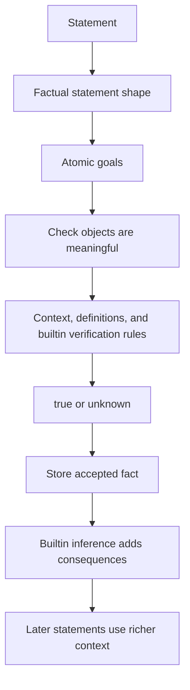

# Proof Process

Try all snippets in browser: https://litexlang.com/doc/Manual/Proof_Process

Markdown source: https://github.com/litexlang/golitex/blob/main/docs/Manual/Proof_Process.md

A Litex proof is a sequence of small mathematical checks. Each check starts from a statement, finds the fact claimed by that statement, reduces the fact to one or more atomic goals, and tries to close those goals from the current context, definitions, and builtin rules.

Once a fact is accepted, it is stored in the context. Litex may then run builtin inference, adding consequences that later statements can use.

---

## The main loop



In one sentence:

> Litex checks mathematical sentences by reducing them to atomic facts about builtin objects, then storing the successful facts so later sentences can use them.

This page explains the flow. The reference pages give the full vocabulary:

- [Objects](Objects.md): the terms and mathematical objects a fact can talk about.
- [Builtin Props](Builtin_Props.md): the atomic proposition forms, such as `=`, `<`, `$in`, and `$is_set`.
- [Factual Statements](Factual_Statements.md): the shapes of facts, from atomic facts to `forall`, `exist`, `and`, `or`, and chains.
- [Builtin Verification Rules](Builtin_Verification_Rules.md): what the checker can close while proving a goal.
- [Builtin Inference](Builtin_Inference.md): what is added after a fact has been accepted.
- [Builtin statements](Statements.md): the statement forms that organize definitions, context, and proof blocks.

---

## A running example

```litex
have x N = 2
x $in N
0 <= x
x + 1 = 3
```

This short proof already shows the main parts of Litex.

`2`, `N`, `x`, and `x + 1` are objects. They name mathematical values or sets. They are not true or false by themselves.

`x $in N`, `0 <= x`, and `x + 1 = 3` are facts. Each one has a main relation: membership, order, or equality.

`have x N = 2` is a statement. It introduces a name, records its value, and records enough context for later facts to use `x`.

When Litex checks `x + 1 = 3`, it can use the stored equation `x = 2` and builtin arithmetic rules. The goal reduces to the numeric equality `2 + 1 = 3`.

When Litex stores `x $in N`, builtin inference can make the usual natural-number consequence available: `0 <= x`. That is different from proving the original membership goal. Verification closes the current goal; inference enriches the context after a fact is accepted.

---

## Objects are the material of facts

An object is an expression that denotes something mathematical: a number, a set, a tuple, a function, a product, a sequence, a matrix, or a name introduced earlier.

```text
2
N
x + 1
{1, 2}
fn(x R) R
cart(R, Z)
```

These expressions are not facts. They become part of facts when a relation or predicate makes a judgment about them:

```text
x + 1 = 3
2 $in N
$is_set({1, 2})
```

This distinction is important because builtin mathematical knowledge is attached to both sides: Litex must understand the objects, and it must understand the atomic proposition that relates them.

---

## Atomic facts are the smallest goals

An atomic fact is one indivisible mathematical judgment. It has no top-level `and` or `or`.

Common atomic forms include:

- equality and inequality: `a = b`, `a != b`;
- order: `a < b`, `a <= b`, `a > b`, `a >= b`;
- membership: `x $in A`;
- set and shape predicates: `$is_set(A)`, `$is_tuple(t)`, `$is_cart(C)`;
- user predicates: `$prime(17)`, `$p(x)`.

Atomic facts are where most builtin verification rules apply. For example, arithmetic normalization can prove an equality, membership rules can prove that `2 $in N`, and set rules can prove that `1 $in {1, 2}`.

---

## How an atomic fact is checked

For an atomic goal, Litex roughly asks:

1. Do the objects in the fact make sense in the current context?
2. What is the main relation or predicate?
3. Is the fact already known, or can it be obtained from a definition?
4. Does a builtin verification rule close this shape of goal?

The result is either `true` or `unknown`.

`unknown` does not always mean the statement is false. It often means the proof needs a smaller intermediate fact, such as a membership condition, a nonzero denominator, a useful equality, or a previously proved lemma.

---

## Compound facts reduce to smaller checks

A factual statement can be bigger than one atomic fact:

```text
0 < 1 and 1 < 2
0 <= 1 < 2
exist x R st { x = 1 }
forall x R:
    x = x
```

These larger forms organize smaller goals.

For an `and`, each part must be checked. For a chain such as `0 <= 1 < 2`, Litex checks the adjacent comparisons and records the useful equalities or inequalities implied by the chain. For a `forall`, Litex checks the body in a temporary context with typed parameters. For an `exist`, Litex needs witnesses and then checks the stated properties for those witnesses.

The important point is that complex proofs still rely on the same atomic layer. The outer shape tells Litex how to break the problem down; the atomic checks decide whether the mathematical steps close.

---

## Verification and inference are different

Builtin verification rules run while Litex is trying to prove the current goal.

```litex
2 + 3 = 5
```

This can be closed by numeric evaluation during verification.

Builtin inference runs after a fact has already been accepted into the context.

```litex
have k N
0 <= k
```

The statement `have k N` records `k $in N`. After that fact is stored, builtin inference can make the order consequence `0 <= k` available.

This separation keeps the proof model simple:

- verification answers, "Can this goal be proved now?"
- inference answers, "Now that this fact is known, what standard consequences should also be available?"

---

## Why the builtin layer is large

Litex includes many basic mathematical objects and rules because ordinary proofs use many small background facts. Numbers, sets, membership, functions, tuples, products, order, equality, finite displays, and positivity conditions constantly interact.

Each individual builtin rule is meant to be simple. For example:

```litex
1 $in {1, 2}
2 + 3 = 5
0 <= 2
$is_set(R)
```

The size comes from combinations. A proof about a function may need arithmetic on its output, membership in its domain, tuple projections, set inclusion, and equality substitution. If every one of those steps had to be rebuilt as a user theorem, proofs would be dominated by bookkeeping.

The builtin layer is Litex's shared mathematical background. User-defined `prop`s and `forall` theorems add domain-specific ideas on top of that background, while the language handles the common low-level facts of basic mathematics.
