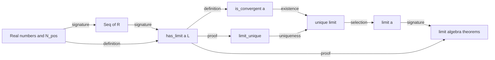

# Typed Mathematical Dependency DAG

A concept graph must explain why one mathematical node precedes another. A
plain import graph or list of file references is insufficient.

## Edge types

| Edge | Meaning |
| --- | --- |
| `signature` | A parameter domain, carrier, or codomain names the dependency. |
| `definition` | The definition body unfolds to or calls the dependency. |
| `well_definedness` | The dependency justifies that an expression or application is meaningful. |
| `law` | A structure or candidate satisfies a required property. |
| `existence` | A construction requires an existence result. |
| `uniqueness` | A canonical selection requires uniqueness. |
| `selection` | A `have fn ... by exist!` interface is produced from the unique-existence fact. |
| `proof` | A lemma or theorem cites or derives from the dependency. |
| `import` | The dependency crosses a module or package boundary. |
| `trust/source` | The edge ends at an axiom, trusted fact, omitted source proof, or external assumption. |

Use the narrowest accurate edge. A theorem may have several edge types, such
as a signature dependency on a structure and proof dependencies on two lemmas.

## Construction procedure

1. Create nodes for the important carriers, declarations, canonical
   constructions, intermediate results, and main results.
2. Add signature and definition edges before proof edges. This exposes a wrong
   ontology early.
3. Add well-definedness, existence, and uniqueness edges explicitly; do not
   bury them in a theorem body.
4. Add proof and import edges from actual or intended citations.
5. Mark every trust/source boundary visibly.
6. Detect cycles. Resolve an accidental cycle by extracting the shared
   primitive relation, separating a candidate relation from a selected value,
   or correcting a definition. Do not break it with a trusted wrapper.
7. Compute a topological build order, then choose among valid orders to retain
   the source's pedagogical sequence and theorem identity.
8. When code exists, compare the planned DAG with verifier-generated
   definition, relation, and fact graphs. Classify every surprising edge.

## Typical layer pattern

```text
foundational carriers and logic
    -> objects, functions, and operations
    -> relations and structure laws
    -> structures and parameterized families
    -> well-definedness / existence / uniqueness
    -> canonical constructions
    -> local lemmas
    -> main theorems
    -> corollaries, examples, and public interfaces
```

This is a common shape, not a mandatory total order. `template` can
parameterize declarations at several layers. A theorem can also establish the
unique existence needed to create a later function.

## Example: limits of sequences



The graph prevents three common mistakes: defining `limit(a)` before its
domain is known, conflating convergence with the selected value, and hiding
uniqueness inside an opaque constructor.

## Required graph outputs

For a module-level modeling task, provide:

1. a legend for edge types actually used;
2. a readable graph or adjacency list;
3. a topological implementation order;
4. source-order deviations with reasons;
5. cycles or unresolved dependencies; and
6. trust/source boundaries and their downstream consumers.
