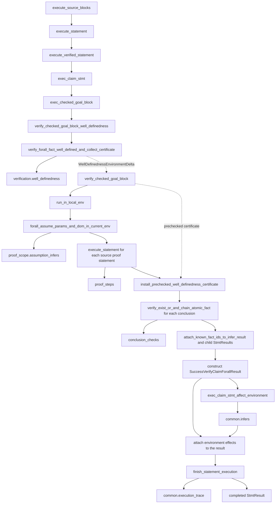

# Executing statements

For `1 + 1 = 2`, execution checks the expression, verifies the equality, stores the fact, and attaches a statement trace.

```text
execute_statement(Stmt::Fact(1 + 1 = 2))
  clear statement-local proof caches
  read ExecutionMode::RequireVerification or ExecutionMode::Trusted
  verify both sides are well-defined
  verify 1 + 1 = 2
  store the fact and allocate its FactId
  run inference from the stored fact
  attach proof FactIds and execution phases
  return StmtResult::Success
```

`ExecutionMode` says whether the current source is verified or is a configured
trusted import. There is no second per-statement execution context: every
statement follows the same lifecycle and only the source frame selects its
verification mode.

## Concrete `forall` claim pipeline

This existing regression exercises every major proof-producing stage:

```litex
claim:
    ? forall x R:
        x = 1
        =>:
            x = 1
    x = x
```

The parsed claim flows through these current Rust functions. Solid result
labels are durable outputs; dashed edges carry temporary execution support
that must remain available only until the receiving stage finishes.



The field-to-stage correspondence is therefore concrete rather than inferred
from type names:

| Durable result part | Producing execution node | Meaning |
| --- | --- | --- |
| `statement` / `forall_fact` | `parse_statement`, then verified dispatch | The source object being executed. |
| `verification.well_definedness` | `verify_checked_goal_block_well_definedness` | Why the complete goal is meaningful before proof execution. |
| `proof_scope.assumption_infers` | `forall_assume_params_and_dom_in_current_env` | Parameter facts, source premises, and their ordered inferred consequences in the local proof domain. |
| `proof_steps` | the `execute_statement(proof_stmt)` loop | One recursive `StmtResult` for every source-authored proof statement, in source order. |
| `conclusion_checks` | the `verify_exist_or_and_chain_atomic_fact` loop | The kernel checks performed after the authored proof body to close each `then` clause. |
| `common.infers` | `exec_claim_stmt_affect_environment` | Effects produced when the completed claim is published to the surrounding mathematical environment. |
| `common.execution_trace` | `finish_statement_execution` | Final phase status after verification and environment mutation. |

Two values deliberately do not correspond to durable fields. The
`WellDefinednessEnvironmentDelta` is an edge value passed from preflight into
proof execution, and statement-local memo or recursion state is execution
context used while recursive verifier nodes are active. Persisting either one
merely because it crosses several functions would confuse pipeline support
with proof evidence.

This gives a structural test for future result changes:

1. A durable field should name the important function or phase that produces it.
2. A recursively executed source statement should appear as a child `StmtResult`.
3. A temporary value used only between stages should be a local value or explicit context, not a result field.
4. A result enum branch should correspond to a real mutually exclusive control-flow branch.

## Examples and boundaries

| Statement | Execution behavior |
| --- | --- |
| `1 + 1 = 2` | Uses verified execution and stores the successful fact. |
| `have a R = 1` | Creates an object definition only after its required facts verify. |
| `try:`<br>&nbsp;&nbsp;`1 = 2` | Returns a successful `TryStmt` result whose body is marked `RolledBack`; no environment changes are committed. |
| `trust 1 = 2` | Uses the unsafe statement path; `-strict` rejects this example. |
| A failed `1 / 0 = 0` | Stops after well-definedness; verification and environment mutation do not run. |

## Start here

| File | Example |
| --- | --- |
| [`statement_execution.rs`](statement_execution.rs) | Owns statement lifecycle, chooses verified or trusted execution, and attaches the final execution trace. |
| [`verified_statement_execution.rs`](verified_statement_execution.rs) | Dispatches every verified `Stmt` family to its executor. |
| [`trusted_statement_execution.rs`](trusted_statement_execution.rs) | Replays trusted and preverified statements into the environment. |
| [`attach_fact_ids_to_stmt_result.rs`](attach_fact_ids_to_stmt_result.rs) | Fills missing FactIds in the completed recursive Result tree without retargeting frozen local evidence. |
| [`submitted_fact_execution.rs`](submitted_fact_execution.rs) | Executes a submitted fact through well-definedness, proof verification, storage, and inference. |
| [`definition_execution/object/`](definition_execution/object/) | Executes object, function, tuple, sequence, matrix, preimage, and existential-elimination definitions and bindings. |
| [`witness_execution.rs`](witness_execution.rs) | Executes logical witness statements; witness introduction remains separate from definition storage. |
| [`definition_execution/`](definition_execution/) | Groups proposition, theorem, axiom, template, structure, algorithm, parameter, and definition-storage execution. |
| [`proof_block_execution/`](proof_block_execution/) | Groups claim, goal-proof, sketch, and transactional `try` execution. |
| [`command_execution/`](command_execution/) | Executes `eval` commands. |
| [`trust_execution/`](trust_execution/) | Groups explicit unsafe fact and parameterized assumptions. |
| [`strategy_execution.rs`](strategy_execution.rs) | Checks strategy proof bodies, stores definitions, and publishes their proved forall facts. |
| [`verified_fact_storage.rs`](verified_fact_storage.rs) | Verifies fact well-definedness before storage and inference. |
| [`proof_block_execution/try_block.rs`](proof_block_execution/try_block.rs) | Gives `try:` its transactional rollback behavior. |
